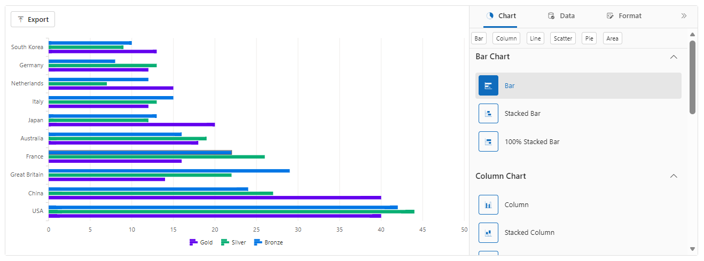

# Working with Data in Blazor Charts Component

The primary configuration for the wizard is provided via the `ChartSettings`. Key properties:

- `DataSource` (IEnumerable<Object>) — Provide the collection of data objects used by the chart. Each object should contain fields referenced by `CategoryFields` and `SeriesFields`.
- `CategoryFields` (IEnumerable<string>) — One or more field names from the data objects used for the category (x-axis) values. Example: `new List<string>{ "Country" }` or `new[] { "Month" }`.
- `SeriesFields` (IEnumerable<string>) — One or more numeric field names to render as series. Provide multiple names when creating multi-series charts (e.g., `new[]{ "Gold", "Silver", "Bronze" }`).
- `SeriesType` (ChartWizardSeriesType) — Selects the chart type that the wizard will use for rendering series. Common values: `Bar`, `Column`, `Line`, `Area`, `Pie`, etc.

## Configuring fields

- Single-category, single-series chart

```razor
<ChartSettings DataSource="@SalesData"
               CategoryFields="@(new[]{ "Month" })"
               SeriesFields="@(new[]{ "Sales" })"
               SeriesType="ChartWizardSeriesType.Column" />
```

- Multi-series chart (stacked or grouped)

```razor
<ChartSettings DataSource="@OlympicsData"
               CategoryFields="@(new[]{ "Country" })"
               SeriesFields="@(new[]{ "Gold", "Silver", "Bronze" })"
               SeriesType="ChartWizardSeriesType.Bar" />
```

N>
* The order of `SeriesFields` determines the default series ordering.
* `CategoryFields` can contain multiple fields when composing nested/grouped categories; the wizard will combine them as specified.

```

@using Syncfusion.Blazor.ChartWizard

<div class="control-section">
    <SfChartWizard Width="90%" Theme="Theme.Fluent2" PropertyPanelExpanded="true">
        <ChartSettings DataSource="@OlympicsDataSource"
                        CategoryFields="@(new[] { "Country" })"
                        SeriesFields="@(new[] { "Gold", "Silver", "Bronze" })"
                        SeriesType="ChartWizardSeriesType.Bar"
                        EnablePropertyPanel="true"
                        AllowExport="true">
        </ChartSettings>
    </SfChartWizard>
</div>

@code {
    private readonly List<string> chartSeries = new() { "Gold", "Silver", "Bronze" };
    private readonly List<string> categories = new() { "Country" };

    private readonly List<OlympicsData> OlympicsDataSource = new()
    {
        new OlympicsData { Country = "USA", CountryCode = "USA", Gold = 40, Silver = 44, Bronze = 42 },
        new OlympicsData { Country = "China", CountryCode = "CHN", Gold = 40, Silver = 27, Bronze = 24 },
        new OlympicsData { Country = "Great Britain", CountryCode = "GBR", Gold = 14, Silver = 22, Bronze = 29 },
        new OlympicsData { Country = "France", CountryCode = "FRA", Gold = 16, Silver = 26, Bronze = 22 },
        new OlympicsData { Country = "Australia", CountryCode = "AUS", Gold = 18, Silver = 19, Bronze = 16 },
        new OlympicsData { Country = "Japan", CountryCode = "JPN", Gold = 20, Silver = 12, Bronze = 13 },
        new OlympicsData { Country = "Italy", CountryCode = "ITA", Gold = 12, Silver = 13, Bronze = 15 },
        new OlympicsData { Country = "Netherlands", CountryCode = "NLD", Gold = 15, Silver = 7,  Bronze = 12 },
        new OlympicsData { Country = "Germany", CountryCode = "DEU", Gold = 12, Silver = 13, Bronze = 8  },
        new OlympicsData { Country = "South Korea", CountryCode = "KOR", Gold = 13, Silver = 9,  Bronze = 10 }
    };

    public class OlympicsData
    {
        public string Country { get; set; }
        public int Gold { get; set; }
        public int Silver { get; set; }
        public int Bronze { get; set; }
    }
}

```

> 

## See also

- Explore the [Chart Wizard Demo]("Demo_Link") for interactive samples.
