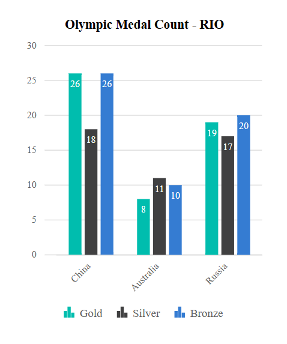
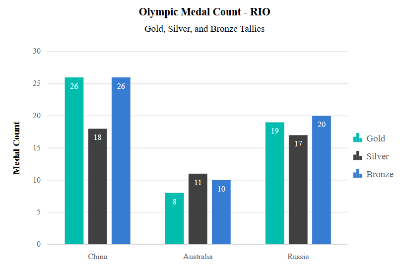

# Adaptive Layout in Blazor Charts Component

Adaptive rendering in charts refers to a feature that dynamically adjusts chart elements to provide an optimal display based on the available screen size and orientation. By setting the `EnableAdaptiveRendering` property to **true**, the chart responds to changes in the container's size. This ensures that elements like the legend, axis titles, axis labels, data labels, and chart title are appropriately adjusted.

## Small Layout

The small layout is designed for smaller screens with limited space. For example, with a width of 300px and height of 400px, the chart elements adjust to fit the smaller screen.

* Legend Position - When the screen width is less than 300px, and the legend is positioned on the right or left, it moves to the bottom of the chart to avoid overlapping with the main chart area. This improves readability and ensures the data remains visible.

* Chart Subtitle - On very small screens (e.g., 200px by 200px), the subtitle is hidden due to space limitations. This helps keep the chart clean and focused on the essential data.

```cshtml

@using Syncfusion.Blazor
@using Syncfusion.Blazor.Charts

<SfChart  Title="Olympic Medal Count - RIO" SubTitle="Gold, Silver, and Bronze Tallies" Width="300px" Height="400px" EnableAdaptiveRendering="true">
    <ChartArea>
        <ChartAreaBorder Width="0"></ChartAreaBorder>
    </ChartArea>
    <ChartPrimaryXAxis ValueType="Syncfusion.Blazor.Charts.ValueType.Category" PlotOffsetLeft="15">
        <ChartAxisMajorGridLines Width="0"></ChartAxisMajorGridLines>
        <ChartAxisMajorTickLines Width="0"></ChartAxisMajorTickLines>
    </ChartPrimaryXAxis>
    <ChartPrimaryYAxis Title="Medal Count">
        <ChartAxisLineStyle Width="0"></ChartAxisLineStyle>
        <ChartAxisMajorTickLines Width="0"></ChartAxisMajorTickLines>
    </ChartPrimaryYAxis>
    <ChartSeriesCollection>
        <ChartSeries DataSource="@ChartPoints" XName="Country" YName="GoldMedal" Type="ChartSeriesType.Column" Name="Gold" ColumnSpacing="0.2">
            <ChartSeriesAnimation Enable="false"></ChartSeriesAnimation>
            <ChartMarker>
                <ChartDataLabel Visible="true" Position="Syncfusion.Blazor.Charts.LabelPosition.Top">
                    <ChartDataLabelFont Color="#FFFFFF"></ChartDataLabelFont>
                </ChartDataLabel>
            </ChartMarker>
        </ChartSeries>
        <ChartSeries DataSource="@ChartPoints" XName="Country" YName="SilverMedal" Type="ChartSeriesType.Column" Name="Silver" ColumnSpacing="0.2">
            <ChartSeriesAnimation Enable="false"></ChartSeriesAnimation>
            <ChartMarker>
                <ChartDataLabel Visible="true" Position="Syncfusion.Blazor.Charts.LabelPosition.Top">
                    <ChartDataLabelFont Color="#FFFFFF"></ChartDataLabelFont>
                </ChartDataLabel>
            </ChartMarker>
        </ChartSeries> 
        <ChartSeries DataSource="@ChartPoints" XName="Country" YName="BronzeMedal" Type="ChartSeriesType.Column" Name="Bronze" ColumnSpacing="0.2">
            <ChartSeriesAnimation Enable="false"></ChartSeriesAnimation>
            <ChartMarker>
                <ChartDataLabel Visible="true" Position="Syncfusion.Blazor.Charts.LabelPosition.Top">
                    <ChartDataLabelFont Color="#FFFFFF"></ChartDataLabelFont>
                </ChartDataLabel>
            </ChartMarker>
        </ChartSeries>
    </ChartSeriesCollection>
    <ChartLegendSettings Visible="true" Position="LegendPosition.Right"></ChartLegendSettings>
    <ChartTooltipSettings Enable="true"></ChartTooltipSettings>
</SfChart>

@code {
    public List<ChartData> ChartPoints { get; set; } = new List<ChartData>
    {
        new ChartData { Country = "China", GoldMedal = 26, SilverMedal = 18, BronzeMedal = 26 },
        new ChartData { Country = "Australia", GoldMedal = 8, SilverMedal = 11, BronzeMedal = 10 },
        new ChartData { Country = "Russia", GoldMedal = 19, SilverMedal = 17, BronzeMedal = 20 }
    };
    public class ChartData
    {
        public string Country { get; set; }
        public double GoldMedal { get; set; }
        public double SilverMedal { get; set; }
        public double BronzeMedal { get; set; }
    }
}

```



## Large Layout

The large layout is used for larger screens, where there’s enough space to show all the elements clearly without crowding. For example, with a width of 600px and a height of 400px, the chart can display more information.

In this layout, all chart elements such as the legend, chart title, subtitle, axis labels, and data labels are visible. Since the screen has enough space, all elements are displayed in their usual positions, providing a complete and detailed chart view without any elements being hidden or repositioned.


```cshtml

@using Syncfusion.Blazor
@using Syncfusion.Blazor.Charts

<SfChart  Title="Olympic Medal Count - RIO" SubTitle="Gold, Silver, and Bronze Tallies" Width="600px" Height="400px" EnableAdaptiveRendering="true">
    <ChartArea>
        <ChartAreaBorder Width="0"></ChartAreaBorder>
    </ChartArea>
    <ChartPrimaryXAxis ValueType="Syncfusion.Blazor.Charts.ValueType.Category" PlotOffsetLeft="0">
        <ChartAxisMajorGridLines Width="0"></ChartAxisMajorGridLines>
        <ChartAxisMajorTickLines Width="0"></ChartAxisMajorTickLines>
    </ChartPrimaryXAxis>
    <ChartPrimaryYAxis Title="Medal Count">
        <ChartAxisLineStyle Width="0"></ChartAxisLineStyle>
        <ChartAxisMajorTickLines Width="0"></ChartAxisMajorTickLines>
    </ChartPrimaryYAxis>
    <ChartSeriesCollection>
        <ChartSeries DataSource="@ChartPoints" XName="Country" YName="GoldMedal" Type="ChartSeriesType.Column" Name="Gold" ColumnSpacing="0.2">
            <ChartSeriesAnimation Enable="false"></ChartSeriesAnimation>
            <ChartMarker>
                <ChartDataLabel Visible="true" Position="Syncfusion.Blazor.Charts.LabelPosition.Top">
                    <ChartDataLabelFont Color="#FFFFFF"></ChartDataLabelFont>
                </ChartDataLabel>
            </ChartMarker>
        </ChartSeries>
        <ChartSeries DataSource="@ChartPoints" XName="Country" YName="SilverMedal" Type="ChartSeriesType.Column" Name="Silver" ColumnSpacing="0.2">
            <ChartSeriesAnimation Enable="false"></ChartSeriesAnimation>
            <ChartMarker>
                <ChartDataLabel Visible="true" Position="Syncfusion.Blazor.Charts.LabelPosition.Top">
                    <ChartDataLabelFont Color="#FFFFFF"></ChartDataLabelFont>
                </ChartDataLabel>
            </ChartMarker>
        </ChartSeries> 
        <ChartSeries DataSource="@ChartPoints" XName="Country" YName="BronzeMedal" Type="ChartSeriesType.Column" Name="Bronze" ColumnSpacing="0.2">
            <ChartSeriesAnimation Enable="false"></ChartSeriesAnimation>
            <ChartMarker>
                <ChartDataLabel Visible="true" Position="Syncfusion.Blazor.Charts.LabelPosition.Top">
                    <ChartDataLabelFont Color="#FFFFFF"></ChartDataLabelFont>
                </ChartDataLabel>
            </ChartMarker>
        </ChartSeries>
    </ChartSeriesCollection>
    <ChartLegendSettings Visible="true" Position="LegendPosition.Right"></ChartLegendSettings>
    <ChartTooltipSettings Enable="true"></ChartTooltipSettings>
</SfChart>

@code {
    public List<ChartData> ChartPoints { get; set; } = new List<ChartData>
    {
        new ChartData { Country = "China", GoldMedal = 26, SilverMedal = 18, BronzeMedal = 26 },
        new ChartData { Country = "Australia", GoldMedal = 8, SilverMedal = 11, BronzeMedal = 10 },
        new ChartData { Country = "Russia", GoldMedal = 19, SilverMedal = 17, BronzeMedal = 20 }
    };
    public class ChartData
    {
        public string Country { get; set; }
        public double GoldMedal { get; set; }
        public double SilverMedal { get; set; }
        public double BronzeMedal { get; set; }
    }
}

```



The table below shows the different chart elements and their behaviour based on specific conditions related to chart's height and width:


| Element      | Rules              | Description         |
|--------------|------------------  |---------------------|
| Chart Title  | <kbd>Height &lt; 200px</kbd> or <kbd>Width &lt; 200px</kbd> | Removed chart title |
| Chart Sutitle | <kbd>Height &lt; 300px</kbd> or <kbd>Width &lt; 300px</kbd> | Removed chart subtitle |
| X Axis Title | <kbd>Height &lt;= 300px</kbd> or <kbd>Width &lt;= 200px</kbd> | Removed X axis title |
| Y Axis Title | <kbd>Height &lt;= 200px</kbd> or <kbd>Width &lt;= 300px</kbd> | Removed Y axis title |
| X Axis Scrollbar| <kbd>Height &lt;= 300px</kbd> or <kbd>Width &lt;= 200px</kbd> | Removed X axis scrollbar |
| Y Axis Scrollbar| <kbd>Height &lt;= 200px</kbd> or <kbd>Width &lt;= 300px</kbd> | Removed Y axis scrollbar |
| X Axis Label  | <kbd>Height &lt; 100px</kbd> / <kbd>Height &lt; 200px | Disable the X axis label / Move the X axis labels inside the chart |
| Y Axis Label | <kbd>Width &lt; 100px</kbd> / <kbd>Width &lt; 200px</kbd> | Disable the Y axis label / Move the Y axis labels inside the chart |
| Axis Label Format | <kbd>Height &lt;= 400px</kbd> / <kbd>Width &lt;= 400px</kbd> | Format the X axis numeric labels with M, K and B / Format the Y axis numeric labels with M, K and B |
| Stripline Text | <kbd>Height &lt; 100px</kbd> / <kbd>Width &lt; 100px</kbd> | Disable vertical stripline text / Disable horizontal stripline text |
| Legend Position <br> (Top/Bottom) | <kbd>Height &lt; 300px</kbd> | Move to right if the width is greater than 200px or else disabled |
| Legend Position <br> (Right/Left) | <kbd>Width &lt; 300px</kbd>  | Move to bottom if the height is greater than 200px or else disabled |
| Legend Position <br> (Custom) | <kbd>Height &lt; 200px</kbd> | Disable the legend |
| Marker | <kbd>Height &lt; 200px</kbd> or <kbd>Width &lt; 200px</kbd> | Disable marker in the chart |
| Zoom Toolkit | <kbd>Height &lt; 200px</kbd> or <kbd>Width &lt; 200px</kbd> | Disable zoom toolkit |
| Stripline Text | <kbd>Height &lt; 200px</kbd> or <kbd>Width &lt; 200px</kbd>  | Disable stripline text |
| Datalabel <br> (Column abd Bar Chart Types)| | Datalabel will rotate based on rect size. If the datalabel goes beyond the size, it will hide |

N> Refer to our [Blazor Charts](https://www.syncfusion.com/blazor-components/blazor-charts) feature tour page for its groundbreaking feature representations and also explore our [Blazor Chart Example](https://blazor.syncfusion.com/demos/chart/line?theme=bootstrap5) to know various chart types and how to represent time-dependent data, showing trends at equal intervals.

## See also

* [Data label](./data-labels)
* [Tooltip](./tool-tip)
* [Marker](./data-markers)