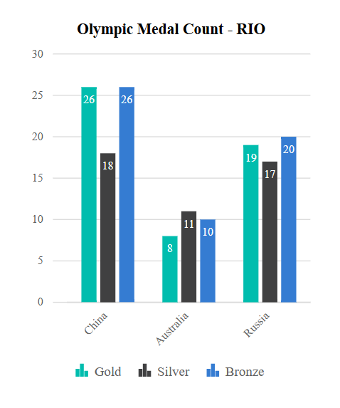

# Adaptive Layout in Blazor Charts Component

When viewing the chart on a mobile device, some elements may not be displayed properly due to limited screen space. This is where the **Syncfusion<sup style="font-size:70%">&reg;</sup> Chart Adaptive Layout** feature proves invaluable. Adaptive rendering dynamically adjusts chart elements to optimize their display based on the available screen size and orientation. By enabling the `EnableAdaptiveRendering` property, the chart automatically adapts to container size changes, ensuring clear alignment and proper visibility of elements such as the legend, axis titles, axis labels, data labels, chart title, and more.

```cshtml

@using Syncfusion.Blazor
@using Syncfusion.Blazor.Charts

<SfChart  Title="Olympic Medal Count - RIO" SubTitle="Gold, Silver, and Bronze Tallies" Width="300px" Height="400px" EnableAdaptiveRendering="true">
    <ChartArea>
        <ChartAreaBorder Width="0"></ChartAreaBorder>
    </ChartArea>
    <ChartPrimaryXAxis ValueType="Syncfusion.Blazor.Charts.ValueType.Category" PlotOffsetLeft="15">
        <ChartAxisMajorGridLines Width="0"></ChartAxisMajorGridLines>
        <ChartAxisMajorTickLines Width="0"></ChartAxisMajorTickLines>
    </ChartPrimaryXAxis>
    <ChartPrimaryYAxis Title="Medal Count">
        <ChartAxisLineStyle Width="0"></ChartAxisLineStyle>
        <ChartAxisMajorTickLines Width="0"></ChartAxisMajorTickLines>
    </ChartPrimaryYAxis>
    <ChartSeriesCollection>
        <ChartSeries DataSource="@ChartPoints" XName="Country" YName="GoldMedal" Type="ChartSeriesType.Column" Name="Gold" ColumnSpacing="0.2">
            <ChartSeriesAnimation Enable="false"></ChartSeriesAnimation>
            <ChartMarker>
                <ChartDataLabel Visible="true" Position="Syncfusion.Blazor.Charts.LabelPosition.Top">
                    <ChartDataLabelFont Color="#FFFFFF"></ChartDataLabelFont>
                </ChartDataLabel>
            </ChartMarker>
        </ChartSeries>
        <ChartSeries DataSource="@ChartPoints" XName="Country" YName="SilverMedal" Type="ChartSeriesType.Column" Name="Silver" ColumnSpacing="0.2">
            <ChartSeriesAnimation Enable="false"></ChartSeriesAnimation>
            <ChartMarker>
                <ChartDataLabel Visible="true" Position="Syncfusion.Blazor.Charts.LabelPosition.Top">
                    <ChartDataLabelFont Color="#FFFFFF"></ChartDataLabelFont>
                </ChartDataLabel>
            </ChartMarker>
        </ChartSeries> 
        <ChartSeries DataSource="@ChartPoints" XName="Country" YName="BronzeMedal" Type="ChartSeriesType.Column" Name="Bronze" ColumnSpacing="0.2">
            <ChartSeriesAnimation Enable="false"></ChartSeriesAnimation>
            <ChartMarker>
                <ChartDataLabel Visible="true" Position="Syncfusion.Blazor.Charts.LabelPosition.Top">
                    <ChartDataLabelFont Color="#FFFFFF"></ChartDataLabelFont>
                </ChartDataLabel>
            </ChartMarker>
        </ChartSeries>
    </ChartSeriesCollection>
    <ChartLegendSettings Visible="true" Position="LegendPosition.Right"></ChartLegendSettings>
    <ChartTooltipSettings Enable="true"></ChartTooltipSettings>
</SfChart>

@code {
    public List<ChartData> ChartPoints { get; set; } = new List<ChartData>
    {
        new ChartData { Country = "China", GoldMedal = 26, SilverMedal = 18, BronzeMedal = 26 },
        new ChartData { Country = "Australia", GoldMedal = 8, SilverMedal = 11, BronzeMedal = 10 },
        new ChartData { Country = "Russia", GoldMedal = 19, SilverMedal = 17, BronzeMedal = 20 }
    };
    public class ChartData
    {
        public string Country { get; set; }
        public double GoldMedal { get; set; }
        public double SilverMedal { get; set; }
        public double BronzeMedal { get; set; }
    }
}

```



The table below outlines the behavior of various chart elements under specific conditions determined by the chart's height and width:


| Element      | Size             | Behavior         |
|--------------|------------------  |---------------------|
| Chart Title  | <kbd>Height &lt; 200</kbd> / <kbd>Width &lt; 200</kbd> | Chart title is disabled |
| Chart Sutitle | <kbd>Height &lt; 300</kbd> / <kbd>Width &lt; 300</kbd> | Chart subtitle is disabled |
| Axes | <kbd>Height &lt;= 200</kbd> / <kbd>Width &lt;= 200</kbd> | Horizontal/Vertical axis titles and scrollbars are disabled |
| Axes Label  | <kbd>Height &lt; 100</kbd> / <kbd>Width &lt; 100</kbd> <br> <kbd>Height &lt; 200</kbd> / <kbd>Width &lt; 200</kbd> <br> <kbd>Height &lt;= 400</kbd> / <kbd>Width &lt;= 400</kbd>  | Horizontal/Vertical axis labels are disabled <br><br> Axis labels move inside the chart <br><br> Axis numeric labels are formatted with M, K and B |
| Legend | <kbd>Height &lt; 300</kbd> / <kbd>Width &lt; 300</kbd> | Moves the bottom or top legend to the right if the width is greater than 200px; otherwise, it is disabled / Moves the right or left legend to the bottom if the height is greater than 200px; otherwise, it is disabled |
| Marker | <kbd>Height &lt; 200</kbd> / <kbd>Width &lt; 200</kbd> | Marker is disabled in the chart |
| Zoom Toolkit | <kbd>Height &lt; 200</kbd> / <kbd>Width &lt; 200</kbd> | Zoom toolkit is disabled |
| Datalabel <br> (Column and Bar Chart Types)| | Datalabel rotates based on rectangle size. If it exceeds the available size, it is hidden |

N> Refer to our [Blazor Charts](https://www.syncfusion.com/blazor-components/blazor-charts) feature tour page for its groundbreaking feature representations and also explore our [Blazor Chart Example](https://blazor.syncfusion.com/demos/chart/line?theme=bootstrap5) to know various chart types and how to represent time-dependent data, showing trends at equal intervals.

## See also

* [Data label](./data-labels)
* [Tooltip](./tool-tip)
* [Marker](./data-markers)