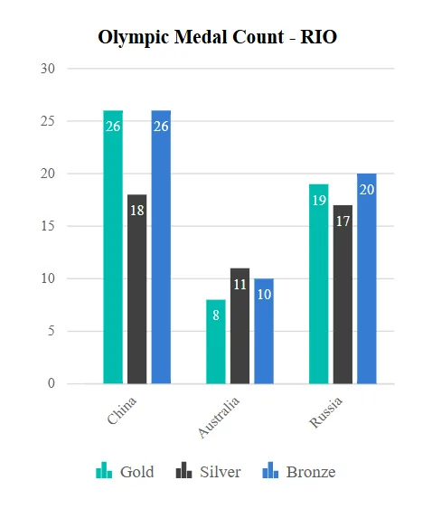

# Blazor Charts Adaptive Layout

Adaptive layout in [Blazor Charts](https://www.syncfusion.com/blazor-components/blazor-charts) ensures optimal display of chart elements on mobile devices and screens with limited space. By enabling the [EnableAdaptiveRendering](https://help.syncfusion.com/cr/blazor/Syncfusion.Blazor.Charts.SfChart.html#Syncfusion_Blazor_Charts_SfChart_EnableAdaptiveRendering) property (default `false`), the chart automatically adjusts to container size changes, maintaining clear alignment and visibility for elements such as the legend, axis titles, axis labels, data labels, and chart title.

N> Adaptive layout is intended for mobile and small-screen containers. On desktop-sized charts, leave `EnableAdaptiveRendering` set to `false` to avoid suppressing axis labels and other interactive elements.

```cshtml

@using Syncfusion.Blazor
@using Syncfusion.Blazor.Charts

<SfChart Title="Olympic Medal Count - RIO" SubTitle="Gold, Silver, and Bronze Tallies" Width="300px" Height="400px" EnableAdaptiveRendering="true">
    <ChartArea>
        <ChartAreaBorder Width="0"></ChartAreaBorder>
    </ChartArea>
    <ChartPrimaryXAxis ValueType="Syncfusion.Blazor.Charts.ValueType.Category" PlotOffsetLeft="15">
        <ChartAxisMajorGridLines Width="0"></ChartAxisMajorGridLines>
        <ChartAxisMajorTickLines Width="0"></ChartAxisMajorTickLines>
    </ChartPrimaryXAxis>
    <ChartPrimaryYAxis Title="Medal Count">
        <ChartAxisLineStyle Width="0"></ChartAxisLineStyle>
        <ChartAxisMajorTickLines Width="0"></ChartAxisMajorTickLines>
    </ChartPrimaryYAxis>
    <ChartSeriesCollection>
        <ChartSeries DataSource="@ChartPoints" XName="Country" YName="GoldMedal" Type="ChartSeriesType.Column" Name="Gold" ColumnSpacing="0.2">
            <ChartSeriesAnimation Enable="false"></ChartSeriesAnimation>
            <ChartMarker>
                <ChartDataLabel Visible="true" Position="Syncfusion.Blazor.Charts.LabelPosition.Top">
                    <ChartDataLabelFont Color="#FFFFFF"></ChartDataLabelFont>
                </ChartDataLabel>
            </ChartMarker>
        </ChartSeries>
        <ChartSeries DataSource="@ChartPoints" XName="Country" YName="SilverMedal" Type="ChartSeriesType.Column" Name="Silver" ColumnSpacing="0.2">
            <ChartSeriesAnimation Enable="false"></ChartSeriesAnimation>
            <ChartMarker>
                <ChartDataLabel Visible="true" Position="Syncfusion.Blazor.Charts.LabelPosition.Top">
                    <ChartDataLabelFont Color="#FFFFFF"></ChartDataLabelFont>
                </ChartDataLabel>
            </ChartMarker>
        </ChartSeries>
        <ChartSeries DataSource="@ChartPoints" XName="Country" YName="BronzeMedal" Type="ChartSeriesType.Column" Name="Bronze" ColumnSpacing="0.2">
            <ChartSeriesAnimation Enable="false"></ChartSeriesAnimation>
            <ChartMarker>
                <ChartDataLabel Visible="true" Position="Syncfusion.Blazor.Charts.LabelPosition.Top">
                    <ChartDataLabelFont Color="#FFFFFF"></ChartDataLabelFont>
                </ChartDataLabel>
            </ChartMarker>
        </ChartSeries>
    </ChartSeriesCollection>
    <ChartLegendSettings Visible="true" Position="LegendPosition.Right"></ChartLegendSettings>
    <ChartTooltipSettings Enable="true"></ChartTooltipSettings>
</SfChart>

@code {
    public List<ChartData> ChartPoints { get; set; } = new List<ChartData>
    {
        new ChartData { Country = "China", GoldMedal = 26, SilverMedal = 18, BronzeMedal = 26 },
        new ChartData { Country = "Australia", GoldMedal = 8, SilverMedal = 11, BronzeMedal = 10 },
        new ChartData { Country = "Russia", GoldMedal = 19, SilverMedal = 17, BronzeMedal = 20 }
    };
    public class ChartData
    {
        public string Country { get; set; }
        public double GoldMedal { get; set; }
        public double SilverMedal { get; set; }
        public double BronzeMedal { get; set; }
    }
}

```



The table below outlines the behavior of chart elements based on chart height and width:

| Element      | Size             | Behavior         |
|--------------|------------------|------------------|
| Chart Title  | <kbd>Height &lt; 200</kbd> / <kbd>Width &lt; 200</kbd> | Chart title is disabled |
| Chart Subtitle | <kbd>Height &lt; 300</kbd> / <kbd>Width &lt; 300</kbd> | Chart subtitle is disabled |
| Axes | <kbd>Height &lt;= 200</kbd> / <kbd>Width &lt;= 200</kbd> | Axis titles and scrollbars are disabled |
| Axis Label  | <kbd>Height &lt; 100</kbd> / <kbd>Width &lt; 100</kbd> <br> <kbd>Height &lt; 200</kbd> / <kbd>Width &lt; 200</kbd> <br> <kbd>Height &lt;= 400</kbd> / <kbd>Width &lt;= 400</kbd>  | Axis labels are disabled <br> Axis labels move inside the chart <br> Axis numeric labels are formatted with M, K, and B |
| Legend | <kbd>Height &lt; 300</kbd> / <kbd>Width &lt; 300</kbd> | Bottom/Top legend moves to the right if width > 200px; otherwise, disabled. Right/Left legend moves to the bottom if height > 200px; otherwise, disabled |
| Marker | <kbd>Height &lt; 200</kbd> / <kbd>Width &lt; 200</kbd> | Marker is disabled |
| Zoom Toolkit | <kbd>Height &lt; 200</kbd> / <kbd>Width &lt; 200</kbd> | [Zoom toolkit](./zooming) is disabled |
| Data Label <br> (Column and Bar Chart Types) | <kbd>Height &lt; 200</kbd> / <kbd>Width &lt; 200</kbd> | Data label rotates based on rectangle size; hidden if it exceeds the available size |

N> The M, K, and B suffixes represent Million, Thousand, and Billion respectively when formatting axis numeric labels.

N> Refer to the [Blazor Charts](https://www.syncfusion.com/blazor-components/blazor-charts) feature tour page for its groundbreaking feature representations. You can also explore the [Blazor Chart Example](https://blazor.syncfusion.com/demos/chart/line?theme=fluent2) to learn about the various chart types and how to represent time-dependent data with trends at equal intervals.

## See also

* [Data label](./data-labels)
* [Tooltip](./tool-tip)
* [Marker](./data-markers)
* [Legend](./legend)
* [Chart dimensions](./chart-dimensions)