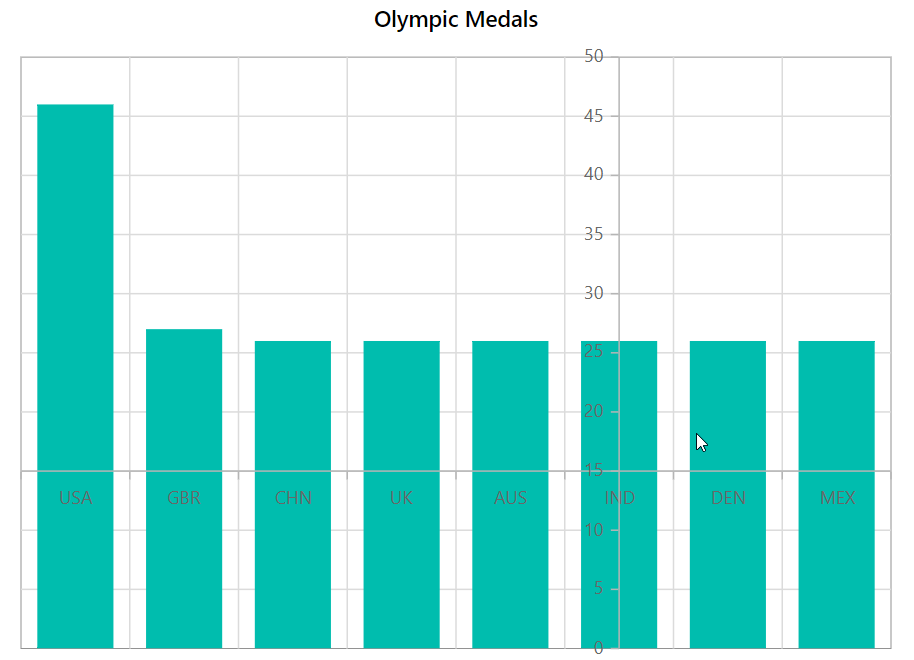
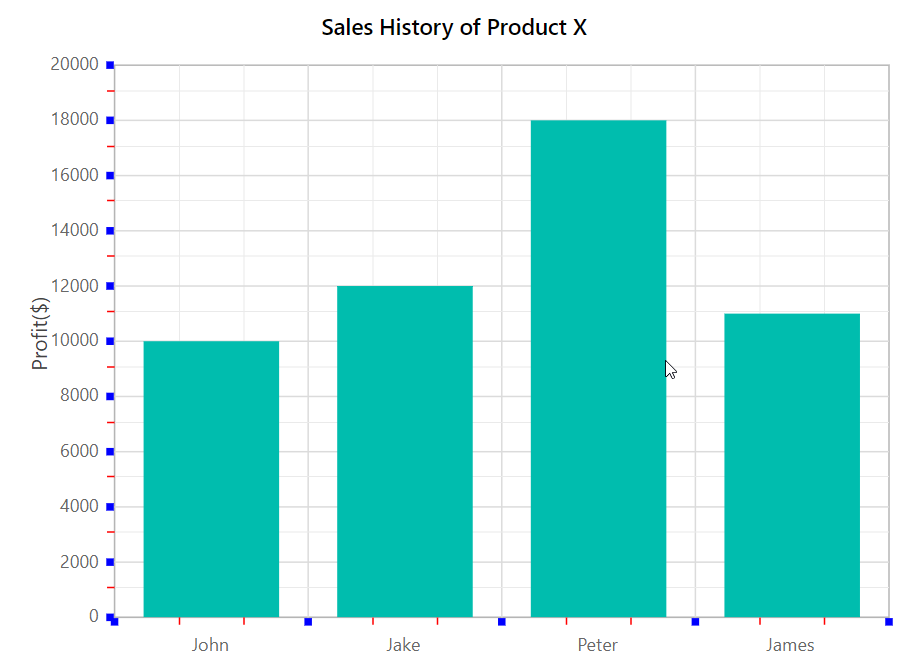
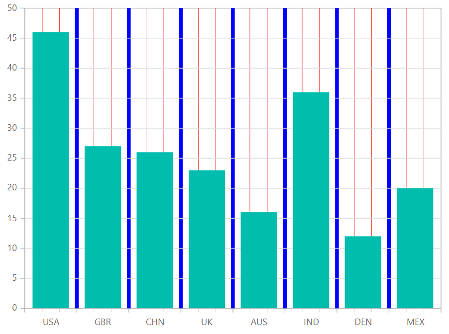
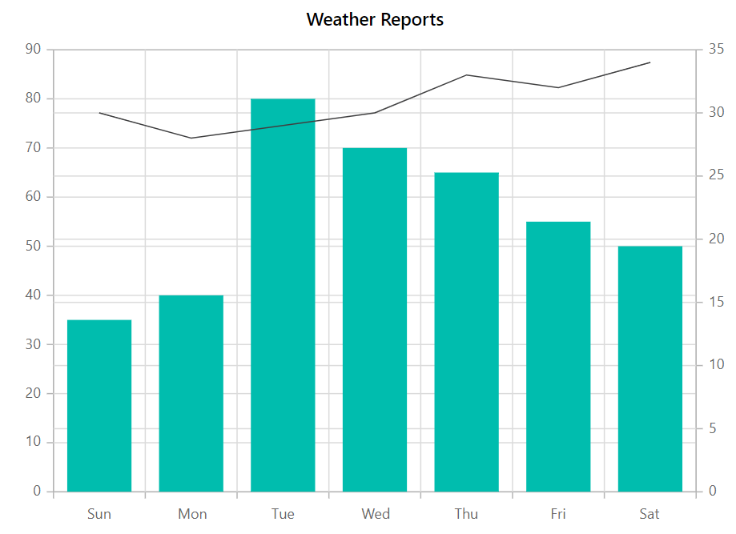
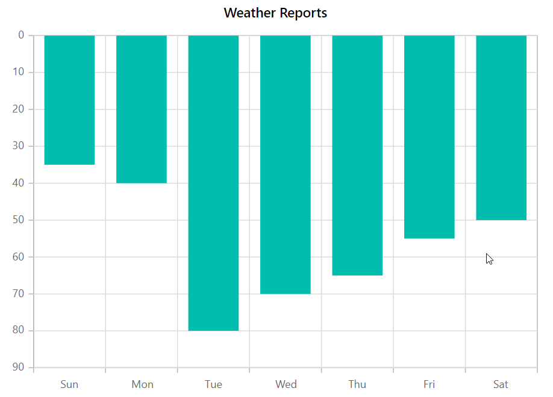
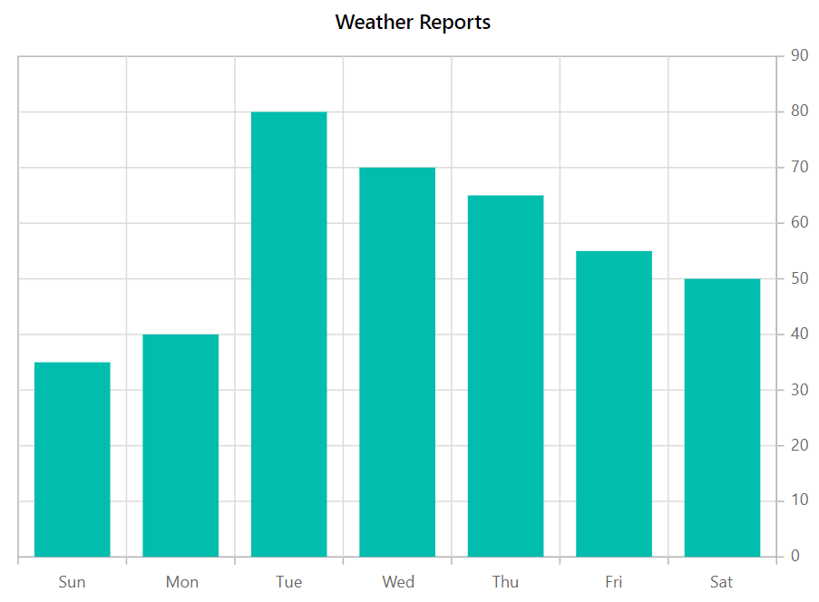

# Axis Customization in Blazor Charts (SfCharts)

## Axis Crossing

An axis can be positioned in the chart area using [`CrossesAt`](https://help.syncfusion.com/cr/blazor/Syncfusion.Blazor.Charts.ChartCommonAxis.html#Syncfusion_Blazor_Charts_ChartCommonAxis_CrossesAt) and [`CrossesInAxis`](https://help.syncfusion.com/cr/blazor/Syncfusion.Blazor.Charts.ChartCommonAxis.html#Syncfusion_Blazor_Charts_ChartCommonAxis_CrossesInAxis) properties. The [`CrossesAt`](https://help.syncfusion.com/cr/blazor/Syncfusion.Blazor.Charts.ChartCommonAxis.html#Syncfusion_Blazor_Charts_ChartCommonAxis_CrossesAt) property specifies the values (datetime, numeric, or logarithmic) at which the axis line has to be intersected with the vertical axis or vice-versa, and the [`CrossesInAxis`](https://help.syncfusion.com/cr/blazor/Syncfusion.Blazor.Charts.ChartCommonAxis.html#Syncfusion_Blazor_Charts_ChartCommonAxis_CrossesInAxis) property specifies the axis name with which the axis line has to be crossed.



@using Syncfusion.Blazor.Charts

<SfChart Title="Olympic Medals">
    <ChartPrimaryXAxis ValueType="Syncfusion.Blazor.Charts.ValueType.Category" CrossesAt="15"/>

    <ChartPrimaryYAxis CrossesAt="5"/>

    <ChartSeriesCollection>
        <ChartSeries DataSource="@MedalDetails" XName="X" YName="YValue" Type="ChartSeriesType.Column"/>
    </ChartSeriesCollection>
</SfChart>

@code{
    public class ChartData
    {
        public string X { get; set; }
        public double YValue { get; set; }
    }
    public List<ChartData> MedalDetails = new List<ChartData>
{
         new ChartData { X= "USA", YValue= 46 },
         new ChartData { X= "GBR", YValue= 27 },
         new ChartData { X= "CHN", YValue= 26 },
         new ChartData { X= "UK", YValue= 26 },
         new ChartData { X= "AUS", YValue= 26 },
         new ChartData { X= "IND", YValue= 26 },
         new ChartData { X= "DEN", YValue= 26 },
         new ChartData { X= "MEX", YValue= 26 },
      };
}



## Title

A title can be added to the axis using [`Title`](https://help.syncfusion.com/cr/blazor/Syncfusion.Blazor.Charts.ChartCommonAxis.html#Syncfusion_Blazor_Charts_ChartCommonAxis_Title) property to provide quick information to the user about the data plotted in the axis. Title text can be customized using [`TitleStyle`](https://help.syncfusion.com/cr/blazor/Syncfusion.Blazor.Charts.ChartCommonAxis.html#Syncfusion_Blazor_Charts_ChartCommonAxis_TitleStyle) property of the axis.



@using Syncfusion.Blazor.Charts

<SfChart Title="Olympic Medals">
    <ChartPrimaryXAxis Title="Countries" ValueType="Syncfusion.Blazor.Charts.ValueType.Category">
        <ChartAxisTitleStyle Size="16px" Color="red" FontFamily="Segoe UI" FontWeight="bold"/>
    </ChartPrimaryXAxis>

    <ChartSeriesCollection>
        <ChartSeries DataSource="@MedalDetails" XName="X" YName="YValue" Type="ChartSeriesType.Column"/>        
    </ChartSeriesCollection>
</SfChart>

@code{
    public class ChartData
    {
        public string X { get; set; }
        public double YValue { get; set; }
    }
    public List<ChartData> MedalDetails = new List<ChartData>
{
         new ChartData { X= "USA", YValue= 46 },
         new ChartData { X= "GBR", YValue= 27 },
         new ChartData { X= "CHN", YValue= 26 },
         new ChartData { X= "UK", YValue= 26 },
         new ChartData { X= "AUS", YValue= 26 },
         new ChartData { X= "IND", YValue= 26 },
         new ChartData { X= "DEN", YValue= 26 },
         new ChartData { X= "MEX", YValue= 26 },
      };
}



## Tick Lines Customization

The width, color and size of the minor and major tick lines can be customized using [`MajorTickLines`](https://help.syncfusion.com/cr/blazor/Syncfusion.Blazor.Charts.ChartCommonAxis.html#Syncfusion_Blazor_Charts_ChartCommonAxis_MajorTickLines) and [`MinorTickLines`](https://help.syncfusion.com/cr/blazor/Syncfusion.Blazor.Charts.ChartCommonAxis.html#Syncfusion_Blazor_Charts_ChartCommonAxis_MinorTickLines) properties in the axis.



@using Syncfusion.Blazor.Charts

<SfChart Title="Sales History of Product X">
    <ChartPrimaryXAxis ValueType="Syncfusion.Blazor.Charts.ValueType.Category" MinorTicksPerInterval="2">
        <ChartAxisMajorTickLines Width="5" Color="blue"/>
        <ChartAxisMinorTickLines Width="1" Color="red"/>
    </ChartPrimaryXAxis>

    <ChartPrimaryYAxis Title="Profit($)" MinorTicksPerInterval="1">
        <ChartAxisMajorTickLines Width="5" Color="blue"/>
        <ChartAxisMinorTickLines Width="1" Color="red"/>
    </ChartPrimaryYAxis>

    <ChartSeriesCollection>
        <ChartSeries DataSource="@SalesData" XName="X" YName="YValue" Type="ChartSeriesType.Column"/>        
    </ChartSeriesCollection>
</SfChart>

@code{
    public class ChartData
    {
        public string X { get; set; }
        public double YValue { get; set; }
    }
    public List<ChartData> SalesData = new List<ChartData>
{
        new ChartData { X= "John", YValue= 10000 },
        new ChartData { X= "Jake", YValue= 12000 },
        new ChartData { X= "Peter", YValue= 18000 },
        new ChartData { X= "James", YValue= 11000 }
    };
}



## Grid Lines Customization

The width, color and dash-array of the minor and major grid lines can be customized using [`MajorGridLines`](https://help.syncfusion.com/cr/blazor/Syncfusion.Blazor.Charts.ChartCommonAxis.html#Syncfusion_Blazor_Charts_ChartCommonAxis_MajorGridLines) and [`MinorGridLines`](https://help.syncfusion.com/cr/blazor/Syncfusion.Blazor.Charts.ChartCommonAxis.html#Syncfusion_Blazor_Charts_ChartCommonAxis_MinorGridLines) properties in the axis.



@using Syncfusion.Blazor.Charts

<SfChart>
    <ChartPrimaryXAxis ValueType="Syncfusion.Blazor.Charts.ValueType.Category" MinorTicksPerInterval="2">
        <ChartAxisMajorGridLines Width="5" Color="blue"/>
        <ChartAxisMinorGridLines Width="0.5" Color="red"/>
    </ChartPrimaryXAxis>

    <ChartSeriesCollection>
        <ChartSeries DataSource="@MedalDetails" XName="X" YName="YValue" Type="ChartSeriesType.Column"/>        
    </ChartSeriesCollection>
</SfChart>

@code{
    public class ChartData
    {
        public string X { get; set; }
        public double YValue { get; set; }
    }
    public List<ChartData> MedalDetails = new List<ChartData>
{
        new ChartData { X= "USA", YValue= 46 },
        new ChartData { X= "GBR", YValue= 27 },
        new ChartData { X= "CHN", YValue= 26 },
        new ChartData { X= "UK", YValue= 23 },
        new ChartData { X= "AUS", YValue= 16 },
        new ChartData { X= "IND", YValue= 36 },
        new ChartData { X= "DEN", YValue= 12 },
        new ChartData { X= "MEX", YValue= 20 },
    };
}



## Multiple Axis

The [`ChartAxes`](https://help.syncfusion.com/cr/blazor/Syncfusion.Blazor.Charts.ChartAxes.html), the secondary axis collection can be used, to add n number of axes to the chart in addition to the basic X and Y axis. By mapping with the axis' unique name, series can be linked to it.

## See also

* [Mixed Chart](./chart-series)
* [Multiple Panes](./multiple-panes)



@using Syncfusion.Blazor.Charts

<SfChart Title="Olympic Medals">
    <ChartPrimaryXAxis ValueType="Syncfusion.Blazor.Charts.ValueType.Category"/>
    
    <ChartAxes>
        <ChartAxis Name="YAxis" OpposedPosition="true"/>
    </ChartAxes>

    <ChartSeriesCollection>
        <ChartSeries DataSource="@WeatherReports" XName="X" YName="Y" Type="ChartSeriesType.Column"/>
        <ChartSeries DataSource="@WeatherReports" XName="X" YName="Y1" YAxisName="YAxis"/>       
    </ChartSeriesCollection>

</SfChart>

@code{
    public class ChartData
    {
        public string X { get; set; }
        public double Y { get; set; }
        public double Y1 { get; set; }
    }
    public List<ChartData> WeatherReports = new List<ChartData>
{
        new ChartData { X = "Sun", Y = 35, Y1 = 30 },
        new ChartData { X = "Mon", Y = 40, Y1 = 28 },
        new ChartData { X = "Tue", Y = 80, Y1 = 29 },
        new ChartData { X = "Wed", Y = 70, Y1 = 30 },
        new ChartData { X = "Thu", Y = 65, Y1 = 33 },
        new ChartData { X = "Fri", Y = 55, Y1 = 32 },
        new ChartData { X = "Sat", Y = 50, Y1 = 34 }
    };
}



## Inversed Axis

<!-- markdownlint-disable MD033 -->

 When an axis is inversed, the axis' greatest value moves closer to the origin, and vice versa. Set this property [`IsInversed`](https://help.syncfusion.com/cr/blazor/Syncfusion.Blazor.Charts.ChartCommonAxis.html#Syncfusion_Blazor_Charts_ChartCommonAxis_IsInversed) to **true** to invert the axis.

 

@using Syncfusion.Blazor.Charts

<SfChart Title="Olympic Medals">
    <ChartPrimaryXAxis ValueType="Syncfusion.Blazor.Charts.ValueType.Category" />

    <ChartPrimaryYAxis IsInversed="true" />

    <ChartSeriesCollection>
        <ChartSeries DataSource="@MedalDetails" XName="X" YName="Y" Type="ChartSeriesType.Column" />
    </ChartSeriesCollection>
</SfChart>

@code{
    public class ChartData
    {
        public string X { get; set; }
        public double Y { get; set; }
    }
    public List<ChartData> MedalDetails = new List<ChartData>
{
        new ChartData { X = "Sun", Y = 35 },
        new ChartData { X = "Mon", Y = 40 },
        new ChartData { X = "Tue", Y = 80 },
        new ChartData { X = "Wed", Y = 70 },
        new ChartData { X = "Thu", Y = 65 },
        new ChartData { X = "Fri", Y = 55 },
        new ChartData { X = "Sat", Y = 50 }
    };
}



## Opposed Position

Set the  [`OpposedPosition`](https://help.syncfusion.com/cr/blazor/Syncfusion.Blazor.Charts.ChartCommonAxis.html#Syncfusion_Blazor_Charts_ChartCommonAxis_OpposedPosition) property of an axis to **true** to place it in the opposite position of its original position.



@using Syncfusion.Blazor.Charts

<SfChart Title="Olympic Medals">
    <ChartPrimaryXAxis ValueType="Syncfusion.Blazor.Charts.ValueType.Category"/>    

    <ChartPrimaryYAxis OpposedPosition="true"/>

    <ChartSeriesCollection>
        <ChartSeries DataSource="@MedalDetails" XName="X" YName="Y" Type="ChartSeriesType.Column"/>        
    </ChartSeriesCollection>

</SfChart>

@code{
    public class ChartData
    {
        public string X { get; set; }
        public double Y { get; set; }
    }
    public List<ChartData> MedalDetails = new List<ChartData>
{
        new ChartData { X = "Sun", Y = 35 },
        new ChartData { X = "Mon", Y = 40 },
        new ChartData { X = "Tue", Y = 80 },
        new ChartData { X = "Wed", Y = 70 },
        new ChartData { X = "Thu", Y = 65 },
        new ChartData { X = "Fri", Y = 55 },
        new ChartData { X = "Sat", Y = 50 }
    };
}



> Refer to our [`Blazor Charts`](https://www.syncfusion.com/blazor-components/blazor-charts) feature tour page for its groundbreaking feature representations and also explore our [`Blazor Chart example`](https://blazor.syncfusion.com/demos/chart/line?theme=bootstrap4) to know various chart types and how to represent time-dependent data, showing trends at equal intervals.

## See Also

* [Data Label](./data-labels)
* [Tooltip](./tool-tip)
* [Marker](./data-markers)