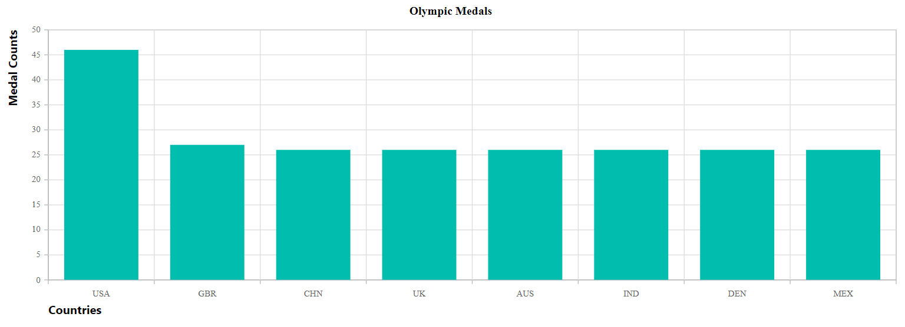

# Axis Customization in Blazor Charts Component

This article explains how to customize chart axes in the Syncfusion Blazor Charts component.

Watch the following video to learn more about axis customization:



## Axis crossing

The position where one axis intersects another can be configured using the [CrossesAt](https://help.syncfusion.com/cr/blazor/Syncfusion.Blazor.Charts.ChartCommonAxis.html#Syncfusion_Blazor_Charts_ChartCommonAxis_CrossesAt) and [CrossesInAxis](https://help.syncfusion.com/cr/blazor/Syncfusion.Blazor.Charts.ChartCommonAxis.html#Syncfusion_Blazor_Charts_ChartCommonAxis_CrossesInAxis) properties in the Syncfusion Blazor Charts component.

- CrossesAt: The value (numeric, DateTime, or logarithmic) at which the axis line should intersect the other axis.
- CrossesInAxis: The name of the axis that this axis should cross.

```cshtml

@using Syncfusion.Blazor.Charts

<SfChart Title="Olympic Medals">
    <ChartPrimaryXAxis ValueType="Syncfusion.Blazor.Charts.ValueType.Category" CrossesAt="15" />

    <ChartPrimaryYAxis CrossesAt="5" />

    <ChartSeriesCollection>
        <ChartSeries DataSource="@MedalDetails" XName="X" YName="YValue" Type="ChartSeriesType.Column" />
    </ChartSeriesCollection>
</SfChart>

@code{
    public class ChartData
    {
        public string X { get; set; }
        public double YValue { get; set; }
    }
	
    public List<ChartData> MedalDetails = new List<ChartData>
	{
         new ChartData { X= "USA", YValue= 46 },
         new ChartData { X= "GBR", YValue= 27 },
         new ChartData { X= "CHN", YValue= 26 },
         new ChartData { X= "UK", YValue= 26 },
         new ChartData { X= "AUS", YValue= 26 },
         new ChartData { X= "IND", YValue= 26 },
         new ChartData { X= "DEN", YValue= 26 },
         new ChartData { X= "MEX", YValue= 26 }
    };
}

```



## Axis title

Add a title to an axis using the [Title](https://help.syncfusion.com/cr/blazor/Syncfusion.Blazor.Charts.ChartCommonAxis.html#Syncfusion_Blazor_Charts_ChartCommonAxis_Title) property to provide context for the plotted values. Customize the title’s appearance with [ChartAxisTitleStyle](https://help.syncfusion.com/cr/blazor/Syncfusion.Blazor.Charts.ChartAxisTitleStyle.html).

```cshtml

@using Syncfusion.Blazor.Charts

<SfChart Title="Olympic Medals">
    <ChartPrimaryXAxis Title="Countries" ValueType="Syncfusion.Blazor.Charts.ValueType.Category">
        <ChartAxisTitleStyle Size="16px" Color="red" FontFamily="Segoe UI" FontWeight="bold" />
    </ChartPrimaryXAxis>

    <ChartSeriesCollection>
        <ChartSeries DataSource="@MedalDetails" XName="X" YName="YValue" Type="ChartSeriesType.Column" />
    </ChartSeriesCollection>
</SfChart>

@code{
    public class ChartData
    {
        public string X { get; set; }
        public double YValue { get; set; }
    }
	
    public List<ChartData> MedalDetails = new List<ChartData>
	{
         new ChartData { X= "USA", YValue= 46 },
         new ChartData { X= "GBR", YValue= 27 },
         new ChartData { X= "CHN", YValue= 26 },
         new ChartData { X= "UK", YValue= 26 },
         new ChartData { X= "AUS", YValue= 26 },
         new ChartData { X= "IND", YValue= 26 },
         new ChartData { X= "DEN", YValue= 26 },
         new ChartData { X= "MEX", YValue= 26 }
    };
}

```



### Axis title alignment

Align the axis title using the `TextAlignment` property of [ChartAxisTitleStyle](https://help.syncfusion.com/cr/blazor/Syncfusion.Blazor.Charts.ChartAxisTitleStyle.html). Use `Alignment.Near`, `Alignment.Center`, or `Alignment.Far` to position the title near the start, centered, or far from the start of the axis, respectively.

```cshtml

@using Syncfusion.Blazor.Charts

<SfChart Title="Olympic Medals">
    <ChartPrimaryXAxis Title="Countries" ValueType="Syncfusion.Blazor.Charts.ValueType.Category">
        <ChartAxisTitleStyle Size="16px" FontFamily="Segoe UI" FontWeight="bold" TextAlignment="Syncfusion.Blazor.Charts.Alignment.Near" />
    </ChartPrimaryXAxis>
    <ChartPrimaryYAxis Title="Medal Counts">
        <ChartAxisTitleStyle Size="16px" FontFamily="Segoe UI" FontWeight="bold" TextAlignment="Syncfusion.Blazor.Charts.Alignment.Far" />
    </ChartPrimaryYAxis>

    <ChartSeriesCollection>
        <ChartSeries DataSource="@MedalDetails" XName="X" YName="YValue" Type="Syncfusion.Blazor.Charts.ChartSeriesType.Column" />
    </ChartSeriesCollection>
</SfChart>

@code {
    public class ChartData
    {
        public string X { get; set; }
        public double YValue { get; set; }
    }

    public List<ChartData> MedalDetails = new List<ChartData>
    {
         new ChartData { X= "USA", YValue= 46 },
         new ChartData { X= "GBR", YValue= 27 },
         new ChartData { X= "CHN", YValue= 26 },
         new ChartData { X= "UK", YValue= 26 },
         new ChartData { X= "AUS", YValue= 26 },
         new ChartData { X= "IND", YValue= 26 },
         new ChartData { X= "DEN", YValue= 26 },
         new ChartData { X= "MEX", YValue= 26 }
    };
}

```




## Tick lines

Customize the width, color, and size of major and minor tick lines using the [MajorTickLines](https://help.syncfusion.com/cr/blazor/Syncfusion.Blazor.Charts.ChartCommonAxis.html#Syncfusion_Blazor_Charts_ChartCommonAxis_MajorTickLines) and [MinorTickLines](https://help.syncfusion.com/cr/blazor/Syncfusion.Blazor.Charts.ChartCommonAxis.html#Syncfusion_Blazor_Charts_ChartCommonAxis_MinorTickLines) properties.

```cshtml

@using Syncfusion.Blazor.Charts

<SfChart Title="Sales History of Product X">
    <ChartPrimaryXAxis ValueType="Syncfusion.Blazor.Charts.ValueType.Category" MinorTicksPerInterval="2">
        <ChartAxisMajorTickLines Width="5" Color="blue" />
        <ChartAxisMinorTickLines Width="1" Color="red" />
    </ChartPrimaryXAxis>

    <ChartPrimaryYAxis Title="Profit($)" MinorTicksPerInterval="1">
        <ChartAxisMajorTickLines Width="5" Color="blue" />
        <ChartAxisMinorTickLines Width="1" Color="red" />
    </ChartPrimaryYAxis>

    <ChartSeriesCollection>
        <ChartSeries DataSource="@SalesData" XName="X" YName="YValue" Type="ChartSeriesType.Column" />
    </ChartSeriesCollection>
</SfChart>

@code{
    public class ChartData
    {
        public string X { get; set; }
        public double YValue { get; set; }
    }
	
    public List<ChartData> SalesData = new List<ChartData>
	{
        new ChartData { X= "John", YValue= 10000 },
        new ChartData { X= "Jake", YValue= 12000 },
        new ChartData { X= "Peter", YValue= 18000 },
        new ChartData { X= "James", YValue= 11000 }
    };
}

```



## Grid lines

Customize the width, color, and dash array of major and minor grid lines using the [MajorGridLines](https://help.syncfusion.com/cr/blazor/Syncfusion.Blazor.Charts.ChartCommonAxis.html#Syncfusion_Blazor_Charts_ChartCommonAxis_MajorGridLines) and [MinorGridLines](https://help.syncfusion.com/cr/blazor/Syncfusion.Blazor.Charts.ChartCommonAxis.html#Syncfusion_Blazor_Charts_ChartCommonAxis_MinorGridLines) properties.

```cshtml

@using Syncfusion.Blazor.Charts

<SfChart>
    <ChartPrimaryXAxis ValueType="Syncfusion.Blazor.Charts.ValueType.Category" MinorTicksPerInterval="2">
        <ChartAxisMajorGridLines Width="5" Color="blue" />
        <ChartAxisMinorGridLines Width="0.5" Color="red" />
    </ChartPrimaryXAxis>

    <ChartSeriesCollection>
        <ChartSeries DataSource="@MedalDetails" XName="X" YName="YValue" Type="ChartSeriesType.Column" />
    </ChartSeriesCollection>
</SfChart>

@code{
    public class ChartData
    {
        public string X { get; set; }
        public double YValue { get; set; }
    }
	
    public List<ChartData> MedalDetails = new List<ChartData>
	{
        new ChartData { X= "USA", YValue= 46 },
        new ChartData { X= "GBR", YValue= 27 },
        new ChartData { X= "CHN", YValue= 26 },
        new ChartData { X= "UK", YValue= 23 },
        new ChartData { X= "AUS", YValue= 16 },
        new ChartData { X= "IND", YValue= 36 },
        new ChartData { X= "DEN", YValue= 12 },
        new ChartData { X= "MEX", YValue= 20 }
    };
}

```



## Multiple axes

Use the [ChartAxes](https://help.syncfusion.com/cr/blazor/Syncfusion.Blazor.Charts.ChartAxes.html) collection to add any number of secondary axes in addition to the primary X and Y axes. Link a series to a secondary axis by setting the series’s `YAxisName` (or `XAxisName`) to the axis’s unique `Name`.

```cshtml

@using Syncfusion.Blazor.Charts

<SfChart Title="Weather Reports">
    <ChartPrimaryXAxis ValueType="Syncfusion.Blazor.Charts.ValueType.Category" />
    
    <ChartAxes>
        <ChartAxis Name="YAxis" OpposedPosition="true" />
    </ChartAxes>

    <ChartSeriesCollection>
        <ChartSeries DataSource="@WeatherReports" XName="X" YName="Y" Type="ChartSeriesType.Column" />
        <ChartSeries DataSource="@WeatherReports" XName="X" YName="Y1" YAxisName="YAxis" />
    </ChartSeriesCollection>

</SfChart>

@code{
    public class ChartData
    {
        public string X { get; set; }
        public double Y { get; set; }
        public double Y1 { get; set; }
    }
	
    public List<ChartData> WeatherReports = new List<ChartData>
	{
        new ChartData { X = "Sun", Y = 35, Y1 = 30 },
        new ChartData { X = "Mon", Y = 40, Y1 = 28 },
        new ChartData { X = "Tue", Y = 80, Y1 = 29 },
        new ChartData { X = "Wed", Y = 70, Y1 = 30 },
        new ChartData { X = "Thu", Y = 65, Y1 = 33 },
        new ChartData { X = "Fri", Y = 55, Y1 = 32 },
        new ChartData { X = "Sat", Y = 50, Y1 = 34 }
    };
}

```



## See also

* [Mixed Chart](./chart-series)
* [Multiple Panes](./multiple-panes)

## Inverted axis

When an axis is inverted, the greatest value on the axis appears nearest the origin, and the lowest value appears farthest away. To invert an axis, set [IsInversed](https://help.syncfusion.com/cr/blazor/Syncfusion.Blazor.Charts.ChartCommonAxis.html#Syncfusion_Blazor_Charts_ChartCommonAxis_IsInversed) to `true`.

```cshtml

@using Syncfusion.Blazor.Charts

<SfChart Title="Weather Reports">
    <ChartPrimaryXAxis ValueType="Syncfusion.Blazor.Charts.ValueType.Category" />

    <ChartPrimaryYAxis IsInversed="true" />

    <ChartSeriesCollection>
        <ChartSeries DataSource="@WeatherReports" XName="X" YName="Y" Type="ChartSeriesType.Column" />
    </ChartSeriesCollection>
</SfChart>

@code{
    public class ChartData
    {
        public string X { get; set; }
        public double Y { get; set; }
    }
	
    public List<ChartData> WeatherReports = new List<ChartData>
	{
        new ChartData { X = "Sun", Y = 35 },
        new ChartData { X = "Mon", Y = 40 },
        new ChartData { X = "Tue", Y = 80 },
        new ChartData { X = "Wed", Y = 70 },
        new ChartData { X = "Thu", Y = 65 },
        new ChartData { X = "Fri", Y = 55 },
        new ChartData { X = "Sat", Y = 50 }
    };
}

```



## Opposed position

Place an axis on the opposite side of its default position by setting [OpposedPosition](https://help.syncfusion.com/cr/blazor/Syncfusion.Blazor.Charts.ChartCommonAxis.html#Syncfusion_Blazor_Charts_ChartCommonAxis_OpposedPosition) to `true`. This is similar to right-to-left (RTL) layouts for axis placement.

```cshtml

@using Syncfusion.Blazor.Charts

<SfChart Title="Weather Reports">
    <ChartPrimaryXAxis ValueType="Syncfusion.Blazor.Charts.ValueType.Category" />

    <ChartPrimaryYAxis OpposedPosition="true" />

    <ChartSeriesCollection>
        <ChartSeries DataSource="@WeatherReports" XName="X" YName="Y" Type="ChartSeriesType.Column" />
    </ChartSeriesCollection>

</SfChart>

@code{
    public class ChartData
    {
        public string X { get; set; }
        public double Y { get; set; }
    }
	
    public List<ChartData> WeatherReports = new List<ChartData>
	{
        new ChartData { X = "Sun", Y = 35 },
        new ChartData { X = "Mon", Y = 40 },
        new ChartData { X = "Tue", Y = 80 },
        new ChartData { X = "Wed", Y = 70 },
        new ChartData { X = "Thu", Y = 65 },
        new ChartData { X = "Fri", Y = 55 },
        new ChartData { X = "Sat", Y = 50 }
    };
}

```



N> Refer to the [Blazor Charts](https://www.syncfusion.com/blazor-components/blazor-charts) feature tour for an overview of key capabilities, and explore the [Blazor Chart Example](https://blazor.syncfusion.com/demos/chart/line?theme=bootstrap5) to see various chart types and time-series visualizations.

## See also

* [Data label](./data-labels)
* [Tooltip](./tool-tip)
* [Marker](./data-markers)
