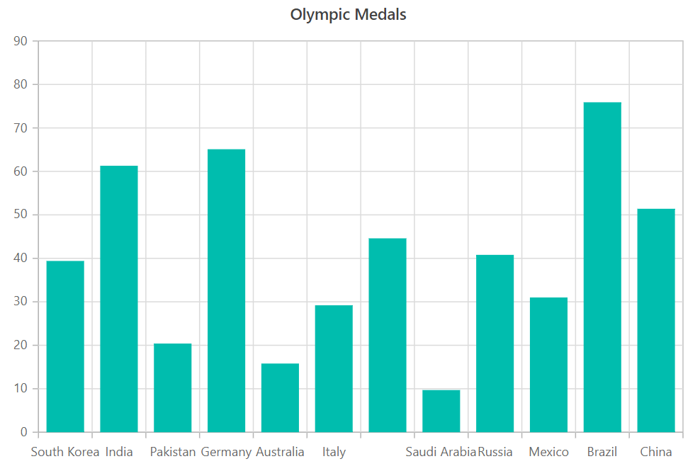
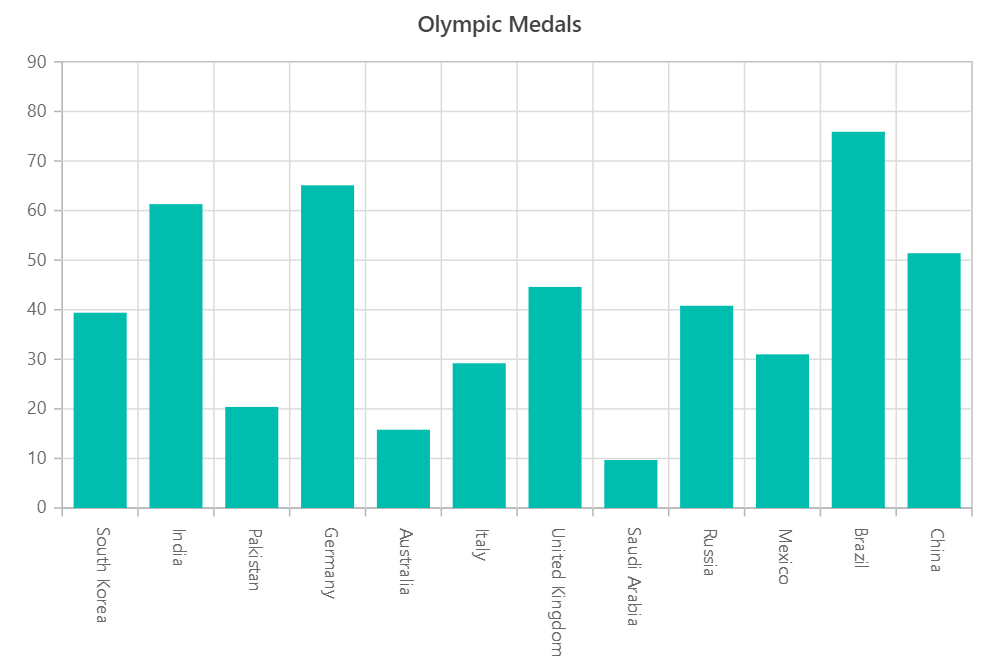
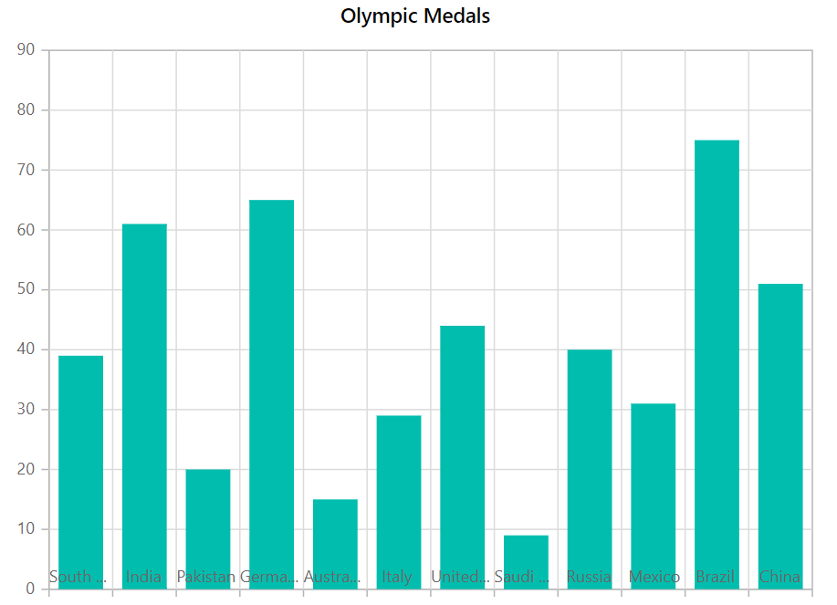
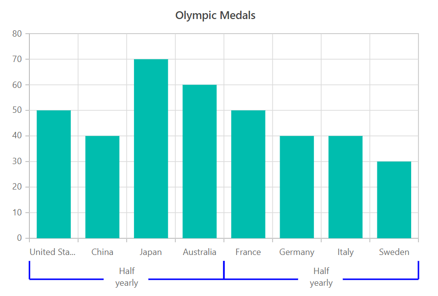
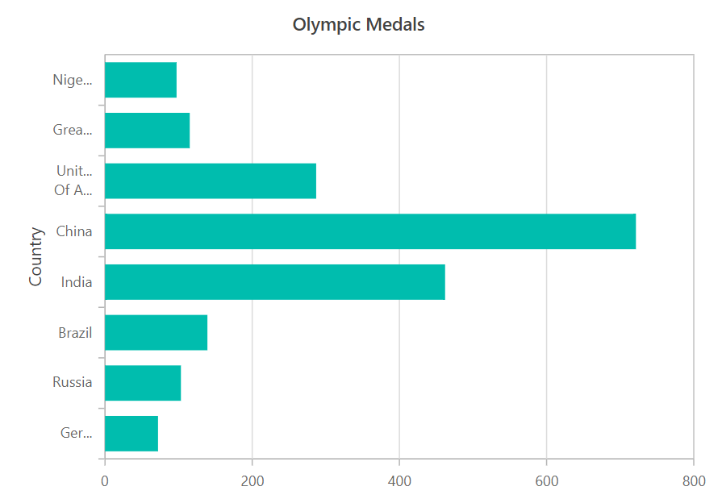

# Axis Labels in Blazor Charts (SfCharts)

## Smart Axis Labels

When the axis labels overlap, the [`LabelIntersectAction`](https://help.syncfusion.com/cr/blazor/Syncfusion.Blazor.Charts.ChartCommonAxis.html#Syncfusion_Blazor_Charts_ChartCommonAxis_LabelIntersectAction) property in the axis may be used to intelligently arrange them.

When [`LabelIntersectAction`](https://help.syncfusion.com/cr/blazor/Syncfusion.Blazor.Charts.ChartCommonAxis.html#Syncfusion_Blazor_Charts_ChartCommonAxis_LabelIntersectAction) is set to **Hide**,

```csharp

@using Syncfusion.Blazor.Charts

<SfChart Title="Olympic Medals" Width="650">

    <ChartPrimaryXAxis ValueType="Syncfusion.Blazor.Charts.ValueType.Category"
        LabelIntersectAction="LabelIntersectAction.Hide" />

    <ChartSeriesCollection>
        <ChartSeries DataSource="@MedalDetails" XName="X" YName="Y" Type="ChartSeriesType.Column" />
    </ChartSeriesCollection>

</SfChart>

@code{
    public class ChartData
    {
        public string X { get; set; }
        public double Y { get; set; }
    }
    public List<ChartData> MedalDetails = new List<ChartData>
    {
    new ChartData { X= "South Korea", Y= 39.4 },
    new ChartData { X= "India", Y= 61.3 },
    new ChartData { X= "Pakistan", Y= 20.4 },
    new ChartData { X= "Germany", Y= 65.1 },
    new ChartData { X= "Australia", Y= 15.8 },
    new ChartData { X= "Italy", Y= 29.2 },
    new ChartData { X= "United Kingdom", Y= 44.6 },
    new ChartData { X= "Saudi Arabia", Y= 9.7 },
    new ChartData { X= "Russia", Y= 40.8 },
    new ChartData { X= "Mexico", Y= 31 },
    new ChartData { X= "Brazil", Y= 75.9 },
    new ChartData { X= "China", Y= 51.4 }
    };
}


```



When [`LabelIntersectAction`](https://help.syncfusion.com/cr/blazor/Syncfusion.Blazor.Charts.ChartCommonAxis.html#Syncfusion_Blazor_Charts_ChartCommonAxis_LabelIntersectAction) is set to **Rotate45**

```csharp

@using Syncfusion.Blazor.Charts

<SfChart Title="Olympic Medals" Width="650">

    <ChartPrimaryXAxis ValueType="Syncfusion.Blazor.Charts.ValueType.Category"
                       LabelIntersectAction="LabelIntersectAction.Rotate45" />

    <ChartSeriesCollection>
        <ChartSeries DataSource="@MedalDetails" XName="X" YName="Y" Type="ChartSeriesType.Column" />
    </ChartSeriesCollection>

</SfChart>

@code{
    public class ChartData
    {
        public string X { get; set; }
        public double Y { get; set; }
    }
    public List<ChartData> MedalDetails = new List<ChartData>
{
    new ChartData { X= "South Korea", Y= 39.4 },
    new ChartData { X= "India", Y= 61.3 },
    new ChartData { X= "Pakistan", Y= 20.4 },
    new ChartData { X= "Germany", Y= 65.1 },
    new ChartData { X= "Australia", Y= 15.8 },
    new ChartData { X= "Italy", Y= 29.2 },
    new ChartData { X= "United Kingdom", Y= 44.6 },
    new ChartData { X= "Saudi Arabia", Y= 9.7 },
    new ChartData { X= "Russia", Y= 40.8 },
    new ChartData { X= "Mexico", Y= 31 },
    new ChartData { X= "Brazil", Y= 75.9 },
    new ChartData { X= "China", Y= 51.4 }
    };
}


```


When [`LabelIntersectAction`](https://help.syncfusion.com/cr/blazor/Syncfusion.Blazor.Charts.ChartCommonAxis.html#Syncfusion_Blazor_Charts_ChartCommonAxis_LabelIntersectAction) is set to **Rotate90**

```csharp

@using Syncfusion.Blazor.Charts

<SfChart Title="Olympic Medals" Width="650">

    <ChartPrimaryXAxis ValueType="Syncfusion.Blazor.Charts.ValueType.Category"
                       LabelIntersectAction="LabelIntersectAction.Rotate90" />

    <ChartSeriesCollection>
        <ChartSeries DataSource="@MedalDetails" XName="X" YName="Y" Type="ChartSeriesType.Column" />
    </ChartSeriesCollection>

</SfChart>

@code{
    public class ChartData
    {
        public string X { get; set; }
        public double Y { get; set; }
    }
    public List<ChartData> MedalDetails = new List<ChartData>
{
    new ChartData { X= "South Korea", Y= 39.4 },
    new ChartData { X= "India", Y= 61.3 },
    new ChartData { X= "Pakistan", Y= 20.4 },
    new ChartData { X= "Germany", Y= 65.1 },
    new ChartData { X= "Australia", Y= 15.8 },
    new ChartData { X= "Italy", Y= 29.2 },
    new ChartData { X= "United Kingdom", Y= 44.6 },
    new ChartData { X= "Saudi Arabia", Y= 9.7 },
    new ChartData { X= "Russia", Y= 40.8 },
    new ChartData { X= "Mexico", Y= 31 },
    new ChartData { X= "Brazil", Y= 75.9 },
    new ChartData { X= "China", Y= 51.4 }
    };
}


```



## Axis Labels Positioning

The axis labels can be put **Outside** of the axis line by default, however the [`LabelPosition`](https://help.syncfusion.com/cr/blazor/Syncfusion.Blazor.Charts.ChartCommonAxis.html#Syncfusion_Blazor_Charts_ChartCommonAxis_LabelPosition) property may also be used to position them **Inside** the axis line.

```csharp

@using Syncfusion.Blazor.Charts

<SfChart Title="Olympic Medals" Width="650">
    <ChartPrimaryXAxis ValueType="Syncfusion.Blazor.Charts.ValueType.Category" 
                       LabelPosition="AxisPosition.Inside"/>   

    <ChartSeriesCollection>
        <ChartSeries DataSource="@MedalDetails" XName="X" YName="Y" Type="ChartSeriesType.Column"/>        
    </ChartSeriesCollection>
</SfChart>

@code{
    public class ChartData
    {
        public string X { get; set; }
        public double Y { get; set; }
    }
    public List<ChartData> MedalDetails = new List<ChartData>
 {
            new ChartData { X= "South Korea", Y= 39.4 },
            new ChartData { X= "India", Y= 61.3 },
            new ChartData { X= "Pakistan", Y= 20.4 },
            new ChartData { X= "Germany", Y= 65.1 },
            new ChartData { X= "Australia", Y= 15.8 },
            new ChartData { X= "Italy", Y= 29.2 },
            new ChartData { X= "United Kingdom", Y= 44.6 },
            new ChartData { X= "Saudi Arabia", Y= 9.7 },
            new ChartData { X= "Russia", Y= 40.8 },
            new ChartData { X= "Mexico", Y= 31 },
            new ChartData { X= "Brazil", Y= 75.9 },
            new ChartData { X= "China", Y= 51.4 }
        };
}

```



## Multilevel Labels

The [`MultiLevelLabels`](https://help.syncfusion.com/cr/blazor/Syncfusion.Blazor.Charts.ChartCommonAxis.html#Syncfusion_Blazor_Charts_ChartCommonAxis_MultiLevelLabels) property allows you to add any number of layers of labels to the axis. The following properties can be used to configure this property.

### Categories

The [`Start`](https://help.syncfusion.com/cr/blazor/Syncfusion.Blazor.Charts.ChartCategory.html#Syncfusion_Blazor_Charts_ChartCategory_Start), [`End`](https://help.syncfusion.com/cr/blazor/Syncfusion.Blazor.Charts.ChartCategory.html#Syncfusion_Blazor_Charts_ChartCategory_End), [`Text`](https://help.syncfusion.com/cr/blazor/Syncfusion.Blazor.Charts.ChartCategory.html#Syncfusion_Blazor_Charts_ChartCategory_Text), and [`MaximumTextWidth`](https://help.syncfusion.com/cr/blazor/Syncfusion.Blazor.Charts.ChartCategory.html#Syncfusion_Blazor_Charts_ChartCategory_MaximumTextWidth) of multilevel labels can be customized using the [`Categories`](https://help.syncfusion.com/cr/blazor/Syncfusion.Blazor.Charts.ChartMultiLevelLabel.html#Syncfusion_Blazor_Charts_ChartMultiLevelLabel_Categories).

```csharp

@using Syncfusion.Blazor.Charts

<SfChart Title="Olympic Medals" Width="650">
    <ChartPrimaryXAxis ValueType="Syncfusion.Blazor.Charts.ValueType.Category">
        <ChartMultiLevelLabels>
            <ChartMultiLevelLabel>
                <ChartCategories>                   
                        <ChartCategory Start="-0.5" End="3.5" Text="Half yearly 1" MaximumTextWidth=50></ChartCategory>
                        <ChartCategory Start="3.5" End="7.5" Text="Half yearly 2" MaximumTextWidth=50></ChartCategory>
                  
                </ChartCategories>
            </ChartMultiLevelLabel>
        </ChartMultiLevelLabels>
    </ChartPrimaryXAxis>

    <ChartSeriesCollection>
        <ChartSeries DataSource="@MedalDetails" XName="X" YName="Y" Type="ChartSeriesType.Column">
        </ChartSeries>
    </ChartSeriesCollection>
</SfChart>

@code{

    public int start = 0, end = 30;
    public class ChartData
    {
        public string X { get; set; }
        public double Y { get; set; }
    }
    public List<ChartData> MedalDetails = new List<ChartData>
{
            new ChartData { X= "Russia", Y= 50 },
            new ChartData { X= "China", Y= 40 },
            new ChartData { X= "Japan", Y= 70 },
            new ChartData { X= "Australia", Y= 60 },
            new ChartData { X= "France", Y= 70 },
            new ChartData { X= "Germany", Y= 40 },
            new ChartData { X= "Italy", Y= 40 },
            new ChartData { X= "United states", Y= 30 },
        };
}


```


### Overflow

[`Trim`](https://help.syncfusion.com/cr/blazor/Syncfusion.Blazor.Charts.TextOverflow.html#Syncfusion_Blazor_Charts_TextOverflow_Trim) or [`Wrap`](https://help.syncfusion.com/cr/blazor/Syncfusion.Blazor.Charts.TextOverflow.html#Syncfusion_Blazor_Charts_TextOverflow_Wrap) the multilevel labels using the [`Overflow`](https://help.syncfusion.com/cr/blazor/Syncfusion.Blazor.Charts.ChartMultiLevelLabel.html#Syncfusion_Blazor_Charts_ChartMultiLevelLabel_Overflow) property.

```csharp

@using Syncfusion.Blazor.Charts

<SfChart Title="Olympic Medals" Width="650">
    <ChartPrimaryXAxis ValueType="Syncfusion.Blazor.Charts.ValueType.Category">
        <ChartMultiLevelLabels>
            <ChartMultiLevelLabel Overflow="TextOverflow.Trim">
                <ChartCategories>                  
                        <ChartCategory Start="-0.5" End="3.5" Text="Half yearly 1" MaximumTextWidth=50></ChartCategory>
                        <ChartCategory Start="3.5" End="7.5" Text="Half yearly 2" MaximumTextWidth=50></ChartCategory>                   
                </ChartCategories>
            </ChartMultiLevelLabel>
        </ChartMultiLevelLabels>
    </ChartPrimaryXAxis>

    <ChartSeriesCollection>
        <ChartSeries DataSource="@MedalDetails" XName="X" YName="Y" Type="ChartSeriesType.Column">
        </ChartSeries>
    </ChartSeriesCollection>
</SfChart>

@code{

    public int start = 0, end = 30;
    public class ChartData
    {
        public string X { get; set; }
        public double Y { get; set; }
    }
    public List<ChartData> MedalDetails = new List<ChartData>
{
            new ChartData { X= "Russia", Y= 50 },
            new ChartData { X= "China", Y= 40 },
            new ChartData { X= "Japan", Y= 70 },
            new ChartData { X= "Australia", Y= 60 },
            new ChartData { X= "France", Y= 70 },
            new ChartData { X= "Germany", Y= 40 },
            new ChartData { X= "Italy", Y= 40 },
            new ChartData { X= "United states", Y= 30 },
        };
}


```


### Alignment

The [`Alignment`](https://help.syncfusion.com/cr/blazor/Syncfusion.Blazor.Charts.ChartMultiLevelLabel.html#Syncfusion_Blazor_Charts_ChartMultiLevelLabel_Alignment) property provides option to position the multilevel labels at `Far`, `Center`, or `Near`.

The [`Alignment`](https://help.syncfusion.com/cr/blazor/Syncfusion.Blazor.Charts.ChartMultiLevelLabel.html#Syncfusion_Blazor_Charts_ChartMultiLevelLabel_Alignment) property allows to place multilevel labels in a [`Far`](https://help.syncfusion.com/cr/blazor/Syncfusion.Blazor.Charts.Alignment.html#Syncfusion_Blazor_Charts_Alignment_Far), [`Center`](https://help.syncfusion.com/cr/blazor/Syncfusion.Blazor.Charts.Alignment.html#Syncfusion_Blazor_Charts_Alignment_Center), or [`Near`](https://help.syncfusion.com/cr/blazor/Syncfusion.Blazor.Charts.Alignment.html#Syncfusion_Blazor_Charts_Alignment_Near) location.

```csharp

@using Syncfusion.Blazor.Charts

<SfChart Title="Olympic Medals" Width="650">
    <ChartPrimaryXAxis ValueType="Syncfusion.Blazor.Charts.ValueType.Category">
        <ChartMultiLevelLabels>
            <ChartMultiLevelLabel Alignment="Alignment.Far">
                <ChartCategories>
                        <ChartCategory Start="-0.5" End="3.5" Text="Half yearly 1" MaximumTextWidth=50></ChartCategory>
                        <ChartCategory Start="3.5" End="7.5" Text="Half yearly 2" MaximumTextWidth=50></ChartCategory>
                       
                </ChartCategories>
            </ChartMultiLevelLabel>
        </ChartMultiLevelLabels>
    </ChartPrimaryXAxis>

    <ChartSeriesCollection>
        <ChartSeries DataSource="@MedalDetails" XName="X" YName="Y" Type="ChartSeriesType.Column">
        </ChartSeries>
    </ChartSeriesCollection>
</SfChart>

@code{

    public int start = 0, end = 30;
    public class ChartData
    {
        public string X { get; set; }
        public double Y { get; set; }
    }
    public List<ChartData> MedalDetails = new List<ChartData>
{
            new ChartData { X= "Russia", Y= 50 },
            new ChartData { X= "China", Y= 40 },
            new ChartData { X= "Japan", Y= 70 },
            new ChartData { X= "Australia", Y= 60 },
            new ChartData { X= "France", Y= 70 },
            new ChartData { X= "Germany", Y= 40 },
            new ChartData { X= "Italy", Y= 40 },
            new ChartData { X= "United states", Y= 30 },
        };
}


```


### Text customization

The [`Size`](https://help.syncfusion.com/cr/blazor/Syncfusion.Blazor.Charts.ChartAxisMultiLevelLabelTextStyle.html#Syncfusion_Blazor_Charts_ChartAxisMultiLevelLabelTextStyle_Size), [`Color`](https://help.syncfusion.com/cr/blazor/Syncfusion.Blazor.Charts.ChartAxisMultiLevelLabelTextStyle.html#Syncfusion_Blazor_Charts_ChartAxisMultiLevelLabelTextStyle_Color), [`FontFamily`](https://help.syncfusion.com/cr/blazor/Syncfusion.Blazor.Charts.ChartCommonFont.html#Syncfusion_Blazor_Charts_ChartCommonFont_FontFamily), [`FontWeight`](https://help.syncfusion.com/cr/blazor/Syncfusion.Blazor.Charts.ChartCommonFont.html#Syncfusion_Blazor_Charts_ChartCommonFont_FontWeight), [`FontStyle`](https://help.syncfusion.com/cr/blazor/Syncfusion.Blazor.Charts.ChartCommonFont.html#Syncfusion_Blazor_Charts_ChartCommonFont_FontStyle), [`Opacity`](https://help.syncfusion.com/cr/blazor/Syncfusion.Blazor.Charts.ChartCommonFont.html#Syncfusion_Blazor_Charts_ChartCommonFont_Opacity), [`TextAlignment`](https://help.syncfusion.com/cr/blazor/Syncfusion.Blazor.Charts.ChartCommonFont.html#Syncfusion_Blazor_Charts_ChartCommonFont_TextAlignment) and [`TextOverflow`](https://help.syncfusion.com/cr/blazor/Syncfusion.Blazor.Charts.ChartCommonFont.html#Syncfusion_Blazor_Charts_ChartCommonFont_TextOverflow) may all be customized using the [`TextStyle`](https://help.syncfusion.com/cr/blazor/Syncfusion.Blazor.Charts.ChartMultiLevelLabel.html#Syncfusion_Blazor_Charts_ChartMultiLevelLabel_TextStyle) property of multilevel labels.

```csharp

@using Syncfusion.Blazor.Charts

<SfChart Title="Olympic Medals" Width="650">
    <ChartPrimaryXAxis ValueType="Syncfusion.Blazor.Charts.ValueType.Category">
        <ChartMultiLevelLabels>
            <ChartMultiLevelLabel>
                <ChartCategories>
                        <ChartCategory Start="-0.5" End="3.5" Text="Half yearly 1" MaximumTextWidth=50></ChartCategory>
                        <ChartCategory Start="3.5" End="7.5" Text="Half yearly 2" MaximumTextWidth=50></ChartCategory>
                   
                </ChartCategories>
                <ChartAxisMultiLevelLabelTextStyle Size="18px" Color="red"/>
            </ChartMultiLevelLabel>
        </ChartMultiLevelLabels>
    </ChartPrimaryXAxis>

    <ChartSeriesCollection>
        <ChartSeries DataSource="@MedalDetails" XName="X" YName="Y" Type="ChartSeriesType.Column">
        </ChartSeries>
    </ChartSeriesCollection>
</SfChart>

@code{

    public int start = 0, end = 30;
    public class ChartData
    {
        public string X { get; set; }
        public double Y { get; set; }
    }
    public List<ChartData> MedalDetails = new List<ChartData>
{
            new ChartData { X= "Russia", Y= 50 },
            new ChartData { X= "China", Y= 40 },
            new ChartData { X= "Japan", Y= 70 },
            new ChartData { X= "Australia", Y= 60 },
            new ChartData { X= "France", Y= 70 },
            new ChartData { X= "Germany", Y= 40 },
            new ChartData { X= "Italy", Y= 40 },
            new ChartData { X= "United states", Y= 30 },
        };
}


```


### Border customization

The [`Width`](https://help.syncfusion.com/cr/blazor/Syncfusion.Blazor.Charts.ChartCommonLabelBorder.html#Syncfusion_Blazor_Charts_ChartCommonLabelBorder_Width), [`Color`](https://help.syncfusion.com/cr/blazor/Syncfusion.Blazor.Charts.ChartCommonLabelBorder.html#Syncfusion_Blazor_Charts_ChartCommonLabelBorder_Color), and [`Type`](https://help.syncfusion.com/cr/blazor/Syncfusion.Blazor.Charts.ChartCommonLabelBorder.html#Syncfusion_Blazor_Charts_ChartCommonLabelBorder_Type) of the border using the [`Border`](https://help.syncfusion.com/cr/blazor/Syncfusion.Blazor.Charts.ChartMultiLevelLabel.html#Syncfusion_Blazor_Charts_ChartMultiLevelLabel_Border) can be changed. [`Rectangle`](https://help.syncfusion.com/cr/blazor/Syncfusion.Blazor.Charts.BorderType.html#Syncfusion_Blazor_Charts_BorderType_Rectangle), [`Brace`](https://help.syncfusion.com/cr/blazor/Syncfusion.Blazor.Charts.BorderType.html#Syncfusion_Blazor_Charts_BorderType_Brace), [`WithoutBorder`](https://help.syncfusion.com/cr/blazor/Syncfusion.Blazor.Charts.BorderType.html#Syncfusion_Blazor_Charts_BorderType_WithoutBorder), [`WithoutTopBorder`](https://help.syncfusion.com/cr/blazor/Syncfusion.Blazor.Charts.BorderType.html#Syncfusion_Blazor_Charts_BorderType_WithoutTopBorder), [`WithoutTopandBottomBorder`](https://help.syncfusion.com/cr/blazor/Syncfusion.Blazor.Charts.BorderType.html#Syncfusion_Blazor_Charts_BorderType_WithoutTopandBottomBorder), [`Auto`](https://help.syncfusion.com/cr/blazor/Syncfusion.Blazor.Charts.BorderType.html#Syncfusion_Blazor_Charts_BorderType_Auto), and [`CurlyBrace`](https://help.syncfusion.com/cr/blazor/Syncfusion.Blazor.Charts.BorderType.html#Syncfusion_Blazor_Charts_BorderType_CurlyBrace) are the different types of borders.

```csharp

@using Syncfusion.Blazor.Charts

<SfChart Title="Olympic Medals" Width="650">
    <ChartPrimaryXAxis ValueType="Syncfusion.Blazor.Charts.ValueType.Category">
        <ChartMultiLevelLabels>
            <ChartMultiLevelLabel>
                <ChartCategories>
                        <ChartCategory Start="-0.5" End="3.5" Text="Half yearly 1" MaximumTextWidth="50"></ChartCategory>
                        <ChartCategory Start="3.5" End="7.5" Text="Half yearly 2" MaximumTextWidth="50"></ChartCategory>
                </ChartCategories>
                <ChartAxisMultiLevelLabelBorder Type="BorderType.Brace" Color="blue" Width=2></ChartAxisMultiLevelLabelBorder>
            </ChartMultiLevelLabel>
        </ChartMultiLevelLabels>
    </ChartPrimaryXAxis>

    <ChartSeriesCollection>
        <ChartSeries DataSource="@MedalDetails" XName="X" YName="Y" Type="ChartSeriesType.Column">
        </ChartSeries>
    </ChartSeriesCollection>
</SfChart>

@code{

    public int start = 0, end = 30;
    public class ChartData
    {
        public string X { get; set; }
        public double Y { get; set; }
    }
    public List<ChartData> MedalDetails = new List<ChartData>
{
            new ChartData { X= "Russia", Y= 50 },
            new ChartData { X= "China", Y= 40 },
            new ChartData { X= "Japan", Y= 70 },
            new ChartData { X= "Australia", Y= 60 },
            new ChartData { X= "France", Y= 70 },
            new ChartData { X= "Germany", Y= 40 },
            new ChartData { X= "Italy", Y= 40 },
            new ChartData { X= "United states", Y= 30 },
        };
}


```



## Edge Label Placement

Long text labels at the axes' edges may display partially in the chart. To avoid this, utilise the axis' [`EdgeLabelPlacement`](https://help.syncfusion.com/cr/blazor/Syncfusion.Blazor.Charts.ChartCommonAxis.html#Syncfusion_Blazor_Charts_ChartCommonAxis_EdgeLabelPlacement) property, which moves or hides the label within the chart area for a better appearance using the [`Shift`](https://help.syncfusion.com/cr/blazor/Syncfusion.Blazor.Charts.EdgeLabelPlacement.html#Syncfusion_Blazor_Charts_EdgeLabelPlacement_Shift), [`Hide`](https://help.syncfusion.com/cr/blazor/Syncfusion.Blazor.Charts.EdgeLabelPlacement.html#Syncfusion_Blazor_Charts_EdgeLabelPlacement_Hide) Options. [`None`](https://help.syncfusion.com/cr/blazor/Syncfusion.Blazor.Charts.EdgeLabelPlacement.html#Syncfusion_Blazor_Charts_EdgeLabelPlacement_None) will leave the text as it is.

```csharp

@using Syncfusion.Blazor.Charts

<SfChart Title="Olympic Medals" Width="50%">
    <ChartPrimaryXAxis ValueType="Syncfusion.Blazor.Charts.ValueType.Category" EdgeLabelPlacement="EdgeLabelPlacement.Shift">
    </ChartPrimaryXAxis>

    <ChartSeriesCollection>
        <ChartSeries DataSource="@MedalDetails" XName="Country" YName="Gold" Type="ChartSeriesType.Column">
        </ChartSeries>
    </ChartSeriesCollection>
</SfChart>

@code{
    public class ChartData
    {
        public string Country { get; set; }
        public double Gold { get; set; }
    }
    public List<ChartData> MedalDetails = new List<ChartData>
{
    new ChartData{ Country= "United States", Gold=50  },
    new ChartData{ Country="China", Gold=40 },
    new ChartData{ Country= "Japan", Gold=70 },
    new ChartData{ Country= "Australia", Gold=60},
    new ChartData{ Country= "France", Gold=50 },
    new ChartData{ Country= "Germany", Gold=40 },
    new ChartData{ Country= "Italy", Gold=40 },
    new ChartData{ Country= "Sweden", Gold=30 }
    };
}

```

## Labels Customization

An axis' [`LabelStyle`](https://help.syncfusion.com/cr/blazor/Syncfusion.Blazor.Charts.ChartMultiLevelLabel.html#Syncfusion_Blazor_Charts_ChartMultiLevelLabel_TextStyle) property allows you to change the [`Colour`](https://help.syncfusion.com/cr/blazor/Syncfusion.Blazor.Charts.ChartAxisMultiLevelLabelTextStyle.html#Syncfusion_Blazor_Charts_ChartAxisMultiLevelLabelTextStyle_Color) and [`Size`](https://help.syncfusion.com/cr/blazor/Syncfusion.Blazor.Charts.ChartAxisMultiLevelLabelTextStyle.html#Syncfusion_Blazor_Charts_ChartAxisMultiLevelLabelTextStyle_Size) of the axis labels.

```csharp

@using Syncfusion.Blazor.Charts

<SfChart Title="Olympic Medals" Width="50%">
    <ChartPrimaryXAxis ValueType="Syncfusion.Blazor.Charts.ValueType.Category">
        <ChartAxisLabelBorder Width="1" Color="red"></ChartAxisLabelBorder>
    </ChartPrimaryXAxis>

    <ChartSeriesCollection>
        <ChartSeries DataSource="@MedalDetails" XName="Country" YName="Gold" Type="ChartSeriesType.Column">
        </ChartSeries>
    </ChartSeriesCollection>
</SfChart>

@code{
    public class ChartData
    {
        public string Country { get; set; }
        public double Gold { get; set; }
    }
    public List<ChartData> MedalDetails = new List<ChartData>
{
    new ChartData{ Country= "United States", Gold=50  },
    new ChartData{ Country="China", Gold=40 },
    new ChartData{ Country= "Japan", Gold=70 },
    new ChartData{ Country= "Australia", Gold=60},
    new ChartData{ Country= "France", Gold=50 },
    new ChartData{ Country= "Germany", Gold=40 },
    new ChartData{ Country= "Italy", Gold=40 },
    new ChartData{ Country= "Sweden", Gold=30 }
    };
}

```

## Label Trim

The label may be trimmed with [`EnableTrim`](https://help.syncfusion.com/cr/blazor/Syncfusion.Blazor.Charts.ChartCommonAxis.html#Syncfusion_Blazor_Charts_ChartCommonAxis_EnableTrim), and the width of the labels may be modified with the [`MaximumLabelWidth`](https://help.syncfusion.com/cr/blazor/Syncfusion.Blazor.Charts.ChartCommonAxis.html#Syncfusion_Blazor_Charts_ChartCommonAxis_MaximumLabelWidth) property in the axis; **34px** is the default value of [`MaximumLabelWidth`](https://help.syncfusion.com/cr/blazor/Syncfusion.Blazor.Charts.ChartCommonAxis.html#Syncfusion_Blazor_Charts_ChartCommonAxis_MaximumLabelWidth) property.

```csharp

@using Syncfusion.Blazor.Charts

<SfChart Title="Olympic Medals" Width="50%">
    <ChartPrimaryXAxis EnableTrim="true" MaximumLabelWidth="40" ValueType="Syncfusion.Blazor.Charts.ValueType.Category">
    </ChartPrimaryXAxis>

    <ChartSeriesCollection>
        <ChartSeries DataSource="@MedalDetails" XName="Country" YName="Gold" Type="ChartSeriesType.Column">
        </ChartSeries>
    </ChartSeriesCollection>
</SfChart>

@code{
    public class ChartData
    {
        public string Country { get; set; }
        public double Gold { get; set; }
    }
    public List<ChartData> MedalDetails = new List<ChartData>
{
    new ChartData{ Country= "United States", Gold=50  },
    new ChartData{ Country="China", Gold=40 },
    new ChartData{ Country= "Japan", Gold=70 },
    new ChartData{ Country= "Australia", Gold=60},
    new ChartData{ Country= "France", Gold=50 },
    new ChartData{ Country= "Germany", Gold=40 },
    new ChartData{ Country= "Italy", Gold=40 },
    new ChartData{ Country= "Sweden", Gold=30 }
    };
}

```


## Line break

The <br> tag can used to separate the long axis label into multiple lines utilizing the line break functionality.

```csharp

@using Syncfusion.Blazor.Charts

<SfChart Title="Olympic Medals">
    <ChartPrimaryXAxis Title="Country" EnableTrim="true" ValueType="Syncfusion.Blazor.Charts.ValueType.Category">
        <ChartAxisMajorGridLines Width="0"></ChartAxisMajorGridLines>
    </ChartPrimaryXAxis>

    <ChartSeriesCollection>
        <ChartSeries DataSource="@MedalDetails" XName="X" YName="Y" Type="ChartSeriesType.Bar">
        </ChartSeries>
    </ChartSeriesCollection>
</SfChart>

@code{
    public class ChartData
    {
        public string X { get; set; }
        public double Y { get; set; }
        public string Country { get; set; }
    }
    public List<ChartData> MedalDetails = new List<ChartData> {
            new ChartData { X = "Germany", Y = 72, Country = "GER: 72"},
            new ChartData { X = "Russia", Y = 103.1, Country = "RUS: 103.1" },
            new ChartData { X = "Brazil", Y = 139.1, Country = "BRZ: 139.1" },
            new ChartData { X = "India", Y = 462.1, Country = "IND: 462.1" },
            new ChartData { X = "China", Y = 721.4, Country = "CHN: 721.4" },
            new ChartData { X = "United States<br>Of America", Y = 286.9, Country = "USA: 286.9" },
            new ChartData { X = "Great Britain", Y = 115.1, Country = "GBR: 115.1" },
            new ChartData { X = "Nigeria", Y = 97.2, Country = "NGR: 97.2" },
        };
}


```



## Label Format

Learn more about axis label format in relation to axis types from the pages below.

* [Numeric Label Format](./numeric-axis#label-format)
* [DateTime Label Format](./date-time-axis#label-format)
* [Custom Label Format](./date-time-axis#custom-label-format)

> Refer to our [`Blazor Charts`](https://www.syncfusion.com/blazor-components/blazor-charts) feature tour page for its groundbreaking feature representations and also explore our [`Blazor Chart example`](https://blazor.syncfusion.com/demos/chart/line?theme=bootstrap4) to know various chart types and how to represent time-dependent data, showing trends at equal intervals.

## See Also

* [Data Label](./data-labels)
* [Tooltip](./tool-tip)
* [Marker](./data-markers)