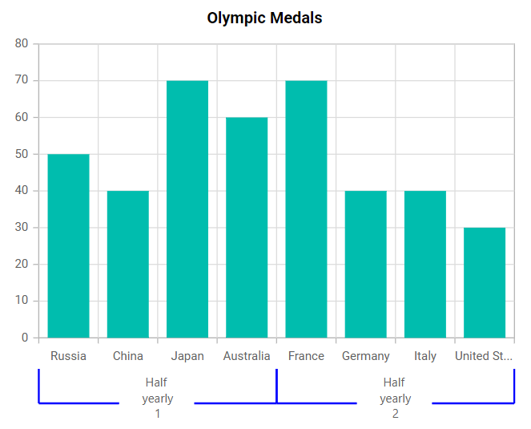
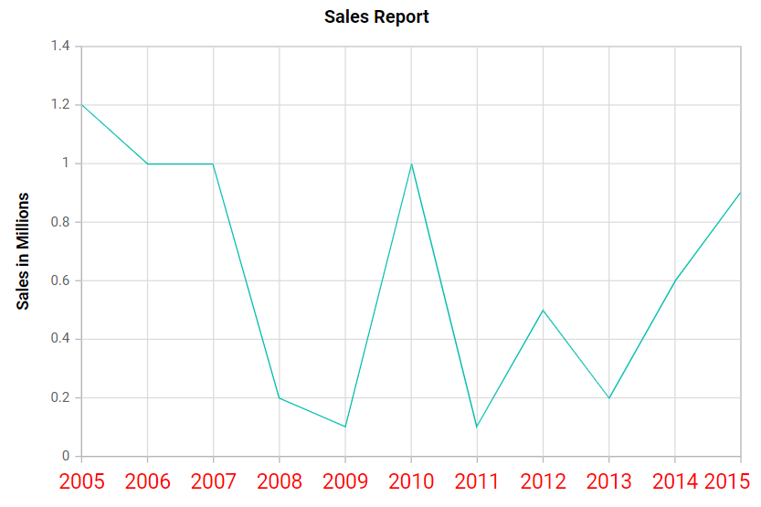
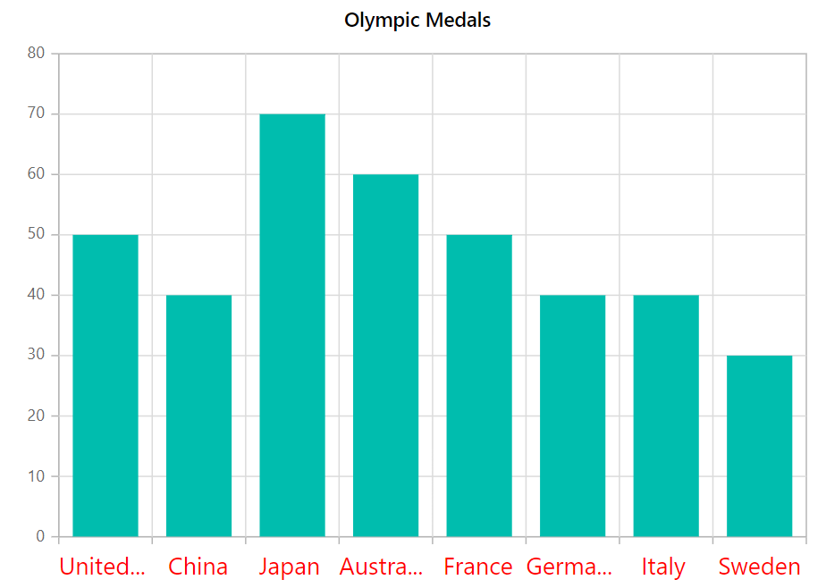
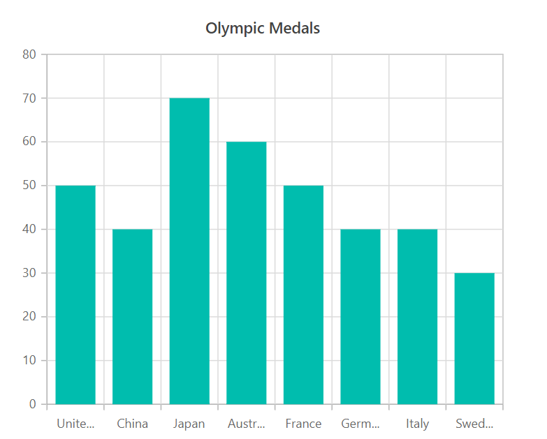
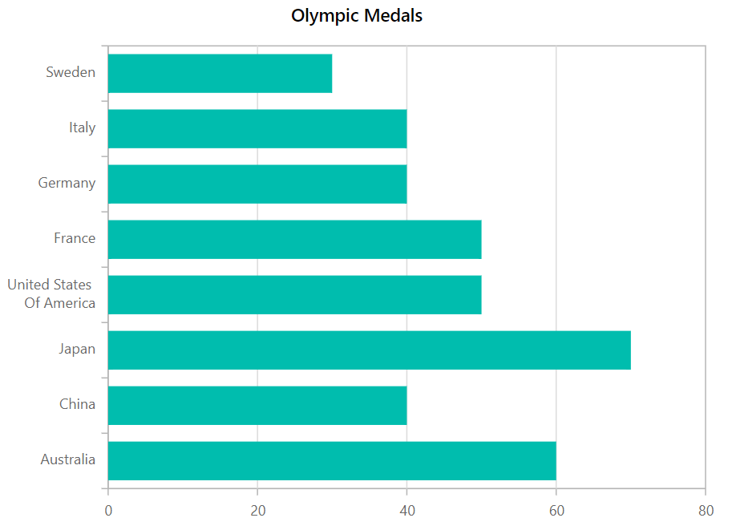
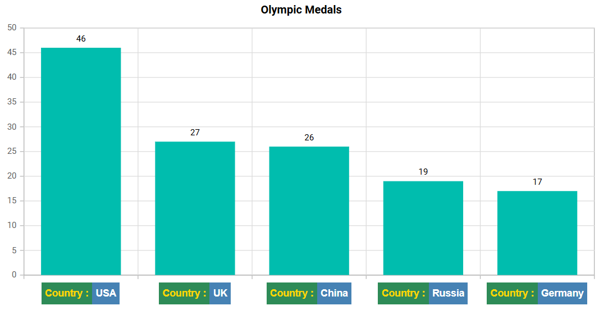

# Axis Labels in Blazor Charts Component

This article explains the different ways to customize axis labels in the Blazor Charts component.

You can also learn how to customize chart axis labels by watching the video below.



## Smart axis labels

When axis labels overlap, use the [LabelIntersectAction](https://help.syncfusion.com/cr/blazor/Syncfusion.Blazor.Charts.ChartCommonAxis.html#Syncfusion_Blazor_Charts_ChartCommonAxis_LabelIntersectAction) property to arrange them intelligently.

**Case 1:** [LabelIntersectAction](https://help.syncfusion.com/cr/blazor/Syncfusion.Blazor.Charts.ChartCommonAxis.html#Syncfusion_Blazor_Charts_ChartCommonAxis_LabelIntersectAction) set to **Hide**

```cshtml

@using Syncfusion.Blazor.Charts

<SfChart Title="Olympic Medals" >
    <ChartPrimaryXAxis ValueType="Syncfusion.Blazor.Charts.ValueType.Category"
        LabelIntersectAction="LabelIntersectAction.Hide" />

    <ChartSeriesCollection>
        <ChartSeries DataSource="@MedalDetails" XName="X" YName="Y" Type="ChartSeriesType.Column" />
    </ChartSeriesCollection>
</SfChart>

@code {
    public class ChartData
    {
        public string X { get; set; }
        public double Y { get; set; }
    }

    public List<ChartData> MedalDetails = new List<ChartData>
    {
        new ChartData { X= "South Korea", Y= 39 },
        new ChartData { X= "India", Y= 61 },
        new ChartData { X= "Pakistan", Y= 20 },
        new ChartData { X= "Germany", Y= 65 },
        new ChartData { X= "Australia", Y= 15 },
        new ChartData { X= "Italy", Y= 29 },
        new ChartData { X= "United Kingdom", Y= 44 },
        new ChartData { X= "Saudi Arabia", Y= 9 },
        new ChartData { X= "Russia", Y= 40 },
        new ChartData { X= "Mexico", Y= 31 },
        new ChartData { X= "Brazil", Y= 75 },
        new ChartData { X= "China", Y= 51 }
    };
}


```



**Case 2:** [LabelIntersectAction](https://help.syncfusion.com/cr/blazor/Syncfusion.Blazor.Charts.ChartCommonAxis.html#Syncfusion_Blazor_Charts_ChartCommonAxis_LabelIntersectAction) set to **Rotate45**

```cshtml

@using Syncfusion.Blazor.Charts

<SfChart Title="Olympic Medals">
    <ChartPrimaryXAxis ValueType="Syncfusion.Blazor.Charts.ValueType.Category"
                       LabelIntersectAction="LabelIntersectAction.Rotate45" />

    <ChartSeriesCollection>
        <ChartSeries DataSource="@MedalDetails" XName="X" YName="Y" Type="ChartSeriesType.Column" />
    </ChartSeriesCollection>
</SfChart>

@code{
    public class ChartData
    {
        public string X { get; set; }
        public double Y { get; set; }
    }

    public List<ChartData> MedalDetails = new List<ChartData>
    {
        new ChartData { X= "South Korea", Y= 39 },
        new ChartData { X= "India", Y= 61 },
        new ChartData { X= "Pakistan", Y= 20 },
        new ChartData { X= "Germany", Y= 65 },
        new ChartData { X= "Australia", Y= 15 },
        new ChartData { X= "Italy", Y= 29 },
        new ChartData { X= "United Kingdom", Y= 44 },
        new ChartData { X= "Saudi Arabia", Y= 9 },
        new ChartData { X= "Russia", Y= 40 },
        new ChartData { X= "Mexico", Y= 31 },
        new ChartData { X= "Brazil", Y= 75 },
        new ChartData { X= "China", Y= 51 }
    };
}

```



**Case 3:** [LabelIntersectAction](https://help.syncfusion.com/cr/blazor/Syncfusion.Blazor.Charts.ChartCommonAxis.html#Syncfusion_Blazor_Charts_ChartCommonAxis_LabelIntersectAction) set to **Rotate90**

```cshtml

@using Syncfusion.Blazor.Charts

<SfChart Title="Olympic Medals">
    <ChartPrimaryXAxis ValueType="Syncfusion.Blazor.Charts.ValueType.Category"
                       LabelIntersectAction="LabelIntersectAction.Rotate90" />

    <ChartSeriesCollection>
        <ChartSeries DataSource="@MedalDetails" XName="X" YName="Y" Type="ChartSeriesType.Column" />
    </ChartSeriesCollection>
</SfChart>

@code{
    public class ChartData
    {
        public string X { get; set; }
        public double Y { get; set; }
    }

    public List<ChartData> MedalDetails = new List<ChartData>
    {
        new ChartData { X= "South Korea", Y= 39 },
        new ChartData { X= "India", Y= 61 },
        new ChartData { X= "Pakistan", Y= 20 },
        new ChartData { X= "Germany", Y= 65 },
        new ChartData { X= "Australia", Y= 15 },
        new ChartData { X= "Italy", Y= 29 },
        new ChartData { X= "United Kingdom", Y= 44 },
        new ChartData { X= "Saudi Arabia", Y= 9 },
        new ChartData { X= "Russia", Y= 40 },
        new ChartData { X= "Mexico", Y= 31 },
        new ChartData { X= "Brazil", Y= 75 },
        new ChartData { X= "China", Y= 51 }
    };
}

```



## Axis label positioning

By default, axis labels are placed **Outside** the axis line. Use the [LabelPosition](https://help.syncfusion.com/cr/blazor/Syncfusion.Blazor.Charts.ChartCommonAxis.html#Syncfusion_Blazor_Charts_ChartCommonAxis_LabelPosition) property to position them **Inside** the axis line.

```cshtml

@using Syncfusion.Blazor.Charts

<SfChart Title="Olympic Medals" >
    <ChartPrimaryXAxis ValueType="Syncfusion.Blazor.Charts.ValueType.Category" 
                       LabelPosition="AxisPosition.Inside"/>   

    <ChartSeriesCollection>
        <ChartSeries DataSource="@MedalDetails" XName="X" YName="Y" Type="ChartSeriesType.Column"/>        
    </ChartSeriesCollection>
</SfChart>

@code{
    public class ChartData
    {
        public string X { get; set; }
        public double Y { get; set; }
    }

    public List<ChartData> MedalDetails = new List<ChartData>
    {
        new ChartData { X= "South Korea", Y= 39 },
        new ChartData { X= "India", Y= 61 },
        new ChartData { X= "Pakistan", Y= 20 },
        new ChartData { X= "Germany", Y= 65 },
        new ChartData { X= "Australia", Y= 15 },
        new ChartData { X= "Italy", Y= 29 },
        new ChartData { X= "United Kingdom", Y= 44 },
        new ChartData { X= "Saudi Arabia", Y= 9 },
        new ChartData { X= "Russia", Y= 40 },
        new ChartData { X= "Mexico", Y= 31 },
        new ChartData { X= "Brazil", Y= 75 },
        new ChartData { X= "China", Y= 51 }
    };
}

```



## Multilevel labels

Use [MultiLevelLabels](https://help.syncfusion.com/cr/blazor/Syncfusion.Blazor.Charts.ChartCommonAxis.html#Syncfusion_Blazor_Charts_ChartCommonAxis_MultiLevelLabels) to add multiple layers of labels to the axis. Configure it with the following options.

### Categories

Customize the [Start](https://help.syncfusion.com/cr/blazor/Syncfusion.Blazor.Charts.ChartCategory.html#Syncfusion_Blazor_Charts_ChartCategory_Start), [End](https://help.syncfusion.com/cr/blazor/Syncfusion.Blazor.Charts.ChartCategory.html#Syncfusion_Blazor_Charts_ChartCategory_End), [Text](https://help.syncfusion.com/cr/blazor/Syncfusion.Blazor.Charts.ChartCategory.html#Syncfusion_Blazor_Charts_ChartCategory_Text), and [MaximumTextWidth](https://help.syncfusion.com/cr/blazor/Syncfusion.Blazor.Charts.ChartCategory.html#Syncfusion_Blazor_Charts_ChartCategory_MaximumTextWidth) properties using [ChartCategories](https://help.syncfusion.com/cr/blazor/Syncfusion.Blazor.Charts.ChartCategories.html), which accepts a collection of [ChartCategory](https://help.syncfusion.com/cr/blazor/Syncfusion.Blazor.Charts.ChartCategory.html).

```cshtml

@using Syncfusion.Blazor.Charts

<SfChart Title="Olympic Medals">
    <ChartPrimaryXAxis ValueType="Syncfusion.Blazor.Charts.ValueType.Category">
        <ChartMultiLevelLabels>
            <ChartMultiLevelLabel>
                <ChartCategories>                   
                        <ChartCategory Start="-0.5" End="3.5" Text="Half yearly 1" MaximumTextWidth=50></ChartCategory>
                        <ChartCategory Start="3.5" End="7.5" Text="Half yearly 2" MaximumTextWidth=50></ChartCategory>                
                </ChartCategories>
            </ChartMultiLevelLabel>
        </ChartMultiLevelLabels>
    </ChartPrimaryXAxis>

    <ChartSeriesCollection>
        <ChartSeries DataSource="@MedalDetails" XName="X" YName="Y" Type="ChartSeriesType.Column">
        </ChartSeries>
    </ChartSeriesCollection>
</SfChart>

@code{
    public int start = 0, end = 30;

    public class ChartData
    {
        public string X { get; set; }
        public double Y { get; set; }
    }

    public List<ChartData> MedalDetails = new List<ChartData>
    {
        new ChartData { X= "Russia", Y= 50 },
        new ChartData { X= "China", Y= 40 },
        new ChartData { X= "Japan", Y= 70 },
        new ChartData { X= "Australia", Y= 60 },
        new ChartData { X= "France", Y= 70 },
        new ChartData { X= "Germany", Y= 40 },
        new ChartData { X= "Italy", Y= 40 },
        new ChartData { X= "United States", Y= 30 }
    };
}

```



### Overflow

Use the [Overflow](https://help.syncfusion.com/cr/blazor/Syncfusion.Blazor.Charts.ChartMultiLevelLabel.html#Syncfusion_Blazor_Charts_ChartMultiLevelLabel_Overflow) property to [Trim](https://help.syncfusion.com/cr/blazor/Syncfusion.Blazor.Charts.TextOverflow.html#Syncfusion_Blazor_Charts_TextOverflow_Trim) or [Wrap](https://help.syncfusion.com/cr/blazor/Syncfusion.Blazor.Charts.TextOverflow.html#Syncfusion_Blazor_Charts_TextOverflow_Wrap) multilevel labels.

```cshtml

@using Syncfusion.Blazor.Charts

<SfChart Title="Olympic Medals">
    <ChartPrimaryXAxis ValueType="Syncfusion.Blazor.Charts.ValueType.Category">
        <ChartMultiLevelLabels>
            <ChartMultiLevelLabel Overflow="TextOverflow.Trim">
                <ChartCategories>                  
                        <ChartCategory Start="-0.5" End="3.5" Text="Half yearly 1" MaximumTextWidth=50></ChartCategory>
                        <ChartCategory Start="3.5" End="7.5" Text="Half yearly 2" MaximumTextWidth=50></ChartCategory>                   
                </ChartCategories>
            </ChartMultiLevelLabel>
        </ChartMultiLevelLabels>
    </ChartPrimaryXAxis>

    <ChartSeriesCollection>
        <ChartSeries DataSource="@MedalDetails" XName="X" YName="Y" Type="ChartSeriesType.Column">
        </ChartSeries>
    </ChartSeriesCollection>
</SfChart>

@code{

    public int start = 0, end = 30;

    public class ChartData
    {
        public string X { get; set; }
        public double Y { get; set; }
    }

    public List<ChartData> MedalDetails = new List<ChartData>
    {
        new ChartData { X= "Russia", Y= 50 },
        new ChartData { X= "China", Y= 40 },
        new ChartData { X= "Japan", Y= 70 },
        new ChartData { X= "Australia", Y= 60 },
        new ChartData { X= "France", Y= 70 },
        new ChartData { X= "Germany", Y= 40 },
        new ChartData { X= "Italy", Y= 40 },
        new ChartData { X= "United States", Y= 30 }
    };
}

```



### Alignment

Place multilevel labels at the [Far](https://help.syncfusion.com/cr/blazor/Syncfusion.Blazor.Charts.Alignment.html#Syncfusion_Blazor_Charts_Alignment_Far), [Center](https://help.syncfusion.com/cr/blazor/Syncfusion.Blazor.Charts.Alignment.html#Syncfusion_Blazor_Charts_Alignment_Center), or [Near](https://help.syncfusion.com/cr/blazor/Syncfusion.Blazor.Charts.Alignment.html#Syncfusion_Blazor_Charts_Alignment_Near) using the [Alignment](https://help.syncfusion.com/cr/blazor/Syncfusion.Blazor.Charts.ChartMultiLevelLabel.html#Syncfusion_Blazor_Charts_ChartMultiLevelLabel_Alignment) property.

```cshtml

@using Syncfusion.Blazor.Charts

<SfChart Title="Olympic Medals">
    <ChartPrimaryXAxis ValueType="Syncfusion.Blazor.Charts.ValueType.Category">
        <ChartMultiLevelLabels>
            <ChartMultiLevelLabel Alignment="Alignment.Far">
                <ChartCategories>
                        <ChartCategory Start="-0.5" End="3.5" Text="Half yearly 1" MaximumTextWidth=100></ChartCategory>
                        <ChartCategory Start="3.5" End="7.5" Text="Half yearly 2" MaximumTextWidth=100></ChartCategory>                      
                </ChartCategories>
            </ChartMultiLevelLabel>
        </ChartMultiLevelLabels>
    </ChartPrimaryXAxis>

    <ChartSeriesCollection>
        <ChartSeries DataSource="@MedalDetails" XName="X" YName="Y" Type="ChartSeriesType.Column">
        </ChartSeries>
    </ChartSeriesCollection>
</SfChart>

@code{

    public int start = 0, end = 30;

    public class ChartData
    {
        public string X { get; set; }
        public double Y { get; set; }
    }

    public List<ChartData> MedalDetails = new List<ChartData>
    {
        new ChartData { X= "Russia", Y= 50 },
        new ChartData { X= "China", Y= 40 },
        new ChartData { X= "Japan", Y= 70 },
        new ChartData { X= "Australia", Y= 60 },
        new ChartData { X= "France", Y= 70 },
        new ChartData { X= "Germany", Y= 40 },
        new ChartData { X= "Italy", Y= 40 },
        new ChartData { X= "United States", Y= 30 }
    };
}

```



### Text customization

Customize [Size](https://help.syncfusion.com/cr/blazor/Syncfusion.Blazor.Charts.ChartAxisMultiLevelLabelTextStyle.html#Syncfusion_Blazor_Charts_ChartAxisMultiLevelLabelTextStyle_Size), [Color](https://help.syncfusion.com/cr/blazor/Syncfusion.Blazor.Charts.ChartAxisMultiLevelLabelTextStyle.html#Syncfusion_Blazor_Charts_ChartAxisMultiLevelLabelTextStyle_Color), [FontFamily](https://help.syncfusion.com/cr/blazor/Syncfusion.Blazor.Charts.ChartCommonFont.html#Syncfusion_Blazor_Charts_ChartCommonFont_FontFamily), [FontWeight](https://help.syncfusion.com/cr/blazor/Syncfusion.Blazor.Charts.ChartCommonFont.html#Syncfusion_Blazor_Charts_ChartCommonFont_FontWeight), [FontStyle](https://help.syncfusion.com/cr/blazor/Syncfusion.Blazor.Charts.ChartCommonFont.html#Syncfusion_Blazor_Charts_ChartCommonFont_FontStyle), [Opacity](https://help.syncfusion.com/cr/blazor/Syncfusion.Blazor.Charts.ChartCommonFont.html#Syncfusion_Blazor_Charts_ChartCommonFont_Opacity), [TextAlignment](https://help.syncfusion.com/cr/blazor/Syncfusion.Blazor.Charts.ChartCommonFont.html#Syncfusion_Blazor_Charts_ChartCommonFont_TextAlignment), and [TextOverflow](https://help.syncfusion.com/cr/blazor/Syncfusion.Blazor.Charts.ChartCommonFont.html#Syncfusion_Blazor_Charts_ChartCommonFont_TextOverflow) via the [TextStyle](https://help.syncfusion.com/cr/blazor/Syncfusion.Blazor.Charts.ChartMultiLevelLabel.html#Syncfusion_Blazor_Charts_ChartMultiLevelLabel_TextStyle) of multilevel labels.

```cshtml

@using Syncfusion.Blazor.Charts

<SfChart Title="Olympic Medals">
    <ChartPrimaryXAxis ValueType="Syncfusion.Blazor.Charts.ValueType.Category">
        <ChartMultiLevelLabels>
            <ChartMultiLevelLabel>
                <ChartCategories>
                        <ChartCategory Start="-0.5" End="3.5" Text="Half yearly 1" MaximumTextWidth=100></ChartCategory>
                        <ChartCategory Start="3.5" End="7.5" Text="Half yearly 2" MaximumTextWidth=100></ChartCategory>                  
                </ChartCategories>
                <ChartAxisMultiLevelLabelTextStyle Size="14px" Color="red"/>
            </ChartMultiLevelLabel>
        </ChartMultiLevelLabels>
    </ChartPrimaryXAxis>

    <ChartSeriesCollection>
        <ChartSeries DataSource="@MedalDetails" XName="X" YName="Y" Type="ChartSeriesType.Column">
        </ChartSeries>
    </ChartSeriesCollection>
</SfChart>

@code{

    public int start = 0, end = 30;

    public class ChartData
    {
        public string X { get; set; }
        public double Y { get; set; }
    }

    public List<ChartData> MedalDetails = new List<ChartData>
    {
        new ChartData { X= "Russia", Y= 50 },
        new ChartData { X= "China", Y= 40 },
        new ChartData { X= "Japan", Y= 70 },
        new ChartData { X= "Australia", Y= 60 },
        new ChartData { X= "France", Y= 70 },
        new ChartData { X= "Germany", Y= 40 },
        new ChartData { X= "Italy", Y= 40 },
        new ChartData { X= "United states", Y= 30 }
    };
}

```



### Border customization

Customize the border [Width](https://help.syncfusion.com/cr/blazor/Syncfusion.Blazor.Charts.ChartCommonLabelBorder.html#Syncfusion_Blazor_Charts_ChartCommonLabelBorder_Width), [Color](https://help.syncfusion.com/cr/blazor/Syncfusion.Blazor.Charts.ChartCommonLabelBorder.html#Syncfusion_Blazor_Charts_ChartCommonLabelBorder_Color), and [Type](https://help.syncfusion.com/cr/blazor/Syncfusion.Blazor.Charts.ChartCommonLabelBorder.html#Syncfusion_Blazor_Charts_ChartCommonLabelBorder_Type) using [ChartAxisMultiLevelLabelBorder](https://help.syncfusion.com/cr/blazor/Syncfusion.Blazor.Charts.ChartAxisMultiLevelLabelBorder.html). Available border types include [Rectangle](https://help.syncfusion.com/cr/blazor/Syncfusion.Blazor.Charts.BorderType.html#Syncfusion_Blazor_Charts_BorderType_Rectangle), [Brace](https://help.syncfusion.com/cr/blazor/Syncfusion.Blazor.Charts.BorderType.html#Syncfusion_Blazor_Charts_BorderType_Brace), [WithoutBorder](https://help.syncfusion.com/cr/blazor/Syncfusion.Blazor.Charts.BorderType.html#Syncfusion_Blazor_Charts_BorderType_WithoutBorder), [WithoutTopBorder](https://help.syncfusion.com/cr/blazor/Syncfusion.Blazor.Charts.BorderType.html#Syncfusion_Blazor_Charts_BorderType_WithoutTopBorder), [WithoutTopandBottomBorder](https://help.syncfusion.com/cr/blazor/Syncfusion.Blazor.Charts.BorderType.html#Syncfusion_Blazor_Charts_BorderType_WithoutTopandBottomBorder), [Auto](https://help.syncfusion.com/cr/blazor/Syncfusion.Blazor.Charts.BorderType.html#Syncfusion_Blazor_Charts_BorderType_Auto), and [CurlyBrace](https://help.syncfusion.com/cr/blazor/Syncfusion.Blazor.Charts.BorderType.html#Syncfusion_Blazor_Charts_BorderType_CurlyBrace).

```cshtml

@using Syncfusion.Blazor.Charts

<SfChart Title="Olympic Medals">
    <ChartPrimaryXAxis ValueType="Syncfusion.Blazor.Charts.ValueType.Category">
        <ChartMultiLevelLabels>
            <ChartMultiLevelLabel>
                <ChartCategories>
                        <ChartCategory Start="-0.5" End="3.5" Text="Half yearly 1" MaximumTextWidth="50"></ChartCategory>
                        <ChartCategory Start="3.5" End="7.5" Text="Half yearly 2" MaximumTextWidth="50"></ChartCategory>
                </ChartCategories>
                <ChartAxisMultiLevelLabelBorder Type="BorderType.Brace" Color="blue" Width=2></ChartAxisMultiLevelLabelBorder>
            </ChartMultiLevelLabel>
        </ChartMultiLevelLabels>
    </ChartPrimaryXAxis>

    <ChartSeriesCollection>
        <ChartSeries DataSource="@MedalDetails" XName="X" YName="Y" Type="ChartSeriesType.Column">
        </ChartSeries>
    </ChartSeriesCollection>
</SfChart>

@code{

    public int start = 0, end = 30;

    public class ChartData
    {
        public string X { get; set; }
        public double Y { get; set; }
    }

    public List<ChartData> MedalDetails = new List<ChartData>
    {
        new ChartData { X= "Russia", Y= 50 },
        new ChartData { X= "China", Y= 40 },
        new ChartData { X= "Japan", Y= 70 },
        new ChartData { X= "Australia", Y= 60 },
        new ChartData { X= "France", Y= 70 },
        new ChartData { X= "Germany", Y= 40 },
        new ChartData { X= "Italy", Y= 40 },
        new ChartData { X= "United States", Y= 30 }
    };
}

```




## Edge label placement

Long text labels at the edges of the axis can be partially hidden. Use [EdgeLabelPlacement](https://help.syncfusion.com/cr/blazor/Syncfusion.Blazor.Charts.ChartCommonAxis.html#Syncfusion_Blazor_Charts_ChartCommonAxis_EdgeLabelPlacement) to move or hide edge labels using [Shift](https://help.syncfusion.com/cr/blazor/Syncfusion.Blazor.Charts.EdgeLabelPlacement.html#Syncfusion_Blazor_Charts_EdgeLabelPlacement_Shift) or [Hide](https://help.syncfusion.com/cr/blazor/Syncfusion.Blazor.Charts.EdgeLabelPlacement.html#Syncfusion_Blazor_Charts_EdgeLabelPlacement_Hide). Use [None](https://help.syncfusion.com/cr/blazor/Syncfusion.Blazor.Charts.EdgeLabelPlacement.html#Syncfusion_Blazor_Charts_EdgeLabelPlacement_None) to leave them unchanged.

```cshtml

@using Syncfusion.Blazor.Charts

<SfChart Title="Sales Report">
    <ChartPrimaryXAxis LabelPlacement="LabelPlacement.OnTicks" EdgeLabelPlacement="EdgeLabelPlacement.Shift" ValueType="Syncfusion.Blazor.Charts.ValueType.Category">
        <ChartAxisLabelStyle Size="18px" Color="red" />
    </ChartPrimaryXAxis>
    
    <ChartPrimaryYAxis Title="Sales in Millions" >
    </ChartPrimaryYAxis>

    <ChartSeriesCollection>
        <ChartSeries DataSource="@SalesDetails" XName="X" YName="Y" Type="ChartSeriesType.Line">
        </ChartSeries>
    </ChartSeriesCollection>
</SfChart>

@code{
    public class ChartData
    {
        public string X { get; set; }
        public double Y { get; set; }
    }

    public List<ChartData> SalesDetails = new List<ChartData>
    {
        new ChartData { X= "2005", Y= 1.2},
        new ChartData { X= "2006", Y= 1 },
        new ChartData { X= "2007", Y= 1 },
        new ChartData { X= "2008", Y= 0.2},
        new ChartData { X= "2009", Y= 0.1},
        new ChartData { X= "2010", Y= 1 },
        new ChartData { X= "2011", Y= 0.1},
        new ChartData { X= "2012", Y= 0.5},
        new ChartData { X= "2013", Y= 0.2},
        new ChartData { X= "2014", Y= 0.6},
        new ChartData { X= "2015", Y= 0.9}
    };
}

```




## Label customization

Customize label [Color](https://help.syncfusion.com/cr/blazor/Syncfusion.Blazor.Charts.ChartAxisMultiLevelLabelTextStyle.html#Syncfusion_Blazor_Charts_ChartAxisMultiLevelLabelTextStyle_Color) and [Size](https://help.syncfusion.com/cr/blazor/Syncfusion.Blazor.Charts.ChartAxisMultiLevelLabelTextStyle.html#Syncfusion_Blazor_Charts_ChartAxisMultiLevelLabelTextStyle_Size) using [ChartAxisLabelStyle](https://help.syncfusion.com/cr/blazor/Syncfusion.Blazor.Charts.ChartAxisMultiLevelLabelTextStyle.html).

```cshtml

@using Syncfusion.Blazor.Charts

<SfChart Title="Olympic Medals">
    <ChartPrimaryXAxis ValueType="Syncfusion.Blazor.Charts.ValueType.Category">
        <ChartAxisLabelStyle Size="18px" Color="red" />
    </ChartPrimaryXAxis>

    <ChartSeriesCollection>
        <ChartSeries DataSource="@MedalDetails" XName="Country" YName="Gold" Type="ChartSeriesType.Column">
        </ChartSeries>
    </ChartSeriesCollection>
</SfChart>

@code{
    public class ChartData
    {
        public string Country { get; set; }
        public double Gold { get; set; }
    }

    public List<ChartData> MedalDetails = new List<ChartData>
    {
        new ChartData{ Country= "United States", Gold=50  },
        new ChartData{ Country= "China", Gold=40 },
        new ChartData{ Country= "Japan", Gold=70 },
        new ChartData{ Country= "Australia", Gold=60},
        new ChartData{ Country= "France", Gold=50 },
        new ChartData{ Country= "Germany", Gold=40 },
        new ChartData{ Country= "Italy", Gold=40 },
        new ChartData{ Country= "Sweden", Gold=30 }
    };
}

```




## Trim label

Enable trimming using [EnableTrim](https://help.syncfusion.com/cr/blazor/Syncfusion.Blazor.Charts.ChartCommonAxis.html#Syncfusion_Blazor_Charts_ChartCommonAxis_EnableTrim). Control the trimmed label width with [MaximumLabelWidth](https://help.syncfusion.com/cr/blazor/Syncfusion.Blazor.Charts.ChartCommonAxis.html#Syncfusion_Blazor_Charts_ChartCommonAxis_MaximumLabelWidth). The default value of MaximumLabelWidth is **34px**.

```cshtml

@using Syncfusion.Blazor.Charts

<SfChart Title="Olympic Medals">
    <ChartPrimaryXAxis EnableTrim="true" MaximumLabelWidth="40" ValueType="Syncfusion.Blazor.Charts.ValueType.Category">
    </ChartPrimaryXAxis>

    <ChartSeriesCollection>
        <ChartSeries DataSource="@MedalDetails" XName="Country" YName="Gold" Type="ChartSeriesType.Column">
        </ChartSeries>
    </ChartSeriesCollection>
</SfChart>

@code{
    public class ChartData
    {
        public string Country { get; set; }
        public double Gold { get; set; }
    }

    public List<ChartData> MedalDetails = new List<ChartData>
    {
        new ChartData{ Country= "United States", Gold=50 },
        new ChartData{ Country= "China", Gold=40 },
        new ChartData{ Country= "Japan", Gold=70 },
        new ChartData{ Country= "Australia", Gold=60},
        new ChartData{ Country= "France", Gold=50 },
        new ChartData{ Country= "Germany", Gold=40 },
        new ChartData{ Country= "Italy", Gold=40 },
        new ChartData{ Country= "Sweden", Gold=30 }
    };
}

```




## Line break

Use the `<br>` tag to split a long axis label into multiple lines.

```cshtml

@using Syncfusion.Blazor.Charts

<SfChart Title="Olympic Medals">
    <ChartPrimaryXAxis ValueType="Syncfusion.Blazor.Charts.ValueType.Category">
        <ChartAxisMajorGridLines Width="0"></ChartAxisMajorGridLines>
    </ChartPrimaryXAxis>

    <ChartSeriesCollection>
        <ChartSeries DataSource="@MedalDetails" XName="Country" YName="Gold" Type="ChartSeriesType.Bar">
        </ChartSeries>
    </ChartSeriesCollection>
</SfChart>

@code{
    public class ChartData
    {
        public string Country { get; set; }
        public double Gold { get; set; }
    }

    public List<ChartData> MedalDetails = new List<ChartData>
    {
        new ChartData{ Country= "Australia", Gold=60},
        new ChartData{ Country= "China", Gold=40 },
        new ChartData{ Country= "Japan", Gold=70 },
        new ChartData{ Country= "United States<br>Of America", Gold=50  },
        new ChartData{ Country= "France", Gold=50 },
        new ChartData{ Country= "Germany", Gold=40 },
        new ChartData{ Country= "Italy", Gold=40 },
        new ChartData{ Country= "Sweden", Gold=30 }
    };
}

```




## Label format

Learn more about axis label formats by axis type from the pages below:

* [Numeric label format](./numeric-axis#label-format)
* [DateTime label format](./date-time-axis#label-format)
* [Custom label format](./date-time-axis#custom-label-format)

## Customize labels using an event

Customize axis labels using the [OnAxisLabelRender](https://help.syncfusion.com/cr/blazor/Syncfusion.Blazor.Charts.ChartEvents.html#Syncfusion_Blazor_Charts_ChartEvents_OnAxisLabelRender) event. The following event-argument properties can be used during label rendering:

* [LabelStyle](https://help.syncfusion.com/cr/blazor/Syncfusion.Blazor.Charts.AxisLabelRenderEventArgs.html#Syncfusion_Blazor_Charts_AxisLabelRenderEventArgs_LabelStyle) – Specifies the font information of the axis label with following properties,

	|Properties|Description|
	|-----|-----|
	|Color |To customize the color of the text. |
	|FontFamily |To customize the font family of label. |
	|FontStyle |To customize the font style. |
	|FontWeight |To customize the font weight.|
	|Opacity |To customize the transparency of text.|

* [Text](https://help.syncfusion.com/cr/blazor/Syncfusion.Blazor.Charts.AxisLabelRenderEventArgs.html#Syncfusion_Blazor_Charts_AxisLabelRenderEventArgs_Text) – The text to display in the axis label. You can modify it using the `Value` and `Axis` properties.
* [Value](https://help.syncfusion.com/cr/blazor/Syncfusion.Blazor.Charts.AxisLabelRenderEventArgs.html#Syncfusion_Blazor_Charts_AxisLabelRenderEventArgs_Value) – The value of the axis label. For `CategoryAxis`, this denotes the index of the data points; for `Numeric` and `DateTime` axes, it denotes the actual value of the data points.
* [Axis](https://help.syncfusion.com/cr/blazor/Syncfusion.Blazor.Charts.AxisLabelClickEventArgs.html#Syncfusion_Blazor_Charts_AxisLabelClickEventArgs_Axis) – The axis for which labels are rendering.
* `Cancel` – Set to true to cancel rendering of a particular label.

```cshtml

@using Syncfusion.Blazor.Charts

<SfChart>
    <ChartEvents OnAxisLabelRender="AxisLabelEvent"></ChartEvents>

    <ChartPrimaryXAxis ValueType="Syncfusion.Blazor.Charts.ValueType.Category"></ChartPrimaryXAxis>

    <ChartSeriesCollection>
        <ChartSeries DataSource="@Sales" XName="Month" YName="SalesValue" Type="ChartSeriesType.Column">
        </ChartSeries>
    </ChartSeriesCollection>
</SfChart>

@code{
    public class SalesInfo
    {
        public string Month { get; set; }
        public double SalesValue { get; set; }
    }

    public List<SalesInfo> Sales = new List<SalesInfo>
    {
        new SalesInfo { Month = "Jan", SalesValue = 35 },
        new SalesInfo { Month = "Feb", SalesValue = 28 },
        new SalesInfo { Month = "Mar", SalesValue = 34 },
        new SalesInfo { Month = "Apr", SalesValue = 32 },
        new SalesInfo { Month = "May", SalesValue = 40 },
        new SalesInfo { Month = "Jun", SalesValue = 32 },
        new SalesInfo { Month = "Jul", SalesValue = 35 }
    };

    public void AxisLabelEvent(AxisLabelRenderEventArgs args)
    {
       if (args.Axis.Name == "PrimaryXAxis")
        {
            args.LabelStyle.Color = "Red";
            if (args.Value == 4)
                args.Text = "chart";

        } 
        else if (args.Axis.Name == "PrimaryYAxis")
        {
            args.LabelStyle.Color = "Blue";
        } 
    }
}

```



## Axis label template

Axis label templates let you format labels with HTML content, apply conditional styling, and include dynamic elements such as icons, images, or additional data. Enable this by setting the template content in the [LabelTemplate](https://help.syncfusion.com/cr/blazor/Syncfusion.Blazor.Charts.ChartAxis.html#Syncfusion_Blazor_Charts_ChartAxis_LabelTemplate) property of the [ChartAxis](https://help.syncfusion.com/cr/blazor/Syncfusion.Blazor.Charts.ChartAxis.html) component.

Within the `LabelTemplate`, the implicit parameter context provides access to label-specific information. Cast the context to [ChartAxisLabelInfo](https://help.syncfusion.com/cr/blazor/Syncfusion.Blazor.Charts.ChartAxisLabelInfo.html) to access its fields.

```cshtml

@using Syncfusion.Blazor.Charts

<SfChart Title="Olympic Medals">
    <ChartPrimaryXAxis ValueType="Syncfusion.Blazor.Charts.ValueType.Category">
        <LabelTemplate>
            @{
                var data = context as ChartAxisLabelInfo;
            }
            <table>
                <tr>
                    <td align="center" style="background-color: #2E8B57; font-size: 14px; color: #FFD700; font-weight: bold; padding: 5px">Country :</td>
                    <td align="center" style="background-color: #4682B4; font-size: 14px; color: #FFFFFF; font-weight: bold; padding: 5px">@data.Text</td>
                </tr>
            </table>
        </LabelTemplate>
    </ChartPrimaryXAxis>
    <ChartPrimaryYAxis ValueType="Syncfusion.Blazor.Charts.ValueType.Double"></ChartPrimaryYAxis>
    <ChartSeriesCollection>
        <ChartSeries DataSource="@MedalDetails" XName="Country" YName="Medals" Type="ChartSeriesType.Column">
            <ChartMarker>
                <ChartDataLabel Visible="true"></ChartDataLabel>
            </ChartMarker>
        </ChartSeries>
    </ChartSeriesCollection>
</SfChart>

@code {
    public class MedalData
    {
        public string Country { get; set; }
        public double Medals { get; set; }
    }

    public List<MedalData> MedalDetails = new List<MedalData>
    {
        new MedalData { Country = "USA", Medals = 46 },
        new MedalData { Country = "UK", Medals = 27 },
        new MedalData { Country = "China", Medals = 26 },
        new MedalData { Country = "Russia", Medals = 19 },
        new MedalData { Country = "Germany", Medals = 17 }
    };
}

```




N> [View Sample in GitHub](https://github.com/SyncfusionExamples/Blazor-Chart-Axis-Label-Customization).

## See also

* [Data label](./data-labels)
* [Tooltip](./tool-tip)
* [Marker](./data-markers)

N> Refer to our [Blazor Charts](https://www.syncfusion.com/blazor-components/blazor-charts) feature tour page for its groundbreaking feature representations and also explore our [Blazor Chart Example](https://blazor.syncfusion.com/demos/chart/line?theme=bootstrap5) to know various chart types and how to represent time-dependent data, showing trends at equal intervals.
