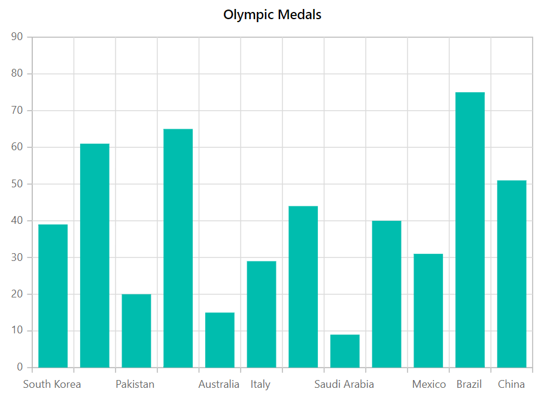
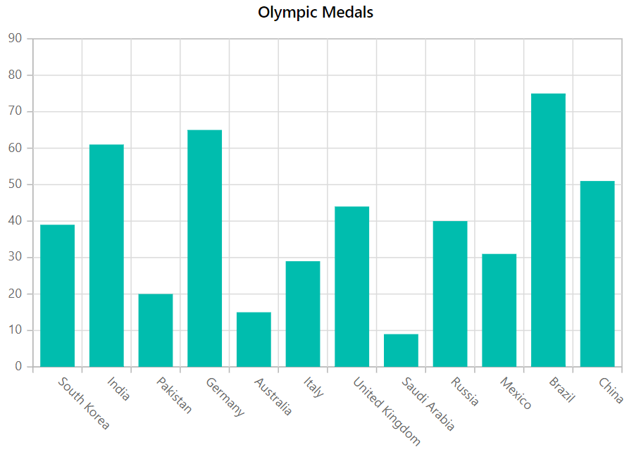
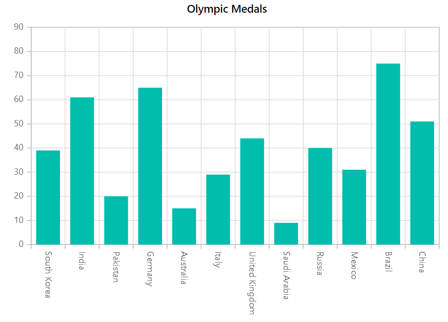
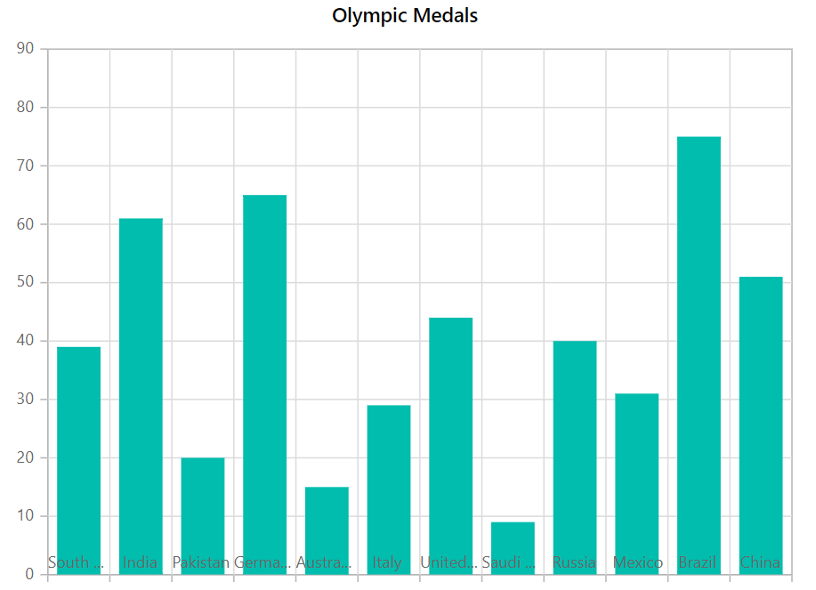
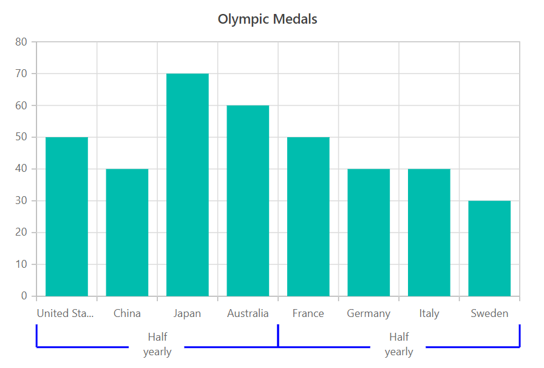
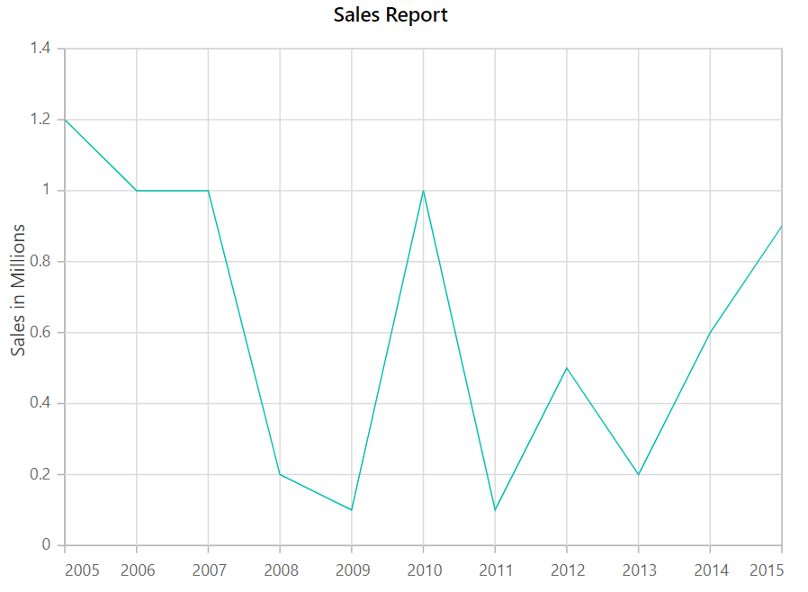
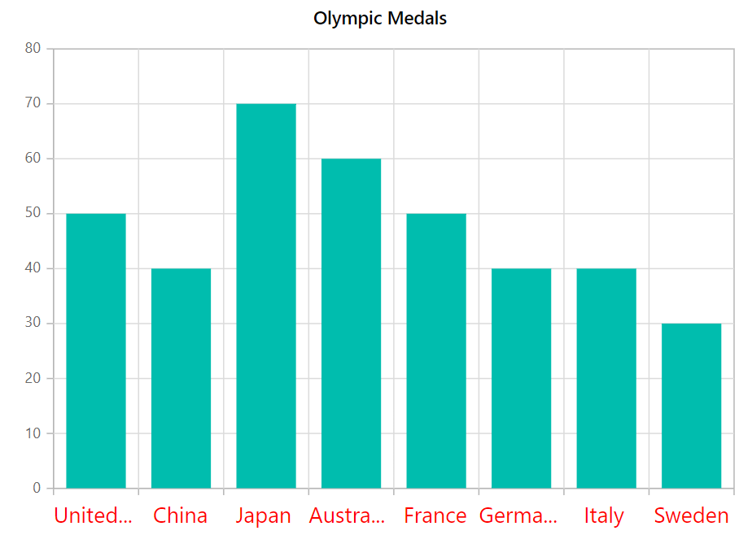
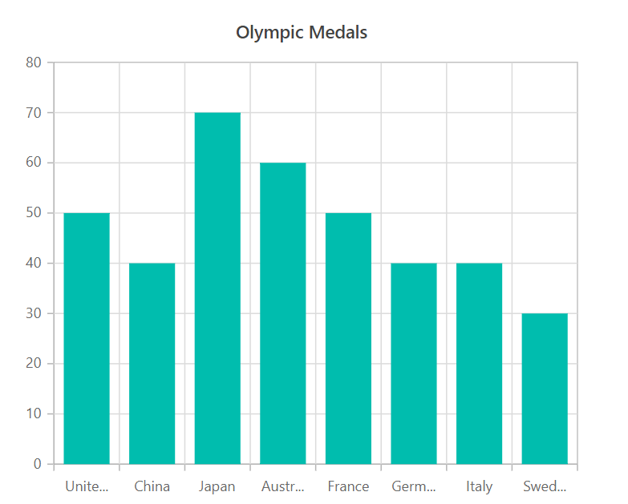
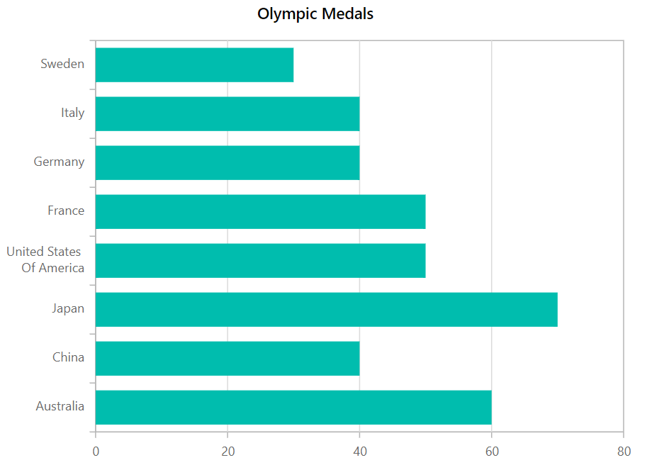
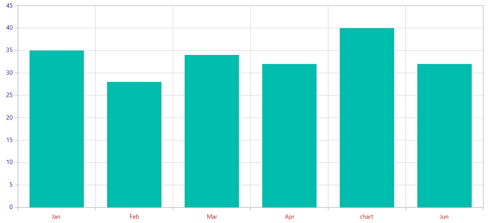

# Axis Labels in Blazor Charts Component

## Smart Axis Labels

When the axis labels overlap, the [LabelIntersectAction](https://help.syncfusion.com/cr/blazor/Syncfusion.Blazor.Charts.ChartCommonAxis.html#Syncfusion_Blazor_Charts_ChartCommonAxis_LabelIntersectAction) property in the axis can be used to intelligently arrange them.

**Case 1:** When [LabelIntersectAction](https://help.syncfusion.com/cr/blazor/Syncfusion.Blazor.Charts.ChartCommonAxis.html#Syncfusion_Blazor_Charts_ChartCommonAxis_LabelIntersectAction) is set to **Hide**.

```cshtml

@using Syncfusion.Blazor.Charts

<SfChart Title="Olympic Medals" >
    <ChartPrimaryXAxis ValueType="Syncfusion.Blazor.Charts.ValueType.Category"
        LabelIntersectAction="LabelIntersectAction.Hide" />

    <ChartSeriesCollection>
        <ChartSeries DataSource="@MedalDetails" XName="X" YName="Y" Type="ChartSeriesType.Column" />
    </ChartSeriesCollection>
</SfChart>

@code{
    public class ChartData
    {
        public string X { get; set; }
        public double Y { get; set; }
    }
	
    public List<ChartData> MedalDetails = new List<ChartData>
    {
		new ChartData { X= "South Korea", Y= 39 },
		new ChartData { X= "India", Y= 61 },
		new ChartData { X= "Pakistan", Y= 20 },
		new ChartData { X= "Germany", Y= 65 },
		new ChartData { X= "Australia", Y= 15 },
		new ChartData { X= "Italy", Y= 29 },
		new ChartData { X= "United Kingdom", Y= 44 },
		new ChartData { X= "Saudi Arabia", Y= 9 },
		new ChartData { X= "Russia", Y= 40 },
		new ChartData { X= "Mexico", Y= 31 },
		new ChartData { X= "Brazil", Y= 75 },
		new ChartData { X= "China", Y= 51 }
    };
}


```




**Case 2:** When [LabelIntersectAction](https://help.syncfusion.com/cr/blazor/Syncfusion.Blazor.Charts.ChartCommonAxis.html#Syncfusion_Blazor_Charts_ChartCommonAxis_LabelIntersectAction) is set to **Rotate45**.

```cshtml

@using Syncfusion.Blazor.Charts

<SfChart Title="Olympic Medals">
    <ChartPrimaryXAxis ValueType="Syncfusion.Blazor.Charts.ValueType.Category"
                       LabelIntersectAction="LabelIntersectAction.Rotate45" />

    <ChartSeriesCollection>
        <ChartSeries DataSource="@MedalDetails" XName="X" YName="Y" Type="ChartSeriesType.Column" />
    </ChartSeriesCollection>
</SfChart>

@code{
    public class ChartData
    {
        public string X { get; set; }
        public double Y { get; set; }
    }
	
    public List<ChartData> MedalDetails = new List<ChartData>
	{
		new ChartData { X= "South Korea", Y= 39 },
		new ChartData { X= "India", Y= 61 },
		new ChartData { X= "Pakistan", Y= 20 },
		new ChartData { X= "Germany", Y= 65 },
		new ChartData { X= "Australia", Y= 15 },
		new ChartData { X= "Italy", Y= 29 },
		new ChartData { X= "United Kingdom", Y= 44 },
		new ChartData { X= "Saudi Arabia", Y= 9 },
		new ChartData { X= "Russia", Y= 40 },
		new ChartData { X= "Mexico", Y= 31 },
		new ChartData { X= "Brazil", Y= 75 },
		new ChartData { X= "China", Y= 51 }
    };
}

```




**Case 3:** When [LabelIntersectAction](https://help.syncfusion.com/cr/blazor/Syncfusion.Blazor.Charts.ChartCommonAxis.html#Syncfusion_Blazor_Charts_ChartCommonAxis_LabelIntersectAction) is set to **Rotate90**.

```cshtml

@using Syncfusion.Blazor.Charts

<SfChart Title="Olympic Medals">
    <ChartPrimaryXAxis ValueType="Syncfusion.Blazor.Charts.ValueType.Category"
                       LabelIntersectAction="LabelIntersectAction.Rotate90" />

    <ChartSeriesCollection>
        <ChartSeries DataSource="@MedalDetails" XName="X" YName="Y" Type="ChartSeriesType.Column" />
    </ChartSeriesCollection>
</SfChart>

@code{
    public class ChartData
    {
        public string X { get; set; }
        public double Y { get; set; }
    }
	
    public List<ChartData> MedalDetails = new List<ChartData>
	{
		new ChartData { X= "South Korea", Y= 39 },
		new ChartData { X= "India", Y= 61 },
		new ChartData { X= "Pakistan", Y= 20 },
		new ChartData { X= "Germany", Y= 65 },
		new ChartData { X= "Australia", Y= 15 },
		new ChartData { X= "Italy", Y= 29 },
		new ChartData { X= "United Kingdom", Y= 44 },
		new ChartData { X= "Saudi Arabia", Y= 9 },
		new ChartData { X= "Russia", Y= 40 },
		new ChartData { X= "Mexico", Y= 31 },
		new ChartData { X= "Brazil", Y= 75 },
		new ChartData { X= "China", Y= 51 }
    };
}

```




## Axis labels positioning

The axis labels can be put **Outside** of the axis line by default, however the [LabelPosition](https://help.syncfusion.com/cr/blazor/Syncfusion.Blazor.Charts.ChartCommonAxis.html#Syncfusion_Blazor_Charts_ChartCommonAxis_LabelPosition) property can also be used to position them **Inside** the axis line.

```cshtml

@using Syncfusion.Blazor.Charts

<SfChart Title="Olympic Medals" >
    <ChartPrimaryXAxis ValueType="Syncfusion.Blazor.Charts.ValueType.Category" 
                       LabelPosition="AxisPosition.Inside"/>   

    <ChartSeriesCollection>
        <ChartSeries DataSource="@MedalDetails" XName="X" YName="Y" Type="ChartSeriesType.Column"/>        
    </ChartSeriesCollection>
</SfChart>

@code{
    public class ChartData
    {
        public string X { get; set; }
        public double Y { get; set; }
    }
	
    public List<ChartData> MedalDetails = new List<ChartData>
	{
		new ChartData { X= "South Korea", Y= 39 },
		new ChartData { X= "India", Y= 61 },
		new ChartData { X= "Pakistan", Y= 20 },
		new ChartData { X= "Germany", Y= 65 },
		new ChartData { X= "Australia", Y= 15 },
		new ChartData { X= "Italy", Y= 29 },
		new ChartData { X= "United Kingdom", Y= 44 },
		new ChartData { X= "Saudi Arabia", Y= 9 },
		new ChartData { X= "Russia", Y= 40 },
		new ChartData { X= "Mexico", Y= 31 },
		new ChartData { X= "Brazil", Y= 75 },
		new ChartData { X= "China", Y= 51 }
    };
}

```




## Multilevel labels

The [MultiLevelLabels](https://help.syncfusion.com/cr/blazor/Syncfusion.Blazor.Charts.ChartCommonAxis.html#Syncfusion_Blazor_Charts_ChartCommonAxis_MultiLevelLabels) property allows to add any number of layers of labels to the axis. The following properties can be used to configure this property.

### Categories

The [Start](https://help.syncfusion.com/cr/blazor/Syncfusion.Blazor.Charts.ChartCategory.html#Syncfusion_Blazor_Charts_ChartCategory_Start), [End](https://help.syncfusion.com/cr/blazor/Syncfusion.Blazor.Charts.ChartCategory.html#Syncfusion_Blazor_Charts_ChartCategory_End), [Text](https://help.syncfusion.com/cr/blazor/Syncfusion.Blazor.Charts.ChartCategory.html#Syncfusion_Blazor_Charts_ChartCategory_Text), and [MaximumTextWidth](https://help.syncfusion.com/cr/blazor/Syncfusion.Blazor.Charts.ChartCategory.html#Syncfusion_Blazor_Charts_ChartCategory_MaximumTextWidth) of multilevel labels can be customized using the [ChartCategories](https://help.syncfusion.com/cr/blazor/Syncfusion.Blazor.Charts.ChartCategories.html) which accepts the collections of [ChartCategory](https://help.syncfusion.com/cr/blazor/Syncfusion.Blazor.Charts.ChartCategory.html).

```cshtml

@using Syncfusion.Blazor.Charts

<SfChart Title="Olympic Medals">
    <ChartPrimaryXAxis ValueType="Syncfusion.Blazor.Charts.ValueType.Category">
        <ChartMultiLevelLabels>
            <ChartMultiLevelLabel>
                <ChartCategories>                   
                        <ChartCategory Start="-0.5" End="3.5" Text="Half yearly 1" MaximumTextWidth=50></ChartCategory>
                        <ChartCategory Start="3.5" End="7.5" Text="Half yearly 2" MaximumTextWidth=50></ChartCategory>                
                </ChartCategories>
            </ChartMultiLevelLabel>
        </ChartMultiLevelLabels>
    </ChartPrimaryXAxis>

    <ChartSeriesCollection>
        <ChartSeries DataSource="@MedalDetails" XName="X" YName="Y" Type="ChartSeriesType.Column">
        </ChartSeries>
    </ChartSeriesCollection>
</SfChart>

@code{
    public int start = 0, end = 30;

    public class ChartData
    {
        public string X { get; set; }
        public double Y { get; set; }
    }
	
    public List<ChartData> MedalDetails = new List<ChartData>
	{
		new ChartData { X= "Russia", Y= 50 },
		new ChartData { X= "China", Y= 40 },
		new ChartData { X= "Japan", Y= 70 },
		new ChartData { X= "Australia", Y= 60 },
		new ChartData { X= "France", Y= 70 },
		new ChartData { X= "Germany", Y= 40 },
		new ChartData { X= "Italy", Y= 40 },
		new ChartData { X= "United states", Y= 30 },
    };
}

```



### Overflow

Using the [Overflow](https://help.syncfusion.com/cr/blazor/Syncfusion.Blazor.Charts.ChartMultiLevelLabel.html#Syncfusion_Blazor_Charts_ChartMultiLevelLabel_Overflow) property, one can [Trim](https://help.syncfusion.com/cr/blazor/Syncfusion.Blazor.Charts.TextOverflow.html#Syncfusion_Blazor_Charts_TextOverflow_Trim) or [Wrap](https://help.syncfusion.com/cr/blazor/Syncfusion.Blazor.Charts.TextOverflow.html#Syncfusion_Blazor_Charts_TextOverflow_Wrap) the multilevel labels.

```cshtml

@using Syncfusion.Blazor.Charts

<SfChart Title="Olympic Medals">
    <ChartPrimaryXAxis ValueType="Syncfusion.Blazor.Charts.ValueType.Category">
        <ChartMultiLevelLabels>
            <ChartMultiLevelLabel Overflow="TextOverflow.Trim">
                <ChartCategories>                  
                        <ChartCategory Start="-0.5" End="3.5" Text="Half yearly 1" MaximumTextWidth=50></ChartCategory>
                        <ChartCategory Start="3.5" End="7.5" Text="Half yearly 2" MaximumTextWidth=50></ChartCategory>                   
                </ChartCategories>
            </ChartMultiLevelLabel>
        </ChartMultiLevelLabels>
    </ChartPrimaryXAxis>

    <ChartSeriesCollection>
        <ChartSeries DataSource="@MedalDetails" XName="X" YName="Y" Type="ChartSeriesType.Column">
        </ChartSeries>
    </ChartSeriesCollection>
</SfChart>

@code{

    public int start = 0, end = 30;
	
    public class ChartData
    {
        public string X { get; set; }
        public double Y { get; set; }
    }
	
    public List<ChartData> MedalDetails = new List<ChartData>
	{
		new ChartData { X= "Russia", Y= 50 },
		new ChartData { X= "China", Y= 40 },
		new ChartData { X= "Japan", Y= 70 },
		new ChartData { X= "Australia", Y= 60 },
		new ChartData { X= "France", Y= 70 },
		new ChartData { X= "Germany", Y= 40 },
		new ChartData { X= "Italy", Y= 40 },
		new ChartData { X= "United states", Y= 30 },
    };
}

```



### Alignment

The [Alignment](https://help.syncfusion.com/cr/blazor/Syncfusion.Blazor.Charts.ChartMultiLevelLabel.html#Syncfusion_Blazor_Charts_ChartMultiLevelLabel_Alignment) property allows to place multilevel labels in a [Far](https://help.syncfusion.com/cr/blazor/Syncfusion.Blazor.Charts.Alignment.html#Syncfusion_Blazor_Charts_Alignment_Far), [Center](https://help.syncfusion.com/cr/blazor/Syncfusion.Blazor.Charts.Alignment.html#Syncfusion_Blazor_Charts_Alignment_Center), or [Near](https://help.syncfusion.com/cr/blazor/Syncfusion.Blazor.Charts.Alignment.html#Syncfusion_Blazor_Charts_Alignment_Near) location.

```cshtml

@using Syncfusion.Blazor.Charts

<SfChart Title="Olympic Medals">
    <ChartPrimaryXAxis ValueType="Syncfusion.Blazor.Charts.ValueType.Category">
        <ChartMultiLevelLabels>
            <ChartMultiLevelLabel Alignment="Alignment.Far">
                <ChartCategories>
                        <ChartCategory Start="-0.5" End="3.5" Text="Half yearly 1" MaximumTextWidth=100></ChartCategory>
                        <ChartCategory Start="3.5" End="7.5" Text="Half yearly 2" MaximumTextWidth=100></ChartCategory>                      
                </ChartCategories>
            </ChartMultiLevelLabel>
        </ChartMultiLevelLabels>
    </ChartPrimaryXAxis>

    <ChartSeriesCollection>
        <ChartSeries DataSource="@MedalDetails" XName="X" YName="Y" Type="ChartSeriesType.Column">
        </ChartSeries>
    </ChartSeriesCollection>
</SfChart>

@code{

    public int start = 0, end = 30;
	
    public class ChartData
    {
        public string X { get; set; }
        public double Y { get; set; }
    }
	
    public List<ChartData> MedalDetails = new List<ChartData>
	{
		new ChartData { X= "Russia", Y= 50 },
		new ChartData { X= "China", Y= 40 },
		new ChartData { X= "Japan", Y= 70 },
		new ChartData { X= "Australia", Y= 60 },
		new ChartData { X= "France", Y= 70 },
		new ChartData { X= "Germany", Y= 40 },
		new ChartData { X= "Italy", Y= 40 },
		new ChartData { X= "United states", Y= 30 },
    };
}

```



### Text customization

The [Size](https://help.syncfusion.com/cr/blazor/Syncfusion.Blazor.Charts.ChartAxisMultiLevelLabelTextStyle.html#Syncfusion_Blazor_Charts_ChartAxisMultiLevelLabelTextStyle_Size), [Color](https://help.syncfusion.com/cr/blazor/Syncfusion.Blazor.Charts.ChartAxisMultiLevelLabelTextStyle.html#Syncfusion_Blazor_Charts_ChartAxisMultiLevelLabelTextStyle_Color), [FontFamily](https://help.syncfusion.com/cr/blazor/Syncfusion.Blazor.Charts.ChartCommonFont.html#Syncfusion_Blazor_Charts_ChartCommonFont_FontFamily), [FontWeight](https://help.syncfusion.com/cr/blazor/Syncfusion.Blazor.Charts.ChartCommonFont.html#Syncfusion_Blazor_Charts_ChartCommonFont_FontWeight), [FontStyle](https://help.syncfusion.com/cr/blazor/Syncfusion.Blazor.Charts.ChartCommonFont.html#Syncfusion_Blazor_Charts_ChartCommonFont_FontStyle), [Opacity](https://help.syncfusion.com/cr/blazor/Syncfusion.Blazor.Charts.ChartCommonFont.html#Syncfusion_Blazor_Charts_ChartCommonFont_Opacity), [TextAlignment](https://help.syncfusion.com/cr/blazor/Syncfusion.Blazor.Charts.ChartCommonFont.html#Syncfusion_Blazor_Charts_ChartCommonFont_TextAlignment) and [TextOverflow](https://help.syncfusion.com/cr/blazor/Syncfusion.Blazor.Charts.ChartCommonFont.html#Syncfusion_Blazor_Charts_ChartCommonFont_TextOverflow) properties can be customized using the [TextStyle](https://help.syncfusion.com/cr/blazor/Syncfusion.Blazor.Charts.ChartMultiLevelLabel.html#Syncfusion_Blazor_Charts_ChartMultiLevelLabel_TextStyle) of multilevel labels.

```cshtml

@using Syncfusion.Blazor.Charts

<SfChart Title="Olympic Medals">
    <ChartPrimaryXAxis ValueType="Syncfusion.Blazor.Charts.ValueType.Category">
        <ChartMultiLevelLabels>
            <ChartMultiLevelLabel>
                <ChartCategories>
                        <ChartCategory Start="-0.5" End="3.5" Text="Half yearly 1" MaximumTextWidth=100></ChartCategory>
                        <ChartCategory Start="3.5" End="7.5" Text="Half yearly 2" MaximumTextWidth=100></ChartCategory>                  
                </ChartCategories>
                <ChartAxisMultiLevelLabelTextStyle Size="14px" Color="red"/>
            </ChartMultiLevelLabel>
        </ChartMultiLevelLabels>
    </ChartPrimaryXAxis>

    <ChartSeriesCollection>
        <ChartSeries DataSource="@MedalDetails" XName="X" YName="Y" Type="ChartSeriesType.Column">
        </ChartSeries>
    </ChartSeriesCollection>
</SfChart>

@code{

    public int start = 0, end = 30;
	
    public class ChartData
    {
        public string X { get; set; }
        public double Y { get; set; }
    }
	
    public List<ChartData> MedalDetails = new List<ChartData>
	{
		new ChartData { X= "Russia", Y= 50 },
		new ChartData { X= "China", Y= 40 },
		new ChartData { X= "Japan", Y= 70 },
		new ChartData { X= "Australia", Y= 60 },
		new ChartData { X= "France", Y= 70 },
		new ChartData { X= "Germany", Y= 40 },
		new ChartData { X= "Italy", Y= 40 },
		new ChartData { X= "United states", Y= 30 },
    };
}

```



### Border customization

The [Width](https://help.syncfusion.com/cr/blazor/Syncfusion.Blazor.Charts.ChartCommonLabelBorder.html#Syncfusion_Blazor_Charts_ChartCommonLabelBorder_Width), [Color](https://help.syncfusion.com/cr/blazor/Syncfusion.Blazor.Charts.ChartCommonLabelBorder.html#Syncfusion_Blazor_Charts_ChartCommonLabelBorder_Color), and [Type](https://help.syncfusion.com/cr/blazor/Syncfusion.Blazor.Charts.ChartCommonLabelBorder.html#Syncfusion_Blazor_Charts_ChartCommonLabelBorder_Type) of the border can be customized using the [ChartAxisMultiLevelLabelBorder](https://help.syncfusion.com/cr/blazor/Syncfusion.Blazor.Charts.ChartAxisMultiLevelLabelBorder.html). [Rectangle](https://help.syncfusion.com/cr/blazor/Syncfusion.Blazor.Charts.BorderType.html#Syncfusion_Blazor_Charts_BorderType_Rectangle), [Brace](https://help.syncfusion.com/cr/blazor/Syncfusion.Blazor.Charts.BorderType.html#Syncfusion_Blazor_Charts_BorderType_Brace), [WithoutBorder](https://help.syncfusion.com/cr/blazor/Syncfusion.Blazor.Charts.BorderType.html#Syncfusion_Blazor_Charts_BorderType_WithoutBorder), [WithoutTopBorder](https://help.syncfusion.com/cr/blazor/Syncfusion.Blazor.Charts.BorderType.html#Syncfusion_Blazor_Charts_BorderType_WithoutTopBorder), [WithoutTopandBottomBorder](https://help.syncfusion.com/cr/blazor/Syncfusion.Blazor.Charts.BorderType.html#Syncfusion_Blazor_Charts_BorderType_WithoutTopandBottomBorder), [Auto](https://help.syncfusion.com/cr/blazor/Syncfusion.Blazor.Charts.BorderType.html#Syncfusion_Blazor_Charts_BorderType_Auto), and [CurlyBrace](https://help.syncfusion.com/cr/blazor/Syncfusion.Blazor.Charts.BorderType.html#Syncfusion_Blazor_Charts_BorderType_CurlyBrace) are the different types of borders available.

```cshtml

@using Syncfusion.Blazor.Charts

<SfChart Title="Olympic Medals">
    <ChartPrimaryXAxis ValueType="Syncfusion.Blazor.Charts.ValueType.Category">
        <ChartMultiLevelLabels>
            <ChartMultiLevelLabel>
                <ChartCategories>
                        <ChartCategory Start="-0.5" End="3.5" Text="Half yearly 1" MaximumTextWidth="50"></ChartCategory>
                        <ChartCategory Start="3.5" End="7.5" Text="Half yearly 2" MaximumTextWidth="50"></ChartCategory>
                </ChartCategories>
                <ChartAxisMultiLevelLabelBorder Type="BorderType.Brace" Color="blue" Width=2></ChartAxisMultiLevelLabelBorder>
            </ChartMultiLevelLabel>
        </ChartMultiLevelLabels>
    </ChartPrimaryXAxis>

    <ChartSeriesCollection>
        <ChartSeries DataSource="@MedalDetails" XName="X" YName="Y" Type="ChartSeriesType.Column">
        </ChartSeries>
    </ChartSeriesCollection>
</SfChart>

@code{

    public int start = 0, end = 30;
	
    public class ChartData
    {
        public string X { get; set; }
        public double Y { get; set; }
    }
	
    public List<ChartData> MedalDetails = new List<ChartData>
	{
		new ChartData { X= "Russia", Y= 50 },
		new ChartData { X= "China", Y= 40 },
		new ChartData { X= "Japan", Y= 70 },
		new ChartData { X= "Australia", Y= 60 },
		new ChartData { X= "France", Y= 70 },
		new ChartData { X= "Germany", Y= 40 },
		new ChartData { X= "Italy", Y= 40 },
		new ChartData { X= "United states", Y= 30 },
	};
}

```




## Edge label placement

The longer text labels at the axes edges may only be partially visible in the chart. To avoid this, utilize the [EdgeLabelPlacement](https://help.syncfusion.com/cr/blazor/Syncfusion.Blazor.Charts.ChartCommonAxis.html#Syncfusion_Blazor_Charts_ChartCommonAxis_EdgeLabelPlacement) property, which moves or hides the label within the chart area for a better user experience using the [Shift](https://help.syncfusion.com/cr/blazor/Syncfusion.Blazor.Charts.EdgeLabelPlacement.html#Syncfusion_Blazor_Charts_EdgeLabelPlacement_Shift) and [Hide](https://help.syncfusion.com/cr/blazor/Syncfusion.Blazor.Charts.EdgeLabelPlacement.html#Syncfusion_Blazor_Charts_EdgeLabelPlacement_Hide) options. [None](https://help.syncfusion.com/cr/blazor/Syncfusion.Blazor.Charts.EdgeLabelPlacement.html#Syncfusion_Blazor_Charts_EdgeLabelPlacement_None) will leave the text as it is.

```cshtml

@using Syncfusion.Blazor.Charts

<SfChart Title="Sales Report">
    <ChartPrimaryXAxis LabelPlacement="LabelPlacement.OnTicks" EdgeLabelPlacement="EdgeLabelPlacement.Shift" ValueType="Syncfusion.Blazor.Charts.ValueType.Category">
        <ChartAxisLabelStyle Size="18px" Color="red" />
    </ChartPrimaryXAxis>
	
	<ChartPrimaryYAxis Title="Sales in Millions" >
	</ChartPrimaryYAxis>	

    <ChartSeriesCollection>
        <ChartSeries DataSource="@MedalDetails" XName="X" YName="Y" Type="ChartSeriesType.Line">
        </ChartSeries>
    </ChartSeriesCollection>
</SfChart>

@code{
    public class ChartData
    {
        public string X { get; set; }
        public double Y { get; set; }
    }
	
    public List<ChartData> MetalDetails = new List<ChartData>
	{
        new ChartData { X= "2005", Y= 1.2},
        new ChartData { X= "2006", Y= 1 },
        new ChartData { X= "2007", Y= 1 },
        new ChartData { X= "2008", Y= 0.2},
        new ChartData { X= "2009", Y= 0.1},
        new ChartData { X= "2010", Y= 1 },
        new ChartData { X= "2011", Y= 0.1},
        new ChartData { X= "2012", Y= 0.5},
        new ChartData { X= "2013", Y= 0.2},
        new ChartData { X= "2014", Y= 0.6},
        new ChartData { X= "2015", Y= 0.9},
    };
}

```




## Labels customization

The label [Color](https://help.syncfusion.com/cr/blazor/Syncfusion.Blazor.Charts.ChartAxisMultiLevelLabelTextStyle.html#Syncfusion_Blazor_Charts_ChartAxisMultiLevelLabelTextStyle_Color) and [Size](https://help.syncfusion.com/cr/blazor/Syncfusion.Blazor.Charts.ChartAxisMultiLevelLabelTextStyle.html#Syncfusion_Blazor_Charts_ChartAxisMultiLevelLabelTextStyle_Size) can be customized to specify in [ChartAxisLabelStyle](https://help.syncfusion.com/cr/blazor/Syncfusion.Blazor.Charts.ChartAxisMultiLevelLabelTextStyle.html).

```cshtml

@using Syncfusion.Blazor.Charts

<SfChart Title="Olympic Medals">
    <ChartPrimaryXAxis ValueType="Syncfusion.Blazor.Charts.ValueType.Category">
        <ChartAxisLabelStyle Size="18px" Color="red" />
    </ChartPrimaryXAxis>

    <ChartSeriesCollection>
        <ChartSeries DataSource="@MedalDetails" XName="Country" YName="Gold" Type="ChartSeriesType.Column">
        </ChartSeries>
    </ChartSeriesCollection>
</SfChart>

@code{
    public class ChartData
    {
        public string Country { get; set; }
        public double Gold { get; set; }
    }
	
    public List<ChartData> MedalDetails = new List<ChartData>
	{
		new ChartData{ Country= "United States", Gold=50  },
		new ChartData{ Country= "China", Gold=40 },
		new ChartData{ Country= "Japan", Gold=70 },
		new ChartData{ Country= "Australia", Gold=60},
		new ChartData{ Country= "France", Gold=50 },
		new ChartData{ Country= "Germany", Gold=40 },
		new ChartData{ Country= "Italy", Gold=40 },
		new ChartData{ Country= "Sweden", Gold=30 }
    };
}

```




## Trim label

The label can be trimmed using the [EnableTrim](https://help.syncfusion.com/cr/blazor/Syncfusion.Blazor.Charts.ChartCommonAxis.html#Syncfusion_Blazor_Charts_ChartCommonAxis_EnableTrim) property, and the width of the label can be modified using the [MaximumLabelWidth](https://help.syncfusion.com/cr/blazor/Syncfusion.Blazor.Charts.ChartCommonAxis.html#Syncfusion_Blazor_Charts_ChartCommonAxis_MaximumLabelWidth) property in the axis. The default value of [MaximumLabelWidth](https://help.syncfusion.com/cr/blazor/Syncfusion.Blazor.Charts.ChartCommonAxis.html#Syncfusion_Blazor_Charts_ChartCommonAxis_MaximumLabelWidth) property is **34px**.

```cshtml

@using Syncfusion.Blazor.Charts

<SfChart Title="Olympic Medals">
    <ChartPrimaryXAxis EnableTrim="true" MaximumLabelWidth="40" ValueType="Syncfusion.Blazor.Charts.ValueType.Category">
    </ChartPrimaryXAxis>

    <ChartSeriesCollection>
        <ChartSeries DataSource="@MedalDetails" XName="Country" YName="Gold" Type="ChartSeriesType.Column">
        </ChartSeries>
    </ChartSeriesCollection>
</SfChart>

@code{
    public class ChartData
    {
        public string Country { get; set; }
        public double Gold { get; set; }
    }
	
    public List<ChartData> MedalDetails = new List<ChartData>
	{
		new ChartData{ Country= "United States", Gold=50  },
		new ChartData{ Country= "China", Gold=40 },
		new ChartData{ Country= "Japan", Gold=70 },
		new ChartData{ Country= "Australia", Gold=60},
		new ChartData{ Country= "France", Gold=50 },
		new ChartData{ Country= "Germany", Gold=40 },
		new ChartData{ Country= "Italy", Gold=40 },
		new ChartData{ Country= "Sweden", Gold=30 }
    };
}

```




## Line break

The `<br>` tag can used to separate the long axis label into multiple lines.

```cshtml

@using Syncfusion.Blazor.Charts

<SfChart Title="Olympic Medals">
    <ChartPrimaryXAxis ValueType="Syncfusion.Blazor.Charts.ValueType.Category">
        <ChartAxisMajorGridLines Width="0"></ChartAxisMajorGridLines>
    </ChartPrimaryXAxis>

    <ChartSeriesCollection>
        <ChartSeries DataSource="@MedalDetails" XName="Country" YName="Gold" Type="ChartSeriesType.Bar">
        </ChartSeries>
    </ChartSeriesCollection>
</SfChart>

@code{
    public class ChartData
    {
        public string Country { get; set; }
        public double Gold { get; set; }
    }
	
    public List<ChartData> MedalDetails = new List<ChartData>
	{
        new ChartData{ Country= "Australia", Gold=60},
        new ChartData{ Country= "China", Gold=40 },
        new ChartData{ Country= "Japan", Gold=70 },
        new ChartData{ Country= "United States<br>Of America", Gold=50  },
        new ChartData{ Country= "France", Gold=50 },
        new ChartData{ Country= "Germany", Gold=40 },
        new ChartData{ Country= "Italy", Gold=40 },
        new ChartData{ Country= "Sweden", Gold=30 }
    };
}

```




## Label format

Learn more about axis label format in-relation to axis types from the pages below.

* [Numeric Label Format](./numeric-axis#label-format)
* [DateTime Label Format](./date-time-axis#label-format)
* [Custom Label Format](./date-time-axis#custom-label-format)

## Label customization using event

You can customize the axis labels by using [OnAxisLabelRender](https://help.syncfusion.com/cr/blazor/Syncfusion.Blazor.Charts.ChartEvents.html#Syncfusion_Blazor_Charts_ChartEvents_OnAxisLabelRender) event. Below properties in event args can be used to customize the label rendering. 

* [LabelStyle](https://help.syncfusion.com/cr/blazor/Syncfusion.Blazor.Charts.AxisLabelRenderEventArgs.html#Syncfusion_Blazor_Charts_AxisLabelRenderEventArgs_LabelStyle) – Specifies the font information of the axis label with following properties,

	|Properties|Description|
	|-----|-----|
	|Color |To customize the color of the text. |
	|FontFamily |To customize the font family of label. |
	|FontStyle |To customize the font style. |
	|FontWeight |To customize the font weight.|
	|Opacity |To customize the transparency of text.|

* [Text](https://help.syncfusion.com/cr/blazor/Syncfusion.Blazor.Charts.AxisLabelRenderEventArgs.html#Syncfusion_Blazor_Charts_AxisLabelRenderEventArgs_Text) – Get or sets the text to be displayed in the axis label. You can change the text based on `Value` and `Axis` properties.
* [Value](https://help.syncfusion.com/cr/blazor/Syncfusion.Blazor.Charts.AxisLabelRenderEventArgs.html#Syncfusion_Blazor_Charts_AxisLabelRenderEventArgs_Value) – Specifies the value of the axis label. For `CategoryAxis`, it denotes the index of the datapoints and for numerix and date time axis `Value` denotes the actual value of the datapoints.   
* [Axis](https://help.syncfusion.com/cr/blazor/Syncfusion.Blazor.Charts.AxisLabelClickEventArgs.html#Syncfusion_Blazor_Charts_AxisLabelClickEventArgs_Axis) – Specifies the axis for which labels are rendering.
* `Cancel`- Gets or sets whether to cancel the rendering of particular label.


```cshtml

@using Syncfusion.Blazor.Charts

<SfChart>
    <ChartEvents OnAxisLabelRender="AxisLabelEvent"></ChartEvents>
	
    <ChartPrimaryXAxis ValueType="Syncfusion.Blazor.Charts.ValueType.Category"></ChartPrimaryXAxis>
	
    <ChartSeriesCollection>
        <ChartSeries DataSource="@Sales" XName="Month" YName="SalesValue" Type="ChartSeriesType.Column">
        </ChartSeries>
    </ChartSeriesCollection>
</SfChart>

@code{
    public class SalesInfo
    {
        public string Month { get; set; }
        public double SalesValue { get; set; }
    }
	
    public List<SalesInfo> Sales = new List<SalesInfo>
    {
        new SalesInfo { Month = "Jan", SalesValue = 35 },
        new SalesInfo { Month = "Feb", SalesValue = 28 },
        new SalesInfo { Month = "Mar", SalesValue = 34 },
        new SalesInfo { Month = "Apr", SalesValue = 32 },
        new SalesInfo { Month = "May", SalesValue = 40 },
        new SalesInfo { Month = "Jun", SalesValue = 32 },
        new SalesInfo { Month = "Jul", SalesValue = 35 }
    };

    public void AxisLabelEvent(AxisLabelRenderEventArgs args)
    {
       if (args.Axis.Name == "PrimaryXAxis")
        {
            args.LabelStyle.Color = "Red";
             if (args.Value == 4)
             args.Text = "chart"; 

        } else if (args.Axis.Name == "PrimaryYAxis")
        {
            args.LabelStyle.Color = "Blue";

        } 
    }
}

```




N> [View Sample in GitHub](https://github.com/SyncfusionExamples/Blazor-Chart-Axis-Label-Customization).

## See also

* [Data Label](./data-labels)
* [Tooltip](./tool-tip)
* [Marker](./data-markers)

N> Refer to our [Blazor Charts](https://www.syncfusion.com/blazor-components/blazor-charts) feature tour page for its groundbreaking feature representations and also explore our [Blazor Chart Example](https://blazor.syncfusion.com/demos/chart/line?theme=bootstrap4) to know various chart types and how to represent time-dependent data, showing trends at equal intervals.
