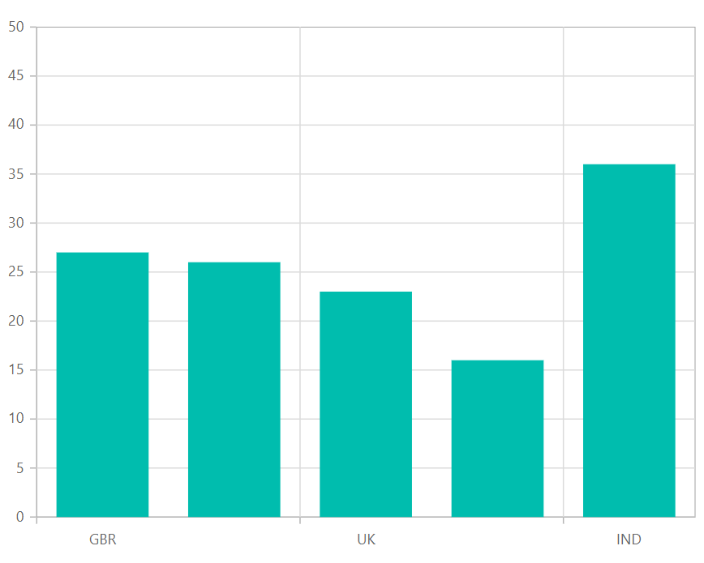

# Category Axis in Blazor Charts Component

The category axis is used to represent string values instead of integers.

```csharp

@using Syncfusion.Blazor.Charts

<SfChart Width="60%">
    <ChartPrimaryXAxis ValueType="Syncfusion.Blazor.Charts.ValueType.Category">
    </ChartPrimaryXAxis>

    <ChartSeriesCollection>
        <ChartSeries DataSource="@MedalDetails" XName="X" YName="YValue" Type="ChartSeriesType.Column">
        </ChartSeries>
    </ChartSeriesCollection>
</SfChart>

@code{
    public class ChartData
    {
        public string X { get; set; }
        public double YValue { get; set; }
    }

    public List<ChartData> MedalDetails = new List<ChartData>
{
        new ChartData { X= "USA", YValue= 46 },
        new ChartData { X= "GBR", YValue= 27 },
        new ChartData { X= "CHN", YValue= 26 },
        new ChartData { X= "UK", YValue= 23 },
        new ChartData { X= "AUS", YValue= 16 },
        new ChartData { X= "IND", YValue= 36 },
        new ChartData { X= "DEN", YValue= 12 },
        new ChartData { X= "MEX", YValue= 20 },
     };
}


```

## Labels Placement

The category labels are positioned between the ticks by default, but the [`LabelPlacement`](https://help.syncfusion.com/cr/blazor/Syncfusion.Blazor.Charts.ChartCommonAxis.html#Syncfusion_Blazor_Charts_ChartCommonAxis_LabelPlacement) property allows them to be placed on the ticks as well with the [`BetweenTicks`](https://help.syncfusion.com/cr/blazor/Syncfusion.Blazor.Charts.LabelPlacement.html#Syncfusion_Blazor_Charts_LabelPlacement_BetweenTicks) and [`OnTicks`](https://help.syncfusion.com/cr/blazor/Syncfusion.Blazor.Charts.LabelPlacement.html#Syncfusion_Blazor_Charts_LabelPlacement_OnTicks) options.

```csharp

@using Syncfusion.Blazor.Charts

<SfChart Width="60%">
    <ChartPrimaryXAxis LabelPlacement="LabelPlacement.OnTicks" ValueType="Syncfusion.Blazor.Charts.ValueType.Category">
    </ChartPrimaryXAxis>

    <ChartSeriesCollection>
        <ChartSeries DataSource="@MedalDetails" XName="X" YName="YValue" Type="ChartSeriesType.Column">
        </ChartSeries>
    </ChartSeriesCollection>
</SfChart>

@code{
    public class ChartData
    {
        public string X { get; set; }
        public double YValue { get; set; }
    }
    public List<ChartData> MedalDetails = new List<ChartData>
{
        new ChartData { X= "USA", YValue= 46 },
        new ChartData { X= "GBR", YValue= 27 },
        new ChartData { X= "CHN", YValue= 26 },
        new ChartData { X= "UK", YValue= 23 },
        new ChartData { X= "AUS", YValue= 16 },
        new ChartData { X= "IND", YValue= 36 },
        new ChartData { X= "DEN", YValue= 12 },
        new ChartData { X= "MEX", YValue= 20 },
     };
}

```


## Range and Interval

The [`Minimum`](https://help.syncfusion.com/cr/blazor/Syncfusion.Blazor.Charts.ChartCommonAxis.html#Syncfusion_Blazor_Charts_ChartCommonAxis_Minimum), [`Maximum`](https://help.syncfusion.com/cr/blazor/Syncfusion.Blazor.Charts.ChartCommonAxis.html#Syncfusion_Blazor_Charts_ChartCommonAxis_Maximum), and [`Interval`](https://help.syncfusion.com/cr/blazor/Syncfusion.Blazor.Charts.ChartCommonAxis.html#Syncfusion_Blazor_Charts_ChartCommonAxis_Interval) properties of the axis can be used to customize the range of the [`Category`](https://help.syncfusion.com/cr/blazor/Syncfusion.Blazor.Charts.ValueType.html#Syncfusion_Blazor_Charts_ValueType_Category) axis.

```csharp

@using Syncfusion.Blazor.Charts

<SfChart Width="60%">
    <ChartPrimaryXAxis Maximum="5" Minimum="1" Interval="2" ValueType="Syncfusion.Blazor.Charts.ValueType.Category">
    </ChartPrimaryXAxis>

    <ChartSeriesCollection>
        <ChartSeries DataSource="@MedalDetails" XName="X" YName="YValue" Type="ChartSeriesType.Column">
        </ChartSeries>
    </ChartSeriesCollection>
</SfChart>

@code{
    public class ChartData
    {
        public string X { get; set; }
        public double YValue { get; set; }
    }
    public List<ChartData> MedalDetails = new List<ChartData>
{
        new ChartData { X= "USA", YValue= 46 },
        new ChartData { X= "GBR", YValue= 27 },
        new ChartData { X= "CHN", YValue= 26 },
        new ChartData { X= "UK", YValue= 23 },
        new ChartData { X= "AUS", YValue= 16 },
        new ChartData { X= "IND", YValue= 36 },
        new ChartData { X= "DEN", YValue= 12 },
        new ChartData { X= "MEX", YValue= 20 },
     };
}

```



## Indexed category axis

The data source index values can also be used to render the category axis. This can be achieved by setting the [`IsIndexed`](https://help.syncfusion.com/cr/blazor/Syncfusion.Blazor.Charts.ChartCommonAxis.html#Syncfusion_Blazor_Charts_ChartCommonAxis_IsIndexed) property in the axis to **true**.

```csharp

@using Syncfusion.Blazor.Charts

<SfChart Width="60%">
    <ChartPrimaryXAxis IsIndexed="true" ValueType="Syncfusion.Blazor.Charts.ValueType.Category">
    </ChartPrimaryXAxis>

    <ChartSeriesCollection>
        <ChartSeries DataSource="@WeatherReports1" XName="X" YName="Y" Type="ChartSeriesType.Column">
        </ChartSeries>
        <ChartSeries DataSource="@WeatherReports2" XName="X" YName="Y" Type="ChartSeriesType.Column">
        </ChartSeries>
    </ChartSeriesCollection>
</SfChart>

@code{
    public class WeatherData
    {
        public string X { get; set; }
        public double Y { get; set; }
    }

    public List<WeatherData> WeatherReports1 = new List<WeatherData>
  {
         new WeatherData{ X= "Myanmar", Y= 7.3 },
         new WeatherData{ X= "India", Y= 7.9 },
         new WeatherData{ X= "Bangladesh", Y= 6.8 },
         new WeatherData{ X= "Cambodia", Y=7.0 },
         new WeatherData{ X= "China", Y= 6.9 }
      };

    public List<WeatherData> WeatherReports2 = new List<WeatherData>
{
         new WeatherData{ X= "Poland", Y=2.7 },
         new WeatherData{ X= "Australia", Y=2.5 },
         new WeatherData{ X= "Singapore", Y=2.0 },
         new WeatherData{ X= "Canada", Y=1.4 },
         new WeatherData{ X= "Germany", Y=1.8 }
     };
}


```


> Refer to our [`Blazor Charts`](https://www.syncfusion.com/blazor-components/blazor-charts) feature tour page for its groundbreaking feature representations and also explore our [`Blazor Chart example`](https://blazor.syncfusion.com/demos/chart/line?theme=bootstrap4) to knows various chart types and how to represent time-dependent data, showing trends in data at equal intervals.

## See Also

* [Data Label](./data-labels)
* [Tooltip](./tool-tip)
* [Marker](./data-markers)rkers)