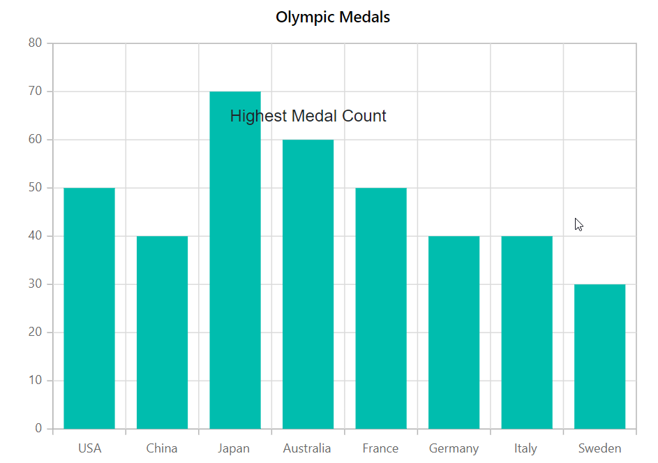
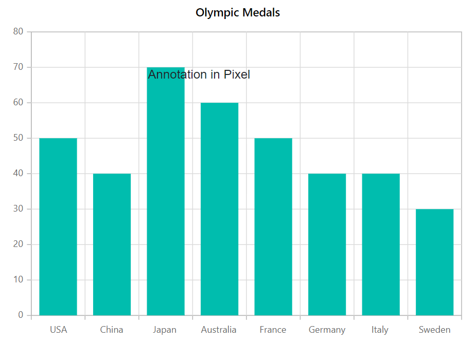

# Annotation in Blazor Charts (SfCharts)

Annotations are texts, shapes, or images that are used to highlight a specific region of interest in a chart.

The [`ChartAnnotations`](https://help.syncfusion.com/cr/blazor/Syncfusion.Blazor.Charts.ChartAnnotations.html) property allows to add annotations to the chart. Specify the id of the element that needs to be displayed in the chart area by using the [`Content`](https://help.syncfusion.com/cr/blazor/Syncfusion.Blazor.Charts.ChartAnnotation.html#Syncfusion_Blazor_Charts_ChartAnnotation_Content) property of annotation.



@using Syncfusion.Blazor.Charts

<SfChart Title="Olympic Medals">
    <ChartPrimaryXAxis ValueType="Syncfusion.Blazor.Charts.ValueType.Category">
    </ChartPrimaryXAxis>

    <ChartAnnotations>
        <ChartAnnotation X="@data" Y="60" CoordinateUnits="Units.Point">
            <ContentTemplate>
                
Medal count

            </ContentTemplate>
        </ChartAnnotation>
    </ChartAnnotations>

    <ChartSeriesCollection>
        <ChartSeries DataSource="@MedalDetails" XName="Country" YName="Gold" Type="ChartSeriesType.Column">
        </ChartSeries>
    </ChartSeriesCollection>
</SfChart>

@code{
    string data = "France";
    public class ChartData
    {
        public string Country { get; set; }
        public double Gold { get; set; }
    }
    public List<ChartData> MedalDetails = new List<ChartData>
{
    new ChartData{ Country= "USA", Gold=50  },
    new ChartData{ Country="China", Gold=40 },
    new ChartData{ Country= "Japan", Gold=70 },
    new ChartData{ Country= "Australia", Gold=60},
    new ChartData{ Country= "France", Gold=50 },
    new ChartData{ Country= "Germany", Gold=40 },
    new ChartData{ Country= "Italy", Gold=40 },
    new ChartData{ Country= "Sweden", Gold=30 }
    };
}



## Region

The [`Region`](https://help.syncfusion.com/cr/blazor/Syncfusion.Blazor.Charts.ChartAnnotation.html#Syncfusion_Blazor_Charts_ChartAnnotation_Region) property can be used to insert annotations in relation to a series or a chart. It is positioned with respect to [`Chart`](https://help.syncfusion.com/cr/blazor/Syncfusion.Blazor.Charts.Regions.html#Syncfusion_Blazor_Charts_Regions_Chart) by default.



@using Syncfusion.Blazor.Charts

<SfChart Title="Olympic Medals">
    <ChartPrimaryXAxis ValueType="Syncfusion.Blazor.Charts.ValueType.Category">
    </ChartPrimaryXAxis>

    <ChartAnnotations>
        <ChartAnnotation X="@Country" Y="70" Region="Regions.Series" CoordinateUnits="Units.Point">
            <ContentTemplate>
                
Highest Medal Count

            </ContentTemplate>
        </ChartAnnotation>
    </ChartAnnotations>

    <ChartSeriesCollection>
        <ChartSeries DataSource="@MedalDetails" XName="Country" YName="Gold" Type="ChartSeriesType.Column">
        </ChartSeries>
    </ChartSeriesCollection>
</SfChart>

@code{
    string Country = "Japan";
    public class ChartData
    {
        public string Country { get; set; }
        public double Gold { get; set; }
    }
    public List<ChartData> MedalDetails = new List<ChartData>
{
    new ChartData{ Country= "USA", Gold=50  },
    new ChartData{ Country="China", Gold=40 },
    new ChartData{ Country= "Japan", Gold=70 },
    new ChartData{ Country= "Australia", Gold=60},
    new ChartData{ Country= "France", Gold=50 },
    new ChartData{ Country= "Germany", Gold=40 },
    new ChartData{ Country= "Italy", Gold=40 },
    new ChartData{ Country= "Sweden", Gold=30 }
    };
}



## Co-ordinate Units

[`CoordinateUnits`](https://help.syncfusion.com/cr/blazor/Syncfusion.Blazor.Charts.ChartAnnotation.html#Syncfusion_Blazor_Charts_ChartAnnotation_CoordinateUnits) allows you to specify the annotation's coordinate units in either [`Pixel`](https://help.syncfusion.com/cr/blazor/Syncfusion.Blazor.Charts.Units.html#Syncfusion_Blazor_Charts_Units_Pixel) or [`Point`](https://help.syncfusion.com/cr/blazor/Syncfusion.Blazor.Charts.Units.html#Syncfusion_Blazor_Charts_Units_Point).



@using Syncfusion.Blazor.Charts

<SfChart Title="Olympic Medals">
    <ChartPrimaryXAxis ValueType="Syncfusion.Blazor.Charts.ValueType.Category">
    </ChartPrimaryXAxis>

    <ChartAnnotations>
        <ChartAnnotation X="250" Y="100" CoordinateUnits="Units.Pixel">
            <ContentTemplate>
                
Annotation in Pixel

            </ContentTemplate>
        </ChartAnnotation>
    </ChartAnnotations>

    <ChartSeriesCollection>
        <ChartSeries DataSource="@MedalDetails" XName="Country" YName="Gold" Type="ChartSeriesType.Column">
        </ChartSeries>
    </ChartSeriesCollection>
</SfChart>

@code{
    public class ChartData
    {
        public string Country { get; set; }
        public double Gold { get; set; }
    }
    public List<ChartData> MedalDetails = new List<ChartData>
{
    new ChartData{ Country= "USA", Gold=50  },
    new ChartData{ Country="China", Gold=40 },
    new ChartData{ Country= "Japan", Gold=70 },
    new ChartData{ Country= "Australia", Gold=60},
    new ChartData{ Country= "France", Gold=50 },
    new ChartData{ Country= "Germany", Gold=40 },
    new ChartData{ Country= "Italy", Gold=40 },
    new ChartData{ Country= "Sweden", Gold=30 }
    };
}



> Refer to our [`Blazor Charts`](https://www.syncfusion.com/blazor-components/blazor-charts) feature tour page for its groundbreaking feature representations and also explore our [`Blazor Chart example`](https://blazor.syncfusion.com/demos/chart/line?theme=bootstrap4) to know various chart types and how to represent time-dependent data, showing trends at equal intervals.

## See Also

* [Tooltip](./tool-tip)
* [Legend](./legend)