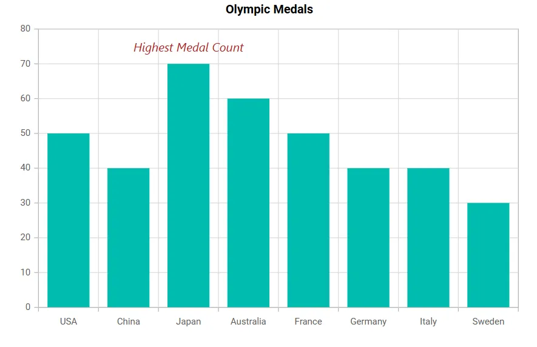
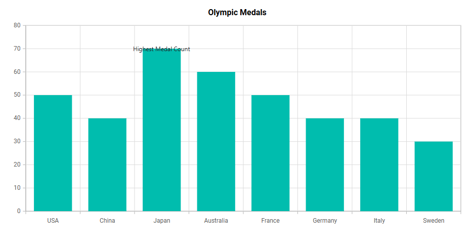
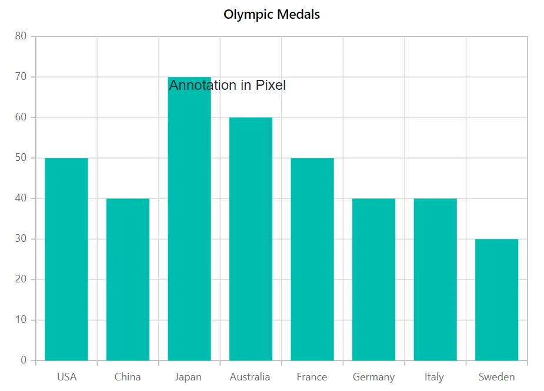

# Blazor Charts Annotation

Annotations are texts, shapes, or images that are used to highlight a specific region of interest in a chart.

Watch the video below for a walkthrough on adding and customizing annotations in a chart.


 
 The [ChartAnnotations](https://help.syncfusion.com/cr/blazor/Syncfusion.Blazor.Charts.ChartAnnotations.html) property is used to add annotations to the chart. [Annotation](https://help.syncfusion.com/cr/blazor/Syncfusion.Blazor.Charts.ChartAnnotation.html) content can be defined by using the [ContentTemplate](https://help.syncfusion.com/cr/blazor/Syncfusion.Blazor.Charts.ChartAnnotation.html#Syncfusion_Blazor_Charts_ChartAnnotation_ContentTemplate) property, which allows custom HTML content to be rendered at a specified coordinate within the chart area.

```cshtml

@using Syncfusion.Blazor.Charts

<SfChart Title="Olympic Medals">
    <ChartPrimaryXAxis ValueType="Syncfusion.Blazor.Charts.ValueType.Category" />

    <ChartAnnotations>
        <ChartAnnotation X="@data" Y="70" CoordinateUnits="Units.Point">
            <ContentTemplate>
                <div style="color: firebrick; font-size: medium; font-style: italic">Highest Medal Count</div>
            </ContentTemplate>
        </ChartAnnotation>
    </ChartAnnotations>

    <ChartSeriesCollection>
        <ChartSeries DataSource="@MedalDetails" XName="Country" YName="Gold" Type="ChartSeriesType.Column" />
    </ChartSeriesCollection>
</SfChart>

@code {
    string data = "Japan";
	
    public class ChartData
    {
        public string Country { get; set; }
        public double Gold { get; set; }
    }
	
    public List<ChartData> MedalDetails = new List<ChartData>
	{
		new ChartData{ Country= "USA", Gold=50  },
		new ChartData{ Country= "China", Gold=40 },
		new ChartData{ Country= "Japan", Gold=70 },
		new ChartData{ Country= "Australia", Gold=60},
		new ChartData{ Country= "France", Gold=50 },
		new ChartData{ Country= "Germany", Gold=40 },
		new ChartData{ Country= "Italy", Gold=40 },
		new ChartData{ Country= "Sweden", Gold=30 }
    };
}

```



## Region

The [Region](https://help.syncfusion.com/cr/blazor/Syncfusion.Blazor.Charts.ChartAnnotation.html#Syncfusion_Blazor_Charts_ChartAnnotation_Region) property is used to insert annotations in relation to a series or the overall chart. By default, `Region` is set to [Regions.Chart](https://help.syncfusion.com/cr/blazor/Syncfusion.Blazor.Charts.Regions.html#Syncfusion_Blazor_Charts_Regions_Chart).

```cshtml

@using Syncfusion.Blazor.Charts

<SfChart Title="Olympic Medals">
    <ChartPrimaryXAxis ValueType="Syncfusion.Blazor.Charts.ValueType.Category" />

    <ChartAnnotations>
        <ChartAnnotation X="@Country" Y="70" Region="Regions.Series" CoordinateUnits="Units.Point">
            <ContentTemplate>
                <div>Highest Medal Count</div>
            </ContentTemplate>
        </ChartAnnotation>
    </ChartAnnotations>

    <ChartSeriesCollection>
        <ChartSeries DataSource="@MedalDetails" XName="Country" YName="Gold" Type="ChartSeriesType.Column" />
    </ChartSeriesCollection>
</SfChart>

@code {
    string Country = "Japan";
	
    public class ChartData
    {
        public string Country { get; set; }
        public double Gold { get; set; }
    }
	
    public List<ChartData> MedalDetails = new List<ChartData>
	{
		new ChartData{ Country= "USA", Gold=50  },
		new ChartData{ Country= "China", Gold=40 },
		new ChartData{ Country= "Japan", Gold=70 },
		new ChartData{ Country= "Australia", Gold=60},
		new ChartData{ Country= "France", Gold=50 },
		new ChartData{ Country= "Germany", Gold=40 },
		new ChartData{ Country= "Italy", Gold=40 },
		new ChartData{ Country= "Sweden", Gold=30 }
    };
}

```



## Coordinate units

The [CoordinateUnits](https://help.syncfusion.com/cr/blazor/Syncfusion.Blazor.Charts.ChartAnnotation.html#Syncfusion_Blazor_Charts_ChartAnnotation_CoordinateUnits) property allows you to specify the annotation's coordinate units in either [Pixel](https://help.syncfusion.com/cr/blazor/Syncfusion.Blazor.Charts.Units.html#Syncfusion_Blazor_Charts_Units_Pixel) or [Point](https://help.syncfusion.com/cr/blazor/Syncfusion.Blazor.Charts.Units.html#Syncfusion_Blazor_Charts_Units_Point). The default is `Units.Point`. Pixel coordinates are absolute and may not respond to chart resizing.

```cshtml

@using Syncfusion.Blazor.Charts

<SfChart Title="Olympic Medals">
    <ChartPrimaryXAxis ValueType="Syncfusion.Blazor.Charts.ValueType.Category" />

    <ChartAnnotations>
        <ChartAnnotation X="250" Y="100" CoordinateUnits="Units.Pixel">
            <ContentTemplate>
                <div>Annotation in Pixel</div>
            </ContentTemplate>
        </ChartAnnotation>
    </ChartAnnotations>

    <ChartSeriesCollection>
        <ChartSeries DataSource="@MedalDetails" XName="Country" YName="Gold" Type="ChartSeriesType.Column" />
    </ChartSeriesCollection>
</SfChart>

@code {
    public class ChartData
    {
        public string Country { get; set; }
        public double Gold { get; set; }
    }

    public List<ChartData> MedalDetails = new List<ChartData>
    {
        new ChartData { Country = "USA", Gold = 50 },
        new ChartData { Country = "China", Gold = 40 },
        new ChartData { Country = "Japan", Gold = 70 },
        new ChartData { Country = "Australia", Gold = 60 },
        new ChartData { Country = "France", Gold = 50 },
        new ChartData { Country = "Germany", Gold = 40 },
        new ChartData { Country = "Italy", Gold = 40 },
        new ChartData { Country = "Sweden", Gold = 30 }
    };
}

```



## See also

* [Tooltip](./tool-tip)
* [Legend](./legend)
* [Data labels](./data-labels)
* [Chart tooltip table](./how-to/tool-tip-table)