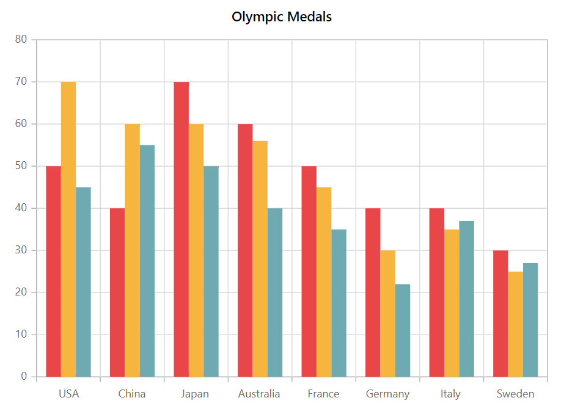
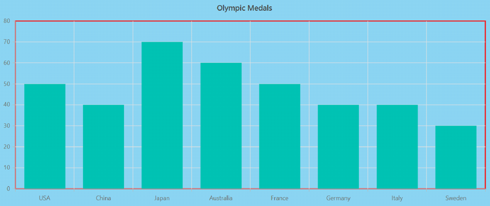
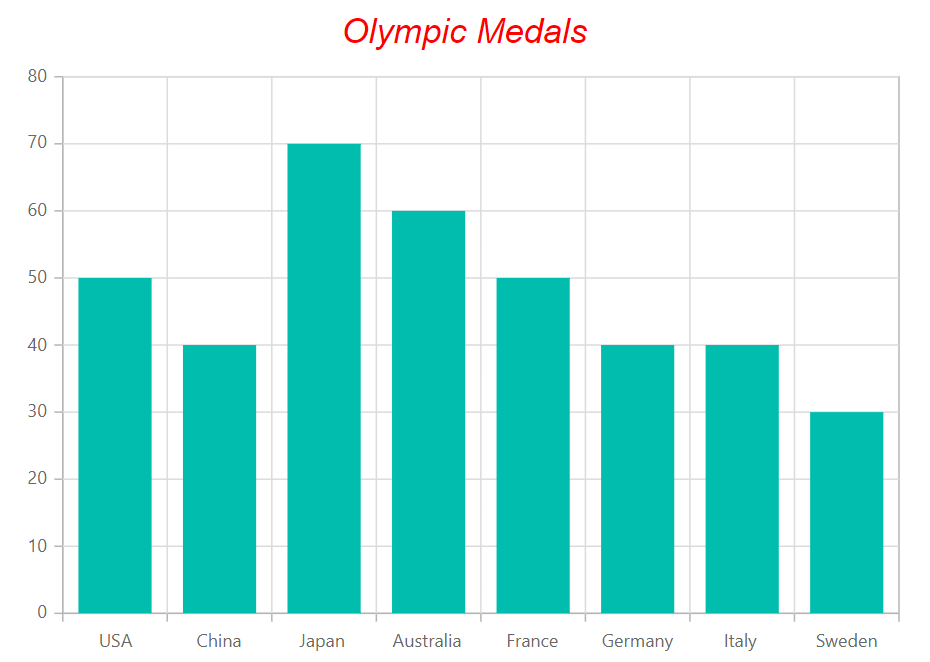
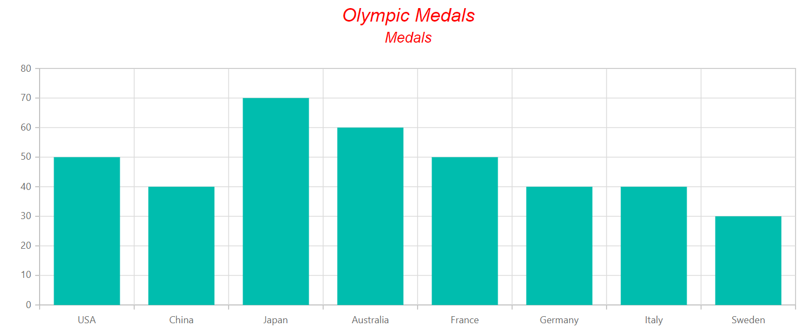

# Appearance in Blazor Charts Component

## Custom Color Palette

The default colour of series or points can be changed by providing a custom colour palette to the [`Palettes`](https://help.syncfusion.com/cr/blazor/Syncfusion.Blazor.Charts.SfChart.html#Syncfusion_Blazor_Charts_SfChart_Palettes) property .

```csharp

@using Syncfusion.Blazor.Charts

<SfChart Title="Olympic Medals" Palettes="@palettes">
    <ChartPrimaryXAxis ValueType="Syncfusion.Blazor.Charts.ValueType.Category">
    </ChartPrimaryXAxis>

    <ChartSeriesCollection>
        <ChartSeries DataSource="@MedalDetails" XName="Country" YName="Gold" Type="ChartSeriesType.Column">
        </ChartSeries>
        <ChartSeries DataSource="@MedalDetails" XName="Country" YName="Silver" Type="ChartSeriesType.Column">
        </ChartSeries>
        <ChartSeries DataSource="@MedalDetails" XName="Country" YName="Bronze" Type="ChartSeriesType.Column">
        </ChartSeries>
    </ChartSeriesCollection>
</SfChart>

@code{
    public class ChartData
    {
        public string Country { get; set; }
        public double Gold { get; set; }
        public double Silver { get; set; }
        public double Bronze { get; set; }
    }
    public List<ChartData> MedalDetails = new List<ChartData>
{
         new ChartData{ Country= "USA", Gold=50, Silver=70, Bronze=45 },
         new ChartData{ Country="China", Gold=40, Silver= 60, Bronze=55 },
         new ChartData{ Country= "Japan", Gold=70, Silver= 60, Bronze=50 },
         new ChartData{ Country= "Australia", Gold=60, Silver= 56, Bronze=40 },
         new ChartData{ Country= "France", Gold=50, Silver= 45, Bronze=35 },
         new ChartData{ Country= "Germany", Gold=40, Silver=30, Bronze=22 },
         new ChartData{ Country= "Italy", Gold=40, Silver=35, Bronze=37 },
         new ChartData{ Country= "Sweden", Gold=30, Silver=25, Bronze=27 }
    };
    public String[] palettes = new String[] { "#E94649", "#F6B53F", "#6FAAB0" };
}


```



<!-- markdownlint-disable MD036 -->

## Chart Customization

<!-- markdownlint-disable MD036 -->

**Chart Background**

<!-- markdownlint-disable MD013 -->

The chart's background colour and border can be changed using the [`Background`](https://help.syncfusion.com/cr/blazor/Syncfusion.Blazor.Charts.SfChart.html#Syncfusion_Blazor_Charts_SfChart_Background) and [`Border`](https://help.syncfusion.com/cr/blazor/Syncfusion.Blazor.Charts.ChartBorder.html) properties.

```csharp

@using Syncfusion.Blazor.Charts

<SfChart Title="Olympic Medals" Background="skyblue">
    <ChartArea>
        <ChartAreaBorder Color="#FF0000" Width="2"/>
    </ChartArea>

    <ChartPrimaryXAxis ValueType="Syncfusion.Blazor.Charts.ValueType.Category"/>

    <ChartSeriesCollection>
        <ChartSeries DataSource="@MedalDetails" XName="Country" YName="Gold" Type="ChartSeriesType.Column"/>        
    </ChartSeriesCollection>
</SfChart>

@code{
    public class ChartData
    {
        public string Country { get; set; }
        public double Gold { get; set; }
    }
    public List<ChartData> MedalDetails = new List<ChartData>
{
    new ChartData{ Country= "USA", Gold=50  },
    new ChartData{ Country="China", Gold=40 },
    new ChartData{ Country= "Japan", Gold=70 },
    new ChartData{ Country= "Australia", Gold=60},
    new ChartData{ Country= "France", Gold=50 },
    new ChartData{ Country= "Germany", Gold=40 },
    new ChartData{ Country= "Italy", Gold=40 },
    new ChartData{ Country= "Sweden", Gold=30 }
    };
}

```



**Chart Margin**

The [`Margin`](https://help.syncfusion.com/cr/blazor/Syncfusion.Blazor.Charts.ChartMargin.html) property allows you to set the chart's margin from its container.

```csharp

@using Syncfusion.Blazor.Charts

<SfChart Title="Olympic Medals" Background="skyblue">
    <ChartArea>
        <ChartAreaBorder Color="#FF0000" Width="2"></ChartAreaBorder>
    </ChartArea>

    <ChartMargin Left="40" Right="40" Top="40" Bottom="40"></ChartMargin>

    <ChartPrimaryXAxis ValueType="Syncfusion.Blazor.Charts.ValueType.Category">
    </ChartPrimaryXAxis>

    <ChartSeriesCollection>
        <ChartSeries DataSource="@MedalDetails" XName="Country" YName="Gold" Type="ChartSeriesType.Column">
        </ChartSeries>
    </ChartSeriesCollection>
</SfChart>

@code{
    public class ChartData
    {
        public string Country { get; set; }
        public double Gold { get; set; }
    }
    public List<ChartData> MedalDetails = new List<ChartData>
{
    new ChartData{ Country= "USA", Gold=50  },
    new ChartData{ Country="China", Gold=40 },
    new ChartData{ Country= "Japan", Gold=70 },
    new ChartData{ Country= "Australia", Gold=60},
    new ChartData{ Country= "France", Gold=50 },
    new ChartData{ Country= "Germany", Gold=40 },
    new ChartData{ Country= "Italy", Gold=40 },
    new ChartData{ Country= "Sweden", Gold=30 }
    };
}

```

**Chart Area Background**

The chart area background can be customized by using the [`Background`](https://help.syncfusion.com/cr/blazor/Syncfusion.Blazor.Charts.ChartArea.html#Syncfusion_Blazor_Charts_ChartArea_Background)
property in the [`ChartArea`](https://help.syncfusion.com/cr/blazor/Syncfusion.Blazor.Charts.ChartArea.html).

```csharp

@using Syncfusion.Blazor.Charts

<SfChart Title="Olympic Medals" Background="skyblue">
    <ChartPrimaryXAxis ValueType="Syncfusion.Blazor.Charts.ValueType.Category"/>    

    <ChartSeriesCollection>
        <ChartSeries DataSource="@MedalDetails" XName="Country" YName="Gold" Type="ChartSeriesType.Column">
        </ChartSeries>
    </ChartSeriesCollection>
</SfChart>

@code{
    public class ChartData
    {
        public string Country { get; set; }
        public double Gold { get; set; }
    }
    public List<ChartData> MedalDetails = new List<ChartData>
{
    new ChartData{ Country= "USA", Gold=50  },
    new ChartData{ Country="China", Gold=40 },
    new ChartData{ Country= "Japan", Gold=70 },
    new ChartData{ Country= "Australia", Gold=60},
    new ChartData{ Country= "France", Gold=50 },
    new ChartData{ Country= "Germany", Gold=40 },
    new ChartData{ Country= "Italy", Gold=40 },
    new ChartData{ Country= "Sweden", Gold=30 }
    };
}

```

## Animation

The [`Animation`](https://help.syncfusion.com/cr/blazor/Syncfusion.Blazor.Charts.ChartSeries.html#Syncfusion_Blazor_Charts_ChartSeries_Animation) property allows you to customize animation for a certain series. The [`Enable`](https://help.syncfusion.com/cr/blazor/Syncfusion.Blazor.Charts.StockChartCommonAnimation.html#Syncfusion_Blazor_Charts_StockChartCommonAnimation_Enable) property can be used to enable or disable the series' animation. The duration of the animation is specified by [`Duration`](https://help.syncfusion.com/cr/blazor/Syncfusion.Blazor.Charts.StockChartCommonAnimation.html#Syncfusion_Blazor_Charts_StockChartCommonAnimation_Duration), and [`Delay`](https://help.syncfusion.com/cr/blazor/Syncfusion.Blazor.Charts.StockChartCommonAnimation.html#Syncfusion_Blazor_Charts_StockChartCommonAnimation_Delay) allows to start the animation at a specific moment.

```csharp

@using Syncfusion.Blazor.Charts

<SfChart Title="Olympic Medals">

    <ChartPrimaryXAxis ValueType="Syncfusion.Blazor.Charts.ValueType.Category"/>    

    <ChartSeriesCollection>
        <ChartSeries DataSource="@MedalDetails" Name="Gold" XName="Country" Width="2" Opacity="1" YName="Gold" Type="ChartSeriesType.Column">
            <ChartSeriesAnimation Enable="true" Duration="2000" Delay="200"></ChartSeriesAnimation>
            <ChartSeriesBorder Width="3" Color="red"></ChartSeriesBorder>
        </ChartSeries>
    </ChartSeriesCollection>
</SfChart>

@code{
    public class ChartData
    {
        public string Country { get; set; }
        public double Gold { get; set; }
        public double Silver { get; set; }
        public double Bronze { get; set; }
    }
    public List<ChartData> MedalDetails = new List<ChartData>
{
        new ChartData{ Country= "USA", Gold=50, Silver=70, Bronze=45 },
        new ChartData{ Country="China", Gold=40, Silver= 60, Bronze=55 },
        new ChartData{ Country= "Japan", Gold=70, Silver= 60, Bronze=50 },
        new ChartData{ Country= "Australia", Gold=60, Silver= 56, Bronze=40 },
        new ChartData{ Country= "France", Gold=50, Silver= 45, Bronze=35 },
        new ChartData{ Country= "Germany", Gold=40, Silver=30, Bronze=22 },
        new ChartData{ Country= "Italy", Gold=40, Silver=35, Bronze=37 },
        new ChartData{ Country= "Sweden", Gold=30, Silver=25, Bronze=27 }
    };
}


```

## Chart Title

The [`Title`](https://help.syncfusion.com/cr/blazor/Syncfusion.Blazor.Charts.SfChart.html#Syncfusion_Blazor_Charts_SfChart_Title) property can be used to give a title to a chart in order to provide information about the data shown.

```csharp

@using Syncfusion.Blazor.Charts

<SfChart Title="Olympic Medals">
    <ChartTitleStyle Size="23px" Color="red" FontFamily="Arial" FontWeight="regular" FontStyle="italic"></ChartTitleStyle>

    <ChartPrimaryXAxis ValueType="Syncfusion.Blazor.Charts.ValueType.Category">
    </ChartPrimaryXAxis>

    <ChartSeriesCollection>
        <ChartSeries DataSource="@MedalDetails" XName="Country" YName="Gold" Type="ChartSeriesType.Column">
        </ChartSeries>
    </ChartSeriesCollection>
</SfChart>

@code{
    public class ChartData
    {
        public string Country { get; set; }
        public double Gold {get; set; }
    }
    public List<ChartData> MedalDetails = new List<ChartData>
{
    new ChartData{ Country= "USA", Gold=50  },
    new ChartData{ Country="China", Gold=40 },
    new ChartData{ Country= "Japan", Gold=70 },
    new ChartData{ Country= "Australia", Gold=60},
    new ChartData{ Country= "France", Gold=50 },
    new ChartData{ Country= "Germany", Gold=40 },
    new ChartData{ Country= "Italy", Gold=40 },
    new ChartData{ Country= "Sweden", Gold=30 }
    };
}

```



## Chart SubTitle

The [`SubTitle`](https://help.syncfusion.com/cr/blazor/Syncfusion.Blazor.Charts.SfChart.html#Syncfusion_Blazor_Charts_SfChart_SubTitle) property can be used to provide a chart a subtitle that displays information about the data shown.

```csharp

@using Syncfusion.Blazor.Charts

<SfChart Title="Olympic Medals" SubTitle="Medals">
    <ChartSubTitleStyle FontFamily="Arial" FontStyle="italic" FontWeight="regular" Size="18px" Color="red"></ChartSubTitleStyle>

    <ChartTitleStyle FontFamily="Arial" FontStyle="italic" FontWeight="regular" Size="23px" Color="red"></ChartTitleStyle>

    <ChartPrimaryXAxis ValueType="Syncfusion.Blazor.Charts.ValueType.Category">
    </ChartPrimaryXAxis>

    <ChartSeriesCollection>
        <ChartSeries DataSource="@MedalDetails" XName="Country" YName="Gold" Type="ChartSeriesType.Column">
        </ChartSeries>
    </ChartSeriesCollection>
</SfChart>

@code{
    public class ChartData
    {
        public string Country { get; set; }
        public double Gold { get; set; }
    }
    public List<ChartData> MedalDetails = new List<ChartData>
{
    new ChartData{ Country= "USA", Gold=50  },
    new ChartData{ Country="China", Gold=40 },
    new ChartData{ Country= "Japan", Gold=70 },
    new ChartData{ Country= "Australia", Gold=60},
    new ChartData{ Country= "France", Gold=50 },
    new ChartData{ Country= "Germany", Gold=40 },
    new ChartData{ Country= "Italy", Gold=40 },
    new ChartData{ Country= "Sweden", Gold=30 }
    };
}

```



> Refer to our [`Blazor Charts`](https://www.syncfusion.com/blazor-components/blazor-charts) feature tour page for its groundbreaking feature representations and also explore our [`Blazor Chart example`](https://blazor.syncfusion.com/demos/chart/line?theme=bootstrap4) to know various chart types and how to represent time-dependent data, showing trends at equal intervals.

## See Also

* [Data Label](./data-labels)
* [Tooltip](./tool-tip)-tip)