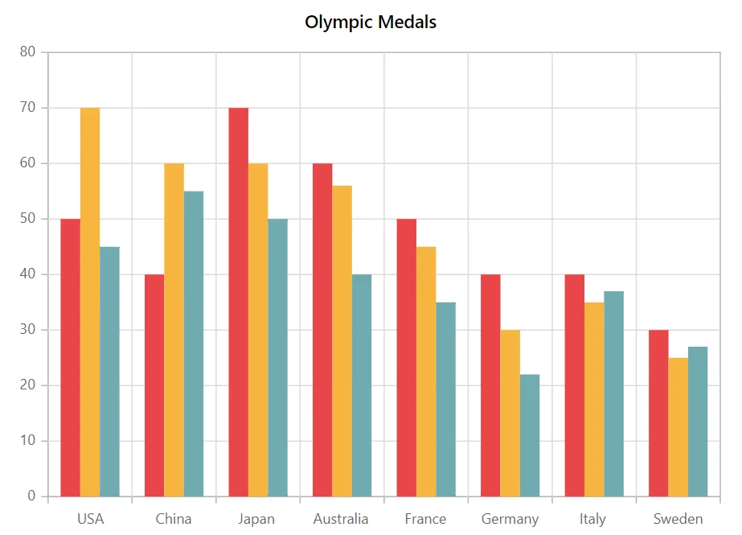
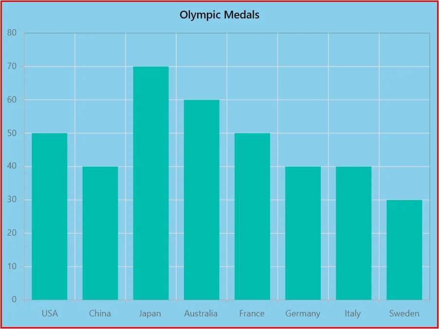
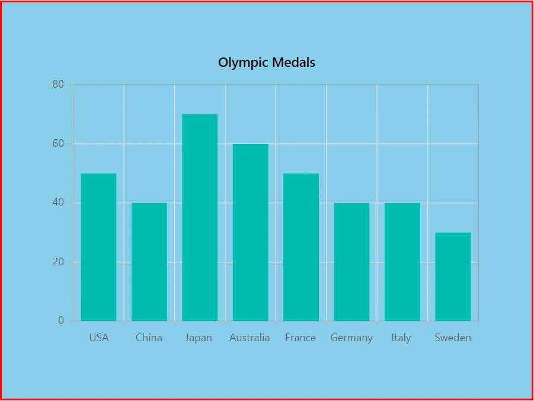
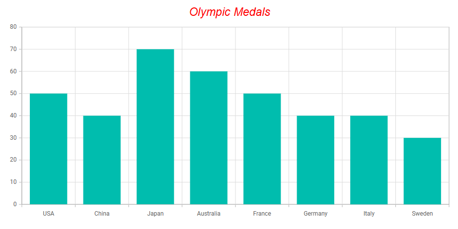
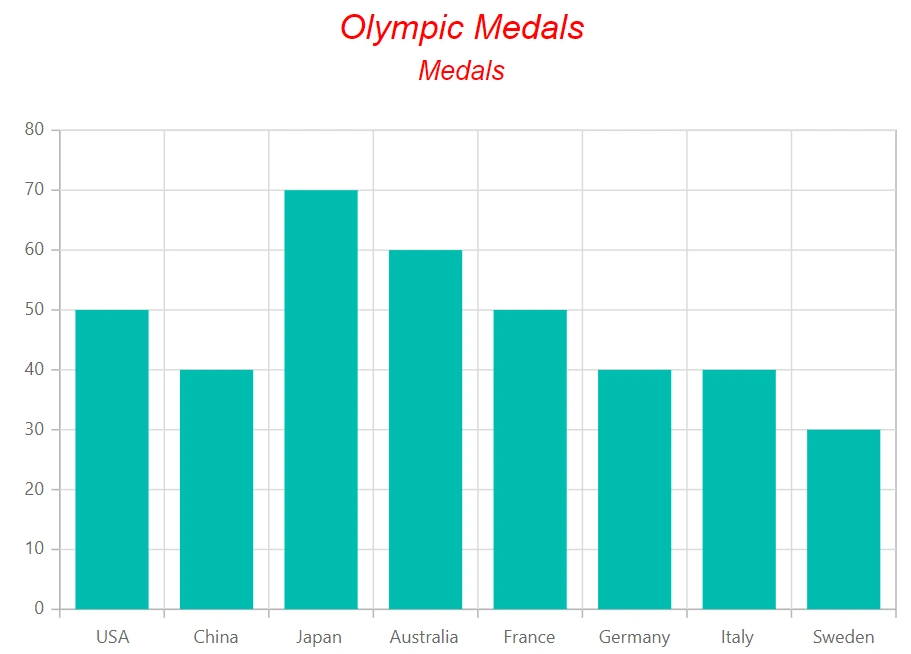

# Blazor Charts Appearance

## Custom color palette

Use the [Palettes](https://help.syncfusion.com/cr/blazor/Syncfusion.Blazor.Charts.SfChart.html#Syncfusion_Blazor_Charts_SfChart_Palettes) property to override the default series or data-point colors. When the number of series or data points exceeds the palette length, the colors cycle.

```cshtml

@using Syncfusion.Blazor.Charts

<SfChart Title="Olympic Medals" Palettes="@palettes">
    <ChartPrimaryXAxis ValueType="Syncfusion.Blazor.Charts.ValueType.Category">
    </ChartPrimaryXAxis>

    <ChartSeriesCollection>
        <ChartSeries DataSource="@MedalDetails" XName="Country" YName="Gold" Type="ChartSeriesType.Column">
        </ChartSeries>
        <ChartSeries DataSource="@MedalDetails" XName="Country" YName="Silver" Type="ChartSeriesType.Column">
        </ChartSeries>
        <ChartSeries DataSource="@MedalDetails" XName="Country" YName="Bronze" Type="ChartSeriesType.Column">
        </ChartSeries>
    </ChartSeriesCollection>
</SfChart>

@code{
    public class ChartData
    {
        public string Country { get; set; }
        public double Gold { get; set; }
        public double Silver { get; set; }
        public double Bronze { get; set; }
    }

    public List<ChartData> MedalDetails = new List<ChartData>
	{
         new ChartData{ Country= "USA", Gold=50, Silver=70, Bronze=45 },
         new ChartData{ Country="China", Gold=40, Silver= 60, Bronze=55 },
         new ChartData{ Country= "Japan", Gold=70, Silver= 60, Bronze=50 },
         new ChartData{ Country= "Australia", Gold=60, Silver= 56, Bronze=40 },
         new ChartData{ Country= "France", Gold=50, Silver= 45, Bronze=35 },
         new ChartData{ Country= "Germany", Gold=40, Silver=30, Bronze=22 },
         new ChartData{ Country= "Italy", Gold=40, Silver=35, Bronze=37 },
         new ChartData{ Country= "Sweden", Gold=30, Silver=25, Bronze=27 }
    };

    public string[] palettes = new string[] { "#E94649", "#F6B53F", "#6FAAB0" };
}

```



## Chart customization

### Chart background and border

The chart's background color can be customized using the [Background](https://help.syncfusion.com/cr/blazor/Syncfusion.Blazor.Charts.SfChart.html#Syncfusion_Blazor_Charts_SfChart_Background) property. The border color and width can be customized using the [ChartBorder](https://help.syncfusion.com/cr/blazor/Syncfusion.Blazor.Charts.ChartBorder.html) component, which supports the following properties:

* `Color` – sets the border color.
* `Width` – sets the border width in pixels.

```cshtml

@using Syncfusion.Blazor.Charts

<SfChart Title="Olympic Medals" Background="skyblue">
    <ChartBorder Color="#FF0000" Width="2"></ChartBorder>

    <ChartPrimaryXAxis ValueType="Syncfusion.Blazor.Charts.ValueType.Category" />

    <ChartSeriesCollection>
        <ChartSeries DataSource="@MedalDetails" XName="Country" YName="Gold" Type="ChartSeriesType.Column">
        </ChartSeries>
    </ChartSeriesCollection>
</SfChart>

@code{
    public class ChartData
    {
        public string Country { get; set; }
        public double Gold { get; set; }
    }

    public List<ChartData> MedalDetails = new List<ChartData>
	{
		new ChartData{ Country= "USA", Gold=50  },
		new ChartData{ Country="China", Gold=40 },
		new ChartData{ Country= "Japan", Gold=70 },
		new ChartData{ Country= "Australia", Gold=60},
		new ChartData{ Country= "France", Gold=50 },
		new ChartData{ Country= "Germany", Gold=40 },
		new ChartData{ Country= "Italy", Gold=40 },
		new ChartData{ Country= "Sweden", Gold=30 }
    };
}

```



### Chart margin

The chart's margin (in pixels) from its container can be customized using the [ChartMargin](https://help.syncfusion.com/cr/blazor/Syncfusion.Blazor.Charts.ChartMargin.html) component, which supports the following properties:

* `Left` – left margin in pixels.
* `Right` – right margin in pixels.
* `Top` – top margin in pixels.
* `Bottom` – bottom margin in pixels.

```cshtml

@using Syncfusion.Blazor.Charts

<SfChart Title="Olympic Medals" Background="skyblue">
    <ChartBorder Color="#FF0000" Width="2"></ChartBorder>

    <ChartMargin Left="60" Right="60" Top="60" Bottom="60"></ChartMargin>

    <ChartPrimaryXAxis ValueType="Syncfusion.Blazor.Charts.ValueType.Category">
    </ChartPrimaryXAxis>

    <ChartSeriesCollection>
        <ChartSeries DataSource="@MedalDetails" XName="Country" YName="Gold" Type="ChartSeriesType.Column">
        </ChartSeries>
    </ChartSeriesCollection>
</SfChart>

@code{
    public class ChartData
    {
        public string Country { get; set; }
        public double Gold { get; set; }
    }

    public List<ChartData> MedalDetails = new List<ChartData>
	{
		new ChartData{ Country= "USA", Gold=50  },
		new ChartData{ Country="China", Gold=40 },
		new ChartData{ Country= "Japan", Gold=70 },
		new ChartData{ Country= "Australia", Gold=60},
		new ChartData{ Country= "France", Gold=50 },
		new ChartData{ Country= "Germany", Gold=40 },
		new ChartData{ Country= "Italy", Gold=40 },
		new ChartData{ Country= "Sweden", Gold=30 }
    };
}

```



### Chart area customization

Use the [Background](https://help.syncfusion.com/cr/blazor/Syncfusion.Blazor.Charts.ChartArea.html#Syncfusion_Blazor_Charts_ChartArea_Background) and [ChartAreaBorder](https://help.syncfusion.com/cr/blazor/Syncfusion.Blazor.Charts.ChartAreaBorder.html) properties to change the background color and border of the chart area. The chart area width can be customized using the [Width](https://help.syncfusion.com/cr/blazor/Syncfusion.Blazor.Charts.ChartArea.html#Syncfusion_Blazor_Charts_ChartArea_Width) property.

```cshtml

@using Syncfusion.Blazor.Charts

<SfChart Title="Olympic Medals" >
    <ChartArea Background="skyblue" Width="80%">
        <ChartAreaBorder Color="#FF0000"  Width="2" />
    </ChartArea>

    <ChartPrimaryXAxis ValueType="Syncfusion.Blazor.Charts.ValueType.Category" />

    <ChartSeriesCollection>
        <ChartSeries DataSource="@MedalDetails" XName="Country" YName="Gold" Type="ChartSeriesType.Column" />
    </ChartSeriesCollection>
</SfChart>

@code{
    public class ChartData
    {
        public string Country { get; set; }
        public double Gold { get; set; }
    }

    public List<ChartData> MedalDetails = new List<ChartData>
	{
		new ChartData{ Country= "USA", Gold=50  },
		new ChartData{ Country="China", Gold=40 },
		new ChartData{ Country= "Japan", Gold=70 },
		new ChartData{ Country= "Australia", Gold=60},
		new ChartData{ Country= "France", Gold=50 },
		new ChartData{ Country= "Germany", Gold=40 },
		new ChartData{ Country= "Italy", Gold=40 },
		new ChartData{ Country= "Sweden", Gold=30 }
    };
}

```


### Animation

The [Animation](https://help.syncfusion.com/cr/blazor/Syncfusion.Blazor.Charts.ChartSeries.html#Syncfusion_Blazor_Charts_ChartSeries_Animation) property customizes animation for a series. The following properties are available on [ChartSeriesAnimation](https://help.syncfusion.com/cr/blazor/Syncfusion.Blazor.Charts.ChartSeriesAnimation.html):

N> The animation example below also applies a red border to the columns through `ChartSeriesBorder`. The `Border` property on a chart series is independent of the animation settings.

```cshtml

@using Syncfusion.Blazor.Charts

<SfChart Title="Olympic Medals">
    <ChartPrimaryXAxis ValueType="Syncfusion.Blazor.Charts.ValueType.Category"/>

    <ChartSeriesCollection>
        <ChartSeries DataSource="@MedalDetails" Name="Gold" XName="Country" YName="Gold" Type="ChartSeriesType.Column">
            <ChartSeriesAnimation Enable="true" Duration="2000" Delay="200"></ChartSeriesAnimation>
            <ChartSeriesBorder Width="3" Color="red"></ChartSeriesBorder>
        </ChartSeries>
    </ChartSeriesCollection>
</SfChart>

@code{
    public class ChartData
    {
        public string Country { get; set; }
        public double Gold { get; set; }
        public double Silver { get; set; }
        public double Bronze { get; set; }
    }

    public List<ChartData> MedalDetails = new List<ChartData>
	{
        new ChartData{ Country= "USA", Gold=50, Silver=70, Bronze=45 },
        new ChartData{ Country="China", Gold=40, Silver= 60, Bronze=55 },
        new ChartData{ Country= "Japan", Gold=70, Silver= 60, Bronze=50 },
        new ChartData{ Country= "Australia", Gold=60, Silver= 56, Bronze=40 },
        new ChartData{ Country= "France", Gold=50, Silver= 45, Bronze=35 },
        new ChartData{ Country= "Germany", Gold=40, Silver=30, Bronze=22 },
        new ChartData{ Country= "Italy", Gold=40, Silver=35, Bronze=37 },
        new ChartData{ Country= "Sweden", Gold=30, Silver=25, Bronze=27 }
    };
}

```

## Chart title

A chart title can be specified using the [Title](https://help.syncfusion.com/cr/blazor/Syncfusion.Blazor.Charts.SfChart.html#Syncfusion_Blazor_Charts_SfChart_Title) property to convey information about the displayed data. The title appearance can be customized using [ChartTitleStyle](https://help.syncfusion.com/cr/blazor/Syncfusion.Blazor.Charts.ChartTitleStyle.html), which supports properties such as `Size`, `Color`, `FontFamily`, `FontWeight`, and `FontStyle`.

```cshtml

@using Syncfusion.Blazor.Charts

<SfChart Title="Olympic Medals">
    <ChartTitleStyle Size="23px" Color="red" FontFamily="Arial" FontWeight="normal" FontStyle="italic"></ChartTitleStyle>

    <ChartPrimaryXAxis ValueType="Syncfusion.Blazor.Charts.ValueType.Category">
    </ChartPrimaryXAxis>

    <ChartSeriesCollection>
        <ChartSeries DataSource="@MedalDetails" XName="Country" YName="Gold" Type="ChartSeriesType.Column">
        </ChartSeries>
    </ChartSeriesCollection>
</SfChart>

@code{
    public class ChartData
    {
        public string Country { get; set; }
        public double Gold {get; set; }
    }

    public List<ChartData> MedalDetails = new List<ChartData>
	{
		new ChartData{ Country= "USA", Gold=50  },
		new ChartData{ Country="China", Gold=40 },
		new ChartData{ Country= "Japan", Gold=70 },
		new ChartData{ Country= "Australia", Gold=60},
		new ChartData{ Country= "France", Gold=50 },
		new ChartData{ Country= "Germany", Gold=40 },
		new ChartData{ Country= "Italy", Gold=40 },
		new ChartData{ Country= "Sweden", Gold=30 }
    };
}

```



### Title position

The [Position](https://help.syncfusion.com/cr/blazor/Syncfusion.Blazor.Charts.ChartTitleStyle.html#Syncfusion_Blazor_Charts_ChartTitleStyle_Position) property customizes the placement of the chart title. It supports the following options: [Right](https://help.syncfusion.com/cr/blazor/Syncfusion.Blazor.Charts.ChartTitlePosition.html#Syncfusion_Blazor_Charts_ChartTitlePosition_Right), [Left](https://help.syncfusion.com/cr/blazor/Syncfusion.Blazor.Charts.ChartTitlePosition.html#Syncfusion_Blazor_Charts_ChartTitlePosition_Left), [Bottom](https://help.syncfusion.com/cr/blazor/Syncfusion.Blazor.Charts.ChartTitlePosition.html#Syncfusion_Blazor_Charts_ChartTitlePosition_Bottom), [Top](https://help.syncfusion.com/cr/blazor/Syncfusion.Blazor.Charts.ChartTitlePosition.html#Syncfusion_Blazor_Charts_ChartTitlePosition_Top), and [Custom](https://help.syncfusion.com/cr/blazor/Syncfusion.Blazor.Charts.ChartTitlePosition.html#Syncfusion_Blazor_Charts_ChartTitlePosition_Custom), providing flexible title alignment based on layout requirements. By default, the chart title appears at the top of the chart.

N> The subtitle, which appears below the title by default, moves with the title when the `Position` property is set. The subtitle retains its relative position to the title rather than to the chart area.

```cshtml 

@using Syncfusion.Blazor.Charts

<SfChart Title="Olympic Medals" SubTitle="Medals">
    <ChartTitleStyle Position="ChartTitlePosition.Bottom"></ChartTitleStyle>

    <ChartPrimaryXAxis ValueType="Syncfusion.Blazor.Charts.ValueType.Category">
    </ChartPrimaryXAxis>

    <ChartSeriesCollection>
        <ChartSeries DataSource="@MedalDetails" XName="Country" YName="Gold" Type="ChartSeriesType.Column">
        </ChartSeries>
    </ChartSeriesCollection>
</SfChart>

@code{
    public class ChartData
    {
        public string Country { get; set; }
        public double Gold { get; set; }
    }

    public List<ChartData> MedalDetails = new List<ChartData>
	{
		new ChartData{ Country= "USA", Gold=50  },
		new ChartData{ Country="China", Gold=40 },
		new ChartData{ Country= "Japan", Gold=70 },
		new ChartData{ Country= "Australia", Gold=60},
		new ChartData{ Country= "France", Gold=50 },
		new ChartData{ Country= "Germany", Gold=40 },
		new ChartData{ Country= "Italy", Gold=40 },
		new ChartData{ Country= "Sweden", Gold=30 }
    };
}

```


When `Position` is set to `Custom`, the title can be positioned anywhere on the chart using the [X](https://help.syncfusion.com/cr/blazor/Syncfusion.Blazor.Charts.ChartTitleStyle.html#Syncfusion_Blazor_Charts_ChartTitleStyle_X) and [Y](https://help.syncfusion.com/cr/blazor/Syncfusion.Blazor.Charts.ChartTitleStyle.html#Syncfusion_Blazor_Charts_ChartTitleStyle_Y) properties of [ChartTitleStyle](https://help.syncfusion.com/cr/blazor/Syncfusion.Blazor.Charts.ChartTitleStyle.html), which specify the horizontal and vertical coordinates in pixels.

N> The `X` and `Y` values are in pixels and are not responsive; on a different chart size the title may need to be repositioned.

```cshtml 

@using Syncfusion.Blazor.Charts

<SfChart Title="Olympic Medals" SubTitle="Medals">

    <ChartTitleStyle Position="ChartTitlePosition.Custom" X="335" Y="60"></ChartTitleStyle>

    <ChartPrimaryXAxis ValueType="Syncfusion.Blazor.Charts.ValueType.Category">
        <ChartAxisMajorGridLines Width="0"></ChartAxisMajorGridLines>
    </ChartPrimaryXAxis>

    <ChartSeriesCollection>
        <ChartSeries DataSource="@MedalDetails" XName="Country" YName="Gold" Type="ChartSeriesType.Column">
        </ChartSeries>
    </ChartSeriesCollection>
</SfChart>

@code{
    public class ChartData
    {
        public string Country { get; set; }
        public double Gold { get; set; }
    }

    public List<ChartData> MedalDetails = new List<ChartData>
	{
		new ChartData{ Country= "USA", Gold=50  },
		new ChartData{ Country="China", Gold=40 },
		new ChartData{ Country= "Japan", Gold=70 },
		new ChartData{ Country= "Australia", Gold=60},
		new ChartData{ Country= "France", Gold=50 },
		new ChartData{ Country= "Germany", Gold=40 },
		new ChartData{ Country= "Italy", Gold=40 },
		new ChartData{ Country= "Sweden", Gold=30 }
    };
}

```


## Chart subtitle

The [SubTitle](https://help.syncfusion.com/cr/blazor/Syncfusion.Blazor.Charts.SfChart.html#Syncfusion_Blazor_Charts_SfChart_SubTitle) property can be used to add a subtitle to the chart to provide additional information about the data displayed. The subtitle appearance can be customized using [ChartSubTitleStyle](https://help.syncfusion.com/cr/blazor/Syncfusion.Blazor.Charts.ChartSubTitleStyle.html), which supports the same `Size`, `Color`, `FontFamily`, `FontWeight`, and `FontStyle` properties as the title style.

```cshtml

@using Syncfusion.Blazor.Charts

<SfChart Title="Olympic Medals" SubTitle="Medals">
    <ChartSubTitleStyle FontFamily="Arial" FontStyle="italic" FontWeight="regular" Size="18px" Color="red"></ChartSubTitleStyle>

    <ChartTitleStyle FontFamily="Arial" FontStyle="italic" FontWeight="regular" Size="23px" Color="red"></ChartTitleStyle>

    <ChartPrimaryXAxis ValueType="Syncfusion.Blazor.Charts.ValueType.Category">
    </ChartPrimaryXAxis>

    <ChartSeriesCollection>
        <ChartSeries DataSource="@MedalDetails" XName="Country" YName="Gold" Type="ChartSeriesType.Column">
        </ChartSeries>
    </ChartSeriesCollection>
</SfChart>

@code{
    public class ChartData
    {
        public string Country { get; set; }
        public double Gold { get; set; }
    }

    public List<ChartData> MedalDetails = new List<ChartData>
	{
		new ChartData{ Country= "USA", Gold=50  },
		new ChartData{ Country="China", Gold=40 },
		new ChartData{ Country= "Japan", Gold=70 },
		new ChartData{ Country= "Australia", Gold=60},
		new ChartData{ Country= "France", Gold=50 },
		new ChartData{ Country= "Germany", Gold=40 },
		new ChartData{ Country= "Italy", Gold=40 },
		new ChartData{ Country= "Sweden", Gold=30 }
    };
}

```



N> The Chart components do not use CSS for customization. Chart elements such as axis labels, data labels, the background, the series palette, legend text, and tooltip text can be customized using [ChartAxisLabelStyle](https://help.syncfusion.com/cr/blazor/Syncfusion.Blazor.Charts.ChartAxisLabelStyle.html), [ChartDataLabelFont](https://help.syncfusion.com/cr/blazor/Syncfusion.Blazor.Charts.ChartDataLabelFont.html), [Background](https://help.syncfusion.com/cr/blazor/Syncfusion.Blazor.Charts.SfChart.html#Syncfusion_Blazor_Charts_SfChart_Background), [Palettes](https://help.syncfusion.com/cr/blazor/Syncfusion.Blazor.Charts.SfChart.html#Syncfusion_Blazor_Charts_SfChart_Palettes), [ChartLegendTextStyle](https://help.syncfusion.com/cr/blazor/Syncfusion.Blazor.Charts.ChartLegendTextStyle.html), and [ChartTooltipTextStyle](https://help.syncfusion.com/cr/blazor/Syncfusion.Blazor.Charts.ChartTooltipTextStyle.html), respectively. See the linked topics for more details.

## See also

* [Data Label](./data-labels)
* [Tooltip](./tool-tip)
* [Legend](./legend)
* [Axis Customization](./axis-customization)
* [Gradient](./gradient)