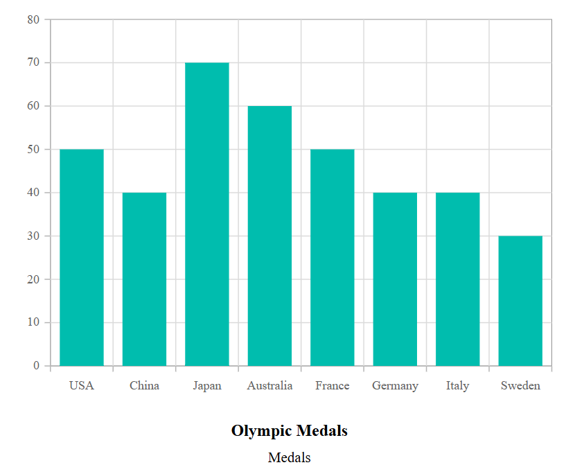
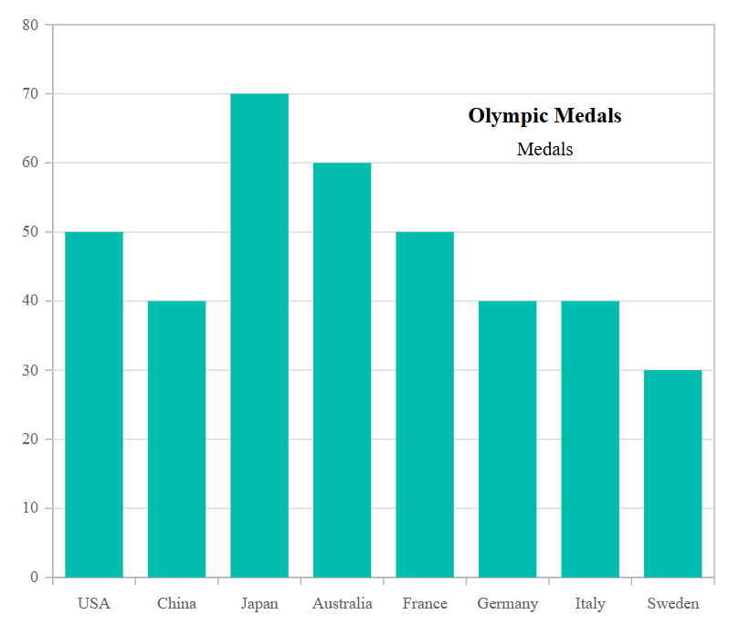

# Appearance in Blazor Charts Component

## Custom color palette

The default color of series or points can be changed by providing a custom color palette to the [Palettes](https://help.syncfusion.com/cr/blazor/Syncfusion.Blazor.Charts.SfChart.html#Syncfusion_Blazor_Charts_SfChart_Palettes) property.

```cshtml

@using Syncfusion.Blazor.Charts

<SfChart Title="Olympic Medals" Palettes="@palettes">
    <ChartPrimaryXAxis ValueType="Syncfusion.Blazor.Charts.ValueType.Category">
    </ChartPrimaryXAxis>

    <ChartSeriesCollection>
        <ChartSeries DataSource="@MedalDetails" XName="Country" YName="Gold" Type="ChartSeriesType.Column">
        </ChartSeries>
        <ChartSeries DataSource="@MedalDetails" XName="Country" YName="Silver" Type="ChartSeriesType.Column">
        </ChartSeries>
        <ChartSeries DataSource="@MedalDetails" XName="Country" YName="Bronze" Type="ChartSeriesType.Column">
        </ChartSeries>
    </ChartSeriesCollection>
</SfChart>

@code{
    public class ChartData
    {
        public string Country { get; set; }
        public double Gold { get; set; }
        public double Silver { get; set; }
        public double Bronze { get; set; }
    }

    public List<ChartData> MedalDetails = new List<ChartData>
	{
         new ChartData{ Country= "USA", Gold=50, Silver=70, Bronze=45 },
         new ChartData{ Country="China", Gold=40, Silver= 60, Bronze=55 },
         new ChartData{ Country= "Japan", Gold=70, Silver= 60, Bronze=50 },
         new ChartData{ Country= "Australia", Gold=60, Silver= 56, Bronze=40 },
         new ChartData{ Country= "France", Gold=50, Silver= 45, Bronze=35 },
         new ChartData{ Country= "Germany", Gold=40, Silver=30, Bronze=22 },
         new ChartData{ Country= "Italy", Gold=40, Silver=35, Bronze=37 },
         new ChartData{ Country= "Sweden", Gold=30, Silver=25, Bronze=27 }
    };

    public String[] palettes = new String[] { "#E94649", "#F6B53F", "#6FAAB0" };
}

```


<!-- markdownlint-disable MD036 -->

## Chart customization

<!-- markdownlint-disable MD036 -->

### Chart background and border

<!-- markdownlint-disable MD013 -->

The chart's background color can be customized using the [Background](https://help.syncfusion.com/cr/blazor/Syncfusion.Blazor.Charts.SfChart.html#Syncfusion_Blazor_Charts_SfChart_Background) property and the border color and width can be customized based on the specified value in [ChartBorder](https://help.syncfusion.com/cr/blazor/Syncfusion.Blazor.Charts.ChartBorder.html).

```cshtml

@using Syncfusion.Blazor.Charts

<SfChart Title="Olympic Medals" Background="skyblue">
    <ChartBorder Color="#FF0000" Width="2"></ChartBorder>

    <ChartPrimaryXAxis ValueType="Syncfusion.Blazor.Charts.ValueType.Category" />

    <ChartSeriesCollection>
        <ChartSeries DataSource="@MedalDetails" XName="Country" YName="Gold" Type="ChartSeriesType.Column">
        </ChartSeries>
    </ChartSeriesCollection>
</SfChart>

@code{
    public class ChartData
    {
        public string Country { get; set; }
        public double Gold { get; set; }
    }

    public List<ChartData> MedalDetails = new List<ChartData>
	{
		new ChartData{ Country= "USA", Gold=50  },
		new ChartData{ Country="China", Gold=40 },
		new ChartData{ Country= "Japan", Gold=70 },
		new ChartData{ Country= "Australia", Gold=60},
		new ChartData{ Country= "France", Gold=50 },
		new ChartData{ Country= "Germany", Gold=40 },
		new ChartData{ Country= "Italy", Gold=40 },
		new ChartData{ Country= "Sweden", Gold=30 }
    };
}

```


### Chart margin

The chart's margin from its container can be customized using the [ChartMargin](https://help.syncfusion.com/cr/blazor/Syncfusion.Blazor.Charts.ChartMargin.html).

```cshtml

@using Syncfusion.Blazor.Charts

<SfChart Title="Olympic Medals" Background="skyblue">
    <ChartBorder Color="#FF0000" Width="2"></ChartBorder>

    <ChartMargin Left="60" Right="60" Top="60" Bottom="60"></ChartMargin>

    <ChartPrimaryXAxis ValueType="Syncfusion.Blazor.Charts.ValueType.Category">
    </ChartPrimaryXAxis>

    <ChartSeriesCollection>
        <ChartSeries DataSource="@MedalDetails" XName="Country" YName="Gold" Type="ChartSeriesType.Column">
        </ChartSeries>
    </ChartSeriesCollection>
</SfChart>

@code{
    public class ChartData
    {
        public string Country { get; set; }
        public double Gold { get; set; }
    }

    public List<ChartData> MedalDetails = new List<ChartData>
	{
		new ChartData{ Country= "USA", Gold=50  },
		new ChartData{ Country="China", Gold=40 },
		new ChartData{ Country= "Japan", Gold=70 },
		new ChartData{ Country= "Australia", Gold=60},
		new ChartData{ Country= "France", Gold=50 },
		new ChartData{ Country= "Germany", Gold=40 },
		new ChartData{ Country= "Italy", Gold=40 },
		new ChartData{ Country= "Sweden", Gold=30 }
    };
}

```


### Chart area customization

Using [Background](https://help.syncfusion.com/cr/blazor/Syncfusion.Blazor.Charts.ChartArea.html#Syncfusion_Blazor_Charts_ChartArea_Background) and [ChartAreaBorder](https://help.syncfusion.com/cr/blazor/Syncfusion.Blazor.Charts.ChartAreaBorder.html) properties, you can change the background color and border of the chart area. Width for the chart area can be customized using [Width](https://help.syncfusion.com/cr/blazor/Syncfusion.Blazor.Charts.ChartArea.html#Syncfusion_Blazor_Charts_ChartArea_Width) property.

Using [Background](https://help.syncfusion.com/cr/blazor/Syncfusion.Blazor.Charts.ChartArea.html#Syncfusion_Blazor_Charts_ChartArea_Background) and [ChartAreaBorder](https://help.syncfusion.com/cr/blazor/Syncfusion.Blazor.Charts.ChartAreaBorder.html) properties, you can change the background color and border of the chart area. Width for the chart area can be customized using [Width](https://help.syncfusion.com/cr/blazor/Syncfusion.Blazor.Charts.ChartArea.html#Syncfusion_Blazor_Charts_ChartArea_Width) property.

```cshtml

@using Syncfusion.Blazor.Charts

<SfChart Title="Olympic Medals" >
    <ChartArea Background="skyblue" Width="80%">
        <ChartAreaBorder Color="#FF0000"  Width="2" />
    </ChartArea>

    <ChartPrimaryXAxis ValueType="Syncfusion.Blazor.Charts.ValueType.Category" />

    <ChartSeriesCollection>
        <ChartSeries DataSource="@MedalDetails" XName="Country" YName="Gold" Type="ChartSeriesType.Column" />
    </ChartSeriesCollection>
</SfChart>

@code{
    public class ChartData
    {
        public string Country { get; set; }
        public double Gold { get; set; }
    }

    public List<ChartData> MedalDetails = new List<ChartData>
	{
		new ChartData{ Country= "USA", Gold=50  },
		new ChartData{ Country="China", Gold=40 },
		new ChartData{ Country= "Japan", Gold=70 },
		new ChartData{ Country= "Australia", Gold=60},
		new ChartData{ Country= "France", Gold=50 },
		new ChartData{ Country= "Germany", Gold=40 },
		new ChartData{ Country= "Italy", Gold=40 },
		new ChartData{ Country= "Sweden", Gold=30 }
    };
}

```


## Animation

The [Animation](https://help.syncfusion.com/cr/blazor/Syncfusion.Blazor.Charts.ChartSeries.html#Syncfusion_Blazor_Charts_ChartSeries_Animation) property allows to customize animation for a certain series. The [Enable](https://help.syncfusion.com/cr/blazor/Syncfusion.Blazor.Charts.StockChartCommonAnimation.html#Syncfusion_Blazor_Charts_StockChartCommonAnimation_Enable) property can be used to enable or disable the series animation. The duration of the animation is specified by [Duration](https://help.syncfusion.com/cr/blazor/Syncfusion.Blazor.Charts.StockChartCommonAnimation.html#Syncfusion_Blazor_Charts_StockChartCommonAnimation_Duration) property, and [Delay](https://help.syncfusion.com/cr/blazor/Syncfusion.Blazor.Charts.StockChartCommonAnimation.html#Syncfusion_Blazor_Charts_StockChartCommonAnimation_Delay) property allows to start the animation at a specific moment.

```cshtml

@using Syncfusion.Blazor.Charts

<SfChart Title="Olympic Medals">
    <ChartPrimaryXAxis ValueType="Syncfusion.Blazor.Charts.ValueType.Category"/>

    <ChartSeriesCollection>
        <ChartSeries DataSource="@MedalDetails" Name="Gold" XName="Country" Width="2" Opacity="1" YName="Gold" Type="ChartSeriesType.Column">
            <ChartSeriesAnimation Enable="true" Duration="2000" Delay="200"></ChartSeriesAnimation>
            <ChartSeriesBorder Width="3" Color="red"></ChartSeriesBorder>
        </ChartSeries>
    </ChartSeriesCollection>
</SfChart>

@code{
    public class ChartData
    {
        public string Country { get; set; }
        public double Gold { get; set; }
        public double Silver { get; set; }
        public double Bronze { get; set; }
    }

    public List<ChartData> MedalDetails = new List<ChartData>
	{
        new ChartData{ Country= "USA", Gold=50, Silver=70, Bronze=45 },
        new ChartData{ Country="China", Gold=40, Silver= 60, Bronze=55 },
        new ChartData{ Country= "Japan", Gold=70, Silver= 60, Bronze=50 },
        new ChartData{ Country= "Australia", Gold=60, Silver= 56, Bronze=40 },
        new ChartData{ Country= "France", Gold=50, Silver= 45, Bronze=35 },
        new ChartData{ Country= "Germany", Gold=40, Silver=30, Bronze=22 },
        new ChartData{ Country= "Italy", Gold=40, Silver=35, Bronze=37 },
        new ChartData{ Country= "Sweden", Gold=30, Silver=25, Bronze=27 }
    };
}

```

## Chart title

The [Title](https://help.syncfusion.com/cr/blazor/Syncfusion.Blazor.Charts.SfChart.html#Syncfusion_Blazor_Charts_SfChart_Title) property can be used to give the chart a title in-order to provide information about the data displayed.

```cshtml

@using Syncfusion.Blazor.Charts

<SfChart Title="Olympic Medals">
    <ChartTitleStyle Size="23px" Color="red" FontFamily="Arial" FontWeight="regular" FontStyle="italic"></ChartTitleStyle>

    <ChartPrimaryXAxis ValueType="Syncfusion.Blazor.Charts.ValueType.Category">
    </ChartPrimaryXAxis>

    <ChartSeriesCollection>
        <ChartSeries DataSource="@MedalDetails" XName="Country" YName="Gold" Type="ChartSeriesType.Column">
        </ChartSeries>
    </ChartSeriesCollection>
</SfChart>

@code{
    public class ChartData
    {
        public string Country { get; set; }
        public double Gold {get; set; }
    }

    public List<ChartData> MedalDetails = new List<ChartData>
	{
		new ChartData{ Country= "USA", Gold=50  },
		new ChartData{ Country="China", Gold=40 },
		new ChartData{ Country= "Japan", Gold=70 },
		new ChartData{ Country= "Australia", Gold=60},
		new ChartData{ Country= "France", Gold=50 },
		new ChartData{ Country= "Germany", Gold=40 },
		new ChartData{ Country= "Italy", Gold=40 },
		new ChartData{ Country= "Sweden", Gold=30 }
    };
}

```


### Title position

The [Position](https://help.syncfusion.com/cr/blazor/Syncfusion.Blazor.Charts.ChartTitleStyle.html#Syncfusion_Blazor_Charts_ChartTitleStyle_Position) property customizes the placement of the chart title. It supports the following options: [Right](https://help.syncfusion.com/cr/blazor/Syncfusion.Blazor.Charts.ChartTitlePosition.html#Syncfusion_Blazor_Charts_ChartTitlePosition_Right), [Left](https://help.syncfusion.com/cr/blazor/Syncfusion.Blazor.Charts.ChartTitlePosition.html#Syncfusion_Blazor_Charts_ChartTitlePosition_Left), [Bottom](https://help.syncfusion.com/cr/blazor/Syncfusion.Blazor.Charts.ChartTitlePosition.html#Syncfusion_Blazor_Charts_ChartTitlePosition_Bottom), [Top](https://help.syncfusion.com/cr/blazor/Syncfusion.Blazor.Charts.ChartTitlePosition.html#Syncfusion_Blazor_Charts_ChartTitlePosition_Top), and [Custom](https://help.syncfusion.com/cr/blazor/Syncfusion.Blazor.Charts.ChartTitlePosition.html#Syncfusion_Blazor_Charts_ChartTitlePosition_Custom), providing flexible title alignment based on layout requirements. By default, the chart title appears at the top of the chart.

N> The subtitle, which appears below the title, will also be positioned along with the title when the `Position` property is set.

```cshtml 

@using Syncfusion.Blazor.Charts

<SfChart Title="Olympic Medals" SubTitle="Medals">
    <ChartTitleStyle Position="ChartTitlePosition.Bottom"></ChartTitleStyle>

    <ChartPrimaryXAxis ValueType="Syncfusion.Blazor.Charts.ValueType.Category">
    </ChartPrimaryXAxis>

    <ChartSeriesCollection>
        <ChartSeries DataSource="@MedalDetails" XName="Country" YName="Gold" Type="Syncfusion.Blazor.Charts.ChartSeriesType.Column">
        </ChartSeries>
    </ChartSeriesCollection>
</SfChart>

@code{
    public class ChartData
    {
        public string Country { get; set; }
        public double Gold { get; set; }
    }

    public List<ChartData> MedalDetails = new List<ChartData>
	{
		new ChartData{ Country= "USA", Gold=50  },
		new ChartData{ Country="China", Gold=40 },
		new ChartData{ Country= "Japan", Gold=70 },
		new ChartData{ Country= "Australia", Gold=60},
		new ChartData{ Country= "France", Gold=50 },
		new ChartData{ Country= "Germany", Gold=40 },
		new ChartData{ Country= "Italy", Gold=40 },
		new ChartData{ Country= "Sweden", Gold=30 }
    };
}

```



When the `Position` is set to `Custom`, the title can be positioned anywhere on the chart using the [X](https://help.syncfusion.com/cr/blazor/Syncfusion.Blazor.Charts.ChartTitleStyle.html#Syncfusion_Blazor_Charts_ChartTitleStyle_X) and [Y](https://help.syncfusion.com/cr/blazor/Syncfusion.Blazor.Charts.ChartTitleStyle.html#Syncfusion_Blazor_Charts_ChartTitleStyle_Y) properties in [ChartTitleStyle](https://help.syncfusion.com/cr/blazor/Syncfusion.Blazor.Charts.ChartTitleStyle.html). This provides precise control over the title’s location, enabling customization to fit specific design or layout needs. The `X` and `Y` values specify the horizontal and vertical coordinates, respectively.

```cshtml 

@using Syncfusion.Blazor.Charts

<SfChart Title="Olympic Medals" SubTitle="Medals">

    <ChartTitleStyle Position="ChartTitlePosition.Custom" X="335" Y="60"></ChartTitleStyle>

    <ChartPrimaryXAxis ValueType="Syncfusion.Blazor.Charts.ValueType.Category">
        <ChartAxisMajorGridLines Width="0"></ChartAxisMajorGridLines>
    </ChartPrimaryXAxis>

    <ChartSeriesCollection>
        <ChartSeries DataSource="@MedalDetails" XName="Country" YName="Gold" Type="Syncfusion.Blazor.Charts.ChartSeriesType.Column">
        </ChartSeries>
    </ChartSeriesCollection>
</SfChart>

@code{
    public class ChartData
    {
        public string Country { get; set; }
        public double Gold { get; set; }
    }

    public List<ChartData> MedalDetails = new List<ChartData>
	{
		new ChartData{ Country= "USA", Gold=50  },
		new ChartData{ Country="China", Gold=40 },
		new ChartData{ Country= "Japan", Gold=70 },
		new ChartData{ Country= "Australia", Gold=60},
		new ChartData{ Country= "France", Gold=50 },
		new ChartData{ Country= "Germany", Gold=40 },
		new ChartData{ Country= "Italy", Gold=40 },
		new ChartData{ Country= "Sweden", Gold=30 }
    };
}

```



## Chart subtitle

The [SubTitle](https://help.syncfusion.com/cr/blazor/Syncfusion.Blazor.Charts.SfChart.html#Syncfusion_Blazor_Charts_SfChart_SubTitle) property can be used to add a subtitle to the chart in-order to provide additional information about the data displayed.

```cshtml

@using Syncfusion.Blazor.Charts

<SfChart Title="Olympic Medals" SubTitle="Medals">
    <ChartSubTitleStyle FontFamily="Arial" FontStyle="italic" FontWeight="regular" Size="18px" Color="red"></ChartSubTitleStyle>

    <ChartTitleStyle FontFamily="Arial" FontStyle="italic" FontWeight="regular" Size="23px" Color="red"></ChartTitleStyle>

    <ChartPrimaryXAxis ValueType="Syncfusion.Blazor.Charts.ValueType.Category">
    </ChartPrimaryXAxis>

    <ChartSeriesCollection>
        <ChartSeries DataSource="@MedalDetails" XName="Country" YName="Gold" Type="ChartSeriesType.Column">
        </ChartSeries>
    </ChartSeriesCollection>
</SfChart>

@code{
    public class ChartData
    {
        public string Country { get; set; }
        public double Gold { get; set; }
    }

    public List<ChartData> MedalDetails = new List<ChartData>
	{
		new ChartData{ Country= "USA", Gold=50  },
		new ChartData{ Country="China", Gold=40 },
		new ChartData{ Country= "Japan", Gold=70 },
		new ChartData{ Country= "Australia", Gold=60},
		new ChartData{ Country= "France", Gold=50 },
		new ChartData{ Country= "Germany", Gold=40 },
		new ChartData{ Country= "Italy", Gold=40 },
		new ChartData{ Country= "Sweden", Gold=30 }
    };
}

```


N> The chart components do not use any CSS style for customization; chart elements like axis labels, datalabel, background, series palette, legend text, and tooltip text can be customized by using the [ChartAxisLabelStyle](https://help.syncfusion.com/cr/blazor/Syncfusion.Blazor.Charts.ChartAxisLabelStyle.html), [ChartDataLabelFont](https://help.syncfusion.com/cr/blazor/Syncfusion.Blazor.Charts.ChartDataLabelFont.html), [BackGround](https://help.syncfusion.com/cr/blazor/Syncfusion.Blazor.Charts.SfChart.html#Syncfusion_Blazor_Charts_SfChart_Background), [Palettes](https://help.syncfusion.com/cr/blazor/Syncfusion.Blazor.Charts.SfChart.html#Syncfusion_Blazor_Charts_SfChart_Palettes), [ChartLegendTextStyle](https://help.syncfusion.com/cr/blazor/Syncfusion.Blazor.Charts.ChartLegendTextStyle.html), and [ChartTooltipTextStyle](https://help.syncfusion.com/cr/blazor/Syncfusion.Blazor.Charts.ChartTooltipTextStyle.html), respectively. 

## See also

* [Data Label](./data-labels)
* [Tooltip](./tool-tip)