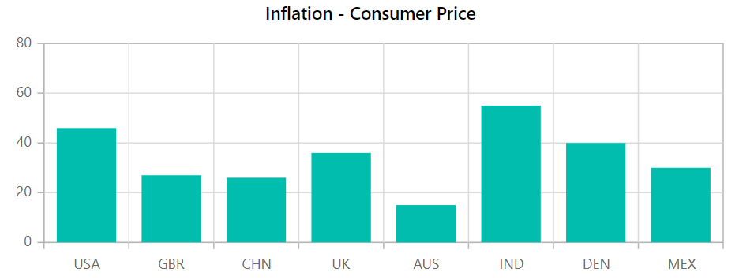

# Chart Dimensions in Blazor Charts Component

> * When no size is specified, the default height and width are 450px and 600px, respectively.
>
> * To avoid delayed rendering, architectural changes were made to the Chart when the width/height were specified [`in percentages`](#In-Percentage) or [`through style settings`](#Size-for-Container) applied in the component's parent. As a result, the Chart is initially rendered with the default width and height and then redrawn by adjusting only the size of the Chart in a responsive manner. By including the following script in the header tag, the redrawn scenario can now be avoided.

```html
<head>
    ...
    ...
   <script src="https://cdnjs.cloudflare.com/ajax/libs/lodash.js/4.17.20/lodash.min.js"></script>
   <!--- To avoid the redraw scenario, add the CDN link below. --->
   <script src="https://cdn.syncfusion.com/blazor/syncfusion-blazor-base.min.js"></script>
</head>
```

## Size for Container

The chart can be scaled to fit the container. As shown below, the size can be changed using inline or CSS.

```csharp

@using Syncfusion.Blazor.Charts

<div style="width:650px; height:350px;">
    <SfChart Title="Inflation - Consumer Price">
        <ChartPrimaryXAxis ValueType="Syncfusion.Blazor.Charts.ValueType.Category"></ChartPrimaryXAxis>

        <ChartSeriesCollection>
            <ChartSeries DataSource="@ConsumerDetails" XName="X" YName="YValue" Type="ChartSeriesType.Column">
            </ChartSeries>
        </ChartSeriesCollection>
    </SfChart>
</div>

@code{
    public class ChartData
    {
        public string X { get; set; }
        public double YValue { get; set; }
    }
    public List<ChartData> ConsumerDetails = new List<ChartData>
{
        new ChartData { X= "USA", YValue= 46 },
        new ChartData { X= "GBR", YValue= 27 },
        new ChartData { X= "CHN", YValue= 26 },
        new ChartData { X= "UK", YValue= 26 },
        new ChartData { X= "AUS", YValue= 26 },
        new ChartData { X= "IND", YValue= 26 },
        new ChartData { X= "DEN", YValue= 26 },
        new ChartData { X= "MEX", YValue= 26 },
     };
}


```

## Size for Chart

The [`Width`](https://help.syncfusion.com/cr/blazor/Syncfusion.Blazor.Charts.SfChart.html#Syncfusion_Blazor_Charts_SfChart_Width) and [`Height`](https://help.syncfusion.com/cr/blazor/Syncfusion.Blazor.Charts.SfChart.html#Syncfusion_Blazor_Charts_SfChart_Height) properties can be used to set the chart's size directly.

### In Pixel

The [`Width`](https://help.syncfusion.com/cr/blazor/Syncfusion.Blazor.Charts.SfChart.html#Syncfusion_Blazor_Charts_SfChart_Width) and [`Height`](https://help.syncfusion.com/cr/blazor/Syncfusion.Blazor.Charts.SfChart.html#Syncfusion_Blazor_Charts_SfChart_Height) properties can be set in pixel as shown below.

```csharp

@using Syncfusion.Blazor.Charts

<SfChart Title="Inflation - Consumer Price" Width="650px" Height="350px">
    <ChartPrimaryXAxis ValueType="Syncfusion.Blazor.Charts.ValueType.Category"></ChartPrimaryXAxis>

    <ChartSeriesCollection>
        <ChartSeries DataSource="@ConsumerDetails" XName="X" YName="YValue" Type="ChartSeriesType.Column">
        </ChartSeries>
    </ChartSeriesCollection>
</SfChart>

@code{
    public class ChartData
    {
        public string X { get; set; }
        public double YValue { get; set; }
    }
    public List<ChartData> ConsumerDetails = new List<ChartData>
{
        new ChartData { X= "USA", YValue= 46 },
        new ChartData { X= "GBR", YValue= 27 },
        new ChartData { X= "CHN", YValue= 26 },
        new ChartData { X= "UK", YValue= 26 },
        new ChartData { X= "AUS", YValue= 26 },
        new ChartData { X= "IND", YValue= 26 },
        new ChartData { X= "DEN", YValue= 26 },
        new ChartData { X= "MEX", YValue= 26 },
     };
}

```



### In Percentage

By setting the values of [`Width`](https://help.syncfusion.com/cr/blazor/Syncfusion.Blazor.Charts.SfChart.html#Syncfusion_Blazor_Charts_SfChart_Width) and [`Height`](https://help.syncfusion.com/cr/blazor/Syncfusion.Blazor.Charts.SfChart.html#Syncfusion_Blazor_Charts_SfChart_Height) properties in percentage, the chart has its dimension with respect to its container. For example, when the [`Height`](https://help.syncfusion.com/cr/blazor/Syncfusion.Blazor.Charts.SfChart.html#Syncfusion_Blazor_Charts_SfChart_Height) is set to **50%**, the chart is half the height of the container.

```csharp

@using Syncfusion.Blazor.Charts

<SfChart Title="Inflation - Consumer Price" Width="80%" height="90%">
    <ChartPrimaryXAxis ValueType="Syncfusion.Blazor.Charts.ValueType.Category"></ChartPrimaryXAxis>

    <ChartSeriesCollection>
        <ChartSeries DataSource="@ConsumerDetails" XName="X" YName="YValue" Type="ChartSeriesType.Column">
        </ChartSeries>
    </ChartSeriesCollection>

</SfChart>

@code{
    public class ChartData
    {
        public string X { get; set; }
        public double YValue { get; set; }
    }
    public List<ChartData> ConsumerDetails = new List<ChartData>
{
        new ChartData { X= "USA", YValue= 46 },
        new ChartData { X= "GBR", YValue= 27 },
        new ChartData { X= "CHN", YValue= 26 },
        new ChartData { X= "UK", YValue= 26 },
        new ChartData { X= "AUS", YValue= 26 },
        new ChartData { X= "IND", YValue= 26 },
        new ChartData { X= "DEN", YValue= 26 },
        new ChartData { X= "MEX", YValue= 26 },
     };
}

```

> Refer to our [`Blazor Charts`](https://www.syncfusion.com/blazor-components/blazor-charts) feature tour page for its groundbreaking feature representations and also explore our [`Blazor Chart example`](https://blazor.syncfusion.com/demos/chart/line?theme=bootstrap4) to know various chart types and how to represent time-dependent data, showing trends at equal intervals.

## See Also

* [Data Label](./data-labels)
* [Tooltip](./tool-tip)
* [Marker](./data-markers)kers)