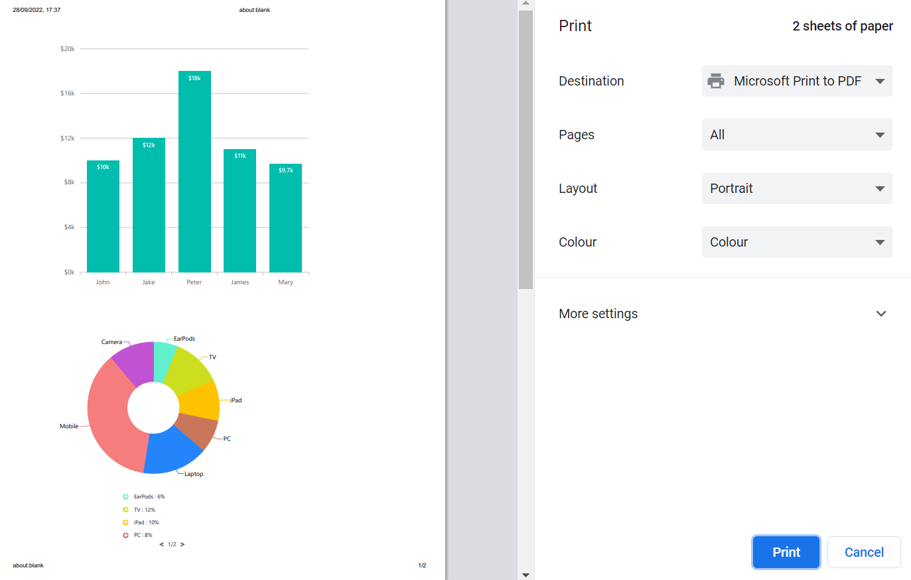

# Print and Export in Blazor Charts Component

## Print

Use the `PrintAsync` method to print a rendered chart directly from the browser.

```cshtml

@using Syncfusion.Blazor.Charts
@using Syncfusion.Blazor.Buttons

<SfChart @ref="ChartObj" Title="Inflation - Consumer Price">
    <ChartPrimaryXAxis ValueType="Syncfusion.Blazor.Charts.ValueType.Category" />

    <ChartSeriesCollection>
        <ChartSeries DataSource="@ConsumerDetails" XName="X" YName="YValue" Type="ChartSeriesType.Column">
        </ChartSeries>
    </ChartSeriesCollection>
</SfChart>

<SfButton Id="button" Content="Print" @onclick="Print"  IsPrimary="true" CssClass="e-flat"></SfButton>

@code {
    SfChart ChartObj;

    private async Task Print(MouseEventArgs args)
    {
        await ChartObj.PrintAsync();
    }

    public class ChartData
    {
        public string X { get; set; }
        public double YValue { get; set; }
    }

    public List<ChartData> ConsumerDetails = new List<ChartData>
	{
        new ChartData { X = "USA", YValue = 46 },
        new ChartData { X = "GBR", YValue = 27 },
        new ChartData { X = "CHN", YValue = 26 },
        new ChartData { X = "UK", YValue = 36 },
        new ChartData { X = "AUS", YValue = 15 },
        new ChartData { X = "IND", YValue = 55 },
        new ChartData { X = "DEN", YValue = 40 },
        new ChartData { X = "MEX", YValue = 30 }
    };
}

```


### Print - Multiple Charts

Print all charts on a page by passing the element reference of the parent container to the [PrintAsync](https://help.syncfusion.com/cr/blazor/Syncfusion.Blazor.Charts.SfChart.html#Syncfusion_Blazor_Charts_SfChart_PrintAsync_Microsoft_AspNetCore_Components_ElementReference_) method.

```cshtml

@using Syncfusion.Blazor
@using Syncfusion.Blazor.Charts
@using Syncfusion.Blazor.Buttons

<div class="row">
<div class="col-lg-9 property-section">
    <div class="property-panel-section">
        <div class="property-panel-content">
            <table style="width: 100%">
                <tbody>
                    <tr style="height: 50px; text-align: left">
                        <td>
                           <b>Print the chart - <SfButton ID="button" IsPrimary="true" IsToggle="true" OnClick="PrintChart">Print</SfButton> </b>
                        </td>
                    </tr>
                </tbody>
            </table>
        </div>
    </div>
</div>
</div>

<div class="justify-content-center">
  <div id = "print_support" class="container" style="justify-content:center" @ref="Element">
    <div class="row">
         <div align="center" class="col-sm-1"  style="height:500px; width:600px" > 
           <div class="p-5"> 
              <SfChart @ref="chartInstance">
                        <ChartArea>
                            <ChartAreaBorder Width="0" />
                        </ChartArea>
                        <ChartPrimaryXAxis ValueType="Syncfusion.Blazor.Charts.ValueType.Category" Interval="1">
                            <ChartAxisMajorGridLines Width="0"></ChartAxisMajorGridLines>
                        </ChartPrimaryXAxis>
                        <ChartPrimaryYAxis Minimum="0" Maximum="20" Interval="4" LabelFormat="${value}k">
                            <ChartAxisMajorGridLines Width="2"></ChartAxisMajorGridLines>
                            <ChartAxisMajorTickLines Width="0"></ChartAxisMajorTickLines>
                            <ChartAxisLineStyle Width="0"></ChartAxisLineStyle>
                        </ChartPrimaryYAxis>
                        <ChartLegendSettings Visible="false"></ChartLegendSettings>
                        <ChartSeriesCollection>
                            <ChartSeries DataSource="@ChartPoints" XName="Manager" YName="SalesInfo" Type="ChartSeriesType.Column">
                                <ChartMarker>
                                    <ChartDataLabel Visible="true" Name="DataLabelMappingName" Position="Syncfusion.Blazor.Charts.LabelPosition.Top">
                                        <ChartDataLabelFont FontWeight="600" Color="#ffffff"></ChartDataLabelFont>
                                    </ChartDataLabel>
                                </ChartMarker>
                            </ChartSeries>
                        </ChartSeriesCollection>
                  </SfChart>
            </div>
         </div>
         <div align="center" class="col-sm-2"  style="height:500px; width:500px">
             <div class="p-5">
                <SfAccumulationChart EnableAnimation="true">
                    <AccumulationChartBorder Color="transparent"></AccumulationChartBorder>
                    <AccumulationChartTooltipSettings Enable="true" Format="${point.x}"></AccumulationChartTooltipSettings>
                    <AccumulationChartSeriesCollection>
                        <AccumulationChartSeries DataSource="@PieChartDataCollection" XName="Product" YName="Percentage" Radius="80%" InnerRadius="40%" Palettes="@palettes">
                            <AccumulationDataLabelSettings Visible="true" Name="TextMapping" Position="AccumulationLabelPosition.Outside">
                                <AccumulationChartConnector Length="8px"></AccumulationChartConnector>
                            </AccumulationDataLabelSettings>
                        </AccumulationChartSeries>
                    </AccumulationChartSeriesCollection>
                    <AccumulationChartLegendSettings Width="130px" ShapePadding="10" Padding="10">
                        <AccumulationChartLegendFont Size="10px"></AccumulationChartLegendFont>
                    </AccumulationChartLegendSettings>
                </SfAccumulationChart>          
             </div>
         </div>
    </div>
    <div align="center" class="col-sm-2"  style="height:450px; width:500px">
    <div class="p-5">
        <SfChart>
            <ChartPrimaryXAxis ValueType="Syncfusion.Blazor.Charts.ValueType.DateTimeCategory" LabelFormat="yyyy" IntervalType="IntervalType.Years" EdgeLabelPlacement="EdgeLabelPlacement.Shift">
            </ChartPrimaryXAxis>
            <ChartPrimaryYAxis LabelFormat="{value}%" Minimum="0" Maximum="4" Interval="1">
            </ChartPrimaryYAxis>
            <ChartTooltipSettings Enable="true"></ChartTooltipSettings>
            <ChartLegendSettings Visible="false"></ChartLegendSettings>
            <ChartSeriesCollection>
                <ChartSeries DataSource="@AreaChartPoints" Name="US" XName="Period" Width="2"
                                Opacity="0.5" YName="US_InflationRate" Type="ChartSeriesType.SplineArea">
                    <ChartSeriesBorder Width="2"></ChartSeriesBorder>
                    <ChartMarker IsFilled="true" Visible="true" Width="6" Height="6" Shape="ChartShape.Circle"></ChartMarker>
                </ChartSeries>
                <ChartSeries DataSource="@AreaChartPoints" Name="France" XName="Period" Width="2"
                                Opacity="0.5" YName="FR_InflationRate" Type="ChartSeriesType.SplineArea">
                    <ChartSeriesBorder Width="2"></ChartSeriesBorder>
                    <ChartMarker IsFilled="true" Visible="true" Height="7" Width="7" Shape="ChartShape.Diamond"></ChartMarker>
                </ChartSeries>
            </ChartSeriesCollection>
        </SfChart>
    </div>
    </div>
  </div>
</div>

@code {
    private SfChart chartInstance;
    private ElementReference Element;

    private string[] palettes = new string[] { "#61EFCD", "#CDDE1F", "#FEC200", "#CA765A", "#2485FA", "#F57D7D", "#C152D2",
    "#8854D9", "#3D4EB8", "#00BCD7","#4472c4", "#ed7d31", "#ffc000", "#70ad47", "#5b9bd5", "#c1c1c1", "#6f6fe2", "#e269ae", "#9e480e", "#997300" };

    public async Task PrintChart(MouseEventArgs args)
    {
        await chartInstance.PrintAsync(Element);
    }

    public class ExportData
    {
        public string Manager { get; set; }
        public double SalesInfo { get; set; }
        public string DataLabelMappingName{ get; set; }
    }

    public List<ExportData> ChartPoints { get; set; } = new List<ExportData>
    {
        new ExportData { Manager = "John", SalesInfo = 10, DataLabelMappingName = "$10k"},
        new ExportData { Manager = "Jake", SalesInfo = 12, DataLabelMappingName = "$12k"},
        new ExportData { Manager = "Peter", SalesInfo = 18, DataLabelMappingName = "$18k"},
        new ExportData { Manager = "James", SalesInfo = 11, DataLabelMappingName = "$11k"},
        new ExportData { Manager = "Mary", SalesInfo = 9.7, DataLabelMappingName = "$9.7k"}
    };

    public class ChartData
    {
        public string Product { get; set; }
        public double Percentage { get; set; }
        public string TextMapping { get; set; }
    }

    public List<ChartData> PieChartDataCollection { get; set; } = new List<ChartData>
    {
        new ChartData { Product = "EarPods : 6%", Percentage = 6, TextMapping = "EarPods"},
        new ChartData { Product = "TV : 12%", Percentage = 12, TextMapping = "TV"},
        new ChartData { Product = "iPad : 10%", Percentage = 10, TextMapping = "iPad"},
        new ChartData { Product = "PC : 8%", Percentage = 8, TextMapping = "PC"},
        new ChartData { Product = "Laptop : 16%",  Percentage = 16, TextMapping = "Laptop"},
        new ChartData { Product = "Mobile : 36%", Percentage = 36, TextMapping = "Mobile"},
        new ChartData { Product = "Camera : 11%", Percentage = 11, TextMapping = "Camera"}
    };

    public class SplineAreaChartData
    {
        public DateTime Period { get; set; }
        public double US_InflationRate { get; set; }
        public double FR_InflationRate { get; set; }
        public double GER_InflationRate { get; set; }
    }

    public List<SplineAreaChartData> AreaChartPoints { get; set; } = new List<SplineAreaChartData>
    {
        new SplineAreaChartData { Period = new DateTime(2002, 01, 01), US_InflationRate = 2.2, FR_InflationRate = 2, GER_InflationRate = 0.8  },
        new SplineAreaChartData { Period = new DateTime(2003, 01, 01), US_InflationRate = 3.4, FR_InflationRate = 1.7, GER_InflationRate = 1.3 },
        new SplineAreaChartData { Period = new DateTime(2004, 01, 01), US_InflationRate = 2.8, FR_InflationRate = 1.8, GER_InflationRate = 1.1 },
        new SplineAreaChartData { Period = new DateTime(2005, 01, 01), US_InflationRate = 1.6, FR_InflationRate = 2.1, GER_InflationRate = 1.6 },
        new SplineAreaChartData { Period = new DateTime(2006, 01, 01), US_InflationRate = 2.3, FR_InflationRate = 2.3, GER_InflationRate = 2 },
    };
   
}

```




## Export

Export charts using the `ExportAsync` method to [JPEG](https://help.syncfusion.com/cr/blazor/Syncfusion.Blazor.Charts.ExportType.html#Syncfusion_Blazor_Charts_ExportType_JPEG), [PNG](https://help.syncfusion.com/cr/blazor/Syncfusion.Blazor.Charts.ExportType.html#Syncfusion_Blazor_Charts_ExportType_PNG), [SVG](https://help.syncfusion.com/cr/blazor/Syncfusion.Blazor.Charts.ExportType.html#Syncfusion_Blazor_Charts_ExportType_SVG), [PDF](https://help.syncfusion.com/cr/blazor/Syncfusion.Blazor.Charts.ExportType.html#Syncfusion_Blazor_Charts_ExportType_PDF), [XLSX](https://help.syncfusion.com/cr/blazor/Syncfusion.Blazor.Charts.ExportType.html#Syncfusion_Blazor_Charts_ExportType_XLSX), or [CSV](https://help.syncfusion.com/cr/blazor/Syncfusion.Blazor.Charts.ExportType.html#Syncfusion_Blazor_Charts_ExportType_CSV) formats. Specify the file format with [ExportType](https://help.syncfusion.com/cr/blazor/Syncfusion.Blazor.Charts.ExportType.html) and the file name with `FileName`.

Optional parameters:
* `Orientation`: Portrait or landscape for PDF
* `AllowDownload`: Enable browser download prompt
* `IsBase64`: Get the exported chart as a base64 string

```cshtml

@using Syncfusion.Blazor.Charts
@using Syncfusion.Blazor.Buttons

<SfChart @ref="ChartObj" Title="Inflation - Consumer Price">
    <ChartPrimaryXAxis ValueType="Syncfusion.Blazor.Charts.ValueType.Category" />

    <ChartSeriesCollection>
        <ChartSeries DataSource="@ConsumerDetails" XName="X" YName="YValue" Type="ChartSeriesType.Column">
        </ChartSeries>
    </ChartSeriesCollection>
</SfChart>

<SfButton Id="button" Content="Export" @onclick="Export"  IsPrimary="true" CssClass="e-flat"></SfButton>

@code {
    SfChart ChartObj;

    private async Task Export(MouseEventArgs args)
    {
        await ChartObj.ExportAsync(ExportType.PNG, "pngImage");
    }

    public class ChartData
    {
        public string X { get; set; }
        public double YValue { get; set; }
    }

    public List<ChartData> ConsumerDetails = new List<ChartData>
    {
        new ChartData { X = "USA", YValue = 46 },
        new ChartData { X = "GBR", YValue = 27 },
        new ChartData { X = "CHN", YValue = 26 },
        new ChartData { X = "UK", YValue = 36 },
        new ChartData { X = "AUS", YValue = 15 },
        new ChartData { X = "IND", YValue = 55 },
        new ChartData { X = "DEN", YValue = 40 },
        new ChartData { X = "MEX", YValue = 30 }
    };
}

```

### Export chart as base64 string

Set `IsBase64` to **true** in [ExportAsync](https://help.syncfusion.com/cr/blazor/Syncfusion.Blazor.Charts.SfChart.html#Syncfusion_Blazor_Charts_SfChart_ExportAsync_Syncfusion_Blazor_Charts_ExportType_System_String_System_Nullable_Syncfusion_PdfExport_PdfPageOrientation__System_Boolean_) to convert the chart to a base64 string, accessible in the [OnExportComplete](https://help.syncfusion.com/cr/blazor/Syncfusion.Blazor.Charts.ChartEvents.html#Syncfusion_Blazor_Charts_ChartEvents_OnExportComplete) event argument.

```cshtml
 
@using Syncfusion.Blazor.Charts;
@using Microsoft.AspNetCore.Components.Web;
@using Syncfusion.PdfExport;

<div id="button">
    <button onclick="@ExportChart">
        Export
    </button>
</div>

<div id="chart">
    <SfChart @ref="@chartInstance">
        <ChartArea>
            <ChartAreaBorder Width="0" />
        </ChartArea>
        <ChartPrimaryXAxis ValueType="Syncfusion.Blazor.Charts.ValueType.Category" Interval="1" LabelIntersectAction="@Label" LabelRotation="-45">
            <ChartAxisMajorGridLines Width="0"></ChartAxisMajorGridLines>
            <ChartAxisMajorTickLines Width="0"></ChartAxisMajorTickLines>
        </ChartPrimaryXAxis>
        <ChartPrimaryYAxis Minimum="0" Maximum="40" Interval="10" Title="Measurements (in Gigawatt)" LabelFormat="@Format">
            <ChartAxisMajorGridLines Width="0"></ChartAxisMajorGridLines>
            <ChartAxisLineStyle Width="0"></ChartAxisLineStyle>
            <ChartAxisMajorGridLines Width="2"></ChartAxisMajorGridLines>
            <ChartAxisMajorTickLines Width="0"></ChartAxisMajorTickLines>
        </ChartPrimaryYAxis>
        <ChartSeriesCollection>
            <ChartSeries DataSource="@ChartPoints" XName="Country" YName="GigaWatts" Type="ChartSeriesType.Column">
                <ChartMarker>
                    <ChartDataLabel Visible="true" Position="Syncfusion.Blazor.Charts.LabelPosition.Top">
                        <ChartDataLabelFont FontWeight="600" Size="9px" Color="#ffffff"></ChartDataLabelFont>
                    </ChartDataLabel>
                </ChartMarker>
            </ChartSeries>
        </ChartSeriesCollection>
        <ChartEvents OnExportComplete="ExportComplete"></ChartEvents>
    </SfChart>
</div>

@code {
    private SfChart chartInstance;
    public string FileName { get; set; } = "Charts";
    public string Format { get; set; } = "{value} GW";
    public LabelIntersectAction Label { get; set; } = LabelIntersectAction.Trim;

    public List<ExportData> ChartPoints { get; set; } = new List<ExportData>
    {
        new ExportData { Country = "India", GigaWatts = 35.5 },
        new ExportData { Country = "China", GigaWatts = 18.3 },
        new ExportData { Country = "Italy", GigaWatts = 17.6 },
        new ExportData { Country = "Japan", GigaWatts = 13.6 },
        new ExportData { Country = "United state", GigaWatts = 12 },
        new ExportData { Country = "Spain", GigaWatts = 5.6 },
        new ExportData { Country = "France", GigaWatts = 4.6 },
        new ExportData { Country = "Australia", GigaWatts = 3.3 },
        new ExportData { Country = "Belgium", GigaWatts = 3 },
        new ExportData { Country = "United Kingdom", GigaWatts = 2.9 }
    };

    public async Task ExportChart(MouseEventArgs args)
    {
        await chartInstance.ExportAsync(ExportType.PDF, FileName, PdfPageOrientation.Landscape, false, true);
    }

    public class ExportData
    {
        public string Country { get; set; }
        public double GigaWatts { get; set; }
    }

    public void ExportComplete(ExportEventArgs exportEventArgs)
    {
        string base64 = exportEventArgs.Base64;
    }
}

```

## Customizing the exported chart using Exporting event

Customize the exported chart before generation using the [Exporting](https://help.syncfusion.com/cr/blazor/Syncfusion.Blazor.Charts.ChartEvents.html#Syncfusion_Blazor_Charts_ChartEvents_Exporting) event. The [ChartExportEventArgs](https://help.syncfusion.com/cr/blazor/Syncfusion.Blazor.Charts.ChartExportEventArgs.html) class provides options:

* `Cancel`: Cancel the export process
* `Height`: Set exported chart height (not applicable for XLSX/CSV)
* `Width`: Set exported chart width (not applicabel for XLSX/CSV)
* `Workbook`: Customize Excel/CSV export

### Customizing the exported Excel documents

Use the [Workbook](https://help.syncfusion.com/cr/blazor/Syncfusion.Blazor.Charts.ChartExportEventArgs.html#Syncfusion_Blazor_Charts_ChartExportEventArgs_Workbook) property in the event argument of [Exporting](https://help.syncfusion.com/cr/blazor/Syncfusion.Blazor.Charts.ChartEvents.html#Syncfusion_Blazor_Charts_ChartEvents_Exporting) event to modify Excel sheet properties before file generation. For non-Excel formats, set chart width as needed.

```cshtml

@using Syncfusion.Blazor.Charts;
@using Microsoft.AspNetCore.Components.Web;
@using Syncfusion.PdfExport;
@using Syncfusion.ExcelExport;

<div id="button">
    <button onclick="@ExportChart">
        Export
    </button>
</div>
<div id="chart">
    <SfChart @ref="@chartInstance" Title="Top 10 Countries Using Solar Power" Theme=" Syncfusion.Blazor.Theme.Tailwind3">
        <ChartArea><ChartAreaBorder Width="0"></ChartAreaBorder></ChartArea>
        <ChartPrimaryXAxis Title="XaxisTitle" ValueType="Syncfusion.Blazor.Charts.ValueType.Category" Interval="1" LabelIntersectAction="@Label" LabelRotation="-45">
            <ChartAxisMajorGridLines Width="0"></ChartAxisMajorGridLines>
            <ChartAxisMajorTickLines Width="0"></ChartAxisMajorTickLines>
        </ChartPrimaryXAxis>
        <ChartPrimaryYAxis Minimum="0" Maximum="40" Interval="10" Title="Measurements (in Gigawatt)" LabelFormat="@Format">
            <ChartAxisMajorGridLines Width="0"></ChartAxisMajorGridLines>
            <ChartAxisLineStyle Width="0"></ChartAxisLineStyle>
            <ChartAxisMajorGridLines Width="2"></ChartAxisMajorGridLines>
            <ChartAxisMajorTickLines Width="0"></ChartAxisMajorTickLines>
        </ChartPrimaryYAxis>
        <ChartSeriesCollection>
            <ChartSeries DataSource="@ChartPoints" XName="Country" YName="GigaWatts" Type="ChartSeriesType.Column">
                <ChartMarker>
                    <ChartDataLabel Visible="true" Position="Syncfusion.Blazor.Charts.LabelPosition.Top">
                        <ChartDataLabelFont FontWeight="600" Size="9px" Color="#ffffff"></ChartDataLabelFont>
                    </ChartDataLabel>
                </ChartMarker>
            </ChartSeries>
        </ChartSeriesCollection>
        <ChartEvents Exporting="BeforeExport"></ChartEvents>
    </SfChart>
</div>

@code {
    private SfChart chartInstance;
    public string FileName { get; set; } = "Charts";
    public string Format { get; set; } = "{value} GW";
    public Syncfusion.Blazor.Charts.LabelIntersectAction Label { get; set; } = Syncfusion.Blazor.Charts.LabelIntersectAction.Trim;

    public List<ExportData> ChartPoints { get; set; } = new List<ExportData>
    {
        new ExportData { Country="India", GigaWatts = 35.5 },
        new ExportData { Country="China", GigaWatts = 18.3 },
        new ExportData { Country="Italy", GigaWatts = 17.6 },
        new ExportData { Country="Japan", GigaWatts = 13.6 },
        new ExportData { Country="United state", GigaWatts = 12 },
        new ExportData { Country="Spain", GigaWatts = 5.6 },
        new ExportData { Country="France", GigaWatts = 4.6 },
        new ExportData { Country="Australia", GigaWatts = 3.3 },
        new ExportData { Country="Belgium", GigaWatts = 3 },
        new ExportData { Country="United Kingdom", GigaWatts = 2.9 },
    };

    public async Task ExportChart(Microsoft.AspNetCore.Components.Web.MouseEventArgs args)
    {
        await chartInstance.ExportAsync(Syncfusion.Blazor.Charts.ExportType.XLSX, FileName);
    }

    public void BeforeExport(ChartExportEventArgs args)
    {
        if (args.Workbook != null)
        {
            Worksheet firstSheet = args.Workbook.Worksheets.First();
            firstSheet.Columns[0].Width = 500;
            firstSheet.Columns[1].Width = 500;
            firstSheet.Rows[1].Cells[0].Value = "Country";
            firstSheet.Rows[1].Cells[1].Value = "GigaWatts";
            firstSheet.Rows[0].Cells[0].CellStyle.BackColor = "#FFA07A";
            for (int i = 0; i < 2; i++)
            {
                firstSheet.Rows[1].Cells[i].CellStyle.Bold = true;
                firstSheet.Rows[1].Cells[i].CellStyle.BackColor = "#FFFF00";
            }
            for (int i = 2; i < firstSheet.Rows.Count; i++)
            {
                for (int j = 0; j < 2; j++)
                {
                    firstSheet.Rows[i].Height = 50;
                    firstSheet.Rows[i].Cells[1].CellStyle.HAlign = HAlignType.Center;
                    firstSheet.Rows[i].Cells[1].CellStyle.VAlign = VAlignType.Center;
                }
            }
        } else {
            args.Width = 500;
        }
    }

    public class ExportData
    {
        public string Country { get; set; }
        public double GigaWatts { get; set; }
    }
}

```


N> Refer to our [Blazor Charts](https://www.syncfusion.com/blazor-components/blazor-charts) feature tour page for its groundbreaking feature representations and also explore our [Blazor Chart Example](https://blazor.syncfusion.com/demos/chart/line?theme=bootstrap5) to know various chart types and how to represent time-dependent data, showing trends at equal intervals.

## See Also

* [Data label](./data-labels)
* [Tooltip](./tool-tip)
* [Legend](./legend)
