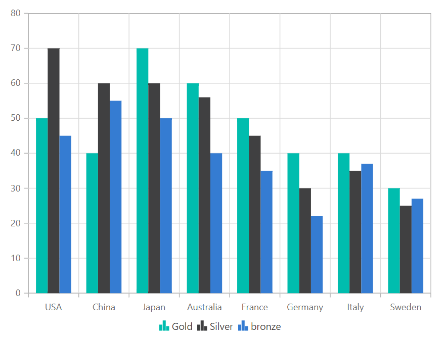
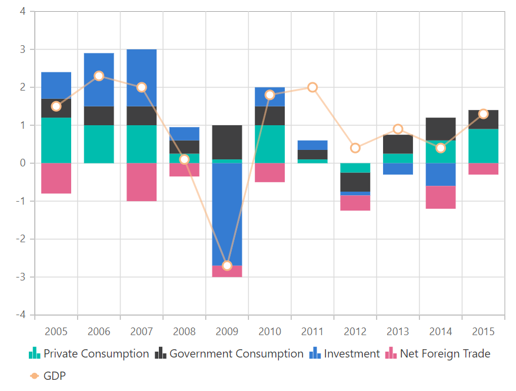

# Mixed Chart in Blazor Charts Component

## Multiple Chart Series

The [ChartSeries](https://help.syncfusion.com/cr/blazor/Syncfusion.Blazor.Charts.ChartSeries.html) property enables you to add multiple series to a chart. Series are rendered in the order they appear in the series array.

```cshtml

@using Syncfusion.Blazor.Charts

<SfChart>
    <ChartPrimaryXAxis ValueType="Syncfusion.Blazor.Charts.ValueType.Category" />

    <ChartSeriesCollection>
        <ChartSeries DataSource="@MedalDetails" Name="Gold" XName="Country" Width="2" Opacity="1" YName="Gold" Type="ChartSeriesType.Column">
        </ChartSeries>
        <ChartSeries DataSource="@MedalDetails" Name="Silver" XName="Country" Width="2" Opacity="1" YName="Silver" Type="ChartSeriesType.Column">
        </ChartSeries>
        <ChartSeries DataSource="@MedalDetails" Name="bronze" XName="Country" Width="2" Opacity="1" YName="Bronze" Type="ChartSeriesType.Column">
        </ChartSeries>
    </ChartSeriesCollection>
</SfChart>

@code {
    public class ChartData
    {
        public string Country { get; set; }
        public double Gold { get; set; }
        public double Silver { get; set; }
        public double Bronze { get; set; }
    }
	
    public List<ChartData> MedalDetails = new List<ChartData>
	{
        new ChartData { Country = "USA", Gold = 50, Silver = 70, Bronze = 45 },
        new ChartData { Country = "China", Gold = 40, Silver = 60, Bronze = 55 },
        new ChartData { Country = "Japan", Gold = 70, Silver = 60, Bronze = 50 },
        new ChartData { Country = "Australia", Gold = 60, Silver = 56, Bronze = 40 },
        new ChartData { Country = "France", Gold = 50, Silver = 45, Bronze = 35 },
        new ChartData { Country = "Germany", Gold = 40, Silver = 30, Bronze = 22 },
        new ChartData { Country = "Italy", Gold = 40, Silver = 35, Bronze = 37 },
        new ChartData { Country = "Sweden", Gold = 30, Silver = 25, Bronze = 27 }
    };
}

```



## Series Combination

You can create a chart by combining different chart types, such as line and column. Note: Bar series cannot be combined with other series due to axis orientation differences.

N> Bar series cannot be combined with any other series as the axis orientation is different from other series.

```cshtml

@using Syncfusion.Blazor.Charts

<SfChart>
    <ChartPrimaryXAxis ValueType="Syncfusion.Blazor.Charts.ValueType.Category" />

    <ChartSeriesCollection>
        <ChartSeries DataSource="@SalesReports" Name="Private Consumption" XName="X" YName="Y" Type="ChartSeriesType.StackingColumn">
        </ChartSeries>
        <ChartSeries DataSource="@SalesReports" Name="Government Consumption" XName="X" YName="Y1" Type="ChartSeriesType.StackingColumn">
        </ChartSeries>
        <ChartSeries DataSource="@SalesReports" Name="Investment" XName="X" YName="Y2" Type="ChartSeriesType.StackingColumn">
        </ChartSeries>
        <ChartSeries DataSource="@SalesReports" Name="Net Foreign Trade" XName="X" YName="Y3" Type="ChartSeriesType.StackingColumn">
        </ChartSeries>
        <ChartSeries DataSource="@SalesReports" Name="GDP" XName="X" YName="Y4" Width="2" Opacity="0.6" Type="ChartSeriesType.Line">
            <ChartMarker Visible="true" Height="10" Width="10"></ChartMarker>
        </ChartSeries>
    </ChartSeriesCollection>
</SfChart>

@code {
    public class ChartData
    {
        public string X { get; set; }
        public double Y { get; set; }
        public double Y1 { get; set; }
        public double Y2 { get; set; }
        public double Y3 { get; set; }
        public double Y4 { get; set; }
    }
	
    public List<ChartData> SalesReports = new List<ChartData>
	{
        new ChartData { X = "2005", Y = 1.2, Y1 = 0.5, Y2 = 0.7, Y3 = -0.8, Y4 = 1.5 },
        new ChartData { X = "2006", Y = 1, Y1 = 0.5, Y2 = 1.4, Y = 0, Y4 = 2.3 },
        new ChartData { X = "2007", Y = 1, Y1 = 0.5, Y2 = 1.5, Y3 = -1, Y4 = 2 },
        new ChartData { X = "2008", Y = 0.25, Y1 = 0.35, Y2 = 0.35, Y3 = -.35, Y4 = 0.1 },
        new ChartData { X = "2009", Y = 0.1, Y1 = 0.9, Y2 = -2.7, Y3 = -0.3, Y4 = -2.7 },
        new ChartData { X = "2010", Y = 1, Y1 = 0.5, Y2 = 0.5, Y3 = -0.5, Y4 = 1.8 },
        new ChartData { X = "2011", Y = 0.1, Y1 = 0.25, Y2 = 0.25, Y3 = 0, Y4 = 2 },
        new ChartData { X = "2012", Y = -0.25, Y1 = -0.5, Y2 = -0.1, Y3 = -0.4, Y4 = 0.4 },
        new ChartData { X = "2013", Y = 0.25, Y1 = 0.5, Y2 = -0.3, Y3 = 0, Y4 = 0.9 },
        new ChartData { X = "2014", Y = 0.6, Y1 = 0.6, Y2 = -0.6, Y3 = -0.6, Y4 = 0.4 },
        new ChartData { X = "2015", Y = 0.9, Y1 = 0.5, Y2 = 0, Y3 = -0.3, Y4 = 1.3 }
    };
}

```



N> Refer to our [Blazor Charts](https://www.syncfusion.com/blazor-components/blazor-charts) feature tour page for its groundbreaking feature representations and also explore our [Blazor Chart Example](https://blazor.syncfusion.com/demos/chart/line?theme=bootstrap5) to know various chart types and how to represent time-dependent data, showing trends at equal intervals.

## See also

* [Data Label](./data-labels)
* [Tooltip](./tool-tip)
* [Legend](./legend)