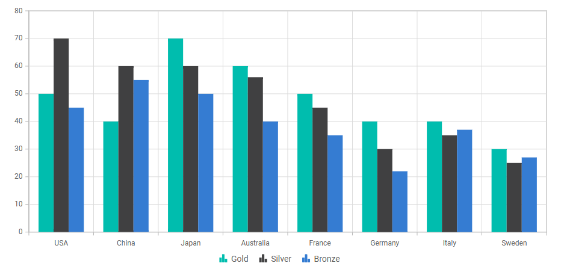
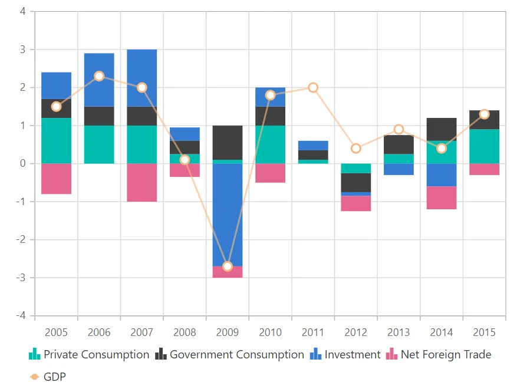

# Blazor Charts Mixed Series

## Multiple chart series

The [ChartSeries](https://help.syncfusion.com/cr/blazor/Syncfusion.Blazor.Charts.ChartSeries.html) collection allows you to add multiple series to the chart. The series are rendered in the order they are declared in `ChartSeriesCollection`.

```cshtml

@using Syncfusion.Blazor.Charts

<SfChart>
    <ChartPrimaryXAxis ValueType="Syncfusion.Blazor.Charts.ValueType.Category"></ChartPrimaryXAxis>

    <ChartSeriesCollection>
        <ChartSeries DataSource="@MedalDetails" Name="Gold" XName="Country" Width="2" Opacity="1" YName="Gold" Type="ChartSeriesType.Column">
        </ChartSeries>
        <ChartSeries DataSource="@MedalDetails" Name="Silver" XName="Country" Width="2" Opacity="1" YName="Silver" Type="ChartSeriesType.Column">
        </ChartSeries>
        <ChartSeries DataSource="@MedalDetails" Name="Bronze" XName="Country" Width="2" Opacity="1" YName="Bronze" Type="ChartSeriesType.Column">
        </ChartSeries>
    </ChartSeriesCollection>
</SfChart>

@code {
    public class ChartData
    {
        public string Country { get; set; }
        public double Gold { get; set; }
        public double Silver { get; set; }
        public double Bronze { get; set; }
    }
	
    public List<ChartData> MedalDetails = new List<ChartData>
	{
        new ChartData{ Country= "USA", Gold=50, Silver=70, Bronze=45 },
        new ChartData{ Country="China", Gold=40, Silver= 60, Bronze=55 },
        new ChartData{ Country= "Japan", Gold=70, Silver= 60, Bronze=50 },
        new ChartData{ Country= "Australia", Gold=60, Silver= 56, Bronze=40 },
        new ChartData{ Country= "France", Gold=50, Silver= 45, Bronze=35 },
        new ChartData{ Country= "Germany", Gold=40, Silver=30, Bronze=22 },
        new ChartData{ Country= "Italy", Gold=40, Silver=35, Bronze=37 },
        new ChartData{ Country= "Sweden", Gold=30, Silver=25, Bronze=27 }
    };
}

```



## Combination chart series

A combination chart mixes two or more series types in a single chart. For example, stack columns to show component contributions and overlay a line to compare against a derived total.

N> Bar series cannot be combined with any other series because of the horizontal axis orientation. Use a column series instead when you need to combine.

```cshtml

@using Syncfusion.Blazor.Charts

<SfChart>
    <ChartPrimaryXAxis ValueType="Syncfusion.Blazor.Charts.ValueType.Category"></ChartPrimaryXAxis>

    <ChartSeriesCollection>
        <ChartSeries DataSource="@SalesReports" Name="Private Consumption" XName="X" YName="Y" Type="ChartSeriesType.StackingColumn">
        </ChartSeries>
        <ChartSeries DataSource="@SalesReports" Name="Government Consumption" XName="X" YName="Y1" Type="ChartSeriesType.StackingColumn">
        </ChartSeries>
        <ChartSeries DataSource="@SalesReports" Name="Investment" XName="X" YName="Y2" Type="ChartSeriesType.StackingColumn">
        </ChartSeries>
        <ChartSeries DataSource="@SalesReports" Name="Net Foreign Trade" XName="X" YName="Y3" Type="ChartSeriesType.StackingColumn">
        </ChartSeries>
        <ChartSeries DataSource="@SalesReports" Name="GDP" XName="X" YName="Y4" Width="2" Opacity="0.6" Type="ChartSeriesType.Line">
            <ChartMarker Visible="true" Height="10" Width="10"></ChartMarker>
        </ChartSeries>
    </ChartSeriesCollection>
</SfChart>

@code {
    public class SalesData
    {
        public string X { get; set; }
        public double Y { get; set; }
        public double Y1 { get; set; }
        public double Y2 { get; set; }
        public double Y3 { get; set; }
        public double Y4 { get; set; }
    }
	
    public List<SalesData> SalesReports = new List<SalesData>
	{
        new SalesData { X= "2005", Y= 1.2, Y1= 0.5, Y2= 0.7, Y3= -0.8, Y4= 1.5 },
        new SalesData { X= "2006", Y= 1, Y1= 0.5, Y2= 1.4, Y3= 0, Y4= 2.3 },
        new SalesData { X= "2007", Y= 1, Y1= 0.5, Y2= 1.5, Y3= -1, Y4= 2 },
        new SalesData { X= "2008", Y= 0.25, Y1= 0.35, Y2= 0.35, Y3= -0.35, Y4= 0.1 },
        new SalesData { X= "2009", Y= 0.1, Y1= 0.9, Y2= -2.7, Y3= -0.3, Y4= -2.7 },
        new SalesData { X= "2010", Y= 1, Y1= 0.5, Y2= 0.5, Y3= -0.5, Y4= 1.8 },
        new SalesData { X= "2011", Y= 0.1, Y1= 0.25, Y2= 0.25, Y3= 0, Y4= 2 },
        new SalesData { X= "2012", Y= -0.25, Y1= -0.5, Y2= -0.1, Y3= -0.4, Y4= 0.4 },
        new SalesData { X= "2013", Y= 0.25, Y1= 0.5, Y2= -0.3, Y3= 0, Y4= 0.9 },
        new SalesData { X= "2014", Y= 0.6, Y1= 0.6, Y2= -0.6, Y3= -0.6, Y4= 0.4 },
        new SalesData { X= "2015", Y= 0.9, Y1= 0.5, Y2= 0, Y3= -0.3, Y4= 1.3 }
    };
}

```



N> For marker customization on the overlay line, see [Data Markers](./data-markers). To plot the overlay series on a separate scale, see [Multiple Panes](./multiple-panes).

## See also

* [Data Label](./data-labels)
* [Tooltip](./tool-tip)
* [Legend](./legend)
* [Data Markers](./data-markers)
* [Multiple Panes](./multiple-panes)