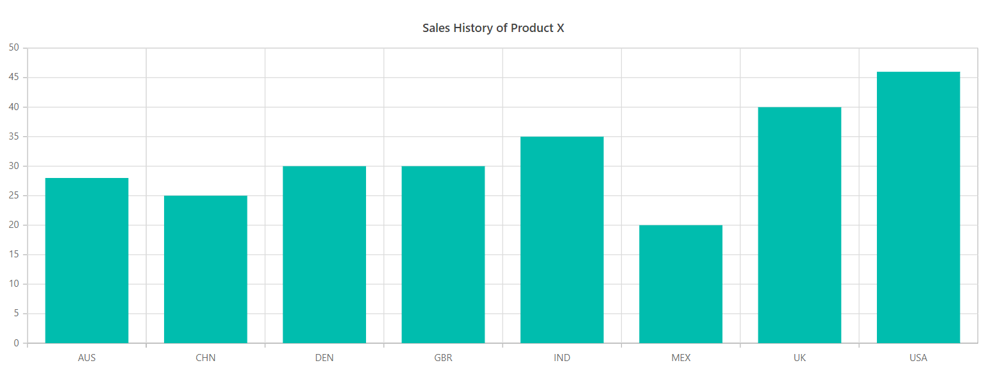
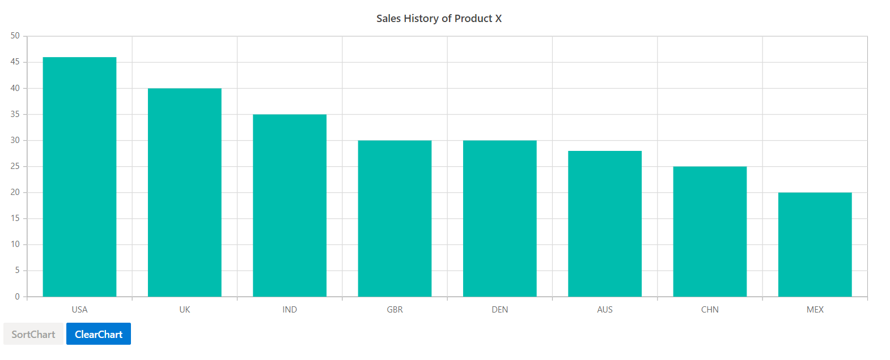

# Sorting in Blazor Charts Component

Sorting enables you to sort data in the **Ascending** or **Descending** order. To sort the chart based on the X-axis value, set 'X' to the 'PropertyName' property.

## Enable sorting

The chart can be Sorted in Three different ways.

* Sort By X axis - Data points are sorted based on X axis.
* Sort By Y axis - Data points are Sorted based on Y axis.
* Sort By Custom - Data points are sorted based on the user-specified custom value.


```cshtml

@using Syncfusion.Blazor.Charts
@using Syncfusion.Blazor.Data

<SfChart Title="Sales History of Product X">
    <ChartSorting PropertyName="X" Direction="ListSortDirection.Ascending"></ChartSorting>
    <ChartPrimaryXAxis ValueType="Syncfusion.Blazor.Charts.ValueType.Category"></ChartPrimaryXAxis>

    <ChartSeriesCollection>
        <ChartSeries DataSource="@SalesReports" XName="X" YName="YValue" Type="ChartSeriesType.Column"></ChartSeries>
    </ChartSeriesCollection>
</SfChart>

@code{
    public class ChartData
    {
        public string X { get; set; }
        public double YValue { get; set; }
        public double Profit { get; set; }
    }

    public List<ChartData> SalesReports = new List<ChartData>
    {
        new ChartData { X= "USA", YValue= 46, Profit = 25},
        new ChartData { X= "GBR", YValue= 30, Profit = 30},
        new ChartData { X= "CHN", YValue= 25, Profit = 20},
        new ChartData { X= "UK", YValue= 40, Profit = 15},
        new ChartData { X= "AUS", YValue= 28, Profit = 10},
        new ChartData { X= "IND", YValue= 35, Profit = 20},
        new ChartData { X= "DEN", YValue= 30, Profit = 10},
        new ChartData { X= "MEX", YValue= 20, Profit = 5},
    };
}

```



### Sort Order

By default, the sorting order will be as Ascending -> Descending. The sort direction can be changed from Ascending to Descending by setting the 'Descending' to the 'Direction' property in the 'chartSorting'.


### Sorting By Custom Value

Data sorting can also be sorted based on any field  in the data source assigned by passing the field name to the 'PropertyName' property in the 'ChartSorting'.

```cshtml

@using Syncfusion.Blazor.Charts
@using Syncfusion.Blazor.Data

<SfChart Title="Sales History of Product X">
    <ChartSorting PropertyName="Profit" Direction="ListSortDirection.Ascending"></ChartSorting>
    <ChartPrimaryXAxis ValueType="Syncfusion.Blazor.Charts.ValueType.Category"></ChartPrimaryXAxis>

    <ChartSeriesCollection>
        <ChartSeries DataSource="@SalesReports" XName="X" YName="YValue" Type="ChartSeriesType.Column"></ChartSeries>
    </ChartSeriesCollection>
</SfChart>

@code{
    public class ChartData
    {
        public string X { get; set; }
        public double YValue { get; set; }
        public double Profit { get; set; }
    }

    public List<ChartData> SalesReports = new List<ChartData>
    {
        new ChartData { X= "USA", YValue= 46, Profit = 25},
        new ChartData { X= "GBR", YValue= 30, Profit = 30},
        new ChartData { X= "CHN", YValue= 25, Profit = 20},
        new ChartData { X= "UK", YValue= 40, Profit = 15},
        new ChartData { X= "AUS", YValue= 28, Profit = 10},
        new ChartData { X= "IND", YValue= 35, Profit = 20},
        new ChartData { X= "DEN", YValue= 30, Profit = 10},
        new ChartData { X= "MEX", YValue= 20, Profit = 5},
    };
}

```


## Sorting By using Function

Sorting can also be done by using inbuilt method **Sort()**. We can pass sort axis and sort order in sort method to perform sorting dynamically.
We can also use **ClearSort()** method to disable sorting.

```cshtml

@using Syncfusion.Blazor.Buttons
@using Syncfusion.Blazor.Data

<SfChart @ref="@Chart"  Title="Sales History of Product X">
    <SfButton OnClick="SortChart" IsToggle="true" IsPrimary="true" Disabled="@SDisable">SortChart</SfButton>
    <SfButton OnClick="ClearSort" IsToggle="true" IsPrimary="true" Disabled="@CDisable">ClearChart</SfButton>
    <ChartPrimaryXAxis ValueType="Syncfusion.Blazor.Charts.ValueType.Category"></ChartPrimaryXAxis>

    <ChartSeriesCollection>
        <ChartSeries DataSource="@SalesReports" XName="X" YName="YValue" Type="ChartSeriesType.Column"></ChartSeries>
    </ChartSeriesCollection>
</SfChart>

@code{

    public SfChart Chart;
    public bool SDisable = false;
    public bool CDisable = false;

    public class ChartData
    {
        public string X { get; set; }
        public double YValue { get; set; }
        public double Profit { get; set; }
    }

    public List<ChartData> SalesReports = new List<ChartData>
    {
        new ChartData { X= "USA", YValue= 46, Profit = 25},
        new ChartData { X= "GBR", YValue= 30, Profit = 30},
        new ChartData { X= "CHN", YValue= 25, Profit = 20},
        new ChartData { X= "UK", YValue= 40, Profit = 15},
        new ChartData { X= "AUS", YValue= 28, Profit = 10},
        new ChartData { X= "IND", YValue= 35, Profit = 20},
        new ChartData { X= "DEN", YValue= 30, Profit = 10},
        new ChartData { X= "MEX", YValue= 20, Profit = 5},
    };

    public void SortChart()
    {
        Chart.Sort("Y", ListSortDirection.Descending);
        SDisable = true;
        CDisable = false;
    }

    public void ClearSort()
    {
        Chart.ClearSort(); 
        CDisable = true;
        SDisable = false;
    }
}

```

    

## See Also

* [Data label](./data-labels)
* [Legend](./legend)
* [Marker](./data-markers)