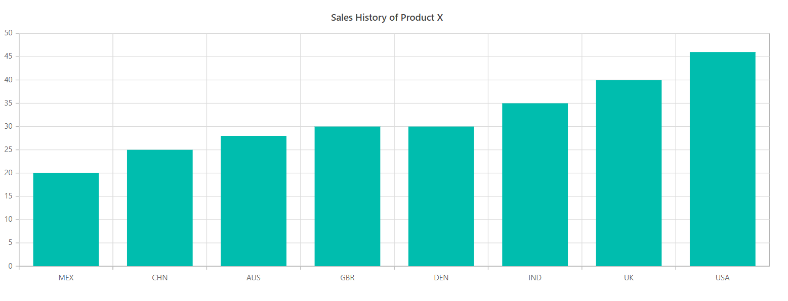
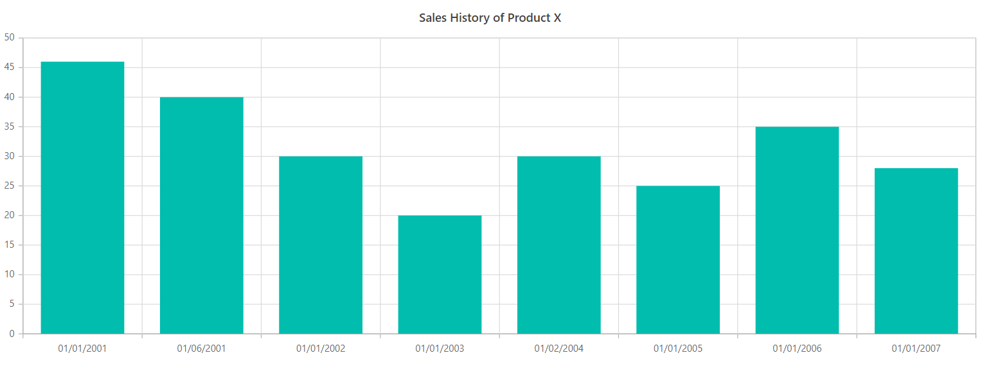
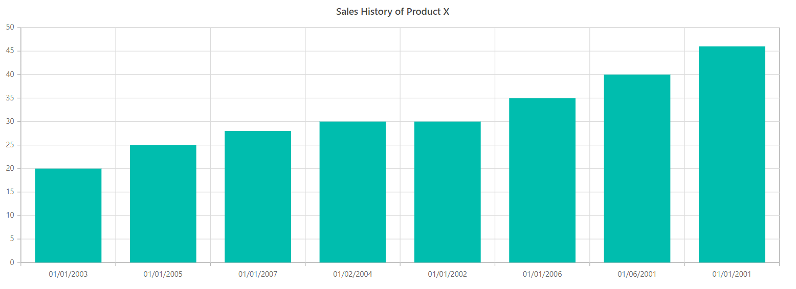
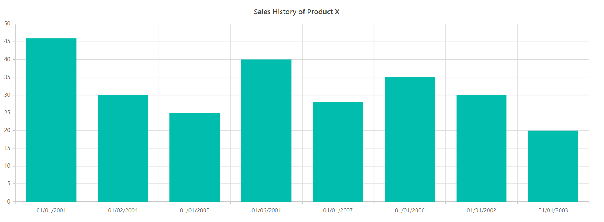

# Sorting in Blazor Charts Component

## Enable sorting

The chart can be Sorted in Three different ways.

* Sort By X axis - Data points are sorted based on X axis (For Category and DateTime Category Axes only).
* Sort By Y axis - Data points are Sorted based on Y axis.
* Sort By Custom - Data points are sorted based on the user-specified custom value.

(sort Axis can be specified by using the API <b>PropertyName</b> and direction can be made ascending or descending by using API <b>Direction</b>) 

### Sorting By X axis (Category Axis)

```cshtml

@using Syncfusion.Blazor.Charts
@using Syncfusion.Blazor.Data

<SfChart Title="Sales History of Product X">
    <ChartSorting PropertyName="X" Direction="ListSortDirection.Ascending"></ChartSorting>
    <ChartPrimaryXAxis ValueType="Syncfusion.Blazor.Charts.ValueType.Category"></ChartPrimaryXAxis>

    <ChartSeriesCollection>
        <ChartSeries DataSource="@SalesReports" XName="X" YName="YValue" Type="ChartSeriesType.Column"></ChartSeries>
    </ChartSeriesCollection>
</SfChart>

@code{
    public class ChartData
    {
        public string X { get; set; }
        public double YValue { get; set; }
        public double Profit { get; set; }
    }

    public List<ChartData> SalesReports = new List<ChartData>
    {
        new ChartData { X= "USA", YValue= 46, Profit = 25},
        new ChartData { X= "GBR", YValue= 30, Profit = 30},
        new ChartData { X= "CHN", YValue= 25, Profit = 20},
        new ChartData { X= "UK", YValue= 40, Profit = 15},
        new ChartData { X= "AUS", YValue= 28, Profit = 10},
        new ChartData { X= "IND", YValue= 35, Profit = 20},
        new ChartData { X= "DEN", YValue= 30, Profit = 10},
        new ChartData { X= "MEX", YValue= 20, Profit = 5},
    };
}

```
 


### Sorting By Y axis (Category Axis)

```cshtml

@using Syncfusion.Blazor.Charts
@using Syncfusion.Blazor.Data

<SfChart Title="Sales History of Product X">
    <ChartSorting PropertyName="Y" Direction="ListSortDirection.Ascending"></ChartSorting>
    <ChartPrimaryXAxis ValueType="Syncfusion.Blazor.Charts.ValueType.Category"></ChartPrimaryXAxis>

    <ChartSeriesCollection>
        <ChartSeries DataSource="@SalesReports" XName="X" YName="YValue" Type="ChartSeriesType.Column"></ChartSeries>
    </ChartSeriesCollection>
</SfChart>

@code{
    public class ChartData
    {
        public string X { get; set; }
        public double YValue { get; set; }
        public double Profit { get; set; }
    }

    public List<ChartData> SalesReports = new List<ChartData>
    {
        new ChartData { X= "USA", YValue= 46, Profit = 25},
        new ChartData { X= "GBR", YValue= 30, Profit = 30},
        new ChartData { X= "CHN", YValue= 25, Profit = 20},
        new ChartData { X= "UK", YValue= 40, Profit = 15},
        new ChartData { X= "AUS", YValue= 28, Profit = 10},
        new ChartData { X= "IND", YValue= 35, Profit = 20},
        new ChartData { X= "DEN", YValue= 30, Profit = 10},
        new ChartData { X= "MEX", YValue= 20, Profit = 5},
    };
}

```



### Sorting By Custom axis (Category Axis)

```cshtml

@using Syncfusion.Blazor.Charts
@using Syncfusion.Blazor.Data

<SfChart Title="Sales History of Product X">
    <ChartSorting PropertyName="Profit" Direction="ListSortDirection.Ascending"></ChartSorting>
    <ChartPrimaryXAxis ValueType="Syncfusion.Blazor.Charts.ValueType.Category"></ChartPrimaryXAxis>

    <ChartSeriesCollection>
        <ChartSeries DataSource="@SalesReports" XName="X" YName="YValue" Type="ChartSeriesType.Column"></ChartSeries>
    </ChartSeriesCollection>
</SfChart>

@code{
    public class ChartData
    {
        public string X { get; set; }
        public double YValue { get; set; }
        public double Profit { get; set; }
    }

    public List<ChartData> SalesReports = new List<ChartData>
    {
        new ChartData { X= "USA", YValue= 46, Profit = 25},
        new ChartData { X= "GBR", YValue= 30, Profit = 30},
        new ChartData { X= "CHN", YValue= 25, Profit = 20},
        new ChartData { X= "UK", YValue= 40, Profit = 15},
        new ChartData { X= "AUS", YValue= 28, Profit = 10},
        new ChartData { X= "IND", YValue= 35, Profit = 20},
        new ChartData { X= "DEN", YValue= 30, Profit = 10},
        new ChartData { X= "MEX", YValue= 20, Profit = 5},
    };
}

```


### Sorting By X axis (DateTimeCategory Axis)

```cshtml

@using Syncfusion.Blazor.Charts
@using Syncfusion.Blazor.Data

<SfChart Title="Sales History of Product X">
    <ChartSorting PropertyName="X" Direction="ListSortDirection.Ascending"></ChartSorting>
    <ChartPrimaryXAxis ValueType="Syncfusion.Blazor.Charts.ValueType.DateTimeCategory" Format="dd/MM/yyyy"></ChartPrimaryXAxis>

    <ChartSeriesCollection>
        <ChartSeries DataSource="@SalesReports" XName="X" YName="YValue" Type="ChartSeriesType.Column"></ChartSeries>
    </ChartSeriesCollection>
</SfChart>

@code{
    public class ChartData
    {
        public DateTime X { get; set; }
        public double YValue { get; set; }
        public double Profit { get; set; }
    }

    public List<ChartData> SalesReports = new List<ChartData>
    {
        new ChartData { X= new DateTime(2001,01,01), YValue= 46, Profit = 25},
        new ChartData { X= new DateTime(2004,02,01), YValue= 30, Profit = 30},
        new ChartData { X= new DateTime(2005,01,01), YValue= 25, Profit = 20},
        new ChartData { X= new DateTime(2001,06,01), YValue= 40, Profit = 15},
        new ChartData { X= new DateTime(2007,01,01), YValue= 28, Profit = 10},
        new ChartData { X= new DateTime(2006,01,01), YValue= 35, Profit = 20},
        new ChartData { X= new DateTime(2002,01,01), YValue= 30, Profit = 10},
        new ChartData { X= new DateTime(2003,01,01), YValue= 20, Profit = 5},
    };
}

```



### Sorting By Y axis (DateTimeCategory Axis)

```cshtml

@using Syncfusion.Blazor.Charts
@using Syncfusion.Blazor.Data

<SfChart Title="Sales History of Product X">
    <ChartSorting PropertyName="Y" Direction="ListSortDirection.Ascending"></ChartSorting>
    <ChartPrimaryXAxis ValueType="Syncfusion.Blazor.Charts.ValueType.DateTimeCategory" Format="dd/MM/yyyy"></ChartPrimaryXAxis>

    <ChartSeriesCollection>
        <ChartSeries DataSource="@SalesReports" XName="X" YName="YValue" Type="ChartSeriesType.Column"></ChartSeries>
    </ChartSeriesCollection>
</SfChart>

@code{
    public class ChartData
    {
        public DateTime X { get; set; }
        public double YValue { get; set; }
        public double Profit { get; set; }
    }

    public List<ChartData> SalesReports = new List<ChartData>
    {
        new ChartData { X= new DateTime(2001,01,01), YValue= 46, Profit = 25},
        new ChartData { X= new DateTime(2004,02,01), YValue= 30, Profit = 30},
        new ChartData { X= new DateTime(2005,01,01), YValue= 25, Profit = 20},
        new ChartData { X= new DateTime(2001,06,01), YValue= 40, Profit = 15},
        new ChartData { X= new DateTime(2007,01,01), YValue= 28, Profit = 10},
        new ChartData { X= new DateTime(2006,01,01), YValue= 35, Profit = 20},
        new ChartData { X= new DateTime(2002,01,01), YValue= 30, Profit = 10},
        new ChartData { X= new DateTime(2003,01,01), YValue= 20, Profit = 5},
    };
}

```



### Sorting By Custom  (DateTimeCategory Axis)

```cshtml

@using Syncfusion.Blazor.Charts
@using Syncfusion.Blazor.Data

<SfChart Title="Sales History of Product X">
    <ChartSorting PropertyName="Profit" Direction="ListSortDirection.Ascending"></ChartSorting>
    <ChartPrimaryXAxis ValueType="Syncfusion.Blazor.Charts.ValueType.DateTimeCategory" Format="dd/MM/yyyy"></ChartPrimaryXAxis>

    <ChartSeriesCollection>
        <ChartSeries DataSource="@SalesReports" XName="X" YName="YValue" Type="ChartSeriesType.Column"></ChartSeries>
    </ChartSeriesCollection>
</SfChart>

@code{
    public class ChartData
    {
        public DateTime X { get; set; }
        public double YValue { get; set; }
        public double Profit { get; set; }
    }

    public List<ChartData> SalesReports = new List<ChartData>
    {
        new ChartData { X= new DateTime(2001,01,01), YValue= 46, Profit = 25},
        new ChartData { X= new DateTime(2004,02,01), YValue= 30, Profit = 30},
        new ChartData { X= new DateTime(2005,01,01), YValue= 25, Profit = 20},
        new ChartData { X= new DateTime(2001,06,01), YValue= 40, Profit = 15},
        new ChartData { X= new DateTime(2007,01,01), YValue= 28, Profit = 10},
        new ChartData { X= new DateTime(2006,01,01), YValue= 35, Profit = 20},
        new ChartData { X= new DateTime(2002,01,01), YValue= 30, Profit = 10},
        new ChartData { X= new DateTime(2003,01,01), YValue= 20, Profit = 5},
    };
}

```



## See Also

* [Data label](./data-labels)
* [Legend](./legend)
* [Marker](./data-markers)