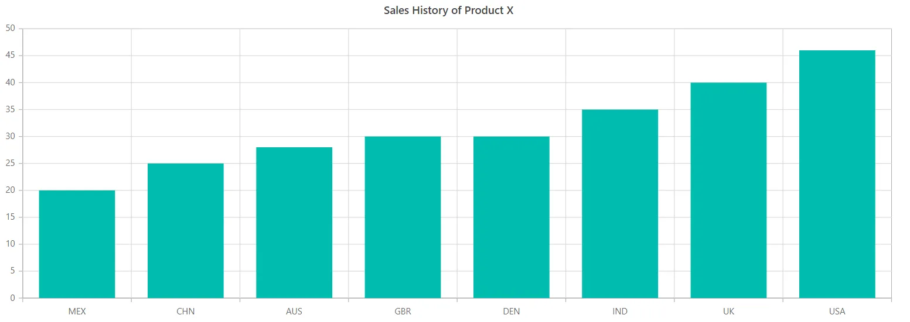
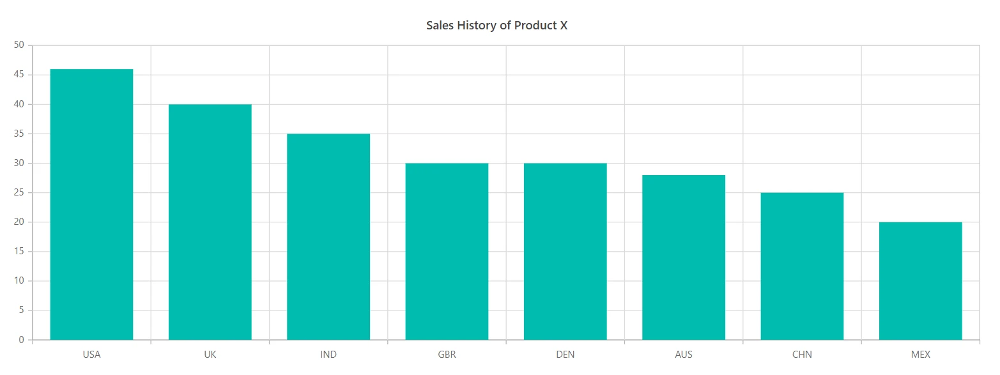
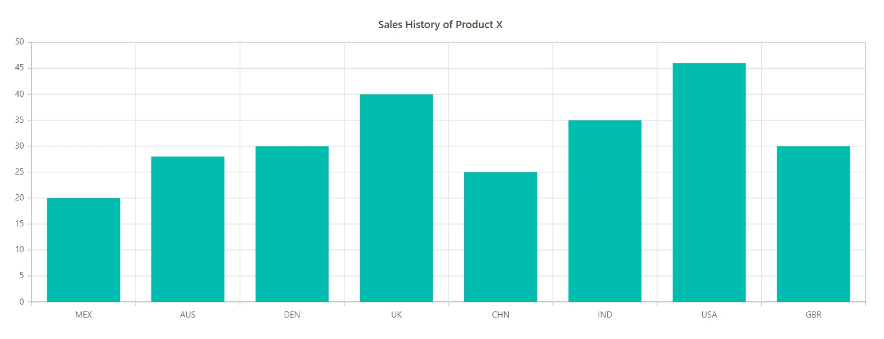

# Blazor Charts Sorting

Sorting arranges the chart data in ascending or descending order based on a chosen field. The [`ChartSorting`](https://help.syncfusion.com/cr/blazor/Syncfusion.Blazor.Charts.ChartSorting.html) component's [PropertyName](https://help.syncfusion.com/cr/blazor/Syncfusion.Blazor.Charts.ChartSorting.html#Syncfusion_Blazor_Charts_ChartSorting_PropertyName) accepts the name of any data-source field (for example, the y-value field such as **YValue**).

```cshtml

@using Syncfusion.Blazor.Charts
@using Syncfusion.Blazor.Data

<SfChart Title="Sales History of Product X">
    <ChartSorting PropertyName="YValue" Direction="ListSortDirection.Ascending"></ChartSorting>
    <ChartPrimaryXAxis ValueType="Syncfusion.Blazor.Charts.ValueType.Category"></ChartPrimaryXAxis>

    <ChartSeriesCollection>
        <ChartSeries DataSource="@SalesReports" XName="X" YName="YValue" Type="ChartSeriesType.Column"></ChartSeries>
    </ChartSeriesCollection>
</SfChart>

@code {
    public class ChartData
    {
        public string X { get; set; }
        public double YValue { get; set; }
        public double Profit { get; set; }
    }

    public List<ChartData> SalesReports = new List<ChartData>
    {
        new ChartData { X= "USA", YValue= 46, Profit = 25},
        new ChartData { X= "GBR", YValue= 30, Profit = 30},
        new ChartData { X= "CHN", YValue= 25, Profit = 20},
        new ChartData { X= "UK", YValue= 40, Profit = 15},
        new ChartData { X= "AUS", YValue= 28, Profit = 10},
        new ChartData { X= "IND", YValue= 35, Profit = 20},
        new ChartData { X= "DEN", YValue= 30, Profit = 10},
        new ChartData { X= "MEX", YValue= 20, Profit = 5},
    };
}

```



## Sort direction

By default, sorting is applied in **Ascending** order. Set the [Direction](https://help.syncfusion.com/cr/blazor/Syncfusion.Blazor.Charts.ChartSorting.html#Syncfusion_Blazor_Charts_ChartSorting_Direction) property to **Descending** on [`ChartSorting`](https://help.syncfusion.com/cr/blazor/Syncfusion.Blazor.Charts.ChartSorting.html) to reverse the order.

```cshtml

@using Syncfusion.Blazor.Charts
@using Syncfusion.Blazor.Data

<SfChart Title="Sales History of Product X">
    <ChartSorting PropertyName="YValue" Direction="ListSortDirection.Descending"></ChartSorting>
    <ChartPrimaryXAxis ValueType="Syncfusion.Blazor.Charts.ValueType.Category"></ChartPrimaryXAxis>

    <ChartSeriesCollection>
        <ChartSeries DataSource="@SalesReports" XName="X" YName="YValue" Type="ChartSeriesType.Column"></ChartSeries>
    </ChartSeriesCollection>
</SfChart>

@code {
    public class ChartData
    {
        public string X { get; set; }
        public double YValue { get; set; }
        public double Profit { get; set; }
    }

    public List<ChartData> SalesReports = new List<ChartData>
    {
        new ChartData { X= "USA", YValue= 46, Profit = 25},
        new ChartData { X= "GBR", YValue= 30, Profit = 30},
        new ChartData { X= "CHN", YValue= 25, Profit = 20},
        new ChartData { X= "UK", YValue= 40, Profit = 15},
        new ChartData { X= "AUS", YValue= 28, Profit = 10},
        new ChartData { X= "IND", YValue= 35, Profit = 20},
        new ChartData { X= "DEN", YValue= 30, Profit = 10},
        new ChartData { X= "MEX", YValue= 20, Profit = 5},
    };
}

```



## Sorting by custom value

Data can also be sorted based on any field in the data source by passing the field name to the [PropertyName](https://help.syncfusion.com/cr/blazor/Syncfusion.Blazor.Charts.ChartSorting.html#Syncfusion_Blazor_Charts_ChartSorting_PropertyName) property in the [ChartSorting](https://help.syncfusion.com/cr/blazor/Syncfusion.Blazor.Charts.ChartSorting.html).

```cshtml

@using Syncfusion.Blazor.Charts
@using Syncfusion.Blazor.Data

<SfChart Title="Sales History of Product X">
    <ChartSorting PropertyName="Profit" Direction="ListSortDirection.Ascending"></ChartSorting>
    <ChartPrimaryXAxis ValueType="Syncfusion.Blazor.Charts.ValueType.Category"></ChartPrimaryXAxis>

    <ChartSeriesCollection>
        <ChartSeries DataSource="@SalesReports" XName="X" YName="YValue" Type="ChartSeriesType.Column"></ChartSeries>
    </ChartSeriesCollection>
</SfChart>

@code {
    public class ChartData
    {
        public string X { get; set; }
        public double YValue { get; set; }
        public double Profit { get; set; }
    }

    public List<ChartData> SalesReports = new List<ChartData>
    {
        new ChartData { X= "USA", YValue= 46, Profit = 25},
        new ChartData { X= "GBR", YValue= 30, Profit = 30},
        new ChartData { X= "CHN", YValue= 25, Profit = 20},
        new ChartData { X= "UK", YValue= 40, Profit = 15},
        new ChartData { X= "AUS", YValue= 28, Profit = 10},
        new ChartData { X= "IND", YValue= 35, Profit = 20},
        new ChartData { X= "DEN", YValue= 30, Profit = 10},
        new ChartData { X= "MEX", YValue= 20, Profit = 5},
    };
}

```



## See also

* [Working with data](./working-with-data)
* [Live chart](./live-chart)
* [Dynamic points](./dynamic-points)
