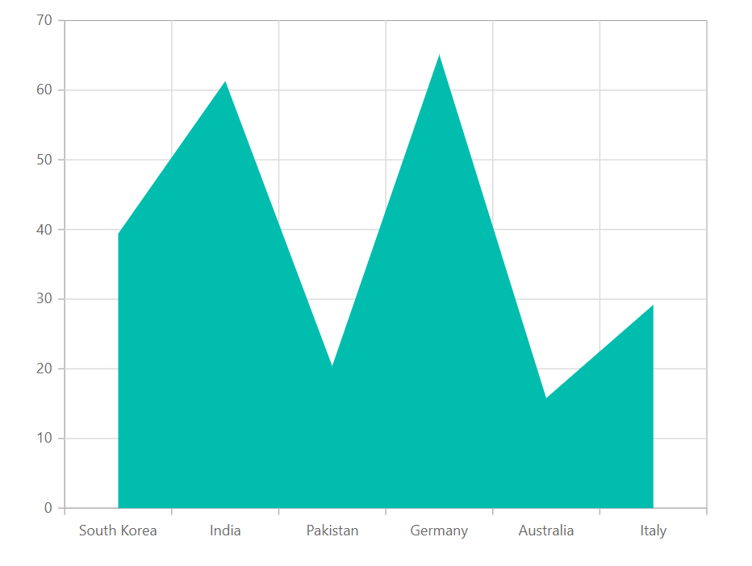

# Area Chart in Blazor Charts (SfCharts)

## Area

[`Area Chart`](https://www.syncfusion.com/blazor-components/blazor-charts/chart-types/area-chart) is like Line Chart, that represents time-dependent data and shows the trends at equal intervals, but it fills the area below the line. To render an area series by specifying the [`Type`](https://help.syncfusion.com/cr/blazor/Syncfusion.Blazor.Charts.ChartSeries.html#Syncfusion_Blazor_Charts_ChartSeries_Type) property as [`Area`](https://help.syncfusion.com/cr/blazor/Syncfusion.Blazor.Charts.ChartSeriesType.html#Syncfusion_Blazor_Charts_ChartSeriesType_Area) and the [`ValueType`](https://help.syncfusion.com/cr/blazor/Syncfusion.Blazor.Charts.ChartCommonAxis.html#Syncfusion_Blazor_Charts_ChartCommonAxis_ValueType) of the plot data can be [`Category`](https://help.syncfusion.com/cr/blazor/Syncfusion.Blazor.Charts.ValueType.html#Syncfusion_Blazor_Charts_ValueType_Category), [`DateTime`](https://help.syncfusion.com/cr/blazor/Syncfusion.Blazor.Charts.ValueType.html#Syncfusion_Blazor_Charts_ValueType_DateTime), [`DateTimeCategory`](https://help.syncfusion.com/cr/blazor/Syncfusion.Blazor.Charts.ValueType.html#Syncfusion_Blazor_Charts_ValueType_DateTimeCategory), [`Double`](https://help.syncfusion.com/cr/blazor/Syncfusion.Blazor.Charts.ValueType.html#Syncfusion_Blazor_Charts_ValueType_Double) or [`Logarithmic`](https://help.syncfusion.com/cr/blazor/Syncfusion.Blazor.Charts.ValueType.html#Syncfusion_Blazor_Charts_ValueType_Logarithmic).







> Refer to our Blazor [`Bar Charts`](https://www.syncfusion.com/blazor-components/blazor-charts/chart-types/area-chart) feature tour page to know about its other groundbreaking feature representations. Explore our Blazor [`Area Chart Example`](https://blazor.syncfusion.com/demos/chart/area?theme=bootstrap4) to knows how to represent time-dependent data, showing trends at equal intervals.

## Multicolored area

To render a multicolored area series, specify the [`Type`](https://help.syncfusion.com/cr/blazor/Syncfusion.Blazor.Charts.ChartSeries.html#Syncfusion_Blazor_Charts_ChartSeries_Type) property as [`MultiColoredArea`](https://help.syncfusion.com/cr/blazor/Syncfusion.Blazor.Charts.ChartSeriesType.html#Syncfusion_Blazor_Charts_ChartSeriesType_MultiColoredArea) in [`ChartSeries`](https://help.syncfusion.com/cr/blazor/Syncfusion.Blazor.Charts.ChartSeries.html). Here, the individual color of the segment can be mapped by using [`Color`](https://help.syncfusion.com/cr/blazor/Syncfusion.Blazor.Charts.ChartSegment.html#Syncfusion_Blazor_Charts_ChartSegment_Color) property in [`ChartSegment`](https://help.syncfusion.com/cr/blazor/Syncfusion.Blazor.Charts.ChartSegment.html).






## Series Customization

The following properties can be used to customize the [`Area`](https://help.syncfusion.com/cr/blazor/Syncfusion.Blazor.Charts.ChartSeriesType.html#Syncfusion_Blazor_Charts_ChartSeriesType_Area) series.

* [`Fill`](https://help.syncfusion.com/cr/blazor/Syncfusion.Blazor.Charts.ChartSeries.html#Syncfusion_Blazor_Charts_ChartSeries_Fill) – Specifies the color of the area series.
* [`Opacity`](https://help.syncfusion.com/cr/blazor/Syncfusion.Blazor.Charts.ChartSeries.html#Syncfusion_Blazor_Charts_ChartSeries_Opacity) – Specifies the opacity of [`Fill`](https://help.syncfusion.com/cr/blazor/Syncfusion.Blazor.Charts.ChartSeries.html#Syncfusion_Blazor_Charts_ChartSeries_Fill).
* [`DashArray`](https://help.syncfusion.com/cr/blazor/Syncfusion.Blazor.Charts.ChartSeries.html#Syncfusion_Blazor_Charts_ChartSeries_DashArray) – Specifies the dashes of series.
* [`ChartSeriesBorder`](https://help.syncfusion.com/cr/blazor/Syncfusion.Blazor.Charts.ChartSeriesBorder.html) – Specifies the [`Color`](https://help.syncfusion.com/cr/blazor/Syncfusion.Blazor.Charts.ChartCommonBorder.html#Syncfusion_Blazor_Charts_ChartCommonBorder_Color) and [`Width`](https://help.syncfusion.com/cr/blazor/Syncfusion.Blazor.Charts.ChartCommonBorder.html#Syncfusion_Blazor_Charts_ChartCommonBorder_Width) of series border.

```csharp
@using Syncfusion.Blazor.Charts

<SfChart>
    <ChartPrimaryXAxis ValueType="Syncfusion.Blazor.Charts.ValueType.Category" />
    <ChartSeriesCollection>
        <ChartSeries DataSource="@MedalDetails" XName="X" YName="Y" Opacity="0.5" DashArray="5,5" Fill="blue" Type="ChartSeriesType.Area">
            <ChartSeriesBorder Width="2" Color="red"></ChartSeriesBorder>
        </ChartSeries>
    </ChartSeriesCollection>
</SfChart>

@code{
    public class ChartData
    {
        public string X { get; set; }
        public double Y { get; set; }
    }
    public List<ChartData> MedalDetails = new List<ChartData>
    {
        new ChartData { X= "South Korea", Y= 39.4 },
        new ChartData { X= "India", Y= 61.3 },
        new ChartData { X= "Pakistan", Y= 20.4 },
        new ChartData { X= "Germany", Y= 65.1 },
        new ChartData { X= "Australia", Y= 15.8 }
    };
}
```


> Refer to our [`Blazor Charts`](https://www.syncfusion.com/blazor-components/blazor-charts) feature tour page for its groundbreaking feature representations and also explore our [`Blazor Chart example`](https://blazor.syncfusion.com/demos/chart/line?theme=bootstrap4) to know various chart types and how to represent time-dependent data, showing trends at equal intervals.

## See Also

* [Data Label](../data-labels)
* [Tooltip](../tool-tip)