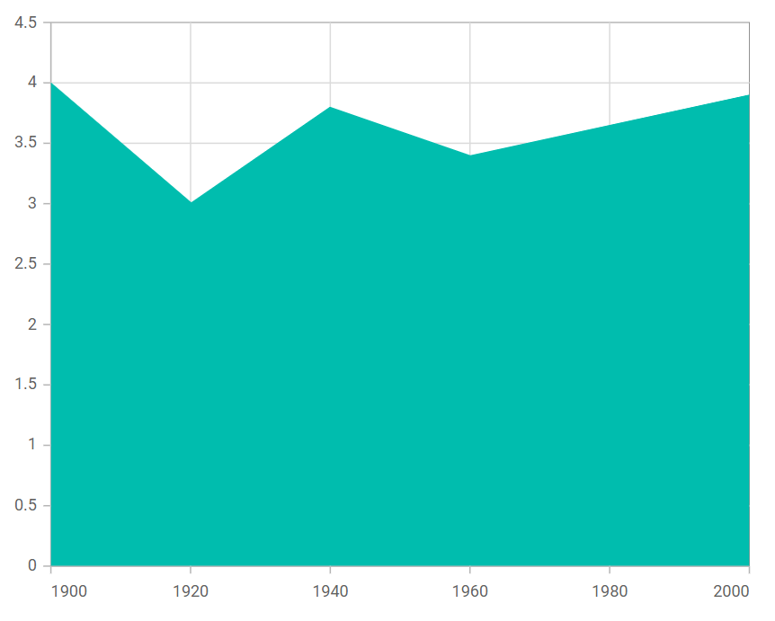

# Area in Blazor Charts Component

## Area

[Area Chart](https://www.syncfusion.com/blazor-components/blazor-charts/chart-types/area-chart) is similar to a line chart and is used to show trends over time or across categories, with the space under the line filled to emphasize magnitude. To render an area series, set the series [Type](https://help.syncfusion.com/cr/blazor/Syncfusion.Blazor.Charts.ChartSeries.html#Syncfusion_Blazor_Charts_ChartSeries_Type) to [Area](https://help.syncfusion.com/cr/blazor/Syncfusion.Blazor.Charts.ChartSeriesType.html#Syncfusion_Blazor_Charts_ChartSeriesType_Area). The axis [ValueType](https://help.syncfusion.com/cr/blazor/Syncfusion.Blazor.Charts.ChartCommonAxis.html#Syncfusion_Blazor_Charts_ChartCommonAxis_ValueType) can be [Category](https://help.syncfusion.com/cr/blazor/Syncfusion.Blazor.Charts.ValueType.html#Syncfusion_Blazor_Charts_ValueType_Category), [DateTime](https://help.syncfusion.com/cr/blazor/Syncfusion.Blazor.Charts.ValueType.html#Syncfusion_Blazor_Charts_ValueType_DateTime), [DateTimeCategory](https://help.syncfusion.com/cr/blazor/Syncfusion.Blazor.Charts.ValueType.html#Syncfusion_Blazor_Charts_ValueType_DateTimeCategory), [Double](https://help.syncfusion.com/cr/blazor/Syncfusion.Blazor.Charts.ValueType.html#Syncfusion_Blazor_Charts_ValueType_Double), or [Logarithmic](https://help.syncfusion.com/cr/blazor/Syncfusion.Blazor.Charts.ValueType.html#Syncfusion_Blazor_Charts_ValueType_Logarithmic).

```cshtml

@using Syncfusion.Blazor.Charts

<SfChart>
    <ChartPrimaryXAxis Minimum="1900" Maximum="2000" EdgeLabelPlacement="EdgeLabelPlacement.Shift"/>
    <ChartSeriesCollection>
        <ChartSeries DataSource="@SalesDetails" XName="X" YName="Y" Type="ChartSeriesType.Area">
        </ChartSeries>
    </ChartSeriesCollection>
</SfChart>

@code {
    public class ChartData
    {
        public double X { get; set; }
        public double Y { get; set; }
    }
    public List<ChartData> SalesDetails = new List<ChartData>
    {
        new ChartData { X= 1900, Y= 4 },
        new ChartData { X= 1920, Y= 3.0 },
        new ChartData { X= 1940, Y= 3.8 },
        new ChartData { X= 1960, Y= 3.4 },
        new ChartData { X= 2000, Y= 3.9 }
    };
}

``` 




N> Refer to the [Blazor Area Charts](https://www.syncfusion.com/blazor-components/blazor-charts/chart-types/area-chart) feature tour to explore capabilities and see a live [Blazor Area Chart example](https://blazor.syncfusion.com/demos/chart/area?theme=fluent).

## Binding data with series

Bind data to the chart using the series [`DataSource`](https://help.syncfusion.com/cr/blazor/Syncfusion.Blazor.Charts.ChartSeries.html#Syncfusion_Blazor_Charts_ChartSeries_DataSource) property. It accepts either an [`SfDataManager`](https://help.syncfusion.com/cr/blazor/Syncfusion.Blazor.Data.SfDataManager.html) configuration or a list of business objects. For details, see [Working with data](../working-with-data). Map fields to [`XName`](https://help.syncfusion.com/cr/blazor/Syncfusion.Blazor.Charts.ChartSeries.html#Syncfusion_Blazor_Charts_ChartSeries_XName) and [`YName`](https://help.syncfusion.com/cr/blazor/Syncfusion.Blazor.Charts.ChartSeries.html#Syncfusion_Blazor_Charts_ChartSeries_YName) to render points correctly.

```cshtml

@using Syncfusion.Blazor.Charts

<SfChart>
    <ChartPrimaryXAxis Minimum="1900" Maximum="2000" EdgeLabelPlacement="EdgeLabelPlacement.Shift"/>
    <ChartSeriesCollection>
        <ChartSeries DataSource="@SalesDetails" XName="X" YName="Y" Type="ChartSeriesType.Area">
        </ChartSeries>
    </ChartSeriesCollection>
</SfChart>

@code {
    public class ChartData
    {
        public double X { get; set; }
        public double Y { get; set; }
    }
    public List<ChartData> SalesDetails = new List<ChartData>
    {
        new ChartData { X= 1900, Y= 4 },
        new ChartData { X= 1920, Y= 3.0 },
        new ChartData { X= 1940, Y= 3.8 },
        new ChartData { X= 1960, Y= 3.4 },
        new ChartData { X= 2000, Y= 3.9 }
    };
}

``` 


## Series customization

The following properties can be used to customize the [Area](https://help.syncfusion.com/cr/blazor/Syncfusion.Blazor.Charts.ChartSeriesType.html#Syncfusion_Blazor_Charts_ChartSeriesType_Area) series.

**Fill**

The [Fill](https://help.syncfusion.com/cr/blazor/Syncfusion.Blazor.Charts.ChartSeries.html#Syncfusion_Blazor_Charts_ChartSeries_Fill) property sets the series color.

```cshtml

@using Syncfusion.Blazor.Charts

<SfChart>
    <ChartPrimaryXAxis Minimum="1900" Maximum="2000" EdgeLabelPlacement="EdgeLabelPlacement.Shift"/>
    <ChartSeriesCollection>
        <ChartSeries DataSource="@SalesDetails" Fill="blue" XName="X" YName="Y" Type="ChartSeriesType.Area">
        </ChartSeries>
    </ChartSeriesCollection>
</SfChart>

@code {
    public class ChartData
    {
        public double X { get; set; }
        public double Y { get; set; }
    }
    public List<ChartData> SalesDetails = new List<ChartData>
    {
        new ChartData { X= 1900, Y= 4 },
        new ChartData { X= 1920, Y= 3.0 },
        new ChartData { X= 1940, Y= 3.8 },
        new ChartData { X= 1960, Y= 3.4 },
        new ChartData { X= 2000, Y= 3.9 }
    };
}


```


The [Fill](https://help.syncfusion.com/cr/blazor/Syncfusion.Blazor.Charts.ChartSeries.html#Syncfusion_Blazor_Charts_ChartSeries_Fill) property also supports gradients by referencing an SVG definition, enabling smooth color transitions for the filled area.

```cshtml

@using Syncfusion.Blazor.Charts

<SfChart>
    <ChartPrimaryXAxis Minimum="1900" Maximum="2000" EdgeLabelPlacement="EdgeLabelPlacement.Shift"/>
    <ChartSeriesCollection>
        <ChartSeries DataSource="@SalesDetails" Fill="url(#grad1)" XName="X" YName="Y" Type="ChartSeriesType.Area">
        </ChartSeries>
    </ChartSeriesCollection>
</SfChart>

<svg style="height: 0">
    <defs>
        <linearGradient id="grad1" x1="0%" y1="0%" x2="0%" y2="100%">
            <stop offset="20%" style="stop-color:orange;stop-opacity:1" />
            <stop offset="100%" style="stop-color:black;stop-opacity:1" />
        </linearGradient>
    </defs>
</svg>

@code {
    public class ChartData
    {
        public double X { get; set; }
        public double Y { get; set; }
    }
    public List<ChartData> SalesDetails = new List<ChartData>
    {
        new ChartData { X= 1900, Y= 4 },
        new ChartData { X= 1920, Y= 3.0 },
        new ChartData { X= 1940, Y= 3.8 },
        new ChartData { X= 1960, Y= 3.4 },
        new ChartData { X= 2000, Y= 3.9 }
    };
}

```


**Opacity**

The [Opacity](https://help.syncfusion.com/cr/blazor/Syncfusion.Blazor.Charts.ChartSeries.html#Syncfusion_Blazor_Charts_ChartSeries_Opacity) property controls the transparency of the filled area.

```cshtml

@using Syncfusion.Blazor.Charts

<SfChart>
    <ChartPrimaryXAxis Minimum="1900" Maximum="2000" EdgeLabelPlacement="EdgeLabelPlacement.Shift"/>
    <ChartSeriesCollection>
        <ChartSeries DataSource="@SalesDetails" Opacity="0.3" XName="X" YName="Y" Type="ChartSeriesType.Area">
        </ChartSeries>
    </ChartSeriesCollection>
</SfChart>

@code {
    public class ChartData
    {
        public double X { get; set; }
        public double Y { get; set; }
    }
    public List<ChartData> SalesDetails = new List<ChartData>
    {
        new ChartData { X= 1900, Y= 4 },
        new ChartData { X= 1920, Y= 3.0 },
        new ChartData { X= 1940, Y= 3.8 },
        new ChartData { X= 1960, Y= 3.4 },
        new ChartData { X= 2000, Y= 3.9 }
    };
}

```


**DashArray**

The [DashArray](https://help.syncfusion.com/cr/blazor/Syncfusion.Blazor.Charts.ChartSeries.html#Syncfusion_Blazor_Charts_ChartSeries_DashArray) property specifies the dash and gap pattern for the series border.

```cshtml

@using Syncfusion.Blazor.Charts

<SfChart>
    <ChartPrimaryXAxis Minimum="1900" Maximum="2000" EdgeLabelPlacement="EdgeLabelPlacement.Shift"/>
    <ChartSeriesCollection>
        <ChartSeries DataSource="@SalesDetails" DashArray="5,5" XName="X" YName="Y" Type="ChartSeriesType.Area">
           <ChartSeriesBorder Width="2" Color="red"></ChartSeriesBorder>
        </ChartSeries>
    </ChartSeriesCollection>
</SfChart>

@code {
    public class ChartData
    {
        public double X { get; set; }
        public double Y { get; set; }
    }
    public List<ChartData> SalesDetails = new List<ChartData>
    {
        new ChartData { X= 1900, Y= 4 },
        new ChartData { X= 1920, Y= 3.0 },
        new ChartData { X= 1940, Y= 3.8 },
        new ChartData { X= 1960, Y= 3.4 },
        new ChartData { X= 2000, Y= 3.9 }
    };
}

```


## Area Border

Use the [ChartSeriesBorder](https://help.syncfusion.com/cr/blazor/Syncfusion.Blazor.Charts.ChartSeriesBorder.html) settings to customize the area series border:

* [Width](https://help.syncfusion.com/cr/blazor/Syncfusion.Blazor.Charts.ChartSeriesBorder.html#Syncfusion_Blazor_Charts_ChartSeriesBorder_Width) – Sets the border width.
* [Color](https://help.syncfusion.com/cr/blazor/Syncfusion.Blazor.Charts.ChartSeriesBorder.html#Syncfusion_Blazor_Charts_ChartSeriesBorder_Color) – Sets the border color.

```cshtml

@using Syncfusion.Blazor.Charts

<SfChart>
    <ChartPrimaryXAxis Minimum="1900" Maximum="2000" EdgeLabelPlacement="EdgeLabelPlacement.Shift"/>
    <ChartSeriesCollection>
        <ChartSeries DataSource="@SalesDetails" XName="X" YName="Y" Type="ChartSeriesType.Area">
            <ChartSeriesBorder Width="2" Color="#962D18"></ChartSeriesBorder>
        </ChartSeries>
    </ChartSeriesCollection>
</SfChart>

@code {
    public class ChartData
    {
        public double X { get; set; }
        public double Y { get; set; }
    }
    public List<ChartData> SalesDetails = new List<ChartData>
    {
        new ChartData { X= 1900, Y= 4 },
        new ChartData { X= 1920, Y= 3.0 },
        new ChartData { X= 1940, Y= 3.8 },
        new ChartData { X= 1960, Y= 3.4 },
        new ChartData { X= 2000, Y= 3.9 }
    };
}

```


## Multicolored area

Render a multicolored area series by configuring the series [`Type`](https://help.syncfusion.com/cr/blazor/Syncfusion.Blazor.Charts.ChartSeries.html#Syncfusion_Blazor_Charts_ChartSeries_Type) as [`MultiColoredArea`](https://help.syncfusion.com/cr/blazor/Syncfusion.Blazor.Charts.ChartSeriesType.html#Syncfusion_Blazor_Charts_ChartSeriesType_MultiColoredArea) and defining segments using [`ChartSegment`](https://help.syncfusion.com/cr/blazor/Syncfusion.Blazor.Charts.ChartSegment.html). Each segment can specify:

- [Value](https://help.syncfusion.com/cr/blazor/Syncfusion.Blazor.Charts.ChartSegment.html#Syncfusion_Blazor_Charts_ChartSegment_Value) – The end value of the segment.
- [Color](https://help.syncfusion.com/cr/blazor/Syncfusion.Blazor.Charts.ChartSegment.html#Syncfusion_Blazor_Charts_ChartSegment_Color) – The segment color.
- [DashArray](https://help.syncfusion.com/cr/blazor/Syncfusion.Blazor.Charts.ChartSegment.html#Syncfusion_Blazor_Charts_ChartSegment_DashArray) – The dash pattern for the segment border.
 
```cshtml
   
@using Syncfusion.Blazor.Charts

<SfChart>
    <ChartSeriesCollection>
        <ChartSeries DataSource="@WeatherReports" XName="X" YName="Y" Type="Syncfusion.Blazor.Charts.ChartSeriesType.MultiColoredArea">
            <ChartSegments>
                <ChartSegment Value="2007" Color="blue" />
                <ChartSegment Value="2009" Color="red" />
                <ChartSegment Color="green"></ChartSegment>
            </ChartSegments>
        </ChartSeries>
    </ChartSeriesCollection>
</SfChart>

@code {
    public class ChartData
    {
        public double X { get; set; }
        public double Y { get; set; }
    }

    public List<ChartData> WeatherReports = new List<ChartData>
    {
        new ChartData{ X= 2005, Y= 28 },
        new ChartData{ X= 2006, Y= 25},
        new ChartData{ X= 2007, Y= 26 },
        new ChartData{ X= 2008, Y= 27 },
        new ChartData{ X= 2009, Y= 32},
        new ChartData{ X= 2010, Y= 35 },
        new ChartData{ X= 2011, Y= 25 }
    };
}

```


## Empty points

Data points with `null` or `double.NaN` values are treated as empty and are not plotted.

**Mode**

Use the [`Mode`](https://help.syncfusion.com/cr/blazor/Syncfusion.Blazor.Charts.ChartEmptyPointSettings.html#Syncfusion_Blazor_Charts_ChartEmptyPointSettings_Mode) property to control how empty points are rendered. The default mode is [`Gap`](https://help.syncfusion.com/cr/blazor/Syncfusion.Blazor.Charts.EmptyPointMode.html#Syncfusion_Blazor_Charts_EmptyPointMode_Gap).

```cshtml

@using Syncfusion.Blazor.Charts

<SfChart>
    <ChartPrimaryXAxis Minimum="1900" Maximum="2000" EdgeLabelPlacement="EdgeLabelPlacement.Shift" />
    <ChartSeriesCollection>
        <ChartSeries DataSource="@SalesDetails" XName="X" YName="Y" Type="Syncfusion.Blazor.Charts.ChartSeriesType.Area">
            <ChartEmptyPointSettings Mode="EmptyPointMode.Zero"></ChartEmptyPointSettings>
        </ChartSeries>
    </ChartSeriesCollection>
</SfChart>

@code {
    public class ChartData
    {
        public double X { get; set; }
        public double Y { get; set; }
    }
    public List<ChartData> SalesDetails = new List<ChartData>
    {
        new ChartData { X= 1900, Y= 4 },
        new ChartData { X= 1920, Y= 3.0 },
        new ChartData { X= 1940, Y= double.NaN },
        new ChartData { X= 1960, Y= 3.4 },
        new ChartData { X= 2000, Y= 3.9 }
    };
}

```


**Fill**

Use the [`Fill`](https://help.syncfusion.com/cr/blazor/Syncfusion.Blazor.Charts.ChartEmptyPointSettings.html#Syncfusion_Blazor_Charts_ChartEmptyPointSettings_Fill) property to set the fill color for empty points.

```cshtml

@using Syncfusion.Blazor.Charts

<SfChart>
    <ChartPrimaryXAxis Minimum="1900" Maximum="2000" EdgeLabelPlacement="EdgeLabelPlacement.Shift" />
    <ChartSeriesCollection>
        <ChartSeries DataSource="@SalesDetails" XName="X" YName="Y" Type="ChartSeriesType.Area">
            <ChartEmptyPointSettings Fill="red" Mode="EmptyPointMode.Zero" />
            <ChartMarker Visible="true" Height="7" Width="7" IsFilled="true"></ChartMarker>
        </ChartSeries>
    </ChartSeriesCollection>
</SfChart>

@code {
    public class ChartData
    {
        public double X { get; set; }
        public double Y { get; set; }
    }
    public List<ChartData> SalesDetails = new List<ChartData>
    {
        new ChartData { X= 1900, Y= 4 },
        new ChartData { X= 1920, Y= 3.0 },
        new ChartData { X= 1940, Y= double.NaN },
        new ChartData { X= 1960, Y= 3.4 },
        new ChartData { X= 2000, Y= 3.9 }
    };
}

```


**Border**

Use the [`Border`](https://help.syncfusion.com/cr/blazor/Syncfusion.Blazor.Charts.ChartEmptyPointSettings.html#Syncfusion_Blazor_Charts_ChartEmptyPointSettings_Border) property to customize the [Width](https://help.syncfusion.com/cr/blazor/Syncfusion.Blazor.Charts.ChartEmptyPointBorder.html#Syncfusion_Blazor_Charts_ChartEmptyPointBorder_Width) and [Color](https://help.syncfusion.com/cr/blazor/Syncfusion.Blazor.Charts.ChartEmptyPointBorder.html#Syncfusion_Blazor_Charts_ChartEmptyPointBorder_Color) of empty point borders.

```cshtml

@using Syncfusion.Blazor.Charts

<SfChart>
    <ChartPrimaryXAxis Minimum="1900" Maximum="2000" EdgeLabelPlacement="EdgeLabelPlacement.Shift" />
    <ChartSeriesCollection>
        <ChartSeries DataSource="@SalesDetails" XName="X" YName="Y" Type="Syncfusion.Blazor.Charts.ChartSeriesType.Area">
            <ChartEmptyPointSettings Fill="red" Mode="EmptyPointMode.Zero">
                <ChartEmptyPointBorder Color="green" Width="2"></ChartEmptyPointBorder>
            </ChartEmptyPointSettings>
            <ChartMarker Visible="true" Height="7" Width="7" IsFilled="true"></ChartMarker>
        </ChartSeries>
    </ChartSeriesCollection>
</SfChart>

@code {
    public class ChartData
    {
        public double X { get; set; }
        public double Y { get; set; }
    }
    public List<ChartData> SalesDetails = new List<ChartData>
    {
        new ChartData { X= 1900, Y= 4 },
        new ChartData { X= 1920, Y= 3.0 },
        new ChartData { X= 1940, Y= double.NaN },
        new ChartData { X= 1960, Y= 3.4 },
        new ChartData { X= 2000, Y= 3.9 }
    };
}

```


## Events

### Series render

The [`OnSeriesRender`](https://help.syncfusion.com/cr/blazor/Syncfusion.Blazor.Charts.ChartEvents.html#Syncfusion_Blazor_Charts_ChartEvents_OnSeriesRender) event can be used to customize series properties such as [Data](https://help.syncfusion.com/cr/blazor/Syncfusion.Blazor.Charts.SeriesRenderEventArgs.html#Syncfusion_Blazor_Charts_SeriesRenderEventArgs_Data), [Fill](https://help.syncfusion.com/cr/blazor/Syncfusion.Blazor.Charts.SeriesRenderEventArgs.html#Syncfusion_Blazor_Charts_SeriesRenderEventArgs_Fill), and [Series](https://help.syncfusion.com/cr/blazor/Syncfusion.Blazor.Charts.SeriesRenderEventArgs.html#Syncfusion_Blazor_Charts_SeriesRenderEventArgs_Series) before rendering.

```cshtml

@using Syncfusion.Blazor.Charts

<SfChart>
    <ChartPrimaryXAxis Minimum="1900" Maximum="2000" EdgeLabelPlacement="EdgeLabelPlacement.Shift"/>
    <ChartEvents OnSeriesRender="SeriesRender"></ChartEvents>
    <ChartSeriesCollection>
        <ChartSeries DataSource="@SalesDetails" XName="X" YName="Y" Type="Syncfusion.Blazor.Charts.ChartSeriesType.Area" />
    </ChartSeriesCollection>
</SfChart>

@code {
    public class ChartData
    {
        public double X { get; set; }
        public double Y { get; set; }
    }

    public void SeriesRender(SeriesRenderEventArgs args)
    {
        args.Fill = "#FF4081";
    }

    public List<ChartData> SalesDetails = new List<ChartData>
    {
        new ChartData { X= 1900, Y= 4 },
        new ChartData { X= 1920, Y= 3.0 },
        new ChartData { X= 1940, Y= 3.8 },
        new ChartData { X= 1960, Y= 3.4 },
        new ChartData { X= 2000, Y= 3.9 }
    };
}

```


### Point render

The [`OnPointRender`](https://help.syncfusion.com/cr/blazor/Syncfusion.Blazor.Charts.ChartEvents.html#Syncfusion_Blazor_Charts_ChartEvents_OnPointRender) event can be used to customize each point before it is rendered.

```cshtml

@using Syncfusion.Blazor.Charts

<SfChart>
    <ChartPrimaryXAxis Minimum="1900" Maximum="2000" EdgeLabelPlacement="EdgeLabelPlacement.Shift"/>
    <ChartEvents OnPointRender="PointRender"></ChartEvents>
    <ChartSeriesCollection>
        <ChartSeries DataSource="@SalesDetails" XName="X" YName="Y" Type="ChartSeriesType.Area">
            <ChartMarker Visible="true" Width="7" Height="7"></ChartMarker>
        </ChartSeries>
    </ChartSeriesCollection>
</SfChart>

@code {
    public class ChartData
    {
        public double X { get; set; }
        public double Y { get; set; }
    }

    public void PointRender(PointRenderEventArgs args)
    {
        args.Fill = (args.Point.Index % 2 != 0) ? "#ff6347" : "#009cb8";
    }

    public List<ChartData> SalesDetails = new List<ChartData>
    {
        new ChartData { X= 1900, Y= 4 },
        new ChartData { X= 1920, Y= 3.0 },
        new ChartData { X= 1940, Y= 3.8 },
        new ChartData { X= 1960, Y= 3.4 },
        new ChartData { X= 2000, Y= 3.9 }
    };
}

```


N> Refer to the [Blazor Charts](https://www.syncfusion.com/blazor-components/blazor-charts) feature tour for an overview, and explore the [Blazor Chart example](https://blazor.syncfusion.com/demos/chart/line?theme=bootstrap5) for additional chart types and scenarios.

## See also

* [Data label](../data-labels)
* [Tooltip](../tool-tip)
