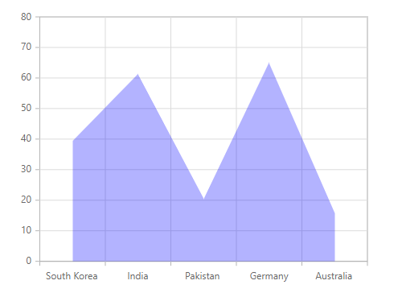
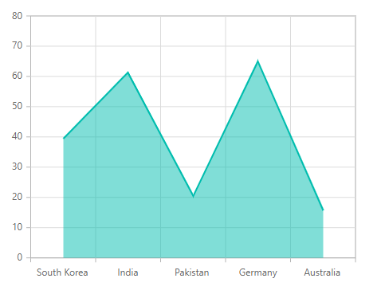
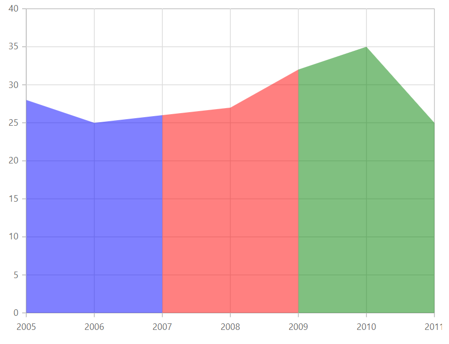

# Area in Blazor Charts Component

## Area

[Area Chart](https://www.syncfusion.com/blazor-components/blazor-charts/chart-types/area-chart) is like Line Chart, that represents time-dependent data and shows the trends at equal intervals, but it fills the area below the line. To render an area series, define the series [Type](https://help.syncfusion.com/cr/blazor/Syncfusion.Blazor.Charts.ChartSeries.html#Syncfusion_Blazor_Charts_ChartSeries_Type) as [Area](https://help.syncfusion.com/cr/blazor/Syncfusion.Blazor.Charts.ChartSeriesType.html#Syncfusion_Blazor_Charts_ChartSeriesType_Area) in your chart configuration. This indicates that the data should be represented as an area chart, which is ideal for showing trends over time or across categories, with filled areas beneath the lines representing data points and the [ValueType](https://help.syncfusion.com/cr/blazor/Syncfusion.Blazor.Charts.ChartCommonAxis.html#Syncfusion_Blazor_Charts_ChartCommonAxis_ValueType) of the plot data can be [Category](https://help.syncfusion.com/cr/blazor/Syncfusion.Blazor.Charts.ValueType.html#Syncfusion_Blazor_Charts_ValueType_Category), [DateTime](https://help.syncfusion.com/cr/blazor/Syncfusion.Blazor.Charts.ValueType.html#Syncfusion_Blazor_Charts_ValueType_DateTime), [DateTimeCategory](https://help.syncfusion.com/cr/blazor/Syncfusion.Blazor.Charts.ValueType.html#Syncfusion_Blazor_Charts_ValueType_DateTimeCategory), [Double](https://help.syncfusion.com/cr/blazor/Syncfusion.Blazor.Charts.ValueType.html#Syncfusion_Blazor_Charts_ValueType_Double) or [Logarithmic](https://help.syncfusion.com/cr/blazor/Syncfusion.Blazor.Charts.ValueType.html#Syncfusion_Blazor_Charts_ValueType_Logarithmic).

```cshtml

@using Syncfusion.Blazor.Charts

<SfChart>

    <ChartPrimaryXAxis ValueType="Syncfusion.Blazor.Charts.ValueType.Category"/>
    <ChartSeriesCollection>
        <ChartSeries DataSource="@MedalDetails" XName="X" YName="Y" Type="ChartSeriesType.Area">
        </ChartSeries>
    </ChartSeriesCollection>
</SfChart>

@code{
    public class ChartData
    {
        public string X { get; set; }
        public double Y { get; set; }
    }
    public List<ChartData> MedalDetails = new List<ChartData>
    {
        new ChartData { X= "South Korea", Y= 39.4 },
        new ChartData { X= "India", Y= 61.3 },
        new ChartData { X= "Pakistan", Y= 20.4 },
        new ChartData { X= "Germany", Y= 65.1 },
        new ChartData { X= "Australia", Y= 15.8 }
    };
}

``` 



N> Refer to our [Blazor Area Charts](https://www.syncfusion.com/blazor-components/blazor-charts/chart-types/area-chart) feature tour page to know about its other groundbreaking feature representations. Explore our [Blazor Area Chart Example](https://blazor.syncfusion.com/demos/chart/area?theme=bootstrap4) to know how to represent time-dependent data, showing trends at equal intervals.

## Binding data with series

You can bind data to the chart using the [`DataSource`](https://help.syncfusion.com/cr/blazor/Syncfusion.Blazor.Charts.ChartSeries.html#Syncfusion_Blazor_Charts_ChartSeries_DataSource) property within the series configuration. This supports data binding methods such as remote data and list binding to your chart. To display the data correctly, map the fields from the data to the chart series [`XName`](https://help.syncfusion.com/cr/blazor/Syncfusion.Blazor.Charts.ChartSeries.html#Syncfusion_Blazor_Charts_ChartSeries_XName) and [`YName`](https://help.syncfusion.com/cr/blazor/Syncfusion.Blazor.Charts.ChartSeries.html#Syncfusion_Blazor_Charts_ChartSeries_YName) properties.

```cshtml

@using Syncfusion.Blazor.Charts

<SfChart>

    <ChartPrimaryXAxis ValueType="Syncfusion.Blazor.Charts.ValueType.Category"/>
    <ChartSeriesCollection>
        <ChartSeries DataSource="@MedalDetails" XName="X" YName="Y" Type="ChartSeriesType.Area">
        </ChartSeries>
    </ChartSeriesCollection>
</SfChart>

@code{
    public class ChartData
    {
        public string X { get; set; }
        public double Y { get; set; }
    }
    public List<ChartData> MedalDetails = new List<ChartData>
    {
        new ChartData { X= "South Korea", Y= 39.4 },
        new ChartData { X= "India", Y= 61.3 },
        new ChartData { X= "Pakistan", Y= 20.4 },
        new ChartData { X= "Germany", Y= 65.1 },
        new ChartData { X= "Australia", Y= 15.8 }
    };
}

``` 


## Series customization

The following properties can be used to customize the [Area](https://help.syncfusion.com/cr/blazor/Syncfusion.Blazor.Charts.ChartSeriesType.html#Syncfusion_Blazor_Charts_ChartSeriesType_Area) series.

**Fill**

The [Fill](https://help.syncfusion.com/cr/blazor/Syncfusion.Blazor.Charts.ChartSeries.html#Syncfusion_Blazor_Charts_ChartSeries_Fill) property determines the color applied to the series.

```cshtml

@using Syncfusion.Blazor.Charts

<SfChart>
    <ChartPrimaryXAxis ValueType="Syncfusion.Blazor.Charts.ValueType.Category" />
    <ChartSeriesCollection>
        <ChartSeries DataSource="@MedalDetails" XName="X" YName="Y" Fill="blue" Type="ChartSeriesType.Area">
        </ChartSeries>
    </ChartSeriesCollection>
</SfChart>

@code {
    public class ChartData
    {
        public string X { get; set; }
        public double Y { get; set; }
    }

    public List<ChartData> MedalDetails = new List<ChartData>
    {
        new ChartData { X= "South Korea", Y= 39.4 },
        new ChartData { X= "India", Y= 61.3 },
        new ChartData { X= "Pakistan", Y= 20.4 },
        new ChartData { X= "Germany", Y= 65.1 },
        new ChartData { X= "Australia", Y= 15.8 }
    };
}

```


The [Fill](https://help.syncfusion.com/cr/blazor/Syncfusion.Blazor.Charts.ChartSeries.html#Syncfusion_Blazor_Charts_ChartSeries_Fill) property can be used to apply a gradient color to the area series. By configuring this property with gradient values, you can create a visually appealing effect in which the color transitions smoothly from one shade to another.

```cshtml

@using Syncfusion.Blazor.Charts

<SfChart>
    <ChartPrimaryXAxis ValueType="Syncfusion.Blazor.Charts.ValueType.Category" />
    <ChartSeriesCollection>
        <ChartSeries DataSource="@MedalDetails" XName="X" YName="Y" Fill="url(#grad1)" Type="ChartSeriesType.Area">
        </ChartSeries>
    </ChartSeriesCollection>
</SfChart>

<svg style="height: 0">
   <defs>
       <linearGradient id="grad1" x1="0%" y1="0%" x2="0%" y2="100%">
           <stop offset="20%" style="stop-color:orange;stop-opacity:1" />
           <stop offset="100%" style="stop-color:black;stop-opacity:1" />
       </linearGradient>
   </defs>
</svg>

@code {
    public class ChartData
    {
        public string X { get; set; }
        public double Y { get; set; }
    }

    public List<ChartData> MedalDetails = new List<ChartData>
    {
        new ChartData { X= "South Korea", Y= 39.4 },
        new ChartData { X= "India", Y= 61.3 },
        new ChartData { X= "Pakistan", Y= 20.4 },
        new ChartData { X= "Germany", Y= 65.1 },
        new ChartData { X= "Australia", Y= 15.8 }
    };
}

```


**Opacity**

The [Opacity](https://help.syncfusion.com/cr/blazor/Syncfusion.Blazor.Charts.ChartSeries.html#Syncfusion_Blazor_Charts_ChartSeries_Opacity) property specifies the transparency level of the [Fill](https://help.syncfusion.com/cr/blazor/Syncfusion.Blazor.Charts.ChartSeries.html#Syncfusion_Blazor_Charts_ChartSeries_Fill). Adjusting this property allows you to control how opaque or transparent the fill color of the series appears.

```cshtml

@using Syncfusion.Blazor.Charts

<SfChart>
    <ChartPrimaryXAxis ValueType="Syncfusion.Blazor.Charts.ValueType.Category" />
    <ChartSeriesCollection>
        <ChartSeries DataSource="@MedalDetails" XName="X" YName="Y" Fill="blue" Opacity="0.3" Type="ChartSeriesType.Area">
        </ChartSeries>
    </ChartSeriesCollection>
</SfChart>

@code {
    public class ChartData
    {
        public string X { get; set; }
        public double Y { get; set; }
    }

    public List<ChartData> MedalDetails = new List<ChartData>
    {
        new ChartData { X= "South Korea", Y= 39.4 },
        new ChartData { X= "India", Y= 61.3 },
        new ChartData { X= "Pakistan", Y= 20.4 },
        new ChartData { X= "Germany", Y= 65.1 },
        new ChartData { X= "Australia", Y= 15.8 }
    };
}

```


**DashArray**

The [DashArray](https://help.syncfusion.com/cr/blazor/Syncfusion.Blazor.Charts.ChartSeries.html#Syncfusion_Blazor_Charts_ChartSeries_DashArray) property determines the pattern of dashes and gaps in the series border.

```cshtml

@using Syncfusion.Blazor.Charts

<SfChart>
    <ChartPrimaryXAxis ValueType="Syncfusion.Blazor.Charts.ValueType.Category" />
    <ChartSeriesCollection>
        <ChartSeries DataSource="@MedalDetails" XName="X" YName="Y" Fill="blue" Opacity="0.3" DashArray="5,5" Type="ChartSeriesType.Area">
            <ChartSeriesBorder Width="2" Color="red"></ChartSeriesBorder>
        </ChartSeries>
    </ChartSeriesCollection>
</SfChart>

@code {
    public class ChartData
    {
        public string X { get; set; }
        public double Y { get; set; }
    }

    public List<ChartData> MedalDetails = new List<ChartData>
    {
        new ChartData { X= "South Korea", Y= 39.4 },
        new ChartData { X= "India", Y= 61.3 },
        new ChartData { X= "Pakistan", Y= 20.4 },
        new ChartData { X= "Germany", Y= 65.1 },
        new ChartData { X= "Australia", Y= 15.8 }
    };
}

```




## Area Border

The following properties in the [ChartSeriesBorder](https://help.syncfusion.com/cr/blazor/Syncfusion.Blazor.Charts.ChartSeriesBorder.html) can be used to customize the border of the Area Chart.

* [Width](https://help.syncfusion.com/cr/blazor/Syncfusion.Blazor.Charts.ChartSeriesBorder.html#Syncfusion_Blazor_Charts_ChartSeriesBorder_Width) - Specifies the width for the border of the Area Chart.
* [Color](https://help.syncfusion.com/cr/blazor/Syncfusion.Blazor.Charts.ChartSeriesBorder.html#Syncfusion_Blazor_Charts_ChartSeriesBorder_Color) - Specifies the Color for the border of the Area Chart.

```cshtml

@using Syncfusion.Blazor.Charts

<SfChart>
    <ChartPrimaryXAxis ValueType="Syncfusion.Blazor.Charts.ValueType.Category" />
    <ChartSeriesCollection>
        <ChartSeries DataSource="@MedalDetails" XName="X" YName="Y" Opacity="0.5" Type="ChartSeriesType.Area">
            <ChartSeriesBorder Width="2" Color="red"></ChartSeriesBorder>
        </ChartSeries>
    </ChartSeriesCollection>
</SfChart>

@code{
    public class ChartData
    {
        public string X { get; set; }
        public double Y { get; set; }
    }

    public List<ChartData> MedalDetails = new List<ChartData>
    {
        new ChartData { X= "South Korea", Y= 39.4 },
        new ChartData { X= "India", Y= 61.3 },
        new ChartData { X= "Pakistan", Y= 20.4 },
        new ChartData { X= "Germany", Y= 65.1 },
        new ChartData { X= "Australia", Y= 15.8 }
    };
}

```




## Empty points

Data points with `null` or `undefined` values are considered empty. Empty data points are ignored and not plotted on the chart.

**Mode**

Use the [`Mode`](https://help.syncfusion.com/cr/blazor/Syncfusion.Blazor.Charts.ChartEmptyPointSettings.html#Syncfusion_Blazor_Charts_ChartEmptyPointSettings_Mode) property to define how empty or missing data points are handled in the series. The default mode for empty points is [`Gap`](https://help.syncfusion.com/cr/blazor/Syncfusion.Blazor.Charts.EmptyPointMode.html#Syncfusion_Blazor_Charts_EmptyPointMode_Gap).

```cshtml

@using Syncfusion.Blazor.Charts

<SfChart>
    <ChartPrimaryXAxis ValueType="Syncfusion.Blazor.Charts.ValueType.Category" />
    <ChartSeriesCollection>
        <ChartSeries DataSource="@MedalDetails" XName="X" YName="Y" Type="ChartSeriesType.Area">
            <ChartEmptyPointSettings Mode="EmptyPointMode.Gap"></ChartEmptyPointSettings>
            <ChartMarker Visible="true" Height="10" Width="10"></ChartMarker>
        </ChartSeries>
    </ChartSeriesCollection>
</SfChart>

@code {
    public class ChartData
    {
        public string X { get; set; }
        public double Y { get; set; }
    }

    public List<ChartData> MedalDetails = new List<ChartData>
    {
        new ChartData { X= "South Korea", Y= 39.4 },
        new ChartData { X= "India", Y= 61.3 },
        new ChartData { X= "Pakistan", Y= double.NaN },
        new ChartData { X= "Germany", Y= 65.1 },
        new ChartData { X= "Australia", Y= 15.8 }
    };
}

```


**Fill**

Use the [`Fill`](https://help.syncfusion.com/cr/blazor/Syncfusion.Blazor.Charts.ChartEmptyPointSettings.html#Syncfusion_Blazor_Charts_ChartEmptyPointSettings_Fill) property to customize the fill color of empty points in the series.

```cshtml

@using Syncfusion.Blazor.Charts

<SfChart>
    <ChartPrimaryXAxis ValueType="Syncfusion.Blazor.Charts.ValueType.Category" />
    <ChartSeriesCollection>
        <ChartSeries DataSource="@MedalDetails" XName="X" YName="Y" Type="ChartSeriesType.Area">
            <ChartEmptyPointSettings Fill="#FFDE59" Mode="EmptyPointMode.Average"></ChartEmptyPointSettings>
            <ChartMarker Visible="true" Height="10" Width="10"></ChartMarker>
        </ChartSeries>
    </ChartSeriesCollection>
</SfChart>

@code {
    public class ChartData
    {
        public string X { get; set; }
        public double Y { get; set; }
    }

    public List<ChartData> MedalDetails = new List<ChartData>
    {
        new ChartData { X= "South Korea", Y= 39.4 },
        new ChartData { X= "India", Y= 61.3 },
        new ChartData { X= "Pakistan", Y= double.NaN },
        new ChartData { X= "Germany", Y= 65.1 },
        new ChartData { X= "Australia", Y= 15.8 }
    };
}

```


**Border**

Use the [`Border`](https://help.syncfusion.com/cr/blazor/Syncfusion.Blazor.Charts.ChartEmptyPointSettings.html#Syncfusion_Blazor_Charts_ChartEmptyPointSettings_Border) property to customize the [Width](https://help.syncfusion.com/cr/blazor/Syncfusion.Blazor.Charts.ChartEmptyPointBorder.html#Syncfusion_Blazor_Charts_ChartEmptyPointBorder_Width) and [Color](https://help.syncfusion.com/cr/blazor/Syncfusion.Blazor.Charts.ChartEmptyPointBorder.html#Syncfusion_Blazor_Charts_ChartEmptyPointBorder_Color) of the border for empty points.

```cshtml

@using Syncfusion.Blazor.Charts

<SfChart>
    <ChartPrimaryXAxis ValueType="Syncfusion.Blazor.Charts.ValueType.Category" />
    <ChartSeriesCollection>
        <ChartSeries DataSource="@MedalDetails" XName="X" YName="Y" Type="ChartSeriesType.Area">
            <ChartEmptyPointSettings Fill="#FFDE59" Mode="EmptyPointMode.Average">
                <ChartEmptyPointBorder Color="red" Width="2"></ChartEmptyPointBorder>
            </ChartEmptyPointSettings>
            <ChartMarker Visible="true" Height="10" Width="10"></ChartMarker>
        </ChartSeries>
    </ChartSeriesCollection>
</SfChart>

@code {
    public class ChartData
    {
        public string X { get; set; }
        public double Y { get; set; }
    }

    public List<ChartData> MedalDetails = new List<ChartData>
    {
        new ChartData { X= "South Korea", Y= 39.4 },
        new ChartData { X= "India", Y= 61.3 },
        new ChartData { X= "Pakistan", Y= double.NaN },
        new ChartData { X= "Germany", Y= 65.1 },
        new ChartData { X= "Australia", Y= 15.8 }
    };
}

```



## Multicolored area

To render a multicolored area series in your chart, you need to follow a few steps to configure it correctly. Here's a concise guide on how to do this:

1. **Set the series type**: Define the series [`Type`](https://help.syncfusion.com/cr/blazor/Syncfusion.Blazor.Charts.ChartSeries.html#Syncfusion_Blazor_Charts_ChartSeries_Type) as [`MultiColoredArea`](https://help.syncfusion.com/cr/blazor/Syncfusion.Blazor.Charts.ChartSeriesType.html#Syncfusion_Blazor_Charts_ChartSeriesType_MultiColoredArea) in your chart configuration. This specifies that the series should be rendered as a multicolored area chart, with different segments of the area having distinct colors.

2. **Customize the Segments**: Define the segments of the series using the [`ChartSegment`](https://help.syncfusion.com/cr/blazor/Syncfusion.Blazor.Charts.ChartSegment.html) property. Each segment can be customized with properties such as `Value`, `Color`, and `DashArray`.
   * [Value](https://help.syncfusion.com/cr/blazor/Syncfusion.Blazor.Charts.ChartSegment.html#Syncfusion_Blazor_Charts_ChartSegment_Value) - Specifies the endpoint of the segment.
   * [Color](https://help.syncfusion.com/cr/blazor/Syncfusion.Blazor.Charts.ChartSegment.html#Syncfusion_Blazor_Charts_ChartSegment_Color) - Defines the color of the segment.
   * [DashArray](https://help.syncfusion.com/cr/blazor/Syncfusion.Blazor.Charts.ChartSegment.html#Syncfusion_Blazor_Charts_ChartSegment_DashArray) - Defines the dashes or gaps in the segment.

```cshtml

@using Syncfusion.Blazor.Charts

<SfChart Width="60%">
    <ChartSeriesCollection>
        <ChartSeries DataSource="@WeatherReports" XName="X" YName="Y" Type="ChartSeriesType.MultiColoredArea">
            <ChartSegments>
                <ChartSegment Value="2007" Color="blue"/>
                <ChartSegment Value="2009" Color="red"/>
                <ChartSegment Color="green"></ChartSegment>
            </ChartSegments>
        </ChartSeries>
    </ChartSeriesCollection>
</SfChart>

@code{
    public class ChartData
    {
        public double X { get; set; }
        public double Y { get; set; }
    }

    public List<ChartData> WeatherReports = new List<ChartData>
	{
        new ChartData{ X= 2005, Y= 28 },
        new ChartData{ X= 2006, Y= 25},
        new ChartData{ X= 2007, Y= 26 },
        new ChartData{ X= 2008, Y= 27 },
        new ChartData{ X= 2009, Y= 32},
        new ChartData{ X= 2010, Y= 35 },
        new ChartData{ X= 2011, Y= 25 }
    };
}

``` 




## Events

### Series render

The [`OnSeriesRender`](https://help.syncfusion.com/cr/blazor/Syncfusion.Blazor.Charts.ChartEvents.html#Syncfusion_Blazor_Charts_ChartEvents_OnSeriesRender) event allows you to customize series properties, such as [Data](https://help.syncfusion.com/cr/blazor/Syncfusion.Blazor.Charts.SeriesRenderEventArgs.html#Syncfusion_Blazor_Charts_SeriesRenderEventArgs_Data), [Fill](https://help.syncfusion.com/cr/blazor/Syncfusion.Blazor.Charts.SeriesRenderEventArgs.html#Syncfusion_Blazor_Charts_SeriesRenderEventArgs_Fill), and [Series](https://help.syncfusion.com/cr/blazor/Syncfusion.Blazor.Charts.SeriesRenderEventArgs.html#Syncfusion_Blazor_Charts_SeriesRenderEventArgs_Series), before they are rendered on the chart.

```cshtml

@using Syncfusion.Blazor.Charts

<SfChart>
    <ChartPrimaryXAxis ValueType="Syncfusion.Blazor.Charts.ValueType.Category" />
    <ChartEvents OnSeriesRender="SeriesRender"></ChartEvents>
    <ChartSeriesCollection>
        <ChartSeries DataSource="@MedalDetails" XName="X" YName="Y" Type="ChartSeriesType.Area">
        </ChartSeries>
    </ChartSeriesCollection>
</SfChart>

@code {
    public class ChartData
    {
        public string X { get; set; }
        public double Y { get; set; }
    }

    public void SeriesRender(SeriesRenderEventArgs args)
    {
        args.Fill = "#FF4081";
    }

    public List<ChartData> MedalDetails = new List<ChartData>
    {
        new ChartData { X= "South Korea", Y= 39.4 },
        new ChartData { X= "India", Y= 61.3 },
        new ChartData { X= "Pakistan", Y= 20.4 },
        new ChartData { X= "Germany", Y= 65.1 },
        new ChartData { X= "Australia", Y= 15.8 }
    };
}

```


### Point render

The [`OnPointRender`](https://help.syncfusion.com/cr/blazor/Syncfusion.Blazor.Charts.ChartEvents.html#Syncfusion_Blazor_Charts_ChartEvents_OnPointRender) event allows you to customize each data point before it is rendered on the chart.

```cshtml

@using Syncfusion.Blazor.Charts

<SfChart>
    <ChartPrimaryXAxis ValueType="Syncfusion.Blazor.Charts.ValueType.Category" />
    <ChartEvents OnPointRender="PointRender"></ChartEvents>
    <ChartSeriesCollection>
        <ChartSeries DataSource="@MedalDetails" XName="X" YName="Y" Type="ChartSeriesType.Area">
            <ChartMarker Visible="true" Height="10" Width="10"></ChartMarker>
        </ChartSeries>
    </ChartSeriesCollection>
</SfChart>

@code {
    public class ChartData
    {
        public string X { get; set; }
        public double Y { get; set; }
    }

    public void PointRender(PointRenderEventArgs args)
    {
        args.Fill = args.Point.X.ToString() == "Pakistan" ? "#E91E63" : "#3F51B5";
    }
    public List<ChartData> MedalDetails = new List<ChartData>
    {
        new ChartData { X= "South Korea", Y= 39.4 },
        new ChartData { X= "India", Y= 61.3 },
        new ChartData { X= "Pakistan", Y= 20.4 },
        new ChartData { X= "Germany", Y= 65.1 },
        new ChartData { X= "Australia", Y= 15.8 }
    };
}

```


N> Refer to our [Blazor Charts](https://www.syncfusion.com/blazor-components/blazor-charts) feature tour page for its groundbreaking feature representations and also explore our [Blazor Chart Example](https://blazor.syncfusion.com/demos/chart/line?theme=bootstrap4) to know various chart types and how to represent time-dependent data, showing trends at equal intervals.

## See also

* [Data Label](../data-labels)
* [Tooltip](../tool-tip)