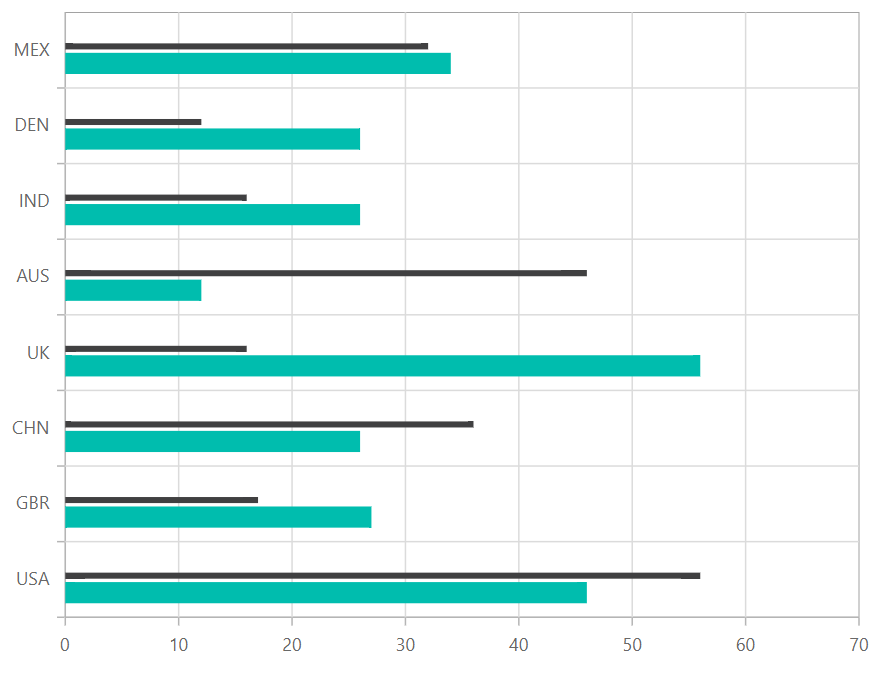
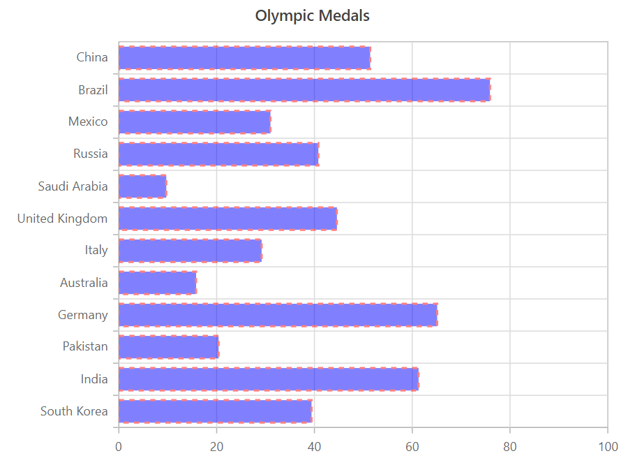

# Bar Chart in Blazor Charts (SfCharts)

## Bar

[`Bar Chart`](https://www.syncfusion.com/blazor-components/blazor-charts/chart-types/bar-chart) is the most commonly used chart type to compare different categories of data, such as  **Frequency**, **Count**, **Total**, or **Average** displayed in horizontal bars. It is ideal for showing variations in the value of an item over time.

```csharp

@using Syncfusion.Blazor.Charts

<SfChart Title="Olympic Medals">    
    <ChartPrimaryXAxis ValueType="Syncfusion.Blazor.Charts.ValueType.Category">
    </ChartPrimaryXAxis>

    <ChartSeriesCollection>
        <ChartSeries DataSource="@MedalDetails" XName="Country" YName="Gold" Type="ChartSeriesType.Bar">
        </ChartSeries>
    </ChartSeriesCollection>
</SfChart>

@code{
    public class ChartData
    {
        public string Country { get; set; }
        public double Gold { get; set; }
    }
    public List<ChartData> MedalDetails = new List<ChartData>
{
    new ChartData{ Country= "USA", Gold=50  },
    new ChartData{ Country="China", Gold=40 },
    new ChartData{ Country= "Japan", Gold=70 },
    new ChartData{ Country= "Australia", Gold=60},
    new ChartData{ Country= "France", Gold=50 },
    new ChartData{ Country= "Germany", Gold=40 },
    new ChartData{ Country= "Italy", Gold=40 },
    new ChartData{ Country= "Sweden", Gold=30 }
    };
}

```

> Refer to our Blazor [`Bar Charts`](https://www.syncfusion.com/blazor-components/blazor-charts/chart-types/bar-chart) feature tour page to know about its other groundbreaking feature representations. Explore our Blazor [`Bar Chart Example`](https://blazor.syncfusion.com/demos/chart/bar?theme=bootstrap4) to compare values across categories by using horizontal bars.

## Bar Space and Width

[`ColumnSpacing`](https://help.syncfusion.com/cr/blazor/Syncfusion.Blazor.Charts.ChartSeries.html#Syncfusion_Blazor_Charts_ChartSeries_ColumnSpacing) and [`ColumnWidth`](https://help.syncfusion.com/cr/blazor/Syncfusion.Blazor.Charts.ChartSeries.html#Syncfusion_Blazor_Charts_ChartSeries_ColumnWidth) properties are used to customize the space between the bars.

```csharp
@using Syncfusion.Blazor.Charts

<SfChart Title="Olympic Medals">
    <ChartPrimaryXAxis ValueType="Syncfusion.Blazor.Charts.ValueType.Category">
    </ChartPrimaryXAxis>
    <ChartSeriesCollection>
        <ChartSeries DataSource="@MedalDetails" XName="Country" YName="Gold" ColumnSpacing="0.2" ColumnWidth="0.7" Type="ChartSeriesType.Bar">
        </ChartSeries>
    </ChartSeriesCollection>
</SfChart>

@code{
    public class ChartData
    {
        public string Country { get; set; }
        public double Gold { get; set; }
    }
    public List<ChartData> MedalDetails = new List<ChartData>
    {
        new ChartData{ Country= "USA", Gold=50  },
        new ChartData{ Country="China", Gold=40 },
        new ChartData{ Country= "Japan", Gold=70 },
        new ChartData{ Country= "Australia", Gold=60},
        new ChartData{ Country= "France", Gold=50 },
        new ChartData{ Country= "Germany", Gold=40 },
        new ChartData{ Country= "Italy", Gold=40 },
        new ChartData{ Country= "Sweden", Gold=30 }
    };
}
```



## Series Customization

The following properties can be used to customize the [`Bar`](https://help.syncfusion.com/cr/blazor/Syncfusion.Blazor.Charts.ChartSeriesType.html#Syncfusion_Blazor_Charts_ChartSeriesType_Bar) series.

* [`Fill`](https://help.syncfusion.com/cr/blazor/Syncfusion.Blazor.Charts.ChartSeries.html#Syncfusion_Blazor_Charts_ChartSeries_Fill) – Specifies the color of the series.
* [`Opacity`](https://help.syncfusion.com/cr/blazor/Syncfusion.Blazor.Charts.ChartSeries.html#Syncfusion_Blazor_Charts_ChartSeries_Opacity) – Specifies the opacity of [`Fill`](https://help.syncfusion.com/cr/blazor/Syncfusion.Blazor.Charts.ChartSeries.html#Syncfusion_Blazor_Charts_ChartSeries_Fill).
* [`DashArray`](https://help.syncfusion.com/cr/blazor/Syncfusion.Blazor.Charts.ChartSeries.html#Syncfusion_Blazor_Charts_ChartSeries_DashArray) – Specifies the dashes of series.
* [`ChartSeriesBorder`](https://help.syncfusion.com/cr/blazor/Syncfusion.Blazor.Charts.ChartSeriesBorder.html) – Specifies the [`Color`](https://help.syncfusion.com/cr/blazor/Syncfusion.Blazor.Charts.ChartCommonBorder.html#Syncfusion_Blazor_Charts_ChartCommonBorder_Color) and [`Width`](https://help.syncfusion.com/cr/blazor/Syncfusion.Blazor.Charts.ChartCommonBorder.html#Syncfusion_Blazor_Charts_ChartCommonBorder_Width) of series border.

```csharp
@using Syncfusion.Blazor.Charts

<SfChart Title="Olympic Medals">
    <ChartPrimaryXAxis ValueType="Syncfusion.Blazor.Charts.ValueType.Category">
    </ChartPrimaryXAxis>
    <ChartSeriesCollection>
        <ChartSeries DataSource="@MedalDetails" XName="Country" YName="Gold" Opacity="0.5" DashArray="5,5" Fill="blue" Type="ChartSeriesType.Bar">
        </ChartSeries>
    </ChartSeriesCollection>
</SfChart>

@code{
    public class ChartData
    {
        public string Country { get; set; }
        public double Gold { get; set; }
    }
    public List<ChartData> MedalDetails = new List<ChartData>
    {
        new ChartData{ Country= "USA", Gold=50  },
        new ChartData{ Country="China", Gold=40 },
        new ChartData{ Country= "Japan", Gold=70 },
        new ChartData{ Country= "Australia", Gold=60},
        new ChartData{ Country= "France", Gold=50 },
        new ChartData{ Country= "Germany", Gold=40 },
        new ChartData{ Country= "Italy", Gold=40 },
        new ChartData{ Country= "Sweden", Gold=30 }
    };
}
```



> Refer to our [`Blazor Charts`](https://www.syncfusion.com/blazor-components/blazor-charts) feature tour page for its groundbreaking feature representations and also explore our [`Blazor Chart example`](https://blazor.syncfusion.com/demos/chart/line?theme=bootstrap4) to know various chart types and how to represent time-dependent data, showing trends at equal intervals.

## See Also

* [Data Label](../data-labels)
* [Tooltip](../tool-tip)