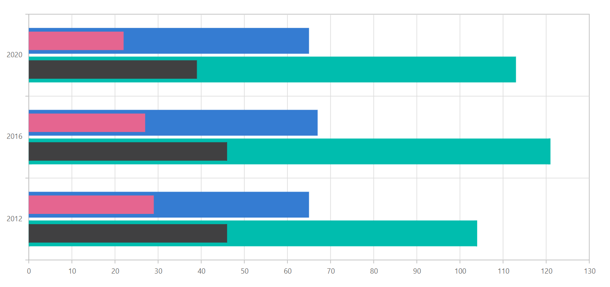

# Bar Charts in Blazor Charts Component

## Bar

[Bar Chart](https://www.syncfusion.com/blazor-components/blazor-charts/chart-types/bar-chart) is the most commonly used chart type to compare different categories of data, such as  **Frequency**, **Count**, **Total**, or **Average** displayed in horizontal bars. It is ideal for showing variations in the value of an item over time. To render a bar series, set series [Type](https://help.syncfusion.com/cr/blazor/Syncfusion.Blazor.Charts.ChartSeries.html#Syncfusion_Blazor_Charts_ChartSeries_Type) as [Bar](https://help.syncfusion.com/cr/blazor/Syncfusion.Blazor.Charts.ChartSeriesType.html#Syncfusion_Blazor_Charts_ChartSeriesType_Bar).

```cshtml

@using Syncfusion.Blazor.Charts

<SfChart Title="Olympic Medals">
    <ChartPrimaryXAxis ValueType="Syncfusion.Blazor.Charts.ValueType.Category">
    </ChartPrimaryXAxis>

    <ChartSeriesCollection>
        <ChartSeries DataSource="@MedalDetails" XName="Country" YName="Gold" Type="ChartSeriesType.Bar">
        </ChartSeries>
    </ChartSeriesCollection>
</SfChart>

@code{
    public class ChartData
    {
        public string Country { get; set; }
        public double Gold { get; set; }
    }

    public List<ChartData> MedalDetails = new List<ChartData>
	{
		new ChartData{ Country= "USA", Gold=50  },
		new ChartData{ Country="China", Gold=40 },
		new ChartData{ Country= "Japan", Gold=70 },
		new ChartData{ Country= "Australia", Gold=60},
		new ChartData{ Country= "France", Gold=50 },
		new ChartData{ Country= "Germany", Gold=40 },
		new ChartData{ Country= "Italy", Gold=40 },
		new ChartData{ Country= "Sweden", Gold=30 }
    };
}

```

N> Refer to our [Blazor Bar Charts](https://www.syncfusion.com/blazor-components/blazor-charts/chart-types/bar-chart) feature tour page to know about its other groundbreaking feature representations. Explore our [Blazor Bar Chart Example](https://blazor.syncfusion.com/demos/chart/bar) to compare values across categories by using horizontal bars.

## Bar space and width

The [ColumnSpacing](https://help.syncfusion.com/cr/blazor/Syncfusion.Blazor.Charts.ChartSeries.html#Syncfusion_Blazor_Charts_ChartSeries_ColumnSpacing) and [ColumnWidth](https://help.syncfusion.com/cr/blazor/Syncfusion.Blazor.Charts.ChartSeries.html#Syncfusion_Blazor_Charts_ChartSeries_ColumnWidth) properties are used to customize the space between bars. The default value of [ColumnSpacing](https://help.syncfusion.com/cr/blazor/Syncfusion.Blazor.Charts.ChartSeries.html#Syncfusion_Blazor_Charts_ChartSeries_ColumnSpacing) is 0, and the default value of [ColumnWidth](https://help.syncfusion.com/cr/blazor/Syncfusion.Blazor.Charts.ChartSeries.html#Syncfusion_Blazor_Charts_ChartSeries_ColumnWidth) is 0.7. Both properties range from 0 to 1.

```cshtml

@using Syncfusion.Blazor.Charts

<SfChart Title="Olympic Medals">
    <ChartPrimaryXAxis ValueType="Syncfusion.Blazor.Charts.ValueType.Category">
    </ChartPrimaryXAxis>

    <ChartSeriesCollection>
        <ChartSeries DataSource="@MedalDetails" XName="Country" YName="Gold" ColumnSpacing="0.2" ColumnWidth="0.7" Type="ChartSeriesType.Bar">
        </ChartSeries>
    </ChartSeriesCollection>
</SfChart>

@code{
    public class ChartData
    {
        public string Country { get; set; }
        public double Gold { get; set; }
    }

    public List<ChartData> MedalDetails = new List<ChartData>
    {
        new ChartData{ Country= "USA", Gold=50  },
        new ChartData{ Country="China", Gold=40 },
        new ChartData{ Country= "Japan", Gold=70 },
        new ChartData{ Country= "Australia", Gold=60},
        new ChartData{ Country= "France", Gold=50 },
        new ChartData{ Country= "Germany", Gold=40 },
        new ChartData{ Country= "Italy", Gold=40 },
        new ChartData{ Country= "Sweden", Gold=30 }
    };
}

```


## Grouped bar

You can use the [GroupName](https://help.syncfusion.com/cr/blazor/Syncfusion.Blazor.Charts.ChartSeries.html#Syncfusion_Blazor_Charts_ChartSeries_GroupName) property to group the data points in the bar type charts. Data points with same group name are grouped together.

```cshtml

@using Syncfusion.Blazor.Charts

<SfChart>
        <ChartPrimaryXAxis ValueType="@Syncfusion.Blazor.Charts.ValueType.Category">
        </ChartPrimaryXAxis>
        <ChartSeriesCollection>
            <ChartSeries DataSource="@ChartPoints" XName="Year" YName="USA_Total" GroupName="USA" ColumnWidth="0.7" ColumnSpacing="0.1" Type="ChartSeriesType.Bar">
            </ChartSeries>
            <ChartSeries DataSource="@ChartPoints" XName="Year" YName="USA_Gold" GroupName="USA" ColumnWidth="0.5" ColumnSpacing="0.1" Type="ChartSeriesType.Bar">
             </ChartSeries>
            <ChartSeries DataSource="@ChartPoints" XName="Year" YName="UK_Total" GroupName="UK" ColumnWidth="0.7" ColumnSpacing="0.1" Type="ChartSeriesType.Bar">
            </ChartSeries>
            <ChartSeries DataSource="@ChartPoints" XName="Year" YName="UK_Gold" GroupName="UK" ColumnWidth="0.5" ColumnSpacing="0.1" Type="ChartSeriesType.Bar">
            </ChartSeries>
        </ChartSeriesCollection>
    </SfChart>

@code{
    public class ColumnData
    {
        public string Year { get; set; }
        public double USA_Total { get; set; }
        public double USA_Gold { get; set; }
        public double UK_Total { get; set; }
        public double UK_Gold { get; set; }
        public double China_Total { get; set; }
        public double China_Gold { get; set; }
    }
    public List<ColumnData> ChartPoints { get; set; } = new List<ColumnData>
    {
        new ColumnData { Year = "2012", USA_Total = 104, USA_Gold = 46, UK_Total = 65, UK_Gold = 29, China_Total = 91, China_Gold = 38},
        new ColumnData { Year = "2016", USA_Total = 121, USA_Gold = 46, UK_Total = 67, UK_Gold = 27, China_Total = 70, China_Gold = 26},
        new ColumnData { Year = "2020", USA_Total = 113, USA_Gold = 39, UK_Total = 65, UK_Gold = 22, China_Total = 88, China_Gold = 38},
    };
}

```



## Series customization

The following properties can be used to customize the [Bar](https://help.syncfusion.com/cr/blazor/Syncfusion.Blazor.Charts.ChartSeriesType.html#Syncfusion_Blazor_Charts_ChartSeriesType_Bar) series.

* [Fill](https://help.syncfusion.com/cr/blazor/Syncfusion.Blazor.Charts.ChartSeries.html#Syncfusion_Blazor_Charts_ChartSeries_Fill) – Specifies the color of the series.
* [Opacity](https://help.syncfusion.com/cr/blazor/Syncfusion.Blazor.Charts.ChartSeries.html#Syncfusion_Blazor_Charts_ChartSeries_Opacity) – Specifies the opacity of [Fill](https://help.syncfusion.com/cr/blazor/Syncfusion.Blazor.Charts.ChartSeries.html#Syncfusion_Blazor_Charts_ChartSeries_Fill).
* [DashArray](https://help.syncfusion.com/cr/blazor/Syncfusion.Blazor.Charts.ChartSeries.html#Syncfusion_Blazor_Charts_ChartSeries_DashArray) – Specifies the dashes of series.
* [ChartSeriesBorder](https://help.syncfusion.com/cr/blazor/Syncfusion.Blazor.Charts.ChartSeriesBorder.html) – Specifies the [Color](https://help.syncfusion.com/cr/blazor/Syncfusion.Blazor.Charts.ChartCommonBorder.html#Syncfusion_Blazor_Charts_ChartCommonBorder_Color) and [Width](https://help.syncfusion.com/cr/blazor/Syncfusion.Blazor.Charts.ChartCommonBorder.html#Syncfusion_Blazor_Charts_ChartCommonBorder_Width) of series border.

```cshtml

@using Syncfusion.Blazor.Charts

<SfChart Title="Olympic Medals">
    <ChartPrimaryXAxis ValueType="Syncfusion.Blazor.Charts.ValueType.Category">
    </ChartPrimaryXAxis>

    <ChartSeriesCollection>
        <ChartSeries DataSource="@MedalDetails" XName="Country" YName="Gold" Opacity="0.5" DashArray="5,5" Fill="blue" Type="ChartSeriesType.Bar">
        <ChartSeriesBorder Width="2" Color="red"></ChartSeriesBorder>
        </ChartSeries>
    </ChartSeriesCollection>
</SfChart>

@code{
    public class ChartData
    {
        public string Country { get; set; }
        public double Gold { get; set; }
    }

    public List<ChartData> MedalDetails = new List<ChartData>
    {
        new ChartData{ Country= "USA", Gold=50  },
        new ChartData{ Country="China", Gold=40 },
        new ChartData{ Country= "Japan", Gold=70 },
        new ChartData{ Country= "Australia", Gold=60},
        new ChartData{ Country= "France", Gold=50 },
        new ChartData{ Country= "Germany", Gold=40 },
        new ChartData{ Country= "Italy", Gold=40 },
        new ChartData{ Country= "Sweden", Gold=30 }
    };
}

```


N> Refer to our [Blazor Charts](https://www.syncfusion.com/blazor-components/blazor-charts) feature tour page for its groundbreaking feature representations and also explore our [Blazor Chart Example](https://blazor.syncfusion.com/demos/chart/line) to know various chart types and how to represent time-dependent data, showing trends at equal intervals.

## See also

* [Creating stacked waterfall chart using Blazor bar chart](https://support.syncfusion.com/kb/article/11589/creating-stacked-waterfall-chart-using-blazor-bar-chart)
* [Data Label](../data-labels)
* [Tooltip](../tool-tip)
