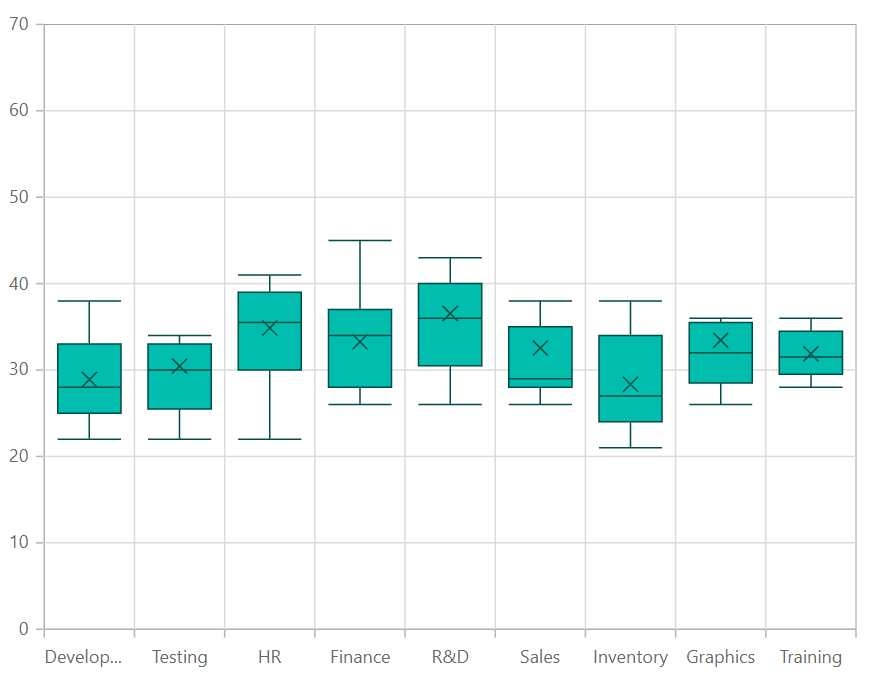

# Box and Whisker Chart in Blazor Charts Component

## Box and Whisker Chart

The [Box and Whisker Chart](https://www.syncfusion.com/blazor-components/blazor-charts/chart-types/box-and-whisker-chart) visualizes variation in a set of data. Render the chart by setting the series [Type](https://help.syncfusion.com/cr/blazor/Syncfusion.Blazor.Charts.ChartSeries.html#Syncfusion_Blazor_Charts_ChartSeries_Type) to [BoxAndWhisker](https://help.syncfusion.com/cr/blazor/Syncfusion.Blazor.Charts.ChartSeriesType.html#Syncfusion_Blazor_Charts_ChartSeriesType_BoxAndWhisker). The [YName](https://help.syncfusion.com/cr/blazor/Syncfusion.Blazor.Charts.ChartSeries.html#Syncfusion_Blazor_Charts_ChartSeries_YName) property requires a minimum of five values for each segment. Here's a concise guide on how to do this:
 
1. **Set the series type**: Define the series [Type](https://help.syncfusion.com/cr/blazor/Syncfusion.Blazor.Charts.ChartSeries.html#Syncfusion_Blazor_Charts_ChartSeries_Type) as [BoxAndWhisker](https://help.syncfusion.com/cr/blazor/Syncfusion.Blazor.Charts.ChartSeriesType.html#Syncfusion_Blazor_Charts_ChartSeriesType_BoxAndWhisker) in your chart configuration. This indicates that the data should be represented as a box and whisker chart, which will plot segments to illustrate the statistical distribution of the data.

2. **Provide data requirements**: The y field of the Box and Whisker series requires a specific number of data points, with a minimum of five values needed to plot a segment.

```cshtml

@using Syncfusion.Blazor.Charts

<SfChart>
    <ChartPrimaryXAxis ValueType="Syncfusion.Blazor.Charts.ValueType.Category" />

    <ChartSeriesCollection>
        <ChartSeries DataSource="@ExpenseDetails" XName="XValue" YName="YValue" Type="ChartSeriesType.BoxAndWhisker">
        </ChartSeries>
    </ChartSeriesCollection>
</SfChart>

@code {
    public class ChartData
    {
        public string XValue { get; set; }
        public double[] YValue { get; set; }
    }

    public List<ChartData> ExpenseDetails = new List<ChartData>
	{
        new ChartData { XValue = "Development", YValue = new double[]{ 22, 22, 23, 25, 25, 25, 26, 27, 27, 28, 28, 29, 30, 32, 34, 32, 34, 36, 35, 38 } },
        new ChartData { XValue = "Testing", YValue = new double[] { 22, 33, 23, 25, 26, 28, 29, 30, 34, 33, 32, 31, 50 }},
        new ChartData { XValue = "HR", YValue = new double[] { 22, 24, 25, 30, 32, 34, 36, 38, 39, 41, 35, 36, 40, 56 } },
        new ChartData { XValue = "Finance", YValue =  new double[] { 26, 27, 28, 30, 32, 34, 35, 37, 35, 37, 45 } },
        new ChartData { XValue = "R&D", YValue = new double[] { 26, 27, 29, 32, 34, 35, 36, 37, 38, 39, 41, 43, 58 } },
        new ChartData { XValue = "Sales", YValue = new double[] { 27, 26, 28, 29, 29, 29, 32, 35, 32, 38, 53 } },
        new ChartData { XValue = "Inventory", YValue = new double[] { 21, 23, 24, 25, 26, 27, 28, 30, 34, 36, 38 } },
        new ChartData { XValue = "Graphics", YValue = new double[] { 26, 28, 29, 30, 32, 33, 35, 36, 52 } },
        new ChartData { XValue = "Training", YValue = new double[] { 28, 29, 30, 31, 32, 34, 35, 36 } }
    };
}

``` 




Refer to the [Blazor Box and Whisker Charts](https://www.syncfusion.com/blazor-components/blazor-charts/chart-types/box-and-whisker-chart) feature tour page for more feature details. Explore the [Blazor Box and Whisker Chart Example](https://blazor.syncfusion.com/demos/chart/box-and-whisker) to learn how to render and configure box and whisker charts with interactive examples.

## Binding data with series

Bind data to the chart using the [`DataSource`](https://help.syncfusion.com/cr/blazor/Syncfusion.Blazor.Charts.ChartSeries.html#Syncfusion_Blazor_Charts_ChartSeries_DataSource) property in the series configuration. The [`DataSource`](https://help.syncfusion.com/cr/blazor/Syncfusion.Blazor.Charts.ChartSeries.html#Syncfusion_Blazor_Charts_ChartSeries_DataSource) value can be set using either [`SfDataManager`](https://help.syncfusion.com/cr/blazor/Syncfusion.Blazor.Data.SfDataManager.html) or a list of business objects. For more information, see [Working with Data](../working-with-data). Map the data fields to the chart series' [`XName`](https://help.syncfusion.com/cr/blazor/Syncfusion.Blazor.Charts.ChartSeries.html#Syncfusion_Blazor_Charts_ChartSeries_XName) and [`YName`](https://help.syncfusion.com/cr/blazor/Syncfusion.Blazor.Charts.ChartSeries.html#Syncfusion_Blazor_Charts_ChartSeries_YName) properties.

```cshtml

@using Syncfusion.Blazor.Charts

<SfChart>
    <ChartPrimaryXAxis ValueType="Syncfusion.Blazor.Charts.ValueType.Category" />

    <ChartSeriesCollection>
        <ChartSeries DataSource="@ExpenseDetails" XName="XValue" YName="YValue" Type="ChartSeriesType.BoxAndWhisker">
        </ChartSeries>
    </ChartSeriesCollection>
</SfChart>

@code {
    public class ChartData
    {
        public string XValue { get; set; }
        public double[] YValue { get; set; }
    }

    public List<ChartData> ExpenseDetails = new List<ChartData>
	{
        new ChartData { XValue = "Development", YValue = new double[]{ 22, 22, 23, 25, 25, 25, 26, 27, 27, 28, 28, 29, 30, 32, 34, 32, 34, 36, 35, 38 } },
        new ChartData { XValue = "Testing", YValue = new double[] { 22, 33, 23, 25, 26, 28, 29, 30, 34, 33, 32, 31, 50 }},
        new ChartData { XValue = "HR", YValue = new double[] { 22, 24, 25, 30, 32, 34, 36, 38, 39, 41, 35, 36, 40, 56 } },
        new ChartData { XValue = "Finance", YValue =  new double[] { 26, 27, 28, 30, 32, 34, 35, 37, 35, 37, 45 } },
        new ChartData { XValue = "R&D", YValue = new double[] { 26, 27, 29, 32, 34, 35, 36, 37, 38, 39, 41, 43, 58 } },
        new ChartData { XValue = "Sales", YValue = new double[] { 27, 26, 28, 29, 29, 29, 32, 35, 32, 38, 53 } },
        new ChartData { XValue = "Inventory", YValue = new double[] { 21, 23, 24, 25, 26, 27, 28, 30, 34, 36, 38 } },
        new ChartData { XValue = "Graphics", YValue = new double[] { 26, 28, 29, 30, 32, 33, 35, 36, 52 } },
        new ChartData { XValue = "Training", YValue = new double[] { 28, 29, 30, 31, 32, 34, 35, 36 } }
    };
}

``` 


## Series customization

Customize the [BoxAndWhisker](https://help.syncfusion.com/cr/blazor/Syncfusion.Blazor.Charts.ChartSeriesType.html#Syncfusion_Blazor_Charts_ChartSeriesType_BoxAndWhisker) series using the following properties:

**Fill**

The [Fill](https://help.syncfusion.com/cr/blazor/Syncfusion.Blazor.Charts.ChartSeries.html#Syncfusion_Blazor_Charts_ChartSeries_Fill) property sets the color for the series.

```cshtml

@using Syncfusion.Blazor.Charts

<SfChart>
    <ChartPrimaryXAxis ValueType="Syncfusion.Blazor.Charts.ValueType.Category">
    </ChartPrimaryXAxis>

    <ChartSeriesCollection>
        <ChartSeries DataSource="@ExpenseDetails" XName="XValue" YName="YValue" Type="Syncfusion.Blazor.Charts.ChartSeriesType.BoxAndWhisker" Fill="blue">
        </ChartSeries>
    </ChartSeriesCollection>
</SfChart>

@code {
    public class ChartData
    {
        public string XValue { get; set; }
        public double[] YValue { get; set; }
    }

    public List<ChartData> ExpenseDetails = new List<ChartData>
    {
        new ChartData { XValue = "Development", YValue = new double[]{ 22, 22, 23, 25, 25, 25, 26, 27, 27, 28, 28, 29, 30, 32, 34, 32, 34, 36, 35, 38 } },
        new ChartData { XValue = "Testing", YValue = new double[] { 22, 33, 23, 25, 26, 28, 29, 30, 34, 33, 32, 31, 50 }},
        new ChartData { XValue = "HR", YValue = new double[] { 22, 24, 25, 30, 32, 34, 36, 38, 39, 41, 35, 36, 40, 56 } },
        new ChartData { XValue = "Finance", YValue =  new double[] { 26, 27, 28, 30, 32, 34, 35, 37, 35, 37, 45 } },
        new ChartData { XValue = "R&D", YValue = new double[] { 26, 27, 29, 32, 34, 35, 36, 37, 38, 39, 41, 43, 58 } },
        new ChartData { XValue = "Sales", YValue = new double[] { 27, 26, 28, 29, 29, 29, 32, 35, 32, 38, 53 } },
        new ChartData { XValue = "Inventory", YValue = new double[] { 21, 23, 24, 25, 26, 27, 28, 30, 34, 36, 38 } },
        new ChartData { XValue = "Graphics", YValue = new double[] { 26, 28, 29, 30, 32, 33, 35, 36, 52 } },
        new ChartData { XValue = "Training", YValue = new double[] { 28, 29, 30, 31, 32, 34, 35, 36 } }
    };
}


```


**Opacity**

The [Opacity](https://help.syncfusion.com/cr/blazor/Syncfusion.Blazor.Charts.ChartSeries.html#Syncfusion_Blazor_Charts_ChartSeries_Opacity) property controls the transparency of the [Fill](https://help.syncfusion.com/cr/blazor/Syncfusion.Blazor.Charts.ChartSeries.html#Syncfusion_Blazor_Charts_ChartSeries_Fill) color, allowing adjustment of the series' appearance.

```cshtml

@using Syncfusion.Blazor.Charts

<SfChart>
    <ChartPrimaryXAxis ValueType="Syncfusion.Blazor.Charts.ValueType.Category" />

    <ChartSeriesCollection>
        <ChartSeries DataSource="@ExpenseDetails" XName="XValue" YName="YValue" Fill="blue" Opacity="0.5" Type="Syncfusion.Blazor.Charts.ChartSeriesType.BoxAndWhisker">
        </ChartSeries>
    </ChartSeriesCollection>
</SfChart>

@code {
    public class ChartData
    {
        public string XValue { get; set; }
        public double[] YValue { get; set; }
    }

    public List<ChartData> ExpenseDetails = new List<ChartData>
    {
        new ChartData { XValue = "Development", YValue = new double[]{ 22, 22, 23, 25, 25, 25, 26, 27, 27, 28, 28, 29, 30, 32, 34, 32, 34, 36, 35, 38 } },
        new ChartData { XValue = "Testing", YValue = new double[] { 22, 33, 23, 25, 26, 28, 29, 30, 34, 33, 32, 31, 50 }},
        new ChartData { XValue = "HR", YValue = new double[] { 22, 24, 25, 30, 32, 34, 36, 38, 39, 41, 35, 36, 40, 56 } },
        new ChartData { XValue = "Finance", YValue =  new double[] { 26, 27, 28, 30, 32, 34, 35, 37, 35, 37, 45 } },
        new ChartData { XValue = "R&D", YValue = new double[] { 26, 27, 29, 32, 34, 35, 36, 37, 38, 39, 41, 43, 58 } },
        new ChartData { XValue = "Sales", YValue = new double[] { 27, 26, 28, 29, 29, 29, 32, 35, 32, 38, 53 } },
        new ChartData { XValue = "Inventory", YValue = new double[] { 21, 23, 24, 25, 26, 27, 28, 30, 34, 36, 38 } },
        new ChartData { XValue = "Graphics", YValue = new double[] { 26, 28, 29, 30, 32, 33, 35, 36, 52 } },
        new ChartData { XValue = "Training", YValue = new double[] { 28, 29, 30, 31, 32, 34, 35, 36 } }
    };
}

```


**DashArray**

The [DashArray](https://help.syncfusion.com/cr/blazor/Syncfusion.Blazor.Charts.ChartSeries.html#Syncfusion_Blazor_Charts_ChartSeries_DashArray) property sets the pattern of dashes and gaps in the series.

```cshtml

@using Syncfusion.Blazor.Charts

<SfChart>
    <ChartPrimaryXAxis ValueType="Syncfusion.Blazor.Charts.ValueType.Category" />

    <ChartSeriesCollection>
        <ChartSeries DataSource="@ExpenseDetails" XName="XValue" YName="YValue" Fill="blue" Opacity="0.5" DashArray="5,5" Type="Syncfusion.Blazor.Charts.ChartSeriesType.BoxAndWhisker">
        </ChartSeries>
    </ChartSeriesCollection>
</SfChart>

@code {
    public class ChartData
    {
        public string XValue { get; set; }
        public double[] YValue { get; set; }
    }

    public List<ChartData> ExpenseDetails = new List<ChartData>
    {
        new ChartData { XValue = "Development", YValue = new double[]{ 22, 22, 23, 25, 25, 25, 26, 27, 27, 28, 28, 29, 30, 32, 34, 32, 34, 36, 35, 38 } },
        new ChartData { XValue = "Testing", YValue = new double[] { 22, 33, 23, 25, 26, 28, 29, 30, 34, 33, 32, 31, 50 }},
        new ChartData { XValue = "HR", YValue = new double[] { 22, 24, 25, 30, 32, 34, 36, 38, 39, 41, 35, 36, 40, 56 } },
        new ChartData { XValue = "Finance", YValue =  new double[] { 26, 27, 28, 30, 32, 34, 35, 37, 35, 37, 45 } },
        new ChartData { XValue = "R&D", YValue = new double[] { 26, 27, 29, 32, 34, 35, 36, 37, 38, 39, 41, 43, 58 } },
        new ChartData { XValue = "Sales", YValue = new double[] { 27, 26, 28, 29, 29, 29, 32, 35, 32, 38, 53 } },
        new ChartData { XValue = "Inventory", YValue = new double[] { 21, 23, 24, 25, 26, 27, 28, 30, 34, 36, 38 } },
        new ChartData { XValue = "Graphics", YValue = new double[] { 26, 28, 29, 30, 32, 33, 35, 36, 52 } },
        new ChartData { XValue = "Training", YValue = new double[] { 28, 29, 30, 31, 32, 34, 35, 36 } }
    };
}

```


**Series Border**

Customize the series border using [ChartSeriesBorder](https://help.syncfusion.com/cr/blazor/Syncfusion.Blazor.Charts.ChartSeriesBorder.html), including [Width](https://help.syncfusion.com/cr/blazor/Syncfusion.Blazor.Charts.ChartCommonBorder.html#Syncfusion_Blazor_Charts_ChartCommonBorder_Width) and [Color](https://help.syncfusion.com/cr/blazor/Syncfusion.Blazor.Charts.ChartCommonBorder.html#Syncfusion_Blazor_Charts_ChartCommonBorder_Color).

```cshtml

@using Syncfusion.Blazor.Charts

<SfChart>
    <ChartPrimaryXAxis ValueType="Syncfusion.Blazor.Charts.ValueType.Category" />

    <ChartSeriesCollection>
        <ChartSeries DataSource="@ExpenseDetails" XName="XValue" YName="YValue" Fill="blue" Opacity="0.5" Type="Syncfusion.Blazor.Charts.ChartSeriesType.BoxAndWhisker">
            <ChartSeriesBorder Width="2" Color="red"></ChartSeriesBorder>
        </ChartSeries>
    </ChartSeriesCollection>
</SfChart>

@code {
    public class ChartData
    {
        public string XValue { get; set; }
        public double[] YValue { get; set; }
    }

    public List<ChartData> ExpenseDetails = new List<ChartData>
    {
        new ChartData { XValue = "Development", YValue = new double[]{ 22, 22, 23, 25, 25, 25, 26, 27, 27, 28, 28, 29, 30, 32, 34, 32, 34, 36, 35, 38 } },
        new ChartData { XValue = "Testing", YValue = new double[] { 22, 33, 23, 25, 26, 28, 29, 30, 34, 33, 32, 31, 50 }},
        new ChartData { XValue = "HR", YValue = new double[] { 22, 24, 25, 30, 32, 34, 36, 38, 39, 41, 35, 36, 40, 56 } },
        new ChartData { XValue = "Finance", YValue =  new double[] { 26, 27, 28, 30, 32, 34, 35, 37, 35, 37, 45 } },
        new ChartData { XValue = "R&D", YValue = new double[] { 26, 27, 29, 32, 34, 35, 36, 37, 38, 39, 41, 43, 58 } },
        new ChartData { XValue = "Sales", YValue = new double[] { 27, 26, 28, 29, 29, 29, 32, 35, 32, 38, 53 } },
        new ChartData { XValue = "Inventory", YValue = new double[] { 21, 23, 24, 25, 26, 27, 28, 30, 34, 36, 38 } },
        new ChartData { XValue = "Graphics", YValue = new double[] { 26, 28, 29, 30, 32, 33, 35, 36, 52 } },
        new ChartData { XValue = "Training", YValue = new double[] { 28, 29, 30, 31, 32, 34, 35, 36 } }
    };
}

```


## Box plot

Change the rendering mode of the Box and Whisker series using the [BoxPlotMode](https://help.syncfusion.com/cr/blazor/Syncfusion.Blazor.Charts.BoxPlotMode.html) property. The default is [Exclusive](https://help.syncfusion.com/cr/blazor/Syncfusion.Blazor.Charts.BoxPlotMode.html#Syncfusion_Blazor_Charts_BoxPlotMode_Exclusive).

```cshtml

@using Syncfusion.Blazor.Charts

<SfChart>
    <ChartPrimaryXAxis ValueType="Syncfusion.Blazor.Charts.ValueType.Category" />

    <ChartSeriesCollection>
        <ChartSeries DataSource="@ExpenseDetails" XName="XValue" YName="YValue" BoxPlotMode="BoxPlotMode.Normal" Type="Syncfusion.Blazor.Charts.ChartSeriesType.BoxAndWhisker">
            <ChartMarker Visible="true" Height="7" Width="7"></ChartMarker>
        </ChartSeries>
    </ChartSeriesCollection>
</SfChart>

@code {
    public class ChartData
    {
        public string XValue { get; set; }
        public double[] YValue { get; set; }
    }

    public List<ChartData> ExpenseDetails = new List<ChartData>
    {
        new ChartData { XValue = "Development", YValue = new double[]{ 22, 22, 23, 25, 25, 25, 26, 27, 27, 28, 28, 29, 30, 32, 34, 32, 34, 36, 35, 38 } },
        new ChartData { XValue = "Testing", YValue = new double[] { 22, 33, 23, 25, 26, 28, 29, 30, 34, 33, 32, 31, 50 }},
        new ChartData { XValue = "HR", YValue = new double[] { 22, 24, 25, 30, 32, 34, 36, 38, 39, 41, 35, 36, 40, 56 } },
        new ChartData { XValue = "Finance", YValue =  new double[] { 26, 27, 28, 30, 32, 34, 35, 37, 35, 37, 45 } },
        new ChartData { XValue = "R&D", YValue = new double[] { 26, 27, 29, 32, 34, 35, 36, 37, 38, 39, 41, 43, 58 } },
        new ChartData { XValue = "Sales", YValue = new double[] { 27, 26, 28, 29, 29, 29, 32, 35, 32, 38, 53 } },
        new ChartData { XValue = "Inventory", YValue = new double[] { 21, 23, 24, 25, 26, 27, 28, 30, 34, 36, 38 } },
        new ChartData { XValue = "Graphics", YValue = new double[] { 26, 28, 29, 30, 32, 33, 35, 36, 52 } },
        new ChartData { XValue = "Training", YValue = new double[] { 28, 29, 30, 31, 32, 34, 35, 36 } }
    };
}

``` 


## Show mean

Use the [ShowMean](https://help.syncfusion.com/cr/blazor/Syncfusion.Blazor.Charts.ChartSeries.html#Syncfusion_Blazor_Charts_ChartSeries_ShowMean) property to display the average value in the Box and Whisker series. The default value is **false**.

```cshtml

@using Syncfusion.Blazor.Charts

<SfChart>
    <ChartPrimaryXAxis ValueType="Syncfusion.Blazor.Charts.ValueType.Category" />

    <ChartSeriesCollection>
        <ChartSeries DataSource="@ExpenseDetails" XName="XValue" YName="YValue" Type="ChartSeriesType.BoxAndWhisker" ShowMean="false">
        </ChartSeries>
    </ChartSeriesCollection>
</SfChart>

@code {
    public class ChartData
    {
        public string XValue { get; set; }
        public double[] YValue { get; set; }
    }

    public List<ChartData> ExpenseDetails = new List<ChartData>
	{
        new ChartData { XValue = "Development", YValue = new double[]{ 22, 22, 23, 25, 25, 25, 26, 27, 27, 28, 28, 29, 30, 32, 34, 32, 34, 36, 35, 38 } },
        new ChartData { XValue = "Testing", YValue = new double[] { 22, 33, 23, 25, 26, 28, 29, 30, 34, 33, 32, 31, 50 }},
        new ChartData { XValue = "HR", YValue = new double[] { 22, 24, 25, 30, 32, 34, 36, 38, 39, 41, 35, 36, 40, 56 } },
        new ChartData { XValue = "Finance", YValue =  new double[] { 26, 27, 28, 30, 32, 34, 35, 37, 35, 37, 45 } },
        new ChartData { XValue = "R&D", YValue = new double[] { 26, 27, 29, 32, 34, 35, 36, 37, 38, 39, 41, 43, 58 } },
        new ChartData { XValue = "Sales", YValue = new double[] { 27, 26, 28, 29, 29, 29, 32, 35, 32, 38, 53 } },
        new ChartData { XValue = "Inventory", YValue = new double[] { 21, 23, 24, 25, 26, 27, 28, 30, 34, 36, 38 } },
        new ChartData { XValue = "Graphics", YValue = new double[] { 26, 28, 29, 30, 32, 33, 35, 36, 52 } },
        new ChartData { XValue = "Training", YValue = new double[] { 28, 29, 30, 31, 32, 34, 35, 36 } }
    };
}

``` 


## Events

### Series render

The [`OnSeriesRender`](https://help.syncfusion.com/cr/blazor/Syncfusion.Blazor.Charts.ChartEvents.html#Syncfusion_Blazor_Charts_ChartEvents_OnSeriesRender) event enables customization of series properties, such as [Data](https://help.syncfusion.com/cr/blazor/Syncfusion.Blazor.Charts.SeriesRenderEventArgs.html#Syncfusion_Blazor_Charts_SeriesRenderEventArgs_Data), [Fill](https://help.syncfusion.com/cr/blazor/Syncfusion.Blazor.Charts.SeriesRenderEventArgs.html#Syncfusion_Blazor_Charts_SeriesRenderEventArgs_Fill), and [Series](https://help.syncfusion.com/cr/blazor/Syncfusion.Blazor.Charts.SeriesRenderEventArgs.html#Syncfusion_Blazor_Charts_SeriesRenderEventArgs_Series), before rendering.

```cshtml

@using Syncfusion.Blazor.Charts

<SfChart>
    <ChartEvents OnSeriesRender="SeriesRender" />
    <ChartPrimaryXAxis ValueType="Syncfusion.Blazor.Charts.ValueType.Category" />
    <ChartSeriesCollection>
        <ChartSeries DataSource="@ExpenseDetails" XName="XValue" YName="YValue" Type="Syncfusion.Blazor.Charts.ChartSeriesType.BoxAndWhisker">
        </ChartSeries>
    </ChartSeriesCollection>
</SfChart>

@code {
    public class ChartData
    {
        public string XValue { get; set; }
        public double[] YValue { get; set; }
    }

    public void SeriesRender(SeriesRenderEventArgs args)
    {
        args.Fill = "#FF4081";
    }

    public List<ChartData> ExpenseDetails = new List<ChartData>
    {
        new ChartData { XValue = "Development", YValue = new double[]{ 22, 22, 23, 25, 25, 25, 26, 27, 27, 28, 28, 29, 30, 32, 34, 32, 34, 36, 35, 38 } },
        new ChartData { XValue = "Testing", YValue = new double[] { 22, 33, 23, 25, 26, 28, 29, 30, 34, 33, 32, 31, 50 }},
        new ChartData { XValue = "HR", YValue = new double[] { 22, 24, 25, 30, 32, 34, 36, 38, 39, 41, 35, 36, 40, 56 } },
        new ChartData { XValue = "Finance", YValue =  new double[] { 26, 27, 28, 30, 32, 34, 35, 37, 35, 37, 45 } },
        new ChartData { XValue = "R&D", YValue = new double[] { 26, 27, 29, 32, 34, 35, 36, 37, 38, 39, 41, 43, 58 } },
        new ChartData { XValue = "Sales", YValue = new double[] { 27, 26, 28, 29, 29, 29, 32, 35, 32, 38, 53 } },
        new ChartData { XValue = "Inventory", YValue = new double[] { 21, 23, 24, 25, 26, 27, 28, 30, 34, 36, 38 } },
        new ChartData { XValue = "Graphics", YValue = new double[] { 26, 28, 29, 30, 32, 33, 35, 36, 52 } },
        new ChartData { XValue = "Training", YValue = new double[] { 28, 29, 30, 31, 32, 34, 35, 36 } }
    };
}

```


### Point render

The [`OnPointRender`](https://help.syncfusion.com/cr/blazor/Syncfusion.Blazor.Charts.ChartEvents.html#Syncfusion_Blazor_Charts_ChartEvents_OnPointRender) event allows customization of each data point before rendering.

```cshtml

@using Syncfusion.Blazor.Charts

<SfChart>
    <ChartEvents OnPointRender="PointRender" />
    <ChartPrimaryXAxis ValueType="Syncfusion.Blazor.Charts.ValueType.Category" /> 
    <ChartSeriesCollection>
        <ChartSeries DataSource="@ExpenseDetails" XName="XValue" YName="YValue" Type="Syncfusion.Blazor.Charts.ChartSeriesType.BoxAndWhisker">
        </ChartSeries>
    </ChartSeriesCollection>
</SfChart>

@code {
    public class ChartData
    {
        public string XValue { get; set; }
        public double[] YValue { get; set; }
    }

    public void PointRender(PointRenderEventArgs args)
    {
        args.Fill = args.Point.X.ToString() == "R&D" ? "#E91E63" : "#3F51B5";
    }

    public List<ChartData> ExpenseDetails = new List<ChartData>
    {
        new ChartData { XValue = "Development", YValue = new double[]{ 22, 22, 23, 25, 25, 25, 26, 27, 27, 28, 28, 29, 30, 32, 34, 32, 34, 36, 35, 38 } },
        new ChartData { XValue = "Testing", YValue = new double[] { 22, 33, 23, 25, 26, 28, 29, 30, 34, 33, 32, 31, 50 }},
        new ChartData { XValue = "HR", YValue = new double[] { 22, 24, 25, 30, 32, 34, 36, 38, 39, 41, 35, 36, 40, 56 } },
        new ChartData { XValue = "Finance", YValue =  new double[] { 26, 27, 28, 30, 32, 34, 35, 37, 35, 37, 45 } },
        new ChartData { XValue = "R&D", YValue = new double[] { 26, 27, 29, 32, 34, 35, 36, 37, 38, 39, 41, 43, 58 } },
        new ChartData { XValue = "Sales", YValue = new double[] { 27, 26, 28, 29, 29, 29, 32, 35, 32, 38, 53 } },
        new ChartData { XValue = "Inventory", YValue = new double[] { 21, 23, 24, 25, 26, 27, 28, 30, 34, 36, 38 } },
        new ChartData { XValue = "Graphics", YValue = new double[] { 26, 28, 29, 30, 32, 33, 35, 36, 52 } },
        new ChartData { XValue = "Training", YValue = new double[] { 28, 29, 30, 31, 32, 34, 35, 36 } }
    };
}

```


N> Refer to our [Blazor Charts](https://www.syncfusion.com/blazor-components/blazor-charts) feature tour page for its groundbreaking feature representations and also explore our [Blazor Chart Example](https://blazor.syncfusion.com/demos/chart/line?theme=bootstrap5) to know various chart types and how to represent time-dependent data, showing trends at equal intervals.

## See also

* [Data label](../data-labels)
* [Tooltip](../tool-tip)
