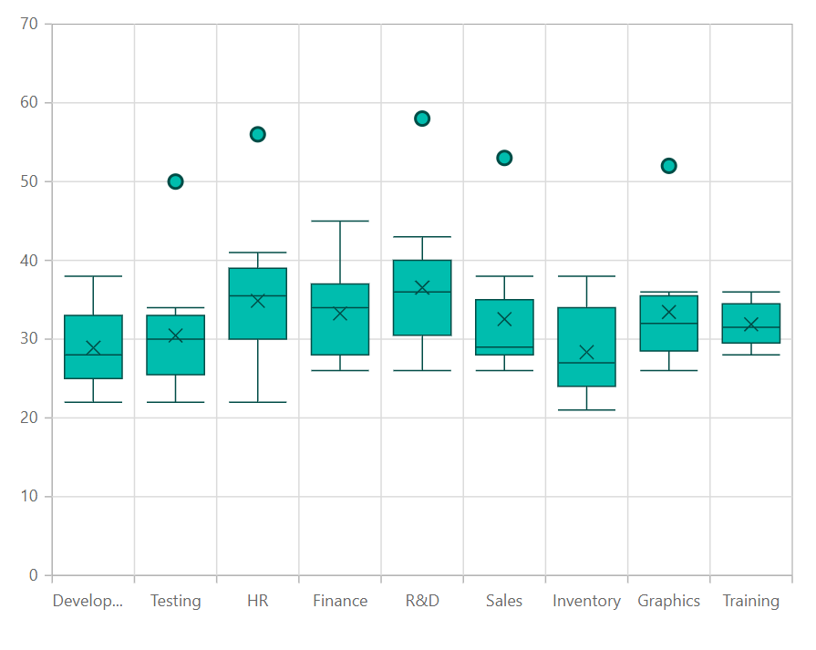
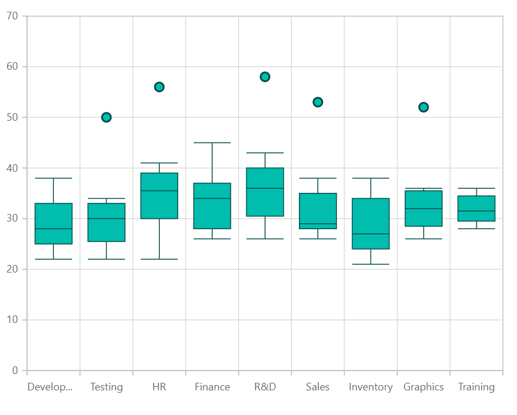

---
title: "Box and Whisker Chart in Blazor Charts component | Syncfusion"

component: "Charts"

description: "Learn here all about Box and Whisker Chart of Syncfusion Charts (SfCharts) component and more."
---

# Box and Whisker Chart in Blazor Charts (SfCharts)

## Box and Whisker

To render a [`Box and Whisker Chart`](https://www.syncfusion.com/blazor-components/blazor-charts/chart-types/box-and-whisker-chart) set the [`Type`](https://help.syncfusion.com/cr/blazor/Syncfusion.Blazor.Charts.ChartSeries.html#Syncfusion_Blazor_Charts_ChartSeries_Type) property to [`BoxAndWhisker`](https://help.syncfusion.com/cr/blazor/Syncfusion.Blazor.Charts.ChartSeriesType.html#Syncfusion_Blazor_Charts_ChartSeriesType_BoxAndWhisker). The property [`YName`](https://help.syncfusion.com/cr/blazor/Syncfusion.Blazor.Charts.ChartSeries.html#Syncfusion_Blazor_Charts_ChartSeries_YName) requires  **n** number of data or it should contains minimum of five values.





> Refer to our Blazor [`Box and Whisker Chart`](https://www.syncfusion.com/blazor-components/blazor-charts/chart-types/box-and-whisker-chart) feature tour page to know about its other groundbreaking feature representations. Explore our Blazor [`Box and Whisker Chart`](https://blazor.syncfusion.com/demos/chart/box-and-whisker) example to know how to render and configure the box and whisker type charts.

## Box Plot

To change the rendering mode of the Box and Whisker series, use the [`BoxPlotMode`](https://help.syncfusion.com/cr/blazor/Syncfusion.Blazor.Charts.BoxPlotMode.html) property. The default [`BoxPlotMode`](https://help.syncfusion.com/cr/blazor/Syncfusion.Blazor.Charts.BoxPlotMode.html) is [`Exclusive`](https://help.syncfusion.com/cr/blazor/Syncfusion.Blazor.Charts.BoxPlotMode.html#Syncfusion_Blazor_Charts_BoxPlotMode_Exclusive).





## Show Mean

In Box and Whisker series, [`ShowMean`](https://help.syncfusion.com/cr/blazor/Syncfusion.Blazor.Charts.ChartSeries.html#Syncfusion_Blazor_Charts_ChartSeries_ShowMean) property is used to show the box and whisker average value. The default value of [`ShowMean`](https://help.syncfusion.com/cr/blazor/Syncfusion.Blazor.Charts.ChartSeries.html#Syncfusion_Blazor_Charts_ChartSeries_ShowMean) is **false**.





> Refer to our [`Blazor Charts`](https://www.syncfusion.com/blazor-components/blazor-charts) feature tour page for its groundbreaking feature representations and also explore our [`Blazor Chart example`](https://blazor.syncfusion.com/demos/chart/line?theme=bootstrap4) to know various chart types and how to represent time-dependent data, showing trends at equal intervals.

## See Also

* [Data Label](../data-labels)
* [Tooltip](../tool-tip)