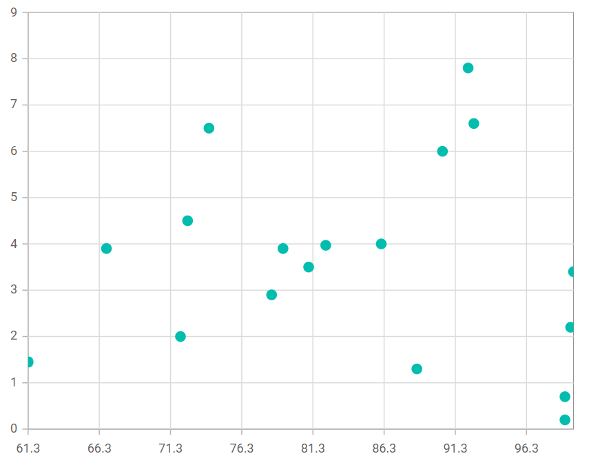

# Bubble in Blazor Charts Component

## Bubble

[Bubble Chart](https://www.syncfusion.com/blazor-components/blazor-charts/chart-types/bubble-chart) is similar to the Scatter chart but it also visualizes the third parameter by its size. To render a bubble series, set series [Type](https://help.syncfusion.com/cr/blazor/Syncfusion.Blazor.Charts.ChartSeries.html#Syncfusion_Blazor_Charts_ChartSeries_Type) as [Bubble](https://help.syncfusion.com/cr/blazor/Syncfusion.Blazor.Charts.ChartSeriesType.html#Syncfusion_Blazor_Charts_ChartSeriesType_Bubble). It visualizes data with three parameters such as [XName](https://help.syncfusion.com/cr/blazor/Syncfusion.Blazor.Charts.ChartSeries.html#Syncfusion_Blazor_Charts_ChartSeries_XName), [YName](https://help.syncfusion.com/cr/blazor/Syncfusion.Blazor.Charts.ChartSeries.html#Syncfusion_Blazor_Charts_ChartSeries_YName), and [Size](https://help.syncfusion.com/cr/blazor/Syncfusion.Blazor.Charts.ChartSeries.html#Syncfusion_Blazor_Charts_ChartSeries_Size). The bubble size depends on third parameter. 

```cshtml

@using Syncfusion.Blazor.Charts

<SfChart>
    <ChartSeriesCollection>
        <ChartSeries DataSource="@SalesReports" XName="X" YName="Y" Type="ChartSeriesType.Bubble">
        </ChartSeries>
    </ChartSeriesCollection>
</SfChart>

@code{
    public class ChartData
    {
        public double X { get; set; }
        public double Y { get; set; }
        public string Text { get; set; }
    }

    public List<ChartData> SalesReports = new List<ChartData>
	{
        new ChartData { X= 92.2, Y= 7.8, Text= "China" },
        new ChartData { X= 74, Y= 6.5, Text= "India" },
        new ChartData { X= 90.4, Y= 6.0, Text= "Indonesia" },
        new ChartData { X= 99.4, Y= 2.2, Text= "US" },
        new ChartData { X= 88.6, Y= 1.3, Text= "Brazil" },
        new ChartData { X= 99, Y= 0.7, Text= "Germany" },
        new ChartData { X= 72, Y= 2.0, Text= "Egypt" },
        new ChartData { X= 99.6, Y= 3.4, Text= "Russia" },
        new ChartData { X= 99, Y= 0.2, Text= "Japan" },
        new ChartData { X= 86.1, Y= 4.0, Text= "Mexico" },
        new ChartData { X= 92.6, Y= 6.6, Text= "Philippines" },
        new ChartData { X= 61.3, Y= 1.45, Text= "Nigeria" },
        new ChartData { X= 82.2, Y= 3.97, Text= "Hong Kong" },
        new ChartData { X= 79.2, Y= 3.9, Text= "Netherland" },
        new ChartData { X= 72.5, Y= 4.5, Text= "Jordan" },
        new ChartData { X= 81, Y= 3.5, Text= "Australia" },
        new ChartData { X= 66.8, Y= 3.9, Text= "Mongolia" },
        new ChartData { X= 78.4, Y= 2.9, Text= "Taiwan" }
    };
}

``` 




N> Refer to our [Blazor Bubble Charts](https://www.syncfusion.com/blazor-components/blazor-charts/chart-types/bubble-chart) feature tour page to know about its other groundbreaking feature representations and also explore our [Blazor Bubble Chart Example](https://blazor.syncfusion.com/demos/chart/bubble?theme=bootstrap5) to know how to render and configure the bubble type charts.

## Binding data with series

You can bind data to the chart using the [`DataSource`](https://help.syncfusion.com/cr/blazor/Syncfusion.Blazor.Charts.ChartSeries.html#Syncfusion_Blazor_Charts_ChartSeries_DataSource) property within the series configuration. The [`DataSource`](https://help.syncfusion.com/cr/blazor/Syncfusion.Blazor.Charts.ChartSeries.html#Syncfusion_Blazor_Charts_ChartSeries_DataSource) value can be set using either [`SfDataManager`](https://help.syncfusion.com/cr/blazor/Syncfusion.Blazor.Data.SfDataManager.html) property values or a list of business objects. More information on data binding can be found [here](../working-with-data). To display the data correctly, map the fields from the data to the chart series' [`XName`](https://help.syncfusion.com/cr/blazor/Syncfusion.Blazor.Charts.ChartSeries.html#Syncfusion_Blazor_Charts_ChartSeries_XName) and [`YName`](https://help.syncfusion.com/cr/blazor/Syncfusion.Blazor.Charts.ChartSeries.html#Syncfusion_Blazor_Charts_ChartSeries_YName) properties.

```cshtml

@using Syncfusion.Blazor.Charts

<SfChart>
    <ChartSeriesCollection>
        <ChartSeries DataSource="@SalesReports" XName="X" YName="Y" Type="ChartSeriesType.Bubble">
        </ChartSeries>
    </ChartSeriesCollection>
</SfChart>

@code{
    public class ChartData
    {
        public double X { get; set; }
        public double Y { get; set; }
        public string Text { get; set; }
    }

    public List<ChartData> SalesReports = new List<ChartData>
	{
        new ChartData { X= 92.2, Y= 7.8, Text= "China" },
        new ChartData { X= 74, Y= 6.5, Text= "India" },
        new ChartData { X= 90.4, Y= 6.0, Text= "Indonesia" },
        new ChartData { X= 99.4, Y= 2.2, Text= "US" },
        new ChartData { X= 88.6, Y= 1.3, Text= "Brazil" },
        new ChartData { X= 99, Y= 0.7, Text= "Germany" },
        new ChartData { X= 72, Y= 2.0, Text= "Egypt" },
        new ChartData { X= 99.6, Y= 3.4, Text= "Russia" },
        new ChartData { X= 99, Y= 0.2, Text= "Japan" },
        new ChartData { X= 86.1, Y= 4.0, Text= "Mexico" },
        new ChartData { X= 92.6, Y= 6.6, Text= "Philippines" },
        new ChartData { X= 61.3, Y= 1.45, Text= "Nigeria" },
        new ChartData { X= 82.2, Y= 3.97, Text= "Hong Kong" },
        new ChartData { X= 79.2, Y= 3.9, Text= "Netherland" },
        new ChartData { X= 72.5, Y= 4.5, Text= "Jordan" },
        new ChartData { X= 81, Y= 3.5, Text= "Australia" },
        new ChartData { X= 66.8, Y= 3.9, Text= "Mongolia" },
        new ChartData { X= 78.4, Y= 2.9, Text= "Taiwan" }
    };
}

```


## Series customization

The following properties can be used to customize the [Bubble](https://help.syncfusion.com/cr/blazor/Syncfusion.Blazor.Charts.ChartSeriesType.html#Syncfusion_Blazor_Charts_ChartSeriesType_Bubble) series.

**Fill**

The [Fill](https://help.syncfusion.com/cr/blazor/Syncfusion.Blazor.Charts.ChartSeries.html#Syncfusion_Blazor_Charts_ChartSeries_Fill) property determines the color applied to the series.

```cshtml

@using Syncfusion.Blazor.Charts

<SfChart>
    <ChartSeriesCollection>
        <ChartSeries DataSource="@SalesReports" XName="X" YName="Y" Fill="blue" Type="Syncfusion.Blazor.Charts.ChartSeriesType.Bubble">
        </ChartSeries>
    </ChartSeriesCollection>
</SfChart>

@code {
    public class ChartData
    {
        public double X { get; set; }
        public double Y { get; set; }
        public string Text { get; set; }
    }

    public List<ChartData> SalesReports = new List<ChartData>
    {
        new ChartData { X= 92.2, Y= 7.8, Text= "China" },
        new ChartData { X= 74, Y= 6.5, Text= "India" },
        new ChartData { X= 90.4, Y= 6.0, Text= "Indonesia" },
        new ChartData { X= 99.4, Y= 2.2, Text= "US" },
        new ChartData { X= 88.6, Y= 1.3, Text= "Brazil" },
        new ChartData { X= 99, Y= 0.7, Text= "Germany" },
        new ChartData { X= 72, Y= 2.0, Text= "Egypt" },
        new ChartData { X= 99.6, Y= 3.4, Text= "Russia" },
        new ChartData { X= 99, Y= 0.2, Text= "Japan" },
        new ChartData { X= 86.1, Y= 4.0, Text= "Mexico" },
        new ChartData { X= 92.6, Y= 6.6, Text= "Philippines" },
        new ChartData { X= 61.3, Y= 1.45, Text= "Nigeria" },
        new ChartData { X= 82.2, Y= 3.97, Text= "Hong Kong" },
        new ChartData { X= 79.2, Y= 3.9, Text= "Netherland" },
        new ChartData { X= 72.5, Y= 4.5, Text= "Jordan" },
        new ChartData { X= 81, Y= 3.5, Text= "Australia" },
        new ChartData { X= 66.8, Y= 3.9, Text= "Mongolia" },
        new ChartData { X= 78.4, Y= 2.9, Text= "Taiwan" }
    };
}

```


The [Fill](https://help.syncfusion.com/cr/blazor/Syncfusion.Blazor.Charts.ChartSeries.html#Syncfusion_Blazor_Charts_ChartSeries_Fill) property can be used to apply a gradient color to the bubble series. By configuring this property with gradient values, you can create a visually appealing effect in which the color transitions smoothly from one shade to another.

```cshtml

@using Syncfusion.Blazor.Charts

<SfChart>
    <ChartSeriesCollection>
        <ChartSeries DataSource="@SalesReports" XName="X" YName="Y" Fill="url(#grad1)" Type="Syncfusion.Blazor.Charts.ChartSeriesType.Bubble">
        </ChartSeries>
    </ChartSeriesCollection>
</SfChart>

<svg style="height: 0">
   <defs>
       <linearGradient id="grad1" x1="0%" y1="0%" x2="0%" y2="100%">
           <stop offset="20%" style="stop-color:orange;stop-opacity:1" />
           <stop offset="100%" style="stop-color:black;stop-opacity:1" />
       </linearGradient>
   </defs>
</svg>

@code {
    public class ChartData
    {
        public double X { get; set; }
        public double Y { get; set; }
        public string Text { get; set; }
    }

    public List<ChartData> SalesReports = new List<ChartData>
    {
        new ChartData { X= 92.2, Y= 7.8, Text= "China" },
        new ChartData { X= 74, Y= 6.5, Text= "India" },
        new ChartData { X= 90.4, Y= 6.0, Text= "Indonesia" },
        new ChartData { X= 99.4, Y= 2.2, Text= "US" },
        new ChartData { X= 88.6, Y= 1.3, Text= "Brazil" },
        new ChartData { X= 99, Y= 0.7, Text= "Germany" },
        new ChartData { X= 72, Y= 2.0, Text= "Egypt" },
        new ChartData { X= 99.6, Y= 3.4, Text= "Russia" },
        new ChartData { X= 99, Y= 0.2, Text= "Japan" },
        new ChartData { X= 86.1, Y= 4.0, Text= "Mexico" },
        new ChartData { X= 92.6, Y= 6.6, Text= "Philippines" },
        new ChartData { X= 61.3, Y= 1.45, Text= "Nigeria" },
        new ChartData { X= 82.2, Y= 3.97, Text= "Hong Kong" },
        new ChartData { X= 79.2, Y= 3.9, Text= "Netherland" },
        new ChartData { X= 72.5, Y= 4.5, Text= "Jordan" },
        new ChartData { X= 81, Y= 3.5, Text= "Australia" },
        new ChartData { X= 66.8, Y= 3.9, Text= "Mongolia" },
        new ChartData { X= 78.4, Y= 2.9, Text= "Taiwan" }
    };
}

```


**Opacity**

The [Opacity](https://help.syncfusion.com/cr/blazor/Syncfusion.Blazor.Charts.ChartSeries.html#Syncfusion_Blazor_Charts_ChartSeries_Opacity) property specifies the transparency level of the [Fill](https://help.syncfusion.com/cr/blazor/Syncfusion.Blazor.Charts.ChartSeries.html#Syncfusion_Blazor_Charts_ChartSeries_Fill). Adjusting this property allows you to control how opaque or transparent the fill color of the series appears.

```cshtml

@using Syncfusion.Blazor.Charts

<SfChart>
    <ChartSeriesCollection>
        <ChartSeries DataSource="@SalesReports" XName="X" YName="Y" Opacity="0.5" Fill="blue" Type="Syncfusion.Blazor.Charts.ChartSeriesType.Bubble">
        </ChartSeries>
    </ChartSeriesCollection>
</SfChart>

@code{
    public class ChartData
    {
        public double X { get; set; }
        public double Y { get; set; }
        public double Size { get; set; }
        public string Text { get; set; }
    }

    public List<ChartData> SalesReports = new List<ChartData>
    {
        new ChartData { X= 92.2, Y= 7.8, Size= 1.347, Text= "China" },
        new ChartData { X= 74, Y= 6.5, Size= 1.241, Text= "India" },
        new ChartData { X= 90.4, Y= 6.0, Size= 0.238, Text= "Indonesia" },
        new ChartData { X= 99.4, Y= 2.2, Size= 0.312, Text= "US" },
        new ChartData { X= 88.6, Y= 1.3, Size= 0.197, Text= "Brazil" },
        new ChartData { X= 99, Y= 0.7, Size= 0.0818, Text= "Germany" },
        new ChartData { X= 72, Y= 2.0, Size= 0.0826, Text= "Egypt" },
        new ChartData { X= 99.6, Y= 3.4, Size= 0.143, Text= "Russia" },
        new ChartData { X= 99, Y= 0.2, Size= 0.128, Text= "Japan" },
        new ChartData { X= 86.1, Y= 4.0, Size= 0.115, Text= "Mexico" },
        new ChartData { X= 92.6, Y= 6.6, Size= 0.096, Text= "Philippines" },
        new ChartData { X= 61.3, Y= 1.45, Size= 0.162, Text= "Nigeria" },
        new ChartData { X= 82.2, Y= 3.97, Size= 0.7, Text= "Hong Kong" },
        new ChartData { X= 79.2, Y= 3.9, Size= 0.162, Text= "Netherland" },
        new ChartData { X= 72.5, Y= 4.5, Size= 0.7, Text= "Jordan" },
        new ChartData { X= 81, Y= 3.5, Size= 0.21, Text= "Australia" },
        new ChartData { X= 66.8, Y= 3.9, Size= 0.028, Text= "Mongolia" },
        new ChartData { X= 78.4, Y= 2.9, Size= 0.231, Text= "Taiwan" }
    };
}

```


## Bubble size mapping

The [Size](https://help.syncfusion.com/cr/blazor/Syncfusion.Blazor.Charts.ChartSeries.html#Syncfusion_Blazor_Charts_ChartSeries_Size) property can be used to map the size value specified from datasource.

```cshtml

@using Syncfusion.Blazor.Charts

<SfChart>
    <ChartSeriesCollection>
        <ChartSeries DataSource="@SalesReports" XName="X" YName="Y" Size="Size" Type="Syncfusion.Blazor.Charts.ChartSeriesType.Bubble">
        </ChartSeries>
    </ChartSeriesCollection>
</SfChart>

@code {
    public class ChartData
    {
        public double X { get; set; }
        public double Y { get; set; }
        public string Text { get; set; }
        public double Size { get; set; }
    }

    public List<ChartData> SalesReports = new List<ChartData>
    {
        new ChartData { X= 92.2, Y= 7.8, Size= 1.347, Text= "China" },
        new ChartData { X= 74, Y= 6.5, Size= 1.241, Text= "India" },
        new ChartData { X= 90.4, Y= 6.0, Size= 0.238, Text= "Indonesia" },
        new ChartData { X= 99.4, Y= 2.2, Size= 0.312, Text= "US" },
        new ChartData { X= 88.6, Y= 1.3, Size= 0.197, Text= "Brazil" },
        new ChartData { X= 99, Y= 0.7, Size= 0.0818, Text= "Germany" },
        new ChartData { X= 72, Y= 2.0, Size= 0.0826, Text= "Egypt" },
        new ChartData { X= 99.6, Y= 3.4, Size= 0.143, Text= "Russia" },
        new ChartData { X= 99, Y= 0.2, Size= 0.128, Text= "Japan" },
        new ChartData { X= 86.1, Y= 4.0, Size= 0.115, Text= "Mexico" },
        new ChartData { X= 92.6, Y= 6.6, Size= 0.096, Text= "Philippines" },
        new ChartData { X= 61.3, Y= 1.45, Size= 0.162, Text= "Nigeria" },
        new ChartData { X= 82.2, Y= 3.97, Size= 0.7, Text= "Hong Kong" },
        new ChartData { X= 79.2, Y= 3.9, Size= 0.162, Text= "Netherland" },
        new ChartData { X= 72.5, Y= 4.5, Size= 0.7, Text= "Jordan" },
        new ChartData { X= 81, Y= 3.5, Size= 0.21, Text= "Australia" },
        new ChartData { X= 66.8, Y= 3.9, Size= 0.028, Text= "Mongolia" },
        new ChartData { X= 78.4, Y= 2.9, Size= 0.231, Text= "Taiwan" }
    };
}

```


## Empty points

Data points with `null`, `double.NaN` or `undefined` values are considered empty. Empty data points are ignored and not plotted on the chart.

**Mode**

Use the [`Mode`](https://help.syncfusion.com/cr/blazor/Syncfusion.Blazor.Charts.ChartEmptyPointSettings.html#Syncfusion_Blazor_Charts_ChartEmptyPointSettings_Mode) property to define how empty or missing data points are handled in the series. The default mode for empty points is [`Gap`](https://help.syncfusion.com/cr/blazor/Syncfusion.Blazor.Charts.EmptyPointMode.html#Syncfusion_Blazor_Charts_EmptyPointMode_Gap).

```cshtml

@using Syncfusion.Blazor.Charts

<SfChart>
    <ChartSeriesCollection>
        <ChartSeries DataSource="@SalesReports" XName="X" YName="Y" Type="Syncfusion.Blazor.Charts.ChartSeriesType.Bubble">
            <ChartEmptyPointSettings Mode="EmptyPointMode.Gap"></ChartEmptyPointSettings>
        </ChartSeries>
    </ChartSeriesCollection>
</SfChart>

@code {
    public class ChartData
    {
        public double X { get; set; }
        public double Y { get; set; }
        public string Text { get; set; }
    }

    public List<ChartData> SalesReports = new List<ChartData>
    {
        new ChartData { X= 92.2, Y= 7.8, Text= "China" },
        new ChartData { X= 74, Y= 6.5, Text= "India" },
        new ChartData { X= 90.4, Y= 6.0, Text= "Indonesia" },
        new ChartData { X= 99.4, Y= 2.2, Text= "US" },
        new ChartData { X= 88.6, Y= 1.3, Text= "Brazil" },
        new ChartData { X= 99, Y= 0.7, Text= "Germany" },
        new ChartData { X= 72, Y= 2.0, Text= "Egypt" },
        new ChartData { X= 99.6, Y= 3.4, Text= "Russia" },
        new ChartData { X= 99, Y= 0.2, Text= "Japan" },
        new ChartData { X= 86.1, Y= double.NaN, Text= "Mexico" },
        new ChartData { X= 92.6, Y= 6.6, Text= "Philippines" },
        new ChartData { X= 61.3, Y= 1.45, Text= "Nigeria" },
        new ChartData { X= 82.2, Y= 3.97, Text= "Hong Kong" },
        new ChartData { X= 79.2, Y= 3.9, Text= "Netherland" },
        new ChartData { X= 72.5, Y= 4.5, Text= "Jordan" },
        new ChartData { X= 81, Y= 3.5, Text= "Australia" },
        new ChartData { X= 66.8, Y= 3.9, Text= "Mongolia" },
        new ChartData { X= 78.4, Y= 2.9, Text= "Taiwan" }
    };
}

```


**Fill**

Use the [`Fill`](https://help.syncfusion.com/cr/blazor/Syncfusion.Blazor.Charts.ChartEmptyPointSettings.html#Syncfusion_Blazor_Charts_ChartEmptyPointSettings_Fill) property to customize the fill color of empty points in the series.

```cshtml

@using Syncfusion.Blazor.Charts

<SfChart>
    <ChartSeriesCollection>
        <ChartSeries DataSource="@SalesReports" XName="X" YName="Y" Type="Syncfusion.Blazor.Charts.ChartSeriesType.Bubble">
            <ChartEmptyPointSettings Mode="EmptyPointMode.Average" Fill="#FFDE59"></ChartEmptyPointSettings>
            <ChartMarker Height="10" Width="10"></ChartMarker>
        </ChartSeries>
    </ChartSeriesCollection>
</SfChart>

@code {
    public class ChartData
    {
        public double X { get; set; }
        public double Y { get; set; }
        public string Text { get; set; }
    }

    public List<ChartData> SalesReports = new List<ChartData>
    {
        new ChartData { X= 92.2, Y= 7.8, Text= "China" },
        new ChartData { X= 74, Y= 6.5, Text= "India" },
        new ChartData { X= 90.4, Y= 6.0, Text= "Indonesia" },
        new ChartData { X= 99.4, Y= 2.2, Text= "US" },
        new ChartData { X= 88.6, Y= 1.3, Text= "Brazil" },
        new ChartData { X= 99, Y= 0.7, Text= "Germany" },
        new ChartData { X= 72, Y= 2.0, Text= "Egypt" },
        new ChartData { X= 99.6, Y= 3.4, Text= "Russia" },
        new ChartData { X= 99, Y= 0.2, Text= "Japan" },
        new ChartData { X= 86.1, Y= double.NaN, Text= "Mexico" },
        new ChartData { X= 92.6, Y= 6.6, Text= "Philippines" },
        new ChartData { X= 61.3, Y= 1.45, Text= "Nigeria" },
        new ChartData { X= 82.2, Y= 3.97, Text= "Hong Kong" },
        new ChartData { X= 79.2, Y= 3.9, Text= "Netherland" },
        new ChartData { X= 72.5, Y= 4.5, Text= "Jordan" },
        new ChartData { X= 81, Y= 3.5, Text= "Australia" },
        new ChartData { X= 66.8, Y= 3.9, Text= "Mongolia" },
        new ChartData { X= 78.4, Y= 2.9, Text= "Taiwan" }
    };
}

```


**Border**

Use the [`Border`](https://help.syncfusion.com/cr/blazor/Syncfusion.Blazor.Charts.ChartEmptyPointSettings.html#Syncfusion_Blazor_Charts_ChartEmptyPointSettings_Border) property to customize the [Width](https://help.syncfusion.com/cr/blazor/Syncfusion.Blazor.Charts.ChartEmptyPointBorder.html#Syncfusion_Blazor_Charts_ChartEmptyPointBorder_Width) and [Color](https://help.syncfusion.com/cr/blazor/Syncfusion.Blazor.Charts.ChartEmptyPointBorder.html#Syncfusion_Blazor_Charts_ChartEmptyPointBorder_Color) of the border for empty points.

```cshtml

@using Syncfusion.Blazor.Charts

<SfChart>
    <ChartSeriesCollection>
        <ChartSeries DataSource="@SalesReports" XName="X" YName="Y" Type="Syncfusion.Blazor.Charts.ChartSeriesType.Bubble">
            <ChartEmptyPointSettings Mode="EmptyPointMode.Average" Fill="#FFDE59">
                <ChartEmptyPointBorder Color="red" Width="2"></ChartEmptyPointBorder>
            </ChartEmptyPointSettings>
        </ChartSeries>
    </ChartSeriesCollection>
</SfChart>

@code {
    public class ChartData
    {
        public double X { get; set; }
        public double Y { get; set; }
        public string Text { get; set; }
    }

    public List<ChartData> SalesReports = new List<ChartData>
    {
        new ChartData { X= 92.2, Y= 7.8, Text= "China" },
        new ChartData { X= 74, Y= 6.5, Text= "India" },
        new ChartData { X= 90.4, Y= 6.0, Text= "Indonesia" },
        new ChartData { X= 99.4, Y= 2.2, Text= "US" },
        new ChartData { X= 88.6, Y= 1.3, Text= "Brazil" },
        new ChartData { X= 99, Y= 0.7, Text= "Germany" },
        new ChartData { X= 72, Y= 2.0, Text= "Egypt" },
        new ChartData { X= 99.6, Y= 3.4, Text= "Russia" },
        new ChartData { X= 99, Y= 0.2, Text= "Japan" },
        new ChartData { X= 86.1, Y= double.NaN, Text= "Mexico" },
        new ChartData { X= 92.6, Y= 6.6, Text= "Philippines" },
        new ChartData { X= 61.3, Y= 1.45, Text= "Nigeria" },
        new ChartData { X= 82.2, Y= 3.97, Text= "Hong Kong" },
        new ChartData { X= 79.2, Y= 3.9, Text= "Netherland" },
        new ChartData { X= 72.5, Y= 4.5, Text= "Jordan" },
        new ChartData { X= 81, Y= 3.5, Text= "Australia" },
        new ChartData { X= 66.8, Y= 3.9, Text= "Mongolia" },
        new ChartData { X= 78.4, Y= 2.9, Text= "Taiwan" }
    };
}

```


## Events

### Series render

The [`OnSeriesRender`](https://help.syncfusion.com/cr/blazor/Syncfusion.Blazor.Charts.ChartEvents.html#Syncfusion_Blazor_Charts_ChartEvents_OnSeriesRender) event allows you to customize series properties, such as [Data](https://help.syncfusion.com/cr/blazor/Syncfusion.Blazor.Charts.SeriesRenderEventArgs.html#Syncfusion_Blazor_Charts_SeriesRenderEventArgs_Data), [Fill](https://help.syncfusion.com/cr/blazor/Syncfusion.Blazor.Charts.SeriesRenderEventArgs.html#Syncfusion_Blazor_Charts_SeriesRenderEventArgs_Fill), and [Series](https://help.syncfusion.com/cr/blazor/Syncfusion.Blazor.Charts.SeriesRenderEventArgs.html#Syncfusion_Blazor_Charts_SeriesRenderEventArgs_Series), before they are rendered on the chart.

```cshtml

@using Syncfusion.Blazor.Charts

<SfChart>
    <ChartSeriesCollection>
        <ChartEvents OnSeriesRender="SeriesRender"></ChartEvents>
        <ChartSeries DataSource="@SalesReports" XName="X" YName="Y" Type="Syncfusion.Blazor.Charts.ChartSeriesType.Bubble">
        </ChartSeries>
    </ChartSeriesCollection>
</SfChart>

@code {
    public class ChartData
    {
        public double X { get; set; }
        public double Y { get; set; }
        public string Text { get; set; }
    }

    public void SeriesRender(SeriesRenderEventArgs args)
    {
        args.Fill = "#FF4081";
    }

    public List<ChartData> SalesReports = new List<ChartData>
    {
        new ChartData { X= 92.2, Y= 7.8, Text= "China" },
        new ChartData { X= 74, Y= 6.5, Text= "India" },
        new ChartData { X= 90.4, Y= 6.0, Text= "Indonesia" },
        new ChartData { X= 99.4, Y= 2.2, Text= "US" },
        new ChartData { X= 88.6, Y= 1.3, Text= "Brazil" },
        new ChartData { X= 99, Y= 0.7, Text= "Germany" },
        new ChartData { X= 72, Y= 2.0, Text= "Egypt" },
        new ChartData { X= 99.6, Y= 3.4, Text= "Russia" },
        new ChartData { X= 99, Y= 0.2, Text= "Japan" },
        new ChartData { X= 86.1, Y= 4.0, Text= "Mexico" },
        new ChartData { X= 92.6, Y= 6.6, Text= "Philippines" },
        new ChartData { X= 61.3, Y= 1.45, Text= "Nigeria" },
        new ChartData { X= 82.2, Y= 3.97, Text= "Hong Kong" },
        new ChartData { X= 79.2, Y= 3.9, Text= "Netherland" },
        new ChartData { X= 72.5, Y= 4.5, Text= "Jordan" },
        new ChartData { X= 81, Y= 3.5, Text= "Australia" },
        new ChartData { X= 66.8, Y= 3.9, Text= "Mongolia" },
        new ChartData { X= 78.4, Y= 2.9, Text= "Taiwan" }
    };
}

```


### Point render

The [`OnPointRender`](https://help.syncfusion.com/cr/blazor/Syncfusion.Blazor.Charts.ChartEvents.html#Syncfusion_Blazor_Charts_ChartEvents_OnPointRender) event allows you to customize each data point before it is rendered on the chart.

```cshtml

@using Syncfusion.Blazor.Charts

<SfChart>
    <ChartSeriesCollection>
        <ChartEvents OnPointRender="PointRender"></ChartEvents>
        <ChartSeries DataSource="@SalesReports" XName="X" YName="Y" Type="Syncfusion.Blazor.Charts.ChartSeriesType.Bubble">
        </ChartSeries>
    </ChartSeriesCollection>
</SfChart>

@code {
    public class ChartData
    {
        public double X { get; set; }
        public double Y { get; set; }
        public string Text { get; set; }
    }

    public void PointRender(PointRenderEventArgs args)
    {
         args.Fill = args.Point.X.ToString() == "86.1" ? "#E91E63" : "#3F51B5";
    }

    public List<ChartData> SalesReports = new List<ChartData>
    {
        new ChartData { X= 92.2, Y= 7.8, Text= "China" },
        new ChartData { X= 74, Y= 6.5, Text= "India" },
        new ChartData { X= 90.4, Y= 6.0, Text= "Indonesia" },
        new ChartData { X= 99.4, Y= 2.2, Text= "US" },
        new ChartData { X= 88.6, Y= 1.3, Text= "Brazil" },
        new ChartData { X= 99, Y= 0.7, Text= "Germany" },
        new ChartData { X= 72, Y= 2.0, Text= "Egypt" },
        new ChartData { X= 99.6, Y= 3.4, Text= "Russia" },
        new ChartData { X= 99, Y= 0.2, Text= "Japan" },
        new ChartData { X= 86.1, Y= 4.0, Text= "Mexico" },
        new ChartData { X= 92.6, Y= 6.6, Text= "Philippines" },
        new ChartData { X= 61.3, Y= 1.45, Text= "Nigeria" },
        new ChartData { X= 82.2, Y= 3.97, Text= "Hong Kong" },
        new ChartData { X= 79.2, Y= 3.9, Text= "Netherland" },
        new ChartData { X= 72.5, Y= 4.5, Text= "Jordan" },
        new ChartData { X= 81, Y= 3.5, Text= "Australia" },
        new ChartData { X= 66.8, Y= 3.9, Text= "Mongolia" },
        new ChartData { X= 78.4, Y= 2.9, Text= "Taiwan" }
    };
}

```


N> Refer to our [Blazor Charts](https://www.syncfusion.com/blazor-components/blazor-charts) feature tour page for its groundbreaking feature representations and also explore our [Blazor Chart Example](https://blazor.syncfusion.com/demos/chart/line?theme=bootstrap5) to know various chart types and how to represent time-dependent data, showing trends at equal intervals.

## See also

* [Data Label](../data-labels)
* [Tooltip](../tool-tip)