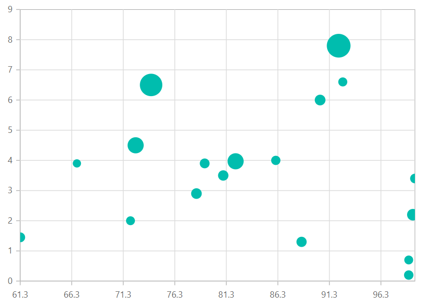
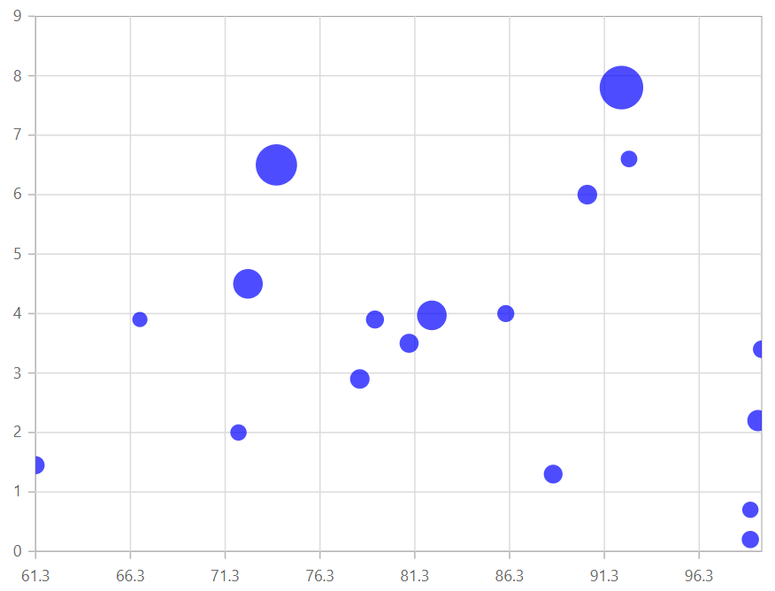

# Bubble Chart in Blazor Charts (SfCharts)

## Bubble

Visualize data with three numeric parameters such as [`XName`](https://help.syncfusion.com/cr/blazor/Syncfusion.Blazor.Charts.ChartSeries.html#Syncfusion_Blazor_Charts_ChartSeries_XName), [`YName`](https://help.syncfusion.com/cr/blazor/Syncfusion.Blazor.Charts.ChartSeries.html#Syncfusion_Blazor_Charts_ChartSeries_YName) and [`Size`](https://help.syncfusion.com/cr/blazor/Syncfusion.Blazor.Charts.ChartSeries.html#Syncfusion_Blazor_Charts_ChartSeries_Size) . The bubble size depends on third parameter. To render a bubble series, use series [`Type`](https://help.syncfusion.com/cr/blazor/Syncfusion.Blazor~Syncfusion.Blazor.Charts.ChartSeries~Type.html) as [`Bubble`](https://help.syncfusion.com/cr/blazor/Syncfusion.Blazor.Charts.ChartSeriesType.html#Syncfusion_Blazor_Charts_ChartSeriesType_Bubble).

```csharp

@using Syncfusion.Blazor.Charts

<SfChart>
    <ChartSeriesCollection>
        <ChartSeries DataSource="@SalesReports" XName="X" YName="Y" Type="ChartSeriesType.Bubble">
        </ChartSeries>
    </ChartSeriesCollection>
</SfChart>

@code{
    public class ChartData
    {
        public double X { get; set; }
        public double Y { get; set; }
        public string Text { get; set; }
    }

    public List<ChartData> SalesReports = new List<ChartData>
{
         new ChartData { X= 92.2, Y= 7.8, Text= "China" },
         new ChartData { X= 74, Y= 6.5, Text= "India" },
         new ChartData { X= 90.4, Y= 6.0, Text= "Indonesia" },
         new ChartData { X= 99.4, Y= 2.2, Text= "US" },
         new ChartData { X= 88.6, Y= 1.3, Text= "Brazil" },
         new ChartData { X= 99, Y= 0.7, Text= "Germany" },
         new ChartData { X= 72, Y= 2.0, Text= "Egypt" },
         new ChartData { X= 99.6, Y= 3.4, Text= "Russia" },
         new ChartData { X= 99, Y= 0.2, Text= "Japan" },
         new ChartData { X= 86.1, Y= 4.0, Text= "Mexico" },
         new ChartData { X= 92.6, Y= 6.6, Text= "Philippines" },
         new ChartData { X= 61.3, Y= 1.45, Text= "Nigeria" },
         new ChartData { X= 82.2, Y= 3.97, Text= "Hong Kong" },
         new ChartData { X= 79.2, Y= 3.9, Text= "Netherland" },
         new ChartData { X= 72.5, Y= 4.5, Text= "Jordan" },
         new ChartData { X= 81, Y= 3.5, Text= "Australia" },
         new ChartData { X= 66.8, Y= 3.9, Text= "Mongolia" },
         new ChartData { X= 78.4, Y= 2.9, Text= "Taiwan" }
    };
}


```

> Refer to our Blazor [`Bubble Charts`](https://www.syncfusion.com/blazor-components/blazor-charts/chart-types/bubble-chart) feature tour page to know about its other groundbreaking feature representations and also explore our Blazor [`Bubble Chart example`](https://blazor.syncfusion.com/demos/chart/bubble?theme=bootstrap4) to know how to render and configure the Bubble type charts.

## Bubble Size Mapping

[`Size`](https://help.syncfusion.com/cr/blazor/Syncfusion.Blazor.Charts.ChartSeries.html#Syncfusion_Blazor_Charts_ChartSeries_Size) property can be used to map the size value specified from datasource.

```csharp

@using Syncfusion.Blazor.Charts

<SfChart>
    <ChartSeriesCollection>
        <ChartSeries DataSource="@SalesReports" XName="X" YName="Y" Size="Size" Type="ChartSeriesType.Bubble">
        </ChartSeries>
    </ChartSeriesCollection>
</SfChart>

@code{
    public class ChartData
    {
        public double X { get; set; }
        public double Y { get; set; }
        public double Size { get; set; }
        public string Text { get; set; }
    }

    public List<ChartData> SalesReports = new List<ChartData>
{
        new ChartData { X= 92.2, Y= 7.8, Size= 1.347, Text= "China" },
        new ChartData { X= 74, Y= 6.5, Size= 1.241, Text= "India" },
        new ChartData { X= 90.4, Y= 6.0, Size= 0.238, Text= "Indonesia" },
        new ChartData { X= 99.4, Y= 2.2, Size= 0.312, Text= "US" },
        new ChartData { X= 88.6, Y= 1.3, Size= 0.197, Text= "Brazil" },
        new ChartData { X= 99, Y= 0.7, Size= 0.0818, Text= "Germany" },
        new ChartData { X= 72, Y= 2.0, Size= 0.0826, Text= "Egypt" },
        new ChartData { X= 99.6, Y= 3.4, Size= 0.143, Text= "Russia" },
        new ChartData { X= 99, Y= 0.2, Size= 0.128, Text= "Japan" },
        new ChartData { X= 86.1, Y= 4.0, Size= 0.115, Text= "Mexico" },
        new ChartData { X= 92.6, Y= 6.6, Size= 0.096, Text= "Philippines" },
        new ChartData { X= 61.3, Y= 1.45, Size= 0.162, Text= "Nigeria" },
        new ChartData { X= 82.2, Y= 3.97, Size= 0.7, Text= "Hong Kong" },
        new ChartData { X= 79.2, Y= 3.9, Size= 0.162, Text= "Netherland" },
        new ChartData { X= 72.5, Y= 4.5, Size= 0.7, Text= "Jordan" },
        new ChartData { X= 81, Y= 3.5, Size= 0.21, Text= "Australia" },
        new ChartData { X= 66.8, Y= 3.9, Size= 0.028, Text= "Mongolia" },
        new ChartData { X= 78.4, Y= 2.9, Size= 0.231, Text= "Taiwan" }
    };
}

```



## Series Customization

The following properties can be used to customize the [`Bubble`](https://help.syncfusion.com/cr/blazor/Syncfusion.Blazor.Charts.ChartSeriesType.html#Syncfusion_Blazor_Charts_ChartSeriesType_Bubble) series.

* [`Fill`](https://help.syncfusion.com/cr/blazor/Syncfusion.Blazor.Charts.ChartSeries.html#Syncfusion_Blazor_Charts_ChartSeries_Fill) – Specifies the color of series.
* [`Opacity`](https://help.syncfusion.com/cr/blazor/Syncfusion.Blazor.Charts.ChartSeries.html#Syncfusion_Blazor_Charts_ChartSeries_Opacity) – Specifies the opacity of [`Fill`](https://help.syncfusion.com/cr/blazor/Syncfusion.Blazor.Charts.ChartSeries.html#Syncfusion_Blazor_Charts_ChartSeries_Fill).

```cshtml
@using Syncfusion.Blazor.Charts

<SfChart>
    <ChartSeriesCollection>
        <ChartSeries DataSource="@SalesReports" XName="X" YName="Y" Opacity="0.7" Fill="blue" Size="Size" Type="ChartSeriesType.Bubble">
        </ChartSeries>
    </ChartSeriesCollection>
</SfChart>

@code{
    public class ChartData
    {
        public double X { get; set; }
        public double Y { get; set; }
        public double Size { get; set; }
        public string Text { get; set; }
    }
    public List<ChartData> SalesReports = new List<ChartData>
    {
        new ChartData { X= 92.2, Y= 7.8, Size= 1.347, Text= "China" },
        new ChartData { X= 74, Y= 6.5, Size= 1.241, Text= "India" },
        new ChartData { X= 90.4, Y= 6.0, Size= 0.238, Text= "Indonesia" },
        new ChartData { X= 99.4, Y= 2.2, Size= 0.312, Text= "US" },
        new ChartData { X= 88.6, Y= 1.3, Size= 0.197, Text= "Brazil" },
        new ChartData { X= 99, Y= 0.7, Size= 0.0818, Text= "Germany" },
        new ChartData { X= 72, Y= 2.0, Size= 0.0826, Text= "Egypt" },
        new ChartData { X= 99.6, Y= 3.4, Size= 0.143, Text= "Russia" },
        new ChartData { X= 99, Y= 0.2, Size= 0.128, Text= "Japan" },
        new ChartData { X= 86.1, Y= 4.0, Size= 0.115, Text= "Mexico" },
        new ChartData { X= 92.6, Y= 6.6, Size= 0.096, Text= "Philippines" },
        new ChartData { X= 61.3, Y= 1.45, Size= 0.162, Text= "Nigeria" },
        new ChartData { X= 82.2, Y= 3.97, Size= 0.7, Text= "Hong Kong" },
        new ChartData { X= 79.2, Y= 3.9, Size= 0.162, Text= "Netherland" },
        new ChartData { X= 72.5, Y= 4.5, Size= 0.7, Text= "Jordan" },
        new ChartData { X= 81, Y= 3.5, Size= 0.21, Text= "Australia" },
        new ChartData { X= 66.8, Y= 3.9, Size= 0.028, Text= "Mongolia" },
        new ChartData { X= 78.4, Y= 2.9, Size= 0.231, Text= "Taiwan" }
    };
}
```



> Refer to our [`Blazor Charts`](https://www.syncfusion.com/blazor-components/blazor-charts) feature tour page for its groundbreaking feature representations and also explore our [`Blazor Chart example`](https://blazor.syncfusion.com/demos/chart/line?theme=bootstrap4) to know various chart types and how to represent time-dependent data, showing trends at equal intervals.

## See Also

* [Data Label](../data-labels)
* [Tooltip](../tool-tip)