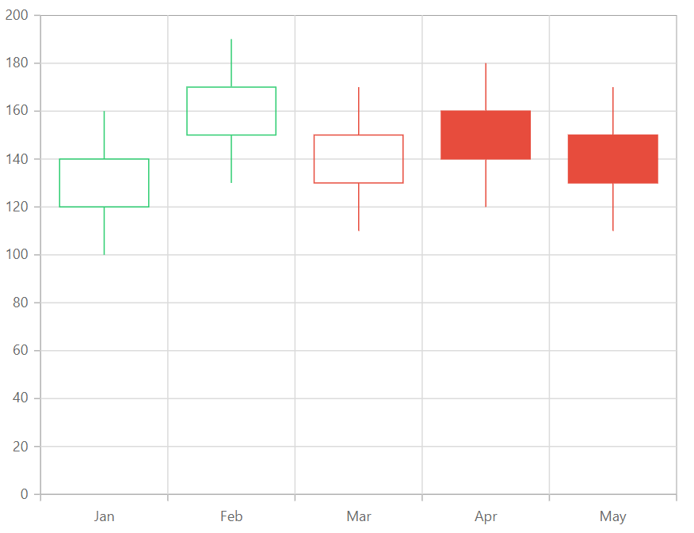

# Candle Chart in Blazor Charts (SfCharts)

## Candle

[`Candle`](https://help.syncfusion.com/cr/blazor/Syncfusion.Blazor.Charts.ChartSeriesType.html#Syncfusion_Blazor_Charts_ChartSeriesType_Candle) series are similar to Hilo Open Close series, are used to represent the **Low**, **High**, **Open and Closing** price over time. To render a candle series, use series
[`Type`](https://help.syncfusion.com/cr/blazor/Syncfusion.Blazor~Syncfusion.Blazor.Charts.ChartSeries~Type.html) as [`Candle`](https://help.syncfusion.com/cr/blazor/Syncfusion.Blazor.Charts.ChartSeriesType.html#Syncfusion_Blazor_Charts_ChartSeriesType_Candle).





## Hollow Candle

[`Candle`](https://help.syncfusion.com/cr/blazor/Syncfusion.Blazor.Charts.ChartSeriesType.html#Syncfusion_Blazor_Charts_ChartSeriesType_Candle) series chart allows to visually compare the current price with previous price by customizing the appearance. Candles are filled/left as hollow based on the following criteria.

<!-- markdownlint-disable MD033 -->
<table>
<tr>
<td><b>States</b></td>
<td><b>Description </b></td>
</tr>
<tr>
<td>Filled</td>
<td>Candle sticks are filled when the close value is lesser than the open value.</td>
</tr>
<tr>
<td>Unfilled</td>
<td>Candle sticks are unfilled when the close value is greater than the open value.</td>
</tr>
</table>

The color of the candle will be defined by comparing with previous values. [`BearFillColor`](https://help.syncfusion.com/cr/blazor/Syncfusion.Blazor.Charts.ChartSeries.html#Syncfusion_Blazor_Charts_ChartSeries_BearFillColor) property is used to apply when the current closing value is greater than the previous closing value and [`BullFillColor`](https://help.syncfusion.com/cr/blazor/Syncfusion.Blazor.Charts.ChartSeries.html#Syncfusion_Blazor_Charts_ChartSeries_BullFillColor) will be applied when the current closing value is less than the previous closing value. By default, [`BullFillColor`](https://help.syncfusion.com/cr/blazor/Syncfusion.Blazor.Charts.ChartSeries.html#Syncfusion_Blazor_Charts_ChartSeries_BullFillColor) is **red** and [`BearFillColor`](https://help.syncfusion.com/cr/blazor/Syncfusion.Blazor.Charts.ChartSeries.html#Syncfusion_Blazor_Charts_ChartSeries_BearFillColor) is **green**.

## Solid Candles

[`EnableSolidCandles`](https://help.syncfusion.com/cr/blazor/Syncfusion.Blazor~Syncfusion.Blazor.Charts.ChartSeries~EnableSolidCandles.html) is used to enable/disable the solid candles. By default it is set as **false**. The fill color of the candle will be defined by its opening and closing values. [`BearFillColor`](https://help.syncfusion.com/cr/blazor/Syncfusion.Blazor~Syncfusion.Blazor.Charts.ChartSeries~BearFillColor.html) will be applied when the opening value is less than the closing value. [`BullFillColor`](https://help.syncfusion.com/cr/blazor/Syncfusion.Blazor~Syncfusion.Blazor.Charts.ChartSeries~BullFillColor.html)
will be applied when the opening value is greater than closing value.





> Refer to our [`Blazor Charts`](https://www.syncfusion.com/blazor-components/blazor-charts) feature tour page for its groundbreaking feature representations and also explore our [`Blazor Chart example`](https://blazor.syncfusion.com/demos/chart/line?theme=bootstrap4) to know various chart types and how to represent time-dependent data, showing trends at equal intervals.

## See Also

* [Data Label](../data-labels)
* [Tooltip](../tool-tip)