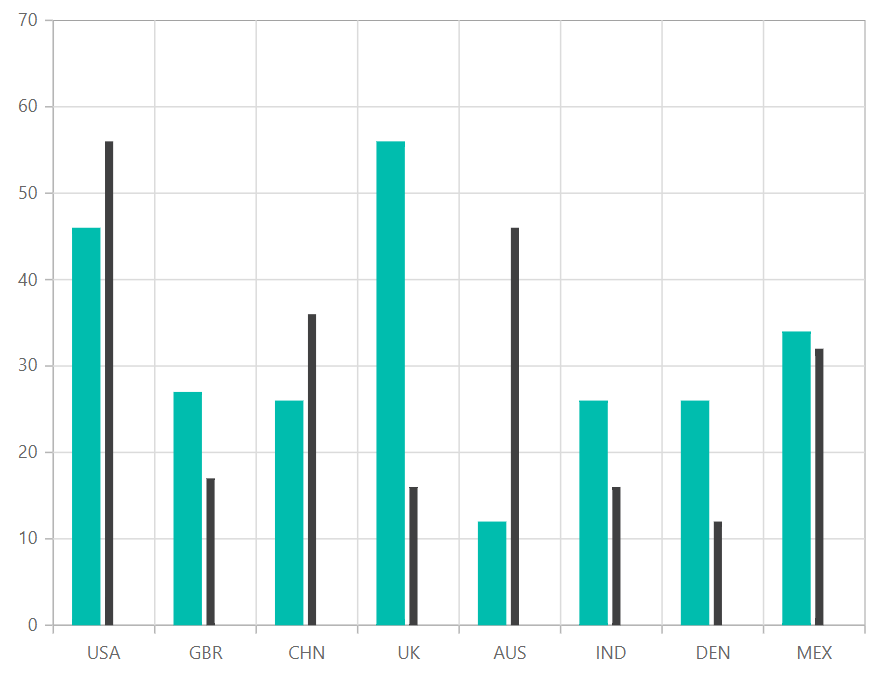

# Column Chart in Blazor Charts Component

## Column

[Column Chart](https://www.syncfusion.com/blazor-components/blazor-charts/chart-types/column-chart) is the most common chart type that is used to compare **Frequency**, **Count**, **Total**, or **Average** of data in different categories. It is ideal for showing variations in the value of an item over time. To render a column series, set series [Type](https://help.syncfusion.com/cr/blazor/Syncfusion.Blazor.Charts.ChartSeries.html#Syncfusion_Blazor_Charts_ChartSeries_Type) as [Column](https://help.syncfusion.com/cr/blazor/Syncfusion.Blazor.Charts.ChartSeriesType.html#Syncfusion_Blazor_Charts_ChartSeriesType_Column).

```cshtml

@using Syncfusion.Blazor.Charts

<SfChart>
    <ChartPrimaryXAxis ValueType="Syncfusion.Blazor.Charts.ValueType.Category"/>

    <ChartSeriesCollection>
        <ChartSeries DataSource="@MedalDetails" XName="X" YName="Y" Type="ChartSeriesType.Column">
        </ChartSeries>
    </ChartSeriesCollection>
</SfChart>

@code{
    public class ChartData
    {
        public string X { get; set; }
        public double Y { get; set; }
    }

    public List<ChartData> MedalDetails = new List<ChartData>
	{
        new ChartData { X= "South Korea", Y= 39.4 },
        new ChartData { X= "India", Y= 61.3 },
        new ChartData { X= "Pakistan", Y= 20.4 },
        new ChartData { X= "Germany", Y= 65.1 },
        new ChartData { X= "Australia", Y= 15.8 },
        new ChartData { X= "Italy", Y= 29.2 },
        new ChartData { X= "United Kingdom", Y= 44.6 },
        new ChartData { X= "Saudi Arabia", Y= 9.7 },
        new ChartData { X= "Russia", Y= 40.8 },
        new ChartData { X= "Mexico", Y= 31 },
        new ChartData { X= "Brazil", Y= 75.9 },
        new ChartData { X= "China", Y= 51.4 }
    };
}

```

<!--  -->

N> Refer to our [Blazor Column Charts](https://www.syncfusion.com/blazor-components/blazor-charts/chart-types/column-chart) feature tour page to know about its other groundbreaking feature representations. Explore our [Blazor Column Charts Example](https://blazor.syncfusion.com/demos/chart/column?theme=bootstrap4) to compare **Frequency**, **Count**, **Total**, or **Average** of data in different categories.

## Column space and width

The [ColumnSpacing](https://help.syncfusion.com/cr/blazor/Syncfusion.Blazor.Charts.ChartSeries.html#Syncfusion_Blazor_Charts_ChartSeries_ColumnSpacing) and [ColumnWidth](https://help.syncfusion.com/cr/blazor/Syncfusion.Blazor.Charts.ChartSeries.html#Syncfusion_Blazor_Charts_ChartSeries_ColumnWidth) properties are used to customize the space between columns.

```cshtml

@using Syncfusion.Blazor.Charts

<SfChart>
    <ChartPrimaryXAxis ValueType="Syncfusion.Blazor.Charts.ValueType.Category" />

    <ChartSeriesCollection>
        <ChartSeries DataSource="@MedalDetails" XName="X" YName="Y" Type="ChartSeriesType.Column"  ColumnSpacing="0.2" ColumnWidth="0.2" >
        </ChartSeries>
    </ChartSeriesCollection>
</SfChart>

@code{
    public class ChartData
    {
        public string X { get; set; }
        public double Y { get; set; }
    }

    public List<ChartData> MedalDetails = new List<ChartData>
    {
        new ChartData { X= "South Korea", Y= 39.4 },
        new ChartData { X= "India", Y= 61.3 },
        new ChartData { X= "Pakistan", Y= 20.4 },
        new ChartData { X= "Germany", Y= 65.1 },
        new ChartData { X= "Australia", Y= 15.8 },
        new ChartData { X= "Italy", Y= 29.2 },
        new ChartData { X= "United Kingdom", Y= 44.6 },
        new ChartData { X= "Saudi Arabia", Y= 9.7 },
        new ChartData { X= "Russia", Y= 40.8 },
        new ChartData { X= "Mexico", Y= 31 },
        new ChartData { X= "Brazil", Y= 75.9 },
        new ChartData { X= "China", Y= 51.4 }
    };
}

```


<!--  -->

## Grouped column

You can use the [GroupName](https://help.syncfusion.com/cr/blazor/Syncfusion.Blazor.Charts.ChartSeries.html#Syncfusion_Blazor_Charts_ChartSeries_GroupName) property to group the data points in the column type charts. Data points with same group name are grouped together.

```cshtml

@using Syncfusion.Blazor.Charts

<SfChart>
        <ChartPrimaryXAxis ValueType="@Syncfusion.Blazor.Charts.ValueType.Category">
        </ChartPrimaryXAxis>
        <ChartSeriesCollection>
            <ChartSeries DataSource="@ChartPoints" XName="Year" YName="USA_Total" GroupName="USA" ColumnWidth="0.7" ColumnSpacing="0.1" Type="ChartSeriesType.Column">
            </ChartSeries>
            <ChartSeries DataSource="@ChartPoints" XName="Year" YName="USA_Gold" GroupName="USA" ColumnWidth="0.5" ColumnSpacing="0.1" Type="ChartSeriesType.Column">
             </ChartSeries>
            <ChartSeries DataSource="@ChartPoints" XName="Year" YName="UK_Total" GroupName="UK" ColumnWidth="0.7" ColumnSpacing="0.1" Type="ChartSeriesType.Column">
            </ChartSeries>
            <ChartSeries DataSource="@ChartPoints" XName="Year" YName="UK_Gold" GroupName="UK" ColumnWidth="0.5" ColumnSpacing="0.1" Type="ChartSeriesType.Column">
            </ChartSeries>
        </ChartSeriesCollection>
    </SfChart>

@code{
    public class ColumnData
    {
        public string Year { get; set; }
        public double USA_Total { get; set; }
        public double USA_Gold { get; set; }
        public double UK_Total { get; set; }
        public double UK_Gold { get; set; }
        public double China_Total { get; set; }
        public double China_Gold { get; set; }
    }
    public List<ColumnData> ChartPoints { get; set; } = new List<ColumnData>
    {
        new ColumnData { Year = "2012", USA_Total = 104, USA_Gold = 46, UK_Total = 65, UK_Gold = 29, China_Total = 91, China_Gold = 38},
        new ColumnData { Year = "2016", USA_Total = 121, USA_Gold = 46, UK_Total = 67, UK_Gold = 27, China_Total = 70, China_Gold = 26},
        new ColumnData { Year = "2020", USA_Total = 113, USA_Gold = 39, UK_Total = 65, UK_Gold = 22, China_Total = 88, China_Gold = 38},
    };
}

```


<!--  -->

## Series customization

The following properties can be used to customize the [Column](https://help.syncfusion.com/cr/blazor/Syncfusion.Blazor.Charts.ChartSeriesType.html#Syncfusion_Blazor_Charts_ChartSeriesType_Column) series.

* [Fill](https://help.syncfusion.com/cr/blazor/Syncfusion.Blazor.Charts.ChartSeries.html#Syncfusion_Blazor_Charts_ChartSeries_Fill) – Specifies the color of the series.
* [Opacity](https://help.syncfusion.com/cr/blazor/Syncfusion.Blazor.Charts.ChartSeries.html#Syncfusion_Blazor_Charts_ChartSeries_Opacity) – Specifies the opacity of [Fill](https://help.syncfusion.com/cr/blazor/Syncfusion.Blazor.Charts.ChartSeries.html#Syncfusion_Blazor_Charts_ChartSeries_Fill).
* [DashArray](https://help.syncfusion.com/cr/blazor/Syncfusion.Blazor.Charts.ChartSeries.html#Syncfusion_Blazor_Charts_ChartSeries_DashArray) – Specifies the dashes of series.
* [ChartSeriesBorder](https://help.syncfusion.com/cr/blazor/Syncfusion.Blazor.Charts.ChartSeriesBorder.html) – Specifies the [Color](https://help.syncfusion.com/cr/blazor/Syncfusion.Blazor.Charts.ChartCommonBorder.html#Syncfusion_Blazor_Charts_ChartCommonBorder_Color) and [Width](https://help.syncfusion.com/cr/blazor/Syncfusion.Blazor.Charts.ChartCommonBorder.html#Syncfusion_Blazor_Charts_ChartCommonBorder_Width) of series border.

```cshtml

@using Syncfusion.Blazor.Charts

<SfChart>
    <ChartPrimaryXAxis ValueType="Syncfusion.Blazor.Charts.ValueType.Category" />

    <ChartSeriesCollection>
        <ChartSeries DataSource="@MedalDetails" XName="X" YName="Y" Type="ChartSeriesType.Column" Opacity="0.5"
                     DashArray="5,5" Fill="blue" >
        <ChartSeriesBorder Width="2" Color="red"></ChartSeriesBorder>
        </ChartSeries>
    </ChartSeriesCollection>
</SfChart>

@code{
    public class ChartData
    {
        public string X { get; set; }
        public double Y { get; set; }
    }

    public List<ChartData> MedalDetails = new List<ChartData>
    {
        new ChartData { X= "South Korea", Y= 39.4 },
        new ChartData { X= "India", Y= 61.3 },
        new ChartData { X= "Pakistan", Y= 20.4 },
        new ChartData { X= "Germany", Y= 65.1 },
        new ChartData { X= "Australia", Y= 15.8 },
        new ChartData { X= "Italy", Y= 29.2 },
        new ChartData { X= "United Kingdom", Y= 44.6 },
        new ChartData { X= "Saudi Arabia", Y= 9.7 },
        new ChartData { X= "Russia", Y= 40.8 },
        new ChartData { X= "Mexico", Y= 31 },
        new ChartData { X= "Brazil", Y= 75.9 },
        new ChartData { X= "China", Y= 51.4 }
    };
}

```


<!--  -->

N> Refer to our [Blazor Charts](https://www.syncfusion.com/blazor-components/blazor-charts) feature tour page for its groundbreaking feature representations and also explore our [Blazor Chart Example](https://blazor.syncfusion.com/demos/chart/line?theme=bootstrap5) to know various chart types and how to represent time-dependent data, showing trends at equal intervals.

## See also

* [Data Label](../data-labels)
* [Tooltip](../tool-tip)