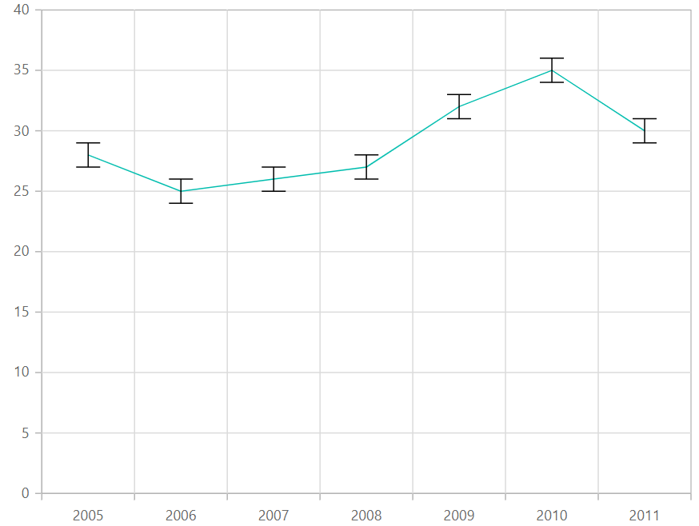

# Error Bar Chart in Blazor Charts (SfCharts)

## Error Bar

Error bars are graphical representations of the variability of data and used on graphs to indicate the error or uncertainty in a reported measurement. To render the error bar for the series, set [`Visible`](https://help.syncfusion.com/cr/blazor/Syncfusion.Blazor.Charts.ChartErrorBarSettings.html#Syncfusion_Blazor_Charts_ChartErrorBarSettings_Visible) property to **true** in [`ChartErrorBarSettings`](https://help.syncfusion.com/cr/blazor/Syncfusion.Blazor.Charts.ChartErrorBarSettings.html).





## Error Bar Type

To change the error bar rendering type, use [`Type`](https://help.syncfusion.com/cr/blazor/Syncfusion.Blazor.Charts.ChartErrorBarSettings.html#Syncfusion_Blazor_Charts_ChartErrorBarSettings_Type)
property in [`ChartErrorBarSettings`](https://help.syncfusion.com/cr/blazor/Syncfusion.Blazor.Charts.ChartErrorBarSettings.html) and to change the error bar line length, use [`VerticalError`](https://help.syncfusion.com/cr/blazor/Syncfusion.Blazor.Charts.ChartErrorBarSettings.html#Syncfusion_Blazor_Charts_ChartErrorBarSettings_VerticalError) property in [`ChartErrorBarSettings`](https://help.syncfusion.com/cr/blazor/Syncfusion.Blazor.Charts.ChartErrorBarSettings.html).





## Customizing Error Bar Type

To customize the error bar type by specifying the [`Type`](https://help.syncfusion.com/cr/blazor/Syncfusion.Blazor.Charts.ChartErrorBarSettings.html#Syncfusion_Blazor_Charts_ChartErrorBarSettings_Type) property to [`Custom`](https://help.syncfusion.com/cr/blazor/Syncfusion.Blazor.Charts.ErrorBarType.html#Syncfusion_Blazor_Charts_ErrorBarType_Custom) and
then change the [`HorizontalNegativeError`](https://help.syncfusion.com/cr/blazor/Syncfusion.Blazor.Charts.ChartErrorBarSettings.html#Syncfusion_Blazor_Charts_ChartErrorBarSettings_HorizontalNegativeError) and [`HorizontalPositiveError`](https://help.syncfusion.com/cr/blazor/Syncfusion.Blazor.Charts.ChartErrorBarSettings.html#Syncfusion_Blazor_Charts_ChartErrorBarSettings_HorizontalPositiveError) properties in [`ChartErrorBarSettings`](https://help.syncfusion.com/cr/blazor/Syncfusion.Blazor.Charts.ChartErrorBarSettings.html).





## Error Bar Mode

Error bar mode is used to define whether the error bar line has to be drawn horizontally, vertically or in both side and to change the error bar mode, use [`Mode`](https://help.syncfusion.com/cr/blazor/Syncfusion.Blazor.Charts.ChartErrorBarSettings.html#Syncfusion_Blazor_Charts_ChartErrorBarSettings_Mode) property in [`ChartErrorBarSettings`](https://help.syncfusion.com/cr/blazor/Syncfusion.Blazor.Charts.ChartErrorBarSettings.html).





## Error Bar Direction

To change the error bar direction to plus, minus or both side, use [`Direction`](https://help.syncfusion.com/cr/blazor/Syncfusion.Blazor.Charts.ChartErrorBarSettings.html#Syncfusion_Blazor_Charts_ChartErrorBarSettings_Direction) property in [`ChartErrorBarSettings`](https://help.syncfusion.com/cr/blazor/Syncfusion.Blazor.Charts.ChartErrorBarSettings.html).





## Customizing Error Bar Cap

To customize the error bar cap [`Length`](https://help.syncfusion.com/cr/blazor/Syncfusion.Blazor.Charts.ChartErrorBarCapSettings.html#Syncfusion_Blazor_Charts_ChartErrorBarCapSettings_Length), [`Width`](https://help.syncfusion.com/cr/blazor/Syncfusion.Blazor.Charts.ChartErrorBarCapSettings.html#Syncfusion_Blazor_Charts_ChartErrorBarCapSettings_Width) and [`Color`](https://help.syncfusion.com/cr/blazor/Syncfusion.Blazor.Charts.ChartErrorBarCapSettings.html#Syncfusion_Blazor_Charts_ChartErrorBarCapSettings_Color) properties in [`ChartErrorBarCapSettings`](https://help.syncfusion.com/cr/blazor/Syncfusion.Blazor.Charts.ChartErrorBarCapSettings.html).





> Refer to our [`Blazor Charts`](https://www.syncfusion.com/blazor-components/blazor-charts) feature tour page for its groundbreaking feature representations and also explore our [`Blazor Chart example`](https://blazor.syncfusion.com/demos/chart/line?theme=bootstrap4) to knows various chart types and how to represent time-dependent data, showing trends at equal intervals.

## See Also

* [Data label](../data-labels)
* [Tooltip](../tool-tip)