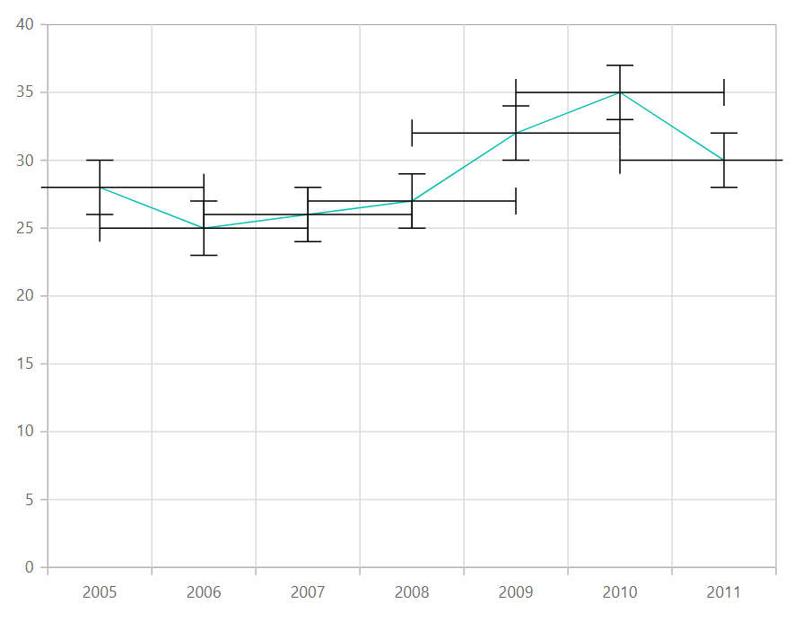
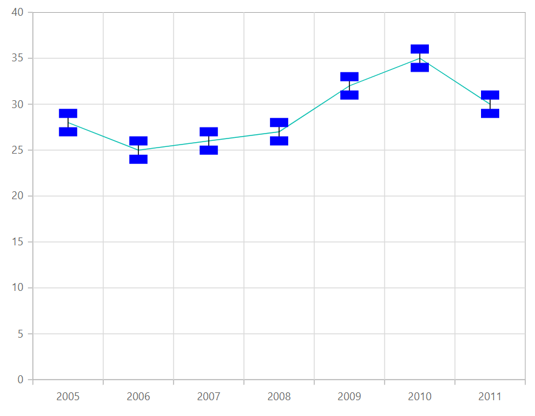

# Error Bar in Blazor Charts Component

## Error bar

Error bars are graphical representations of the variability of data that are used on graphs to indicate the error or uncertainty in a reported measurement. To render the error bar for the series, set [Visible](https://help.syncfusion.com/cr/blazor/Syncfusion.Blazor.Charts.ChartErrorBarSettings.html#Syncfusion_Blazor_Charts_ChartErrorBarSettings_Visible) property to **true** in [ChartErrorBarSettings](https://help.syncfusion.com/cr/blazor/Syncfusion.Blazor.Charts.ChartErrorBarSettings.html).

```cshtml

@using Syncfusion.Blazor.Charts

<SfChart>
    <ChartPrimaryXAxis ValueType="Syncfusion.Blazor.Charts.ValueType.Category">
    </ChartPrimaryXAxis>
	
    <ChartSeriesCollection>
        <ChartSeries DataSource="@SalesReports" XName="X" YName="Y" Type="ChartSeriesType.Line">
            <ChartErrorBarSettings Visible="true">
            </ChartErrorBarSettings>
        </ChartSeries>
    </ChartSeriesCollection>
</SfChart>

@code{
    public class ChartData
    {
        public double X { get; set; }
        public double Y {get; set; }
    }

    public List<ChartData> SalesReports = new List<ChartData>
	{
        new ChartData{ X= 2005, Y= 28 },
        new ChartData{ X= 2006, Y= 25 },
        new ChartData{ X= 2007, Y= 26 },
        new ChartData{ X= 2008, Y= 27 },
        new ChartData{ X= 2009, Y= 32 },
        new ChartData{ X= 2010, Y= 35 },
        new ChartData{ X= 2011, Y= 30 }
    };
}

``` 


<!--  -->

## Error bar type

To change the error bar rendering type, set [Type](https://help.syncfusion.com/cr/blazor/Syncfusion.Blazor.Charts.ChartErrorBarSettings.html#Syncfusion_Blazor_Charts_ChartErrorBarSettings_Type) property in [ChartErrorBarSettings](https://help.syncfusion.com/cr/blazor/Syncfusion.Blazor.Charts.ChartErrorBarSettings.html) and to change the error bar line length, use [VerticalError](https://help.syncfusion.com/cr/blazor/Syncfusion.Blazor.Charts.ChartErrorBarSettings.html#Syncfusion_Blazor_Charts_ChartErrorBarSettings_VerticalError) property in [ChartErrorBarSettings](https://help.syncfusion.com/cr/blazor/Syncfusion.Blazor.Charts.ChartErrorBarSettings.html).

```cshtml

@using Syncfusion.Blazor.Charts

<SfChart>
    <ChartPrimaryXAxis ValueType="Syncfusion.Blazor.Charts.ValueType.Category">
    </ChartPrimaryXAxis>
	
    <ChartSeriesCollection>
        <ChartSeries DataSource="@SalesReports" XName="X" YName="Y" Type="ChartSeriesType.Line">
            <ChartErrorBarSettings Visible="true" Type="ErrorBarType.Percentage" VerticalError="4">
            </ChartErrorBarSettings>
        </ChartSeries>
    </ChartSeriesCollection>
</SfChart>

@code{
    public class ChartData
    {
        public double X { get; set; }
        public double Y { get; set; }
    }

    public List<ChartData> SalesReports = new List<ChartData>
	{
        new ChartData{ X= 2005, Y= 28 },
        new ChartData{ X= 2006, Y= 25 },
        new ChartData{ X= 2007, Y= 26 },
        new ChartData{ X= 2008, Y= 27 },
        new ChartData{ X= 2009, Y= 32 },
        new ChartData{ X= 2010, Y= 35 },
        new ChartData{ X= 2011, Y= 30 }
    };
}

``` 

<!--  -->

## Customizing error bar type

To customize the error bar type, specify the [Type](https://help.syncfusion.com/cr/blazor/Syncfusion.Blazor.Charts.ChartErrorBarSettings.html#Syncfusion_Blazor_Charts_ChartErrorBarSettings_Type) property to [Custom](https://help.syncfusion.com/cr/blazor/Syncfusion.Blazor.Charts.ErrorBarType.html#Syncfusion_Blazor_Charts_ErrorBarType_Custom) and then change the [HorizontalNegativeError](https://help.syncfusion.com/cr/blazor/Syncfusion.Blazor.Charts.ChartErrorBarSettings.html#Syncfusion_Blazor_Charts_ChartErrorBarSettings_HorizontalNegativeError) and [HorizontalPositiveError](https://help.syncfusion.com/cr/blazor/Syncfusion.Blazor.Charts.ChartErrorBarSettings.html#Syncfusion_Blazor_Charts_ChartErrorBarSettings_HorizontalPositiveError) properties in [ChartErrorBarSettings](https://help.syncfusion.com/cr/blazor/Syncfusion.Blazor.Charts.ChartErrorBarSettings.html).

```cshtml

@using Syncfusion.Blazor.Charts

<SfChart>
    <ChartPrimaryXAxis ValueType="Syncfusion.Blazor.Charts.ValueType.Category">
    </ChartPrimaryXAxis>

    <ChartSeriesCollection>
        <ChartSeries DataSource="@SalesReports" XName="X" YName="Y" Type="ChartSeriesType.Line">
            <ChartErrorBarSettings Visible="true" Type="ErrorBarType.Custom" Mode="ErrorBarMode.Both"
                                   VerticalPositiveError="2" HorizontalPositiveError="1" VerticalNegativeError="2" HorizontalNegativeError="1">
            </ChartErrorBarSettings>
        </ChartSeries>
    </ChartSeriesCollection>
</SfChart>

@code{
    public class ChartData
    {
        public double X { get; set; }
        public double Y { get; set; }
    }

    public List<ChartData> SalesReports = new List<ChartData>
	{
        new ChartData{ X= 2005, Y= 28 },
        new ChartData{ X= 2006, Y= 25 },
        new ChartData{ X= 2007, Y= 26 },
        new ChartData{ X= 2008, Y= 27 },
        new ChartData{ X= 2009, Y= 32 },
        new ChartData{ X= 2010, Y= 35 },
        new ChartData{ X= 2011, Y= 30 }
    };
}

``` 


<!--  -->

## Error bar mode

Error bar mode is used to define whether the error bar line should be drawn horizontally, vertically, or on both sides. To change the error bar mode, use [Mode](https://help.syncfusion.com/cr/blazor/Syncfusion.Blazor.Charts.ChartErrorBarSettings.html#Syncfusion_Blazor_Charts_ChartErrorBarSettings_Mode) property in [ChartErrorBarSettings](https://help.syncfusion.com/cr/blazor/Syncfusion.Blazor.Charts.ChartErrorBarSettings.html).

```cshtml

@using Syncfusion.Blazor.Charts

<SfChart>
    <ChartPrimaryXAxis ValueType="Syncfusion.Blazor.Charts.ValueType.Category">
    </ChartPrimaryXAxis>
	
    <ChartSeriesCollection>
        <ChartSeries DataSource="@SalesReports" XName="X" YName="Y" Type="ChartSeriesType.Line">
            <ChartErrorBarSettings Visible="true" Mode="ErrorBarMode.Horizontal">
            </ChartErrorBarSettings>
        </ChartSeries>
    </ChartSeriesCollection>
</SfChart>

@code{
    public class ChartData
    {
        public double X { get; set; }
        public double Y { get; set; }
    }

    public List<ChartData> SalesReports = new List<ChartData>
	{
        new ChartData{ X= 2005, Y= 28 },
        new ChartData{ X= 2006, Y= 25 },
        new ChartData{ X= 2007, Y= 26 },
        new ChartData{ X= 2008, Y= 27 },
        new ChartData{ X= 2009, Y= 32 },
        new ChartData{ X= 2010, Y= 35 },
        new ChartData{ X= 2011, Y= 30 }
    };
}

``` 

<!--  -->

## Error bar direction

To change the error bar direction to plus, minus, or both sides, use [Direction](https://help.syncfusion.com/cr/blazor/Syncfusion.Blazor.Charts.ChartErrorBarSettings.html#Syncfusion_Blazor_Charts_ChartErrorBarSettings_Direction) property in [ChartErrorBarSettings](https://help.syncfusion.com/cr/blazor/Syncfusion.Blazor.Charts.ChartErrorBarSettings.html).

```cshtml

@using Syncfusion.Blazor.Charts

<SfChart>
    <ChartPrimaryXAxis ValueType="Syncfusion.Blazor.Charts.ValueType.Category">
    </ChartPrimaryXAxis>
	
    <ChartSeriesCollection>
        <ChartSeries DataSource="@SalesReports" XName="X" YName="Y" Type="ChartSeriesType.Line">
            <ChartErrorBarSettings Visible="true" Mode="ErrorBarMode.Both" Direction="ErrorBarDirection.Minus">
            </ChartErrorBarSettings>
        </ChartSeries>
    </ChartSeriesCollection>
</SfChart>

@code{
    public class ChartData
    {
        public double X { get; set; }
        public double Y { get; set; }
    }

    public List<ChartData> SalesReports = new List<ChartData>
	{
        new ChartData{ X= 2005, Y= 28 },
        new ChartData{ X= 2006, Y= 25 },
        new ChartData{ X= 2007, Y= 26 },
        new ChartData{ X= 2008, Y= 27 },
        new ChartData{ X= 2009, Y= 32 },
        new ChartData{ X= 2010, Y= 35 },
        new ChartData{ X= 2011, Y= 30 }
    };
}

``` 

<!--  -->

## Customizing error bar cap

To customize the error bar cap [Length](https://help.syncfusion.com/cr/blazor/Syncfusion.Blazor.Charts.ChartErrorBarCapSettings.html#Syncfusion_Blazor_Charts_ChartErrorBarCapSettings_Length), [Width](https://help.syncfusion.com/cr/blazor/Syncfusion.Blazor.Charts.ChartErrorBarCapSettings.html#Syncfusion_Blazor_Charts_ChartErrorBarCapSettings_Width) and [Color](https://help.syncfusion.com/cr/blazor/Syncfusion.Blazor.Charts.ChartErrorBarCapSettings.html#Syncfusion_Blazor_Charts_ChartErrorBarCapSettings_Color) properties in [ChartErrorBarCapSettings](https://help.syncfusion.com/cr/blazor/Syncfusion.Blazor.Charts.ChartErrorBarCapSettings.html).

```cshtml

@using Syncfusion.Blazor.Charts

<SfChart>
    <ChartPrimaryXAxis ValueType="Syncfusion.Blazor.Charts.ValueType.Category">
    </ChartPrimaryXAxis>
	
    <ChartSeriesCollection>
        <ChartSeries DataSource="@SalesReports" XName="X" YName="Y" Type="ChartSeriesType.Line">
            <ChartErrorBarSettings Visible="true">
                <ChartErrorBarCapSettings Length="10" Width="10" Color="#0000ff"></ChartErrorBarCapSettings>
            </ChartErrorBarSettings>
        </ChartSeries>
    </ChartSeriesCollection>
</SfChart>

@code{
    public class ChartData
    {
        public double X { get; set; }
        public double Y { get; set; }
    }

    public List<ChartData> SalesReports = new List<ChartData>
	{
        new ChartData{ X= 2005, Y= 28 },
        new ChartData{ X= 2006, Y= 25 },
        new ChartData{ X= 2007, Y= 26 },
        new ChartData{ X= 2008, Y= 27 },
        new ChartData{ X= 2009, Y= 32 },
        new ChartData{ X= 2010, Y= 35 },
        new ChartData{ X= 2011, Y= 30 }
    };
}

``` 


<!--  -->

N> Refer to our [Blazor Charts](https://www.syncfusion.com/blazor-components/blazor-charts) feature tour page for its groundbreaking feature representations and also explore our [Blazor Chart Example](https://blazor.syncfusion.com/demos/chart/line?theme=bootstrap5) to know various chart types and how to represent time-dependent data, showing trends at equal intervals.

## See also

* [Data label](../data-labels)
* [Tooltip](../tool-tip)