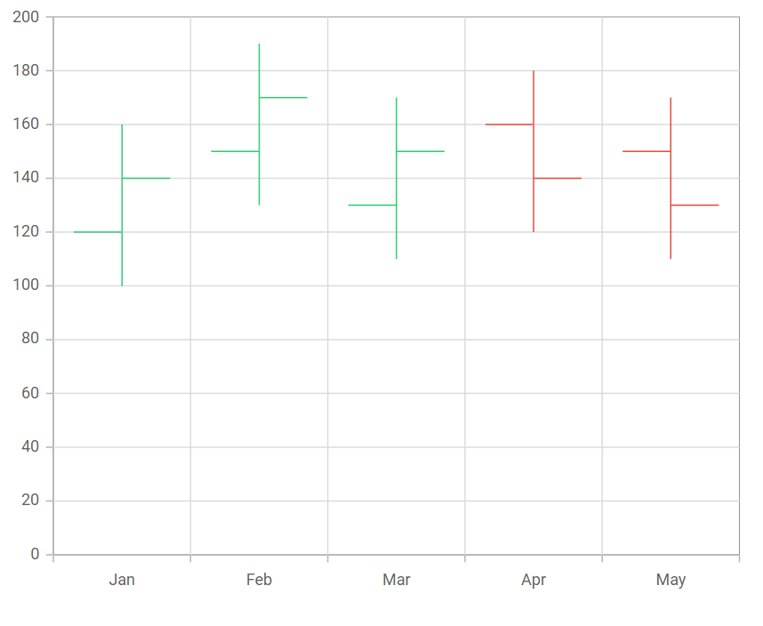

# High Low Open Close Chart in Blazor Charts Component

## High Low Open Close Chart

The [HiloOpenClose](https://help.syncfusion.com/cr/blazor/Syncfusion.Blazor.Charts.ChartSeriesType.html#Syncfusion_Blazor_Charts_ChartSeriesType_HiloOpenClose) series represents **Low**, **High**, **Open**, and **Close** values over time.

Learn how to create a HiloOpenClose chart using Blazor Charts by watching the following video.



Render the chart by setting the series [Type](https://help.syncfusion.com/cr/blazor/Syncfusion.Blazor.Charts.ChartSeries.html#Syncfusion_Blazor_Charts_ChartSeries_Type) to [HiloOpenClose](https://help.syncfusion.com/cr/blazor/Syncfusion.Blazor.Charts.ChartSeriesType.html#Syncfusion_Blazor_Charts_ChartSeriesType_HiloOpenClose). This chart displays high, low, open, and close values for each data point, providing a comprehensive visualization of stock price movements. The HiloOpenClose series requires five fields (X, High, Low, Open, and Close) to accurately display stock prices over time.

```cshtml 

@using Syncfusion.Blazor.Charts

<SfChart>
    <ChartPrimaryXAxis ValueType="Syncfusion.Blazor.Charts.ValueType.Category" />

    <ChartSeriesCollection>
        <ChartSeries DataSource="@StockDetails" XName="X" High="High" Low="Low" Open="Open" Close="Close" Type="ChartSeriesType.HiloOpenClose">
        </ChartSeries>
    </ChartSeriesCollection>
</SfChart>

@code {
    public class Data
    {
        public string X { get; set; }
        public double High { get; set; }
        public double Low { get; set; }
        public double Open { get; set; }
        public double Close { get; set; }
    }

    public List<Data> StockDetails = new List<Data>
	{
        new Data { X = "Jan", Open = 120, High = 160, Low = 100, Close = 140 },
        new Data { X = "Feb", Open = 150, High = 190, Low = 130, Close = 170 },
        new Data { X = "Mar", Open = 130, High = 170, Low = 110, Close = 150 },
        new Data { X = "Apr", Open = 160, High = 180, Low = 120, Close = 140 },
        new Data { X = "May", Open = 150, High = 170, Low = 110, Close = 130 }
    };
}

```




## Binding data with series

Bind data to the chart using the [`DataSource`](https://help.syncfusion.com/cr/blazor/Syncfusion.Blazor.Charts.ChartSeries.html#Syncfusion_Blazor_Charts_ChartSeries_DataSource) property in the series configuration. The [`DataSource`](https://help.syncfusion.com/cr/blazor/Syncfusion.Blazor.Charts.ChartSeries.html#Syncfusion_Blazor_Charts_ChartSeries_DataSource) value can be set using either [`SfDataManager`](https://help.syncfusion.com/cr/blazor/Syncfusion.Blazor.Data.SfDataManager.html) or a list of business objects. For more information, see [Working with Data](../working-with-data). Map the data fields to the chart series' [`XName`](https://help.syncfusion.com/cr/blazor/Syncfusion.Blazor.Charts.ChartSeries.html#Syncfusion_Blazor_Charts_ChartSeries_XName), [`High`](https://help.syncfusion.com/cr/blazor/Syncfusion.Blazor.Charts.ChartSeries.html#Syncfusion_Blazor_Charts_ChartSeries_High), [`Low`](https://help.syncfusion.com/cr/blazor/Syncfusion.Blazor.Charts.ChartSeries.html#Syncfusion_Blazor_Charts_ChartSeries_Low), [`Open`](https://help.syncfusion.com/cr/blazor/Syncfusion.Blazor.Charts.ChartSeries.html#Syncfusion_Blazor_Charts_ChartSeries_Open), and [`Close`](https://help.syncfusion.com/cr/blazor/Syncfusion.Blazor.Charts.ChartSeries.html#Syncfusion_Blazor_Charts_ChartSeries_Close) properties.

```cshtml 

@using Syncfusion.Blazor.Charts

<SfChart>
    <ChartPrimaryXAxis ValueType="Syncfusion.Blazor.Charts.ValueType.Category" />

    <ChartSeriesCollection>
        <ChartSeries DataSource="@StockDetails" XName="X" High="High" Low="Low" Open="Open" Close="Close" Type="ChartSeriesType.HiloOpenClose">
        </ChartSeries>
    </ChartSeriesCollection>
</SfChart>

@code{
    public class Data
    {
        public string X { get; set; }
        public double High { get; set; }
        public double Low { get; set; }
        public double Open { get; set; }
        public double Close { get; set; }
    }

    public List<Data> StockDetails = new List<Data>
	{
        new Data { X = "Jan", Open = 120, High = 160, Low = 100, Close = 140 },
        new Data { X = "Feb", Open = 150, High = 190, Low = 130, Close = 170 },
        new Data { X = "Mar", Open = 130, High = 170, Low = 110, Close = 150 },
        new Data { X = "Apr", Open = 160, High = 180, Low = 120, Close = 140 },
        new Data { X = "May", Open = 150, High = 170, Low = 110, Close = 130 }
    };
}

```


## Series customization

In the HiloOpenClose series, [BullFillColor](https://help.syncfusion.com/cr/blazor/Syncfusion.Blazor.Charts.ChartSeries.html#Syncfusion_Blazor_Charts_ChartSeries_BullFillColor) fills the segment when the open value is greater than the close value, and [BearFillColor](https://help.syncfusion.com/cr/blazor/Syncfusion.Blazor.Charts.ChartSeries.html#Syncfusion_Blazor_Charts_ChartSeries_BearFillColor) fills the segment when the open value is less than the close value. By default, [BullFillColor](https://help.syncfusion.com/cr/blazor/Syncfusion.Blazor.Charts.ChartSeries.html#Syncfusion_Blazor_Charts_ChartSeries_BullFillColor) is green and [BearFillColor](https://help.syncfusion.com/cr/blazor/Syncfusion.Blazor.Charts.ChartSeries.html#Syncfusion_Blazor_Charts_ChartSeries_BearFillColor) is red.

```cshtml 

@using Syncfusion.Blazor.Charts

<SfChart>
    <ChartPrimaryXAxis ValueType="Syncfusion.Blazor.Charts.ValueType.Category" />    

    <ChartSeriesCollection>
        <ChartSeries DataSource="@StockDetails" XName="X" High="High" Width="5" BearFillColor="darkred" BullFillColor="darkgreen" Low="Low" Open="Open" Close="Close" Type="ChartSeriesType.HiloOpenClose">
        </ChartSeries>
    </ChartSeriesCollection>
</SfChart>

@code {
    public class Data
    {
        public string X { get; set; }
        public double High { get; set; }
        public double Low { get; set; }
        public double Open { get; set; }
        public double Close { get; set; }
    }

    public List<Data> StockDetails = new List<Data>
	{
        new Data { X = "Jan", Open = 120, High = 160, Low = 100, Close = 140 },
        new Data { X = "Feb", Open = 150, High = 190, Low = 130, Close = 170 },
        new Data { X = "Mar", Open = 130, High = 170, Low = 110, Close = 150 },
        new Data { X = "Apr", Open = 160, High = 180, Low = 120, Close = 140 },
        new Data { X = "May", Open = 150, High = 170, Low = 110, Close = 130 }
    };
}

```


## Empty points

Data points with `null`, `double.NaN`, or `undefined` values are considered empty and are not plotted.

**Mode**

Use the [`Mode`](https://help.syncfusion.com/cr/blazor/Syncfusion.Blazor.Charts.ChartEmptyPointSettings.html#Syncfusion_Blazor_Charts_ChartEmptyPointSettings_Mode) property to specify how empty or missing data points are handled. The default mode is [`Gap`](https://help.syncfusion.com/cr/blazor/Syncfusion.Blazor.Charts.EmptyPointMode.html#Syncfusion_Blazor_Charts_EmptyPointMode_Gap).

```cshtml

@using Syncfusion.Blazor.Charts

<SfChart>
    <ChartPrimaryXAxis ValueType="Syncfusion.Blazor.Charts.ValueType.Category" />

    <ChartSeriesCollection>
        <ChartSeries DataSource="@StockDetails" XName="X" High="High" Low="Low" Open="Open" Close="Close" Type="Syncfusion.Blazor.Charts.ChartSeriesType.HiloOpenClose">
            <ChartEmptyPointSettings Mode="EmptyPointMode.Gap"></ChartEmptyPointSettings>
        </ChartSeries>
    </ChartSeriesCollection>
</SfChart>

@code {
    public class Data
    {
        public string X { get; set; }
        public double High { get; set; }
        public double Low { get; set; }
        public double Open { get; set; }
        public double Close { get; set; }
    }

    public List<Data> StockDetails = new List<Data>
    {
        new Data { X = "Jan", Open = 120, High = 160, Low = 100, Close = 140 },
        new Data { X = "Feb", Open = 150, High = 190, Low = 130, Close = 170 },
        new Data { X = "Mar", Open = double.NaN, High = double.NaN, Low = double.NaN, Close = double.NaN },
        new Data { X = "Apr", Open = 160, High = 180, Low = 120, Close = 140 },
        new Data { X = "May", Open = 150, High = 170, Low = 110, Close = 130 }
    };
}

```


**Fill**

Customize the fill color of empty points using the [`Fill`](https://help.syncfusion.com/cr/blazor/Syncfusion.Blazor.Charts.ChartEmptyPointSettings.html#Syncfusion_Blazor_Charts_ChartEmptyPointSettings_Fill) property.

```cshtml

@using Syncfusion.Blazor.Charts

<SfChart>
    <ChartPrimaryXAxis ValueType="Syncfusion.Blazor.Charts.ValueType.Category" />

    <ChartSeriesCollection>
        <ChartSeries DataSource="@StockDetails" XName="X" High="High" Low="Low" Open="Open" Close="Close" Type="Syncfusion.Blazor.Charts.ChartSeriesType.HiloOpenClose">
            <ChartEmptyPointSettings Mode="EmptyPointMode.Average" Fill="#FFDE59"></ChartEmptyPointSettings>
        </ChartSeries>
    </ChartSeriesCollection>
</SfChart>

@code {
    public class Data
    {
        public string X { get; set; }
        public double High { get; set; }
        public double Low { get; set; }
        public double Open { get; set; }
        public double Close { get; set; }
    }

    public List<Data> StockDetails = new List<Data>
    {
        new Data { X = "Jan", Open = 120, High = 160, Low = 100, Close = 140 },
        new Data { X = "Feb", Open = 150, High = 190, Low = 130, Close = 170 },
        new Data { X = "Mar", Open = double.NaN, High = double.NaN, Low = double.NaN, Close = double.NaN },
        new Data { X = "Apr", Open = 160, High = 180, Low = 120, Close = 140 },
        new Data { X = "May", Open = 150, High = 170, Low = 110, Close = 130 }
    };
}

```


## Events

### Series render

The [`OnSeriesRender`](https://help.syncfusion.com/cr/blazor/Syncfusion.Blazor.Charts.ChartEvents.html#Syncfusion_Blazor_Charts_ChartEvents_OnSeriesRender) event enables customization of series properties, such as [Data](https://help.syncfusion.com/cr/blazor/Syncfusion.Blazor.Charts.SeriesRenderEventArgs.html#Syncfusion_Blazor_Charts_SeriesRenderEventArgs_Data), [Fill](https://help.syncfusion.com/cr/blazor/Syncfusion.Blazor.Charts.SeriesRenderEventArgs.html#Syncfusion_Blazor_Charts_SeriesRenderEventArgs_Fill), and [Series](https://help.syncfusion.com/cr/blazor/Syncfusion.Blazor.Charts.SeriesRenderEventArgs.html#Syncfusion_Blazor_Charts_SeriesRenderEventArgs_Series), before rendering.

```cshtml

@using Syncfusion.Blazor.Charts

<SfChart>
    <ChartPrimaryXAxis ValueType="Syncfusion.Blazor.Charts.ValueType.Category" />
    <ChartEvents OnSeriesRender="SeriesRender"></ChartEvents>
    <ChartSeriesCollection>
        <ChartSeries DataSource="@StockDetails" XName="X" High="High" Low="Low" Open="Open" Close="Close" Type="Syncfusion.Blazor.Charts.ChartSeriesType.HiloOpenClose" />
    </ChartSeriesCollection>
</SfChart>

@code {
    public class Data
    {
        public string X { get; set; }
        public double High { get; set; }
        public double Low { get; set; }
        public double Open { get; set; }
        public double Close { get; set; }
    }

    public void SeriesRender(SeriesRenderEventArgs args)
    {
        args.Series.BearFillColor = "blue";
        args.Series.BullFillColor = "orange";
    }

    public List<Data> StockDetails = new List<Data>
    {
        new Data { X = "Jan", Open = 120, High = 160, Low = 100, Close = 140 },
        new Data { X = "Feb", Open = 150, High = 190, Low = 130, Close = 170 },
        new Data { X = "Mar", Open = 130, High = 170, Low = 110, Close = 150 },
        new Data { X = "Apr", Open = 160, High = 180, Low = 120, Close = 140 },
        new Data { X = "May", Open = 150, High = 170, Low = 110, Close = 130 }
    };
}

```


### Point render

The [`OnPointRender`](https://help.syncfusion.com/cr/blazor/Syncfusion.Blazor.Charts.ChartEvents.html#Syncfusion_Blazor_Charts_ChartEvents_OnPointRender) event allows customization of each data point before rendering.

```cshtml

@using Syncfusion.Blazor.Charts

<SfChart>
    <ChartPrimaryXAxis ValueType="Syncfusion.Blazor.Charts.ValueType.Category" />
    <ChartEvents OnPointRender="PointRender"></ChartEvents>
    <ChartSeriesCollection>
        <ChartSeries DataSource="@StockDetails" XName="X" High="High" Low="Low" Open="Open" Close="Close" Type="Syncfusion.Blazor.Charts.ChartSeriesType.HiloOpenClose" />
    </ChartSeriesCollection>
</SfChart>

@code {
    public class Data
    {
        public string X { get; set; }
        public double High { get; set; }
        public double Low { get; set; }
        public double Open { get; set; }
        public double Close { get; set; }
    }

    public void PointRender(PointRenderEventArgs args)
    {
        args.Series.BearFillColor = args.Point.X.ToString() == "Mar" ? "#E91E63" : "#3F51B5";
        args.Series.BullFillColor = args.Point.X.ToString() == "Mar" ? "#E91E63" : "#3F51B5";
    }

    public List<Data> StockDetails = new List<Data>
    {
        new Data { X = "Jan", Open = 120, High = 160, Low = 100, Close = 140 },
        new Data { X = "Feb", Open = 150, High = 190, Low = 130, Close = 170 },
        new Data { X = "Mar", Open = 130, High = 170, Low = 110, Close = 150 },
        new Data { X = "Apr", Open = 160, High = 180, Low = 120, Close = 140 },
        new Data { X = "May", Open = 150, High = 170, Low = 110, Close = 130 }
    };
}

```


N> Refer to our [Blazor Charts](https://www.syncfusion.com/blazor-components/blazor-charts) feature tour page for its groundbreaking feature representations and also explore our [Blazor Chart Example](https://blazor.syncfusion.com/demos/chart/line?theme=bootstrap5) to know various chart types and how to represent time-dependent data, showing trends at equal intervals.

## See also

* [Data label](../data-labels)
* [Tooltip](../tool-tip)
