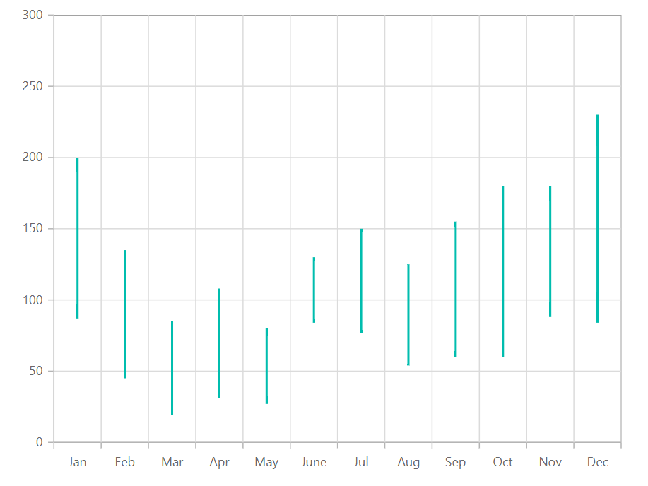
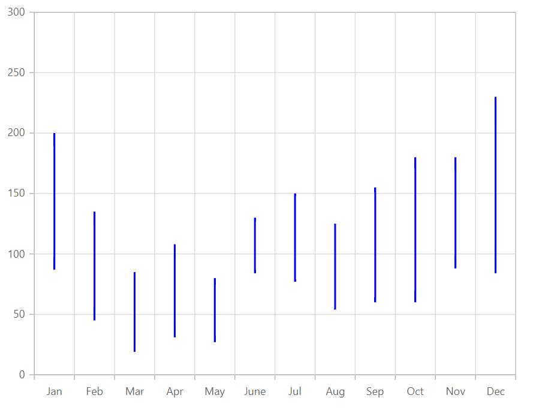

---
title: "Hilo Chart in Blazor Charts component | Syncfusion"

component: "Charts"

description: "Learn here all about Hilo Chart of Syncfusion Charts (SfCharts) component and more."
---

# Hilo Chart in Blazor Charts (SfCharts)

## Hilo

[`Hilo`](https://help.syncfusion.com/cr/blazor/Syncfusion.Blazor.Charts.ChartSeriesType.html#Syncfusion_Blazor_Charts_ChartSeriesType_Hilo) series illustrates the price movements in stock using the high and low values and it can be rendered by specifying the series [`Type`](https://help.syncfusion.com/cr/blazor/Syncfusion.Blazor~Syncfusion.Blazor.Charts.ChartSeries~Type.html) as [`Hilo`](https://help.syncfusion.com/cr/blazor/Syncfusion.Blazor.Charts.ChartSeriesType.html#Syncfusion_Blazor_Charts_ChartSeriesType_Hilo). Hilo series requires three fields (x, high and low) to show the high and low price in the stock.







> Refer to our [`Blazor Hilo Chart`](https://www.syncfusion.com/blazor-components/blazor-charts/chart-types/hilo-chart) feature tour page to know about its other groundbreaking feature representations and also explore our [`Blazor Hilo Chart example`](https://blazor.syncfusion.com/demos/chart/hilo) to know how to render and configure the Hilo type series.

## Series Customization

The following properties can be used to customize the [`Hilo`](https://help.syncfusion.com/cr/blazor/Syncfusion.Blazor.Charts.ChartSeriesType.html#Syncfusion_Blazor_Charts_ChartSeriesType_Hilo) series.

* [`Fill`](https://help.syncfusion.com/cr/blazor/Syncfusion.Blazor.Charts.ChartSeries.html#Syncfusion_Blazor_Charts_ChartSeries_Fill) – Specifies the color of the series.
* [`Opacity`](https://help.syncfusion.com/cr/blazor/Syncfusion.Blazor.Charts.ChartSeries.html#Syncfusion_Blazor_Charts_ChartSeries_Opacity) – Specifies the opacity of [`Fill`](https://help.syncfusion.com/cr/blazor/Syncfusion.Blazor.Charts.ChartSeries.html#Syncfusion_Blazor_Charts_ChartSeries_Fill).

```csharp
@using Syncfusion.Blazor.Charts

<SfChart>
    <ChartPrimaryXAxis ValueType="Syncfusion.Blazor.Charts.ValueType.Category" />
    <ChartSeriesCollection>
        <ChartSeries DataSource="@StockDetails" XName="X" High="High" Low="Low" Fill="blue" Type="ChartSeriesType.Hilo">
        </ChartSeries>
    </ChartSeriesCollection>
</SfChart>

@code{
    public class Data
    {
        public string X { get; set; }
        public double Y { get; set; }
        public double High { get; set; }
        public double Low { get; set; }
    }
    public List<Data> StockDetails = new List<Data> {
            new Data{ X= "Jan", Low= 87, High= 200 },
            new Data{ X= "Feb", Low= 45, High= 135 },
            new Data{ X= "Mar", Low= 19, High= 85 },
            new Data{ X= "Apr", Low= 31, High= 108 },
            new Data{ X= "May", Low= 27, High= 80 },
            new Data{ X= "June",Low= 84, High= 130 },
            new Data{ X= "Jul", Low= 77, High=150 },
            new Data{ X= "Aug", Low= 54, High= 125 },
            new Data{ X= "Sep", Low= 60, High= 155 },
            new Data{ X= "Oct", Low= 60, High= 180 },
            new Data{ X= "Nov", Low= 88, High= 180 },
            new Data{ X= "Dec", Low= 84, High= 230 }
        };
}
```



> Refer to our Blazor [`Charts`](https://www.syncfusion.com/blazor-components/blazor-charts) feature tour page for its groundbreaking feature representations and also explore our Blazor [`Chart example`](https://blazor.syncfusion.com/demos/chart/line?theme=bootstrap4) to know various chart types and how to represent time-dependent data, showing trends at equal intervals.

## See Also

* [Data Label](../data-labels)
* [Tooltip](../tool-tip)