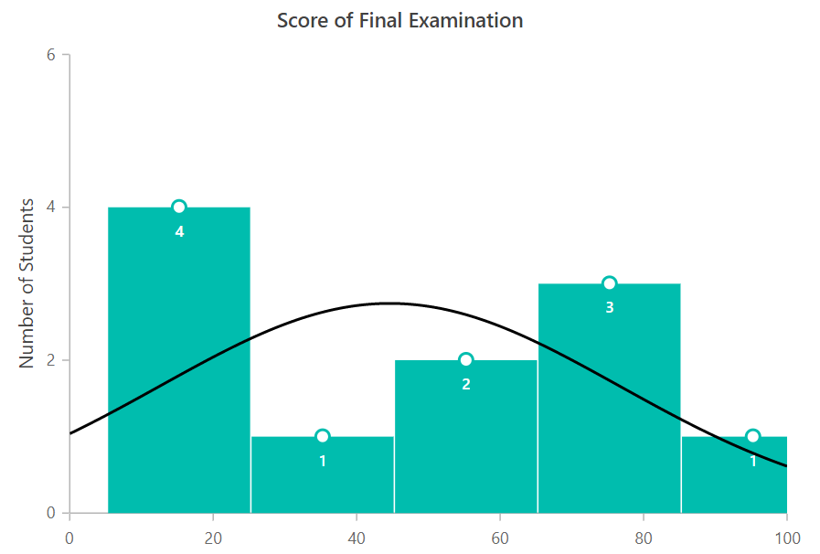

# Histogram Chart in Blazor Charts (SfCharts)

## Histogram

[`Histogram charts`](https://www.syncfusion.com/blazor-components/blazor-charts/chart-types/histogram-chart) can provide a visual display of large amounts of data that are difficult to understand in a tabular or spreadsheet form and it can be rendered by specifying the series [`Type`](https://help.syncfusion.com/cr/blazor/Syncfusion.Blazor~Syncfusion.Blazor.Charts.ChartSeries~Type.html) to [`Histogram`](https://help.syncfusion.com/cr/blazor/Syncfusion.Blazor.Charts.ChartSeriesType.html#Syncfusion_Blazor_Charts_ChartSeriesType_Histogram).





> Refer to our [`Blazor Charts`](https://www.syncfusion.com/blazor-components/blazor-charts) feature tour page for its groundbreaking feature representations and also explore our [`Blazor Chart example`](https://blazor.syncfusion.com/demos/chart/line?theme=bootstrap4) to know various chart types and how to represent time-dependent data, showing trends at equal intervals.

## See Also

* [Data Label](../data-labels)
* [Tooltip](../tool-tip)
