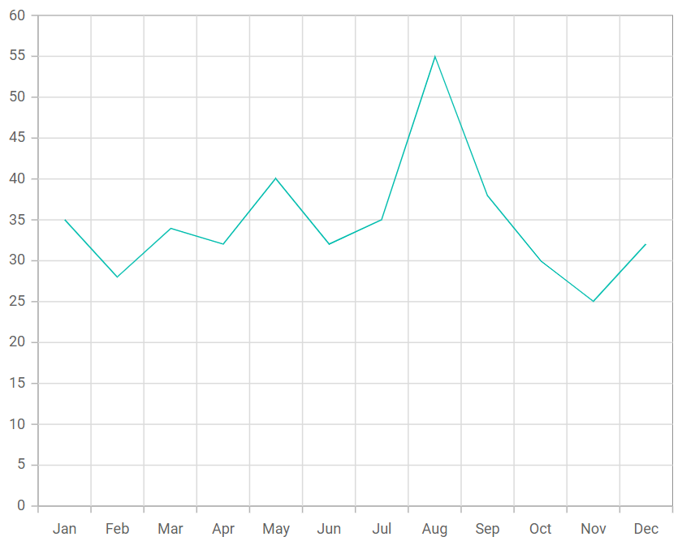

# Line Chart in Blazor Charts Component

## Line

[Line Chart](https://www.syncfusion.com/blazor-components/blazor-charts/chart-types/line-chart) represents and visualizes the time-dependent data to show the trends at equal intervals.

You can learn how to create a line chart using Blazor Charts by watching the video below.



To render a [Line](https://www.syncfusion.com/blazor-components/blazor-charts/chart-types/line-chart) series in your chart, define the series [`Type`](https://help.syncfusion.com/cr/blazor/Syncfusion.Blazor.Charts.ChartSeries.html#Syncfusion_Blazor_Charts_ChartSeries_Type) as [`Line`](https://help.syncfusion.com/cr/blazor/Syncfusion.Blazor.Charts.ChartSeriesType.html#Syncfusion_Blazor_Charts_ChartSeriesType_Line) in your chart configuration. This indicates that the data should be represented as a line chart, which is ideal for visualizing trends over time or across categories.

```cshtml

@using Syncfusion.Blazor.Charts

<SfChart>
    <ChartPrimaryXAxis ValueType="Syncfusion.Blazor.Charts.ValueType.Category"></ChartPrimaryXAxis>
    <ChartSeriesCollection>
        <ChartSeries DataSource="@SalesDetails" XName="X" YName="Y" Type="ChartSeriesType.Line">
        </ChartSeries>
    </ChartSeriesCollection>
</SfChart>

@code{
    public class ChartData
    {
        public string X { get; set;}
        public double Y {get; set;}
    }
	
    public List<ChartData> SalesDetails = new List<ChartData>
	{
        new ChartData { X= "Jan", Y= 35 },
        new ChartData { X= "Feb", Y= 28 },
        new ChartData { X= "Mar", Y= 34 },
        new ChartData { X= "Apr", Y= 32 },
        new ChartData { X= "May", Y= 40 },
        new ChartData { X= "Jun", Y= 32 },
        new ChartData { X= "Jul", Y= 35 },
        new ChartData { X= "Aug", Y= 55 },
        new ChartData { X= "Sep", Y= 38 },
        new ChartData { X= "Oct", Y= 30 },
        new ChartData { X= "Nov", Y= 25 },
        new ChartData { X= "Dec", Y= 32 }
    };
}

``` 




N> Refer to our [Blazor Line Chart](https://www.syncfusion.com/blazor-components/blazor-charts/chart-types/line-chart) feature tour page to know about its other groundbreaking feature representations. Explore our [Blazor Line Chart Example](https://blazor.syncfusion.com/demos/chart/line?theme=bootstrap5) to know how to represent time-dependent data, showing trends at equal intervals.

## Binding data with series

You can bind data to the chart using the [`DataSource`](https://help.syncfusion.com/cr/blazor/Syncfusion.Blazor.Charts.ChartSeries.html#Syncfusion_Blazor_Charts_ChartSeries_DataSource) property within the series configuration. The [`DataSource`](https://help.syncfusion.com/cr/blazor/Syncfusion.Blazor.Charts.ChartSeries.html#Syncfusion_Blazor_Charts_ChartSeries_DataSource) value can be set using either [`SfDataManager`](https://help.syncfusion.com/cr/blazor/Syncfusion.Blazor.Data.SfDataManager.html) property values or a list of business objects. More information on data binding can be found [here](../working-with-data). To display the data correctly, map the fields from the data to the chart series' [`XName`](https://help.syncfusion.com/cr/blazor/Syncfusion.Blazor.Charts.ChartSeries.html#Syncfusion_Blazor_Charts_ChartSeries_XName) and [`YName`](https://help.syncfusion.com/cr/blazor/Syncfusion.Blazor.Charts.ChartSeries.html#Syncfusion_Blazor_Charts_ChartSeries_YName) properties.

```cshtml

@using Syncfusion.Blazor.Charts

<SfChart>
    <ChartPrimaryXAxis ValueType="Syncfusion.Blazor.Charts.ValueType.Category"></ChartPrimaryXAxis>
    <ChartSeriesCollection>
        <ChartSeries DataSource="@SalesDetails" XName="X" YName="Y" Type="ChartSeriesType.Line">
        </ChartSeries>
    </ChartSeriesCollection>
</SfChart>

@code{
    public class ChartData
    {
        public string X { get; set;}
        public double Y {get; set;}
    }
	
    public List<ChartData> SalesDetails = new List<ChartData>
	{
        new ChartData { X= "Jan", Y= 35 },
        new ChartData { X= "Feb", Y= 28 },
        new ChartData { X= "Mar", Y= 34 },
        new ChartData { X= "Apr", Y= 32 },
        new ChartData { X= "May", Y= 40 },
        new ChartData { X= "Jun", Y= 32 },
        new ChartData { X= "Jul", Y= 35 },
        new ChartData { X= "Aug", Y= 55 },
        new ChartData { X= "Sep", Y= 38 },
        new ChartData { X= "Oct", Y= 30 },
        new ChartData { X= "Nov", Y= 25 },
        new ChartData { X= "Dec", Y= 32 }
    };
}

``` 


## Series customization

The following properties can be used to customize the [Line](https://help.syncfusion.com/cr/blazor/Syncfusion.Blazor.Charts.ChartSeriesType.html#Syncfusion_Blazor_Charts_ChartSeriesType_Line) series.

**Fill**

The [Fill](https://help.syncfusion.com/cr/blazor/Syncfusion.Blazor.Charts.ChartSeries.html#Syncfusion_Blazor_Charts_ChartSeries_Fill) property determines the color applied to the series.

```cshtml

@using Syncfusion.Blazor.Charts

<SfChart>
    <ChartPrimaryXAxis ValueType="Syncfusion.Blazor.Charts.ValueType.Category"></ChartPrimaryXAxis>
    <ChartSeriesCollection>
        <ChartSeries DataSource="@SalesDetails" Fill="blue" XName="X" YName="Y" Type="ChartSeriesType.Line">
        </ChartSeries>
    </ChartSeriesCollection>
</SfChart>

@code{
    public class ChartData
    {
        public string X { get; set;}
        public double Y {get; set;}
    }
	
    public List<ChartData> SalesDetails = new List<ChartData>
	{
        new ChartData { X= "Jan", Y= 35 },
        new ChartData { X= "Feb", Y= 28 },
        new ChartData { X= "Mar", Y= 34 },
        new ChartData { X= "Apr", Y= 32 },
        new ChartData { X= "May", Y= 40 },
        new ChartData { X= "Jun", Y= 32 },
        new ChartData { X= "Jul", Y= 35 },
        new ChartData { X= "Aug", Y= 55 },
        new ChartData { X= "Sep", Y= 38 },
        new ChartData { X= "Oct", Y= 30 },
        new ChartData { X= "Nov", Y= 25 },
        new ChartData { X= "Dec", Y= 32 }
    };
}

``` 


The [Fill](https://help.syncfusion.com/cr/blazor/Syncfusion.Blazor.Charts.ChartSeries.html#Syncfusion_Blazor_Charts_ChartSeries_Fill) property can be used to apply a gradient color to the line series. By configuring this property with gradient values, you can create a visually appealing effect in which the color transitions smoothly from one shade to another.

```cshtml

@using Syncfusion.Blazor.Charts

<SfChart>
    <ChartPrimaryXAxis ValueType="Syncfusion.Blazor.Charts.ValueType.Category"></ChartPrimaryXAxis>
    <ChartSeriesCollection>
        <ChartSeries DataSource="@SalesDetails" Fill="url(#grad1)" XName="X" YName="Y" Type="ChartSeriesType.Line">
        </ChartSeries>
    </ChartSeriesCollection>
</SfChart>

<svg style="height: 0">
   <defs>
       <linearGradient id="grad1" x1="0%" y1="0%" x2="0%" y2="100%">
           <stop offset="20%" style="stop-color:orange;stop-opacity:1" />
           <stop offset="100%" style="stop-color:black;stop-opacity:1" />
       </linearGradient>
   </defs>
</svg>

@code{
    public class ChartData
    {
        public string X { get; set;}
        public double Y {get; set;}
    }
	
    public List<ChartData> SalesDetails = new List<ChartData>
	{
        new ChartData { X= "Jan", Y= 35 },
        new ChartData { X= "Feb", Y= 28 },
        new ChartData { X= "Mar", Y= 34 },
        new ChartData { X= "Apr", Y= 32 },
        new ChartData { X= "May", Y= 40 },
        new ChartData { X= "Jun", Y= 32 },
        new ChartData { X= "Jul", Y= 35 },
        new ChartData { X= "Aug", Y= 55 },
        new ChartData { X= "Sep", Y= 38 },
        new ChartData { X= "Oct", Y= 30 },
        new ChartData { X= "Nov", Y= 25 },
        new ChartData { X= "Dec", Y= 32 }
    };
}

``` 


**Opacity**

[Opacity](https://help.syncfusion.com/cr/blazor/Syncfusion.Blazor.Charts.ChartSeries.html#Syncfusion_Blazor_Charts_ChartSeries_Opacity) property specifies the transparency level of the [Fill](https://help.syncfusion.com/cr/blazor/Syncfusion.Blazor.Charts.ChartSeries.html#Syncfusion_Blazor_Charts_ChartSeries_Fill). Adjusting this property allows you to control how opaque or transparent the fill color of the series appears.

```cshtml

@using Syncfusion.Blazor.Charts

<SfChart>
    <ChartPrimaryXAxis ValueType="Syncfusion.Blazor.Charts.ValueType.Category"></ChartPrimaryXAxis>
    <ChartSeriesCollection>
        <ChartSeries DataSource="@SalesDetails" Opacity="0.5" XName="X" YName="Y" Type="ChartSeriesType.Line">
        </ChartSeries>
    </ChartSeriesCollection>
</SfChart>

@code{
    public class ChartData
    {
        public string X { get; set;}
        public double Y {get; set;}
    }
	
    public List<ChartData> SalesDetails = new List<ChartData>
	{
        new ChartData { X= "Jan", Y= 35 },
        new ChartData { X= "Feb", Y= 28 },
        new ChartData { X= "Mar", Y= 34 },
        new ChartData { X= "Apr", Y= 32 },
        new ChartData { X= "May", Y= 40 },
        new ChartData { X= "Jun", Y= 32 },
        new ChartData { X= "Jul", Y= 35 },
        new ChartData { X= "Aug", Y= 55 },
        new ChartData { X= "Sep", Y= 38 },
        new ChartData { X= "Oct", Y= 30 },
        new ChartData { X= "Nov", Y= 25 },
        new ChartData { X= "Dec", Y= 32 }
    };
}

``` 


**DashArray**

[DashArray](https://help.syncfusion.com/cr/blazor/Syncfusion.Blazor.Charts.ChartSeries.html#Syncfusion_Blazor_Charts_ChartSeries_DashArray) property determines the pattern of dashes and gaps in the series.

```cshtml

@using Syncfusion.Blazor.Charts

<SfChart>
    <ChartPrimaryXAxis ValueType="Syncfusion.Blazor.Charts.ValueType.Category"></ChartPrimaryXAxis>
    <ChartSeriesCollection>
        <ChartSeries DataSource="@SalesDetails" DashArray="5,5" XName="X" YName="Y" Type="ChartSeriesType.Line">
        </ChartSeries>
    </ChartSeriesCollection>
</SfChart>

@code{
    public class ChartData
    {
        public string X { get; set;}
        public double Y {get; set;}
    }
	
    public List<ChartData> SalesDetails = new List<ChartData>
	{
        new ChartData { X= "Jan", Y= 35 },
        new ChartData { X= "Feb", Y= 28 },
        new ChartData { X= "Mar", Y= 34 },
        new ChartData { X= "Apr", Y= 32 },
        new ChartData { X= "May", Y= 40 },
        new ChartData { X= "Jun", Y= 32 },
        new ChartData { X= "Jul", Y= 35 },
        new ChartData { X= "Aug", Y= 55 },
        new ChartData { X= "Sep", Y= 38 },
        new ChartData { X= "Oct", Y= 30 },
        new ChartData { X= "Nov", Y= 25 },
        new ChartData { X= "Dec", Y= 32 }
    };
}

``` 


**Width**

[Width](https://help.syncfusion.com/cr/blazor/Syncfusion.Blazor.Charts.ChartSeries.html#Syncfusion_Blazor_Charts_ChartSeries_Width) property specifies the stroke width applied to the series.

```cshtml

@using Syncfusion.Blazor.Charts

<SfChart>
    <ChartPrimaryXAxis ValueType="Syncfusion.Blazor.Charts.ValueType.Category"></ChartPrimaryXAxis>
    <ChartSeriesCollection>
        <ChartSeries DataSource="@SalesDetails" Width="3" XName="X" YName="Y" Type="ChartSeriesType.Line">
        </ChartSeries>
    </ChartSeriesCollection>
</SfChart>

@code{
    public class ChartData
    {
        public string X { get; set;}
        public double Y {get; set;}
    }
	
    public List<ChartData> SalesDetails = new List<ChartData>
	{
        new ChartData { X= "Jan", Y= 35 },
        new ChartData { X= "Feb", Y= 28 },
        new ChartData { X= "Mar", Y= 34 },
        new ChartData { X= "Apr", Y= 32 },
        new ChartData { X= "May", Y= 40 },
        new ChartData { X= "Jun", Y= 32 },
        new ChartData { X= "Jul", Y= 35 },
        new ChartData { X= "Aug", Y= 55 },
        new ChartData { X= "Sep", Y= 38 },
        new ChartData { X= "Oct", Y= 30 },
        new ChartData { X= "Nov", Y= 25 },
        new ChartData { X= "Dec", Y= 32 }
    };
}

``` 


## Multicolored line

To render a multicolored line series in your chart, define the series [`Type`](https://help.syncfusion.com/cr/blazor/Syncfusion.Blazor.Charts.ChartSeries.html#Syncfusion_Blazor_Charts_ChartSeries_Type) as [`MultiColoredLine`](https://help.syncfusion.com/cr/blazor/Syncfusion.Blazor.Charts.ChartSeriesType.html#Syncfusion_Blazor_Charts_ChartSeriesType_MultiColoredLine) in your chart configuration. This specifies that the series should be rendered as a multicolored line chart, with different segments of the line having distinct colors.

```cshtml

@using Syncfusion.Blazor.Charts

<SfChart>
    <ChartPrimaryXAxis ValueType="Syncfusion.Blazor.Charts.ValueType.Category"></ChartPrimaryXAxis>
    <ChartSeriesCollection>
        <ChartSeries DataSource="@SalesDetails" XName="X" YName="Y" PointColorMapping="Color" Type="ChartSeriesType.MultiColoredLine">
        </ChartSeries>
    </ChartSeriesCollection>
</SfChart>

@code{
    public class ChartData
    {
        public string X { get; set;}
        public double Y {get; set;}
        public string Color { get; set; }
    }
	
    public List<ChartData> SalesDetails = new List<ChartData>
	{
        new ChartData { X= "Jan", Y= 35, Color="#1f77b4" },
        new ChartData { X= "Feb", Y= 28, Color="#ff7f0e" },
        new ChartData { X= "Mar", Y= 34, Color="#2ca02c" },
        new ChartData { X= "Apr", Y= 32, Color="#d62728" },
        new ChartData { X= "May", Y= 40, Color="#9467bd" },
        new ChartData { X= "Jun", Y= 32, Color="#8c564b" },
        new ChartData { X= "Jul", Y= 35, Color="#e377c2" },
        new ChartData { X= "Aug", Y= 55, Color="#7f7f7f" },
        new ChartData { X= "Sep", Y= 38, Color="#bcbd22" },
        new ChartData { X= "Oct", Y= 30, Color="#17becf" },
        new ChartData { X= "Nov", Y= 25, Color="#ff69b4" },
        new ChartData { X= "Dec", Y= 32, Color="#ff6347" }
    };
}

``` 


## Empty points

Data points with `null`, `double.NaN` or `undefined` values are considered empty. Empty data points are ignored and not plotted on the chart.

**Mode**

Use the [`Mode`](https://help.syncfusion.com/cr/blazor/Syncfusion.Blazor.Charts.ChartEmptyPointSettings.html#Syncfusion_Blazor_Charts_ChartEmptyPointSettings_Mode) property to define how empty or missing data points are handled in the series. The default mode for empty points is [`Gap`](https://help.syncfusion.com/cr/blazor/Syncfusion.Blazor.Charts.EmptyPointMode.html#Syncfusion_Blazor_Charts_EmptyPointMode_Gap).

```cshtml

@using Syncfusion.Blazor.Charts

<SfChart>
    <ChartPrimaryXAxis ValueType="Syncfusion.Blazor.Charts.ValueType.Category"></ChartPrimaryXAxis>
    <ChartSeriesCollection>
        <ChartSeries DataSource="@SalesDetails" XName="X" YName="Y" Type="ChartSeriesType.Line">
            <ChartEmptyPointSettings Mode="EmptyPointMode.Zero"></ChartEmptyPointSettings>
        </ChartSeries>
    </ChartSeriesCollection>
</SfChart>

@code{
    public class ChartData
    {
        public string X { get; set;}
        public double Y {get; set;}
    }
	
    public List<ChartData> SalesDetails = new List<ChartData>
	{
        new ChartData { X= "Jan", Y= 35 },
        new ChartData { X= "Feb", Y= 28 },
        new ChartData { X= "Mar", Y= 34 },
        new ChartData { X= "Apr", Y= double.NaN },
        new ChartData { X= "May", Y= 40 },
        new ChartData { X= "Jun", Y= 32 },
        new ChartData { X= "Jul", Y= 35 },
        new ChartData { X= "Aug", Y= double.NaN },
        new ChartData { X= "Sep", Y= 38 },
        new ChartData { X= "Oct", Y= 30 },
        new ChartData { X= "Nov", Y= 25 },
        new ChartData { X= "Dec", Y= 32 }
    };
}

``` 


**Fill**

Use the [`Fill`](https://help.syncfusion.com/cr/blazor/Syncfusion.Blazor.Charts.ChartEmptyPointSettings.html#Syncfusion_Blazor_Charts_ChartEmptyPointSettings_Fill) property to customize the fill color of empty points in the series.

```cshtml

@using Syncfusion.Blazor.Charts

<SfChart>
    <ChartPrimaryXAxis ValueType="Syncfusion.Blazor.Charts.ValueType.Category"></ChartPrimaryXAxis>
    <ChartSeriesCollection>
        <ChartSeries DataSource="@SalesDetails" XName="X" YName="Y" Type="ChartSeriesType.Line">
            <ChartEmptyPointSettings Fill="red" Mode="EmptyPointMode.Zero" />
            <ChartMarker Visible="true" Height="7" Width="7" IsFilled="true"></ChartMarker>
        </ChartSeries>
    </ChartSeriesCollection>
</SfChart>

@code{
    public class ChartData
    {
        public string X { get; set;}
        public double Y {get; set;}
    }
	
    public List<ChartData> SalesDetails = new List<ChartData>
	{
        new ChartData { X= "Jan", Y= 35 },
        new ChartData { X= "Feb", Y= 28 },
        new ChartData { X= "Mar", Y= 34 },
        new ChartData { X= "Apr", Y= double.NaN },
        new ChartData { X= "May", Y= 40 },
        new ChartData { X= "Jun", Y= 32 },
        new ChartData { X= "Jul", Y= 35 },
        new ChartData { X= "Aug", Y= double.NaN },
        new ChartData { X= "Sep", Y= 38 },
        new ChartData { X= "Oct", Y= 30 },
        new ChartData { X= "Nov", Y= 25 },
        new ChartData { X= "Dec", Y= 32 }
    };
}

``` 


**Border**

Use the [`Border`](https://help.syncfusion.com/cr/blazor/Syncfusion.Blazor.Charts.ChartEmptyPointSettings.html#Syncfusion_Blazor_Charts_ChartEmptyPointSettings_Border) property to customize the [Width](https://help.syncfusion.com/cr/blazor/Syncfusion.Blazor.Charts.ChartEmptyPointBorder.html#Syncfusion_Blazor_Charts_ChartEmptyPointBorder_Width) and [Color](https://help.syncfusion.com/cr/blazor/Syncfusion.Blazor.Charts.ChartEmptyPointBorder.html#Syncfusion_Blazor_Charts_ChartEmptyPointBorder_Color) of the border for empty points.

```cshtml

@using Syncfusion.Blazor.Charts

<SfChart>
    <ChartPrimaryXAxis ValueType="Syncfusion.Blazor.Charts.ValueType.Category"></ChartPrimaryXAxis>
    <ChartSeriesCollection>
        <ChartSeries DataSource="@SalesDetails" XName="X" YName="Y" Type="Syncfusion.Blazor.Charts.ChartSeriesType.Line">
             <ChartEmptyPointSettings Fill="red" Mode="EmptyPointMode.Zero"> 
                <ChartEmptyPointBorder Color="green" Width="2"></ChartEmptyPointBorder>
            </ChartEmptyPointSettings>
            <ChartMarker Visible="true" Height="7" Width="7" IsFilled="true"></ChartMarker>
        </ChartSeries>
    </ChartSeriesCollection>
</SfChart>

@code{
    public class ChartData
    {
        public string X { get; set;}
        public double Y {get; set;}
    }
	
    public List<ChartData> SalesDetails = new List<ChartData>
	{
        new ChartData { X= "Jan", Y= 35 },
        new ChartData { X= "Feb", Y= 28 },
        new ChartData { X= "Mar", Y= 34 },
        new ChartData { X= "Apr", Y= double.NaN },
        new ChartData { X= "May", Y= 40 },
        new ChartData { X= "Jun", Y= 32 },
        new ChartData { X= "Jul", Y= 35 },
        new ChartData { X= "Aug", Y= double.NaN },
        new ChartData { X= "Sep", Y= 38 },
        new ChartData { X= "Oct", Y= 30 },
        new ChartData { X= "Nov", Y= 25 },
        new ChartData { X= "Dec", Y= 32 }
    };
}

``` 


## Events

### Series render

The [`OnSeriesRender`](https://help.syncfusion.com/cr/blazor/Syncfusion.Blazor.Charts.ChartEvents.html#Syncfusion_Blazor_Charts_ChartEvents_OnSeriesRender) event allows you to customize series properties, such as [Data](https://help.syncfusion.com/cr/blazor/Syncfusion.Blazor.Charts.SeriesRenderEventArgs.html#Syncfusion_Blazor_Charts_SeriesRenderEventArgs_Data), [Fill](https://help.syncfusion.com/cr/blazor/Syncfusion.Blazor.Charts.SeriesRenderEventArgs.html#Syncfusion_Blazor_Charts_SeriesRenderEventArgs_Fill), and [Series](https://help.syncfusion.com/cr/blazor/Syncfusion.Blazor.Charts.SeriesRenderEventArgs.html#Syncfusion_Blazor_Charts_SeriesRenderEventArgs_Series), before they are rendered on the chart.

```cshtml

@using Syncfusion.Blazor.Charts

<SfChart>
    <ChartPrimaryXAxis ValueType="Syncfusion.Blazor.Charts.ValueType.Category"></ChartPrimaryXAxis>
    <ChartEvents OnSeriesRender="SeriesRender"></ChartEvents>
    <ChartSeriesCollection>
        <ChartSeries DataSource="@SalesDetails" XName="X" YName="Y" Type="ChartSeriesType.Line">
        </ChartSeries>
    </ChartSeriesCollection>
</SfChart>

@code{
    public class ChartData
    {
        public string X { get; set;}
        public double Y {get; set;}
    }

    public void SeriesRender(SeriesRenderEventArgs args)
    {
        args.Fill = "#FF4081";
    }
	
    public List<ChartData> SalesDetails = new List<ChartData>
	{
        new ChartData { X= "Jan", Y= 35 },
        new ChartData { X= "Feb", Y= 28 },
        new ChartData { X= "Mar", Y= 34 },
        new ChartData { X= "Apr", Y= 32 },
        new ChartData { X= "May", Y= 40 },
        new ChartData { X= "Jun", Y= 32 },
        new ChartData { X= "Jul", Y= 35 },
        new ChartData { X= "Aug", Y= 55 },
        new ChartData { X= "Sep", Y= 38 },
        new ChartData { X= "Oct", Y= 30 },
        new ChartData { X= "Nov", Y= 25 },
        new ChartData { X= "Dec", Y= 32 }
    };
}

```
 

### Point render

The [`OnPointRender`](https://help.syncfusion.com/cr/blazor/Syncfusion.Blazor.Charts.ChartEvents.html#Syncfusion_Blazor_Charts_ChartEvents_OnPointRender) event allows you to customize each data point before it is rendered on the chart.

```cshtml

@using Syncfusion.Blazor.Charts

<SfChart>
    <ChartPrimaryXAxis ValueType="Syncfusion.Blazor.Charts.ValueType.Category"></ChartPrimaryXAxis>
   <ChartEvents OnPointRender="PointRender"></ChartEvents>
    <ChartSeriesCollection>
        <ChartSeries DataSource="@SalesDetails" XName="X" YName="Y" Type="ChartSeriesType.Line">
            <ChartMarker Visible="true" Height="7" Width="7"></ChartMarker>
        </ChartSeries>
    </ChartSeriesCollection>
</SfChart>

@code{
    public class ChartData
    {
        public string X { get; set;}
        public double Y {get; set;}
    }

    public void PointRender(PointRenderEventArgs args)
    {
        args.Fill = (args.Point.Index % 2 != 0) ? "#ff6347" : "#009cb8";
    }
	
    public List<ChartData> SalesDetails = new List<ChartData>
	{
        new ChartData { X= "Jan", Y= 35 },
        new ChartData { X= "Feb", Y= 28 },
        new ChartData { X= "Mar", Y= 34 },
        new ChartData { X= "Apr", Y= 32 },
        new ChartData { X= "May", Y= 40 },
        new ChartData { X= "Jun", Y= 32 },
        new ChartData { X= "Jul", Y= 35 },
        new ChartData { X= "Aug", Y= 55 },
        new ChartData { X= "Sep", Y= 38 },
        new ChartData { X= "Oct", Y= 30 },
        new ChartData { X= "Nov", Y= 25 },
        new ChartData { X= "Dec", Y= 32 }
    };
}

```
 

N> Refer to our [Blazor Charts](https://www.syncfusion.com/blazor-components/blazor-charts) feature tour page for its groundbreaking feature representations and also explore our [Blazor Chart Example](https://blazor.syncfusion.com/demos/chart/line?theme=bootstrap5) to know various chart types and how to represent time-dependent data, showing trends at equal intervals.

## See also

* [Data Label](../data-labels)
* [Tooltip](../tool-tip)