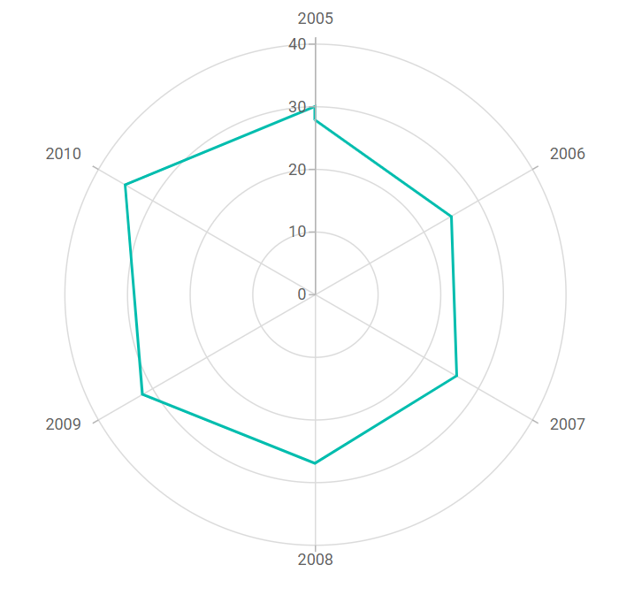

# Polar Chart in Blazor Charts Component

## Polar Chart

The [Polar Chart](https://www.syncfusion.com/blazor-components/blazor-charts/chart-types/polar-chart) series visualizes data using values and angles, providing options for visual comparison between quantitative or qualitative aspects.

You can also learn how to create a Polar chart using Blazor Charts by watching the video below.



To render a [polar](https://www.syncfusion.com/blazor-components/blazor-charts/chart-types/polar-chart) series, set the series [`Type`](https://help.syncfusion.com/cr/blazor/Syncfusion.Blazor.Charts.ChartSeries.html#Syncfusion_Blazor_Charts_ChartSeries_Type) to [`Polar`](https://help.syncfusion.com/cr/blazor/Syncfusion.Blazor.Charts.ChartSeriesType.html#Syncfusion_Blazor_Charts_ChartSeriesType_Polar) in the chart configuration. This displays data points on a circular graph.

```cshtml

@using Syncfusion.Blazor.Charts

<SfChart>
    <ChartSeriesCollection>
        <ChartSeries DataSource="@SalesReports" XName="X" Width="2" YName="Y"
                     Type="Syncfusion.Blazor.Charts.ChartSeriesType.Polar">
        </ChartSeries>
    </ChartSeriesCollection>
</SfChart>

@code {
    public class ChartData
    {
        public double X { get; set; }
        public double Y { get; set; }
    }

    public List<ChartData> SalesReports = new List<ChartData>
    {
        new ChartData { X = 2005, Y = 28 },
        new ChartData { X = 2006, Y = 25 },
        new ChartData { X = 2007, Y = 26 },
        new ChartData { X = 2008, Y = 27 },
        new ChartData { X = 2009, Y = 32 },
        new ChartData { X = 2010, Y = 35 },
        new ChartData { X = 2011, Y = 30 }
    };
}

```




Refer to the [Blazor Polar Chart](https://www.syncfusion.com/blazor-components/blazor-charts/chart-types/polar-chart) feature tour page for more feature details. Explore the [Blazor Polar Chart Example](https://blazor.syncfusion.com/demos/chart/polar-line) to learn how to render and configure polar charts with interactive examples.

## Binding data with series

Bind data to the chart using the [`DataSource`](https://help.syncfusion.com/cr/blazor/Syncfusion.Blazor.Charts.ChartSeries.html#Syncfusion_Blazor_Charts_ChartSeries_DataSource) property in the series configuration. The [`DataSource`](https://help.syncfusion.com/cr/blazor/Syncfusion.Blazor.Charts.ChartSeries.html#Syncfusion_Blazor_Charts_ChartSeries_DataSource) value can be set using either [`SfDataManager`](https://help.syncfusion.com/cr/blazor/Syncfusion.Blazor.Data.SfDataManager.html) or a list of business objects. For more information, see [Working with Data](../working-with-data). Map the data fields to the chart series' [`XName`](https://help.syncfusion.com/cr/blazor/Syncfusion.Blazor.Charts.ChartSeries.html#Syncfusion_Blazor_Charts_ChartSeries_XName) and [`YName`](https://help.syncfusion.com/cr/blazor/Syncfusion.Blazor.Charts.ChartSeries.html#Syncfusion_Blazor_Charts_ChartSeries_YName) properties.

```cshtml

@using Syncfusion.Blazor.Charts

<SfChart>
    <ChartSeriesCollection>
        <ChartSeries DataSource="@SalesReports" XName="X" Width="2" YName="Y"
                     Type="Syncfusion.Blazor.Charts.ChartSeriesType.Polar">
        </ChartSeries>
    </ChartSeriesCollection>
</SfChart>

@code {
    public class ChartData
    {
        public double X { get; set; }
        public double Y { get; set; }
    }

    public List<ChartData> SalesReports = new List<ChartData>
    {
        new ChartData { X = 2005, Y = 28 },
        new ChartData { X = 2006, Y = 25 },
        new ChartData { X = 2007, Y = 26 },
        new ChartData { X = 2008, Y = 27 },
        new ChartData { X = 2009, Y = 32 },
        new ChartData { X = 2010, Y = 35 },
        new ChartData { X = 2011, Y = 30 }
    };
}

```


## Draw types

Change the series plotting type using the [DrawType](https://help.syncfusion.com/cr/blazor/Syncfusion.Blazor.Charts.ChartSeries.html#Syncfusion_Blazor_Charts_ChartSeries_DrawType) property. Supported types include [Line](https://help.syncfusion.com/cr/blazor/Syncfusion.Blazor.Charts.ChartDrawType.html#Syncfusion_Blazor_Charts_ChartDrawType_Line), [Column](https://help.syncfusion.com/cr/blazor/Syncfusion.Blazor.Charts.ChartDrawType.html#Syncfusion_Blazor_Charts_ChartDrawType_Column), [Area](https://help.syncfusion.com/cr/blazor/Syncfusion.Blazor.Charts.ChartDrawType.html#Syncfusion_Blazor_Charts_ChartDrawType_Area), [RangeColumn](https://help.syncfusion.com/cr/blazor/Syncfusion.Blazor.Charts.ChartDrawType.html#Syncfusion_Blazor_Charts_ChartDrawType_RangeColumn), [Spline](https://help.syncfusion.com/cr/blazor/Syncfusion.Blazor.Charts.ChartDrawType.html#Syncfusion_Blazor_Charts_ChartDrawType_Spline), [Scatter](https://help.syncfusion.com/cr/blazor/Syncfusion.Blazor.Charts.ChartDrawType.html#Syncfusion_Blazor_Charts_ChartDrawType_Scatter), [StackingArea](https://help.syncfusion.com/cr/blazor/Syncfusion.Blazor.Charts.ChartDrawType.html#Syncfusion_Blazor_Charts_ChartDrawType_StackingArea), and [StackingColumn](https://help.syncfusion.com/cr/blazor/Syncfusion.Blazor.Charts.ChartDrawType.html#Syncfusion_Blazor_Charts_ChartDrawType_StackingColumn). The default is [Line](https://help.syncfusion.com/cr/blazor/Syncfusion.Blazor.Charts.ChartDrawType.html#Syncfusion_Blazor_Charts_ChartDrawType_Line).

### Line

Render a [line](https://help.syncfusion.com/cr/blazor/Syncfusion.Blazor.Charts.ChartDrawType.html#Syncfusion_Blazor_Charts_ChartDrawType_Line) series in Polar Chart by setting the [DrawType](https://help.syncfusion.com/cr/blazor/Syncfusion.Blazor.Charts.ChartSeries.html#Syncfusion_Blazor_Charts_ChartSeries_DrawType) property to [Line](https://help.syncfusion.com/cr/blazor/Syncfusion.Blazor.Charts.ChartDrawType.html#Syncfusion_Blazor_Charts_ChartDrawType_Line). The [IsClosed](https://help.syncfusion.com/cr/blazor/Syncfusion.Blazor.Charts.ChartSeries.html#Syncfusion_Blazor_Charts_ChartSeries_IsClosed) property determines whether to join the start and end points to form a closed path. The default value is **true**.

```cshtml

@using Syncfusion.Blazor.Charts

<SfChart>
    <ChartSeriesCollection>
        <ChartSeries DataSource="@SalesReports" XName="X" Width="2" YName="Y"
                     Type="ChartSeriesType.Polar" DrawType="ChartDrawType.Line">
            <ChartMarker Height="10" Width="10" Visible="true" Shape="ChartShape.Pentagon"></ChartMarker>
        </ChartSeries>
    </ChartSeriesCollection>
</SfChart>

@code {
    public class ChartData
    {
        public double X { get; set; }
        public double Y { get; set; }
    }

    public List<ChartData> SalesReports = new List<ChartData>
	{
        new ChartData { X = 2005, Y = 28 },
        new ChartData { X = 2006, Y = 25 },
        new ChartData { X = 2007, Y = 26 },
        new ChartData { X = 2008, Y = 27 },
        new ChartData { X = 2009, Y = 32 },
        new ChartData { X = 2010, Y = 35 },
        new ChartData { X = 2011, Y = 30 }
    };
}

``` 


### Spline

Render a [spline](https://help.syncfusion.com/cr/blazor/Syncfusion.Blazor.Charts.ChartDrawType.html#Syncfusion_Blazor_Charts_ChartDrawType_Spline) draw type by setting the series [DrawType](https://help.syncfusion.com/cr/blazor/Syncfusion.Blazor.Charts.ChartSeries.html#Syncfusion_Blazor_Charts_ChartSeries_DrawType) to [Spline](https://help.syncfusion.com/cr/blazor/Syncfusion.Blazor.Charts.ChartDrawType.html#Syncfusion_Blazor_Charts_ChartDrawType_Spline). This displays a polar spline chart with smooth, curved lines.

```cshtml

@using Syncfusion.Blazor.Charts

<SfChart>
    <ChartSeriesCollection>
        <ChartSeries DataSource="@SalesReports" XName="X" Width="2" Opacity="1" YName="Y"
                     Type="ChartSeriesType.Polar" DrawType="ChartDrawType.Spline">
            <ChartMarker Height="10" Width="10" Visible="true" Shape="ChartShape.Pentagon"></ChartMarker>
        </ChartSeries>
    </ChartSeriesCollection>
</SfChart>

@code {
    public class ChartData
    {
        public double X { get; set;}
        public double Y { get; set; }
    }

    public List<ChartData> SalesReports = new List<ChartData>
	{
        new ChartData { X = 2005, Y = 28 },
        new ChartData { X = 2006, Y = 25 },
        new ChartData { X = 2007, Y = 26 },
        new ChartData { X = 2008, Y = 27 },
        new ChartData { X = 2009, Y = 32 },
        new ChartData { X = 2010, Y = 35 },
        new ChartData { X = 2011, Y = 30 }
    };
}

``` 


### Area

Render an [area](https://help.syncfusion.com/cr/blazor/Syncfusion.Blazor.Charts.ChartDrawType.html#Syncfusion_Blazor_Charts_ChartDrawType_Area) draw type by setting the series [DrawType](https://help.syncfusion.com/cr/blazor/Syncfusion.Blazor.Charts.ChartSeries.html#Syncfusion_Blazor_Charts_ChartSeries_DrawType) to [Area](https://help.syncfusion.com/cr/blazor/Syncfusion.Blazor.Charts.ChartDrawType.html#Syncfusion_Blazor_Charts_ChartDrawType_Area). This displays a polar area chart with filled areas below the lines.

```cshtml

@using Syncfusion.Blazor.Charts

<SfChart>
    <ChartSeriesCollection>
        <ChartSeries DataSource="@SalesReports" XName="X" Width="2" Opacity="1" YName="Y"
                     Type="ChartSeriesType.Polar" DrawType="ChartDrawType.Area">
            <ChartMarker Height="10" Width="10" Visible="true" Shape="ChartShape.Pentagon"></ChartMarker>
        </ChartSeries>
    </ChartSeriesCollection>
</SfChart>

@code {
    public class ChartData
    {
        public double X { get; set; }
        public double Y { get; set; }
    }

    public List<ChartData> SalesReports = new List<ChartData>
	{
        new ChartData { X = 2005, Y = 28 },
        new ChartData { X = 2006, Y = 25 },
        new ChartData { X = 2007, Y = 26 },
        new ChartData { X = 2008, Y = 27 },
        new ChartData { X = 2009, Y = 32 },
        new ChartData { X = 2010, Y = 35 },
        new ChartData { X = 2011, Y = 30 }
    };
}

``` 


### Stacked Area

Render a [stacking area](https://help.syncfusion.com/cr/blazor/Syncfusion.Blazor.Charts.ChartDrawType.html#Syncfusion_Blazor_Charts_ChartDrawType_StackingArea) draw type by setting the series [DrawType](https://help.syncfusion.com/cr/blazor/Syncfusion.Blazor.Charts.ChartSeries.html#Syncfusion_Blazor_Charts_ChartSeries_DrawType) to [StackingArea](https://help.syncfusion.com/cr/blazor/Syncfusion.Blazor.Charts.ChartDrawType.html#Syncfusion_Blazor_Charts_ChartDrawType_StackingArea). This displays a polar stacked area chart, showing cumulative values of multiple series.

```cshtml

@using Syncfusion.Blazor.Charts

<SfChart>
    <ChartSeriesCollection>
        <ChartSeries DataSource="@SalesReports" XName="X" YName="Y"
                     Type="ChartSeriesType.Polar" DrawType="ChartDrawType.StackingArea">
            <ChartMarker Height="10" Width="10" Visible="true" Shape="ChartShape.Pentagon"></ChartMarker>
        </ChartSeries>

        <ChartSeries DataSource="@SalesReports" XName="X" YName="Y1"
                     Type="ChartSeriesType.Polar" DrawType="ChartDrawType.StackingArea">
            <ChartMarker Height="10" Width="10" Visible="true" Shape="ChartShape.Pentagon"></ChartMarker>
        </ChartSeries>

        <ChartSeries DataSource="@SalesReports" XName="X" YName="Y2"
                     Type="ChartSeriesType.Polar" DrawType="ChartDrawType.StackingArea">
            <ChartMarker Height="10" Width="10" Visible="true" Shape="ChartShape.Pentagon"></ChartMarker>
        </ChartSeries>
    </ChartSeriesCollection>
</SfChart>

@code {
    public class ChartData
    {
        public double X { get; set; }
        public double Y { get; set; }
        public double Y1 { get; set; }
        public double Y2 { get; set; }
    }

    public List<ChartData> SalesReports = new List<ChartData>
	{
        new ChartData { X = 2000, Y = 0.61, Y1 = 0.03, Y2 = 0.48},
        new ChartData { X = 2001, Y = 0.81, Y1 = 0.05, Y2 = 0.53 },
        new ChartData { X = 2002, Y = 0.91, Y1 = 0.06, Y2 = 0.57 },
        new ChartData { X = 2003, Y = 1, Y1 = 0.09, Y2 = 0.61 },
        new ChartData { X = 2004, Y = 1.19, Y1 = 0.14, Y2 = 0.63 },
        new ChartData { X = 2005, Y = 1.47, Y1 = 0.20, Y2 = 0.64 },
        new ChartData { X = 2006, Y = 1.74, Y1 = 0.29, Y2 = 0.66 },
        new ChartData { X = 2007, Y = 1.98, Y1 = 0.46, Y2 = 0.76 },
        new ChartData { X = 2008, Y = 1.99, Y1 = 0.64, Y2 = 0.77 },
        new ChartData { X = 2009, Y = 1.70, Y1 = 0.75, Y2 = 0.55 }
    };
}

``` 


### Column

Render a [column](https://help.syncfusion.com/cr/blazor/Syncfusion.Blazor.Charts.ChartDrawType.html#Syncfusion_Blazor_Charts_ChartDrawType_Column) draw type by setting the series [DrawType](https://help.syncfusion.com/cr/blazor/Syncfusion.Blazor.Charts.ChartSeries.html#Syncfusion_Blazor_Charts_ChartSeries_DrawType) to [Column](https://help.syncfusion.com/cr/blazor/Syncfusion.Blazor.Charts.ChartDrawType.html#Syncfusion_Blazor_Charts_ChartDrawType_Column). This displays a polar column chart for comparing values across categories.

```cshtml

@using Syncfusion.Blazor.Charts

<SfChart>
    <ChartSeriesCollection>
        <ChartSeries DataSource="@SalesReports" XName="X" YName="Y"
                     Type="ChartSeriesType.Polar" DrawType="ChartDrawType.Column">
            <ChartMarker Height="10" Width="10" Visible="true" Shape="ChartShape.Pentagon"></ChartMarker>
        </ChartSeries>
    </ChartSeriesCollection>
</SfChart>

@code {
    public class ChartData
    {
        public double X { get; set; }
        public double Y { get; set; }
    }

    public List<ChartData> SalesReports = new List<ChartData>
	{
        new ChartData { X = 2005, Y = 28 },
        new ChartData { X = 2006, Y = 25 },
        new ChartData { X = 2007, Y = 26 },
        new ChartData { X = 2008, Y = 27 },
        new ChartData { X = 2009, Y = 32 },
        new ChartData { X = 2010, Y = 35 },
        new ChartData { X = 2011, Y = 30 }
    };
}

``` 


### Stacked column

Render a [stacking column](https://help.syncfusion.com/cr/blazor/Syncfusion.Blazor.Charts.ChartDrawType.html#Syncfusion_Blazor_Charts_ChartDrawType_StackingColumn) draw type by setting the series [DrawType](https://help.syncfusion.com/cr/blazor/Syncfusion.Blazor.Charts.ChartSeries.html#Syncfusion_Blazor_Charts_ChartSeries_DrawType) to [StackingColumn](https://help.syncfusion.com/cr/blazor/Syncfusion.Blazor.Charts.ChartDrawType.html#Syncfusion_Blazor_Charts_ChartDrawType_StackingColumn). This displays a polar stacked column chart with multiple segments stacked in each column.

```cshtml

@using Syncfusion.Blazor.Charts

<SfChart>
    <ChartSeriesCollection>
        <ChartSeries DataSource="@SalesReports" XName="X" YName="Y"
                     Type="ChartSeriesType.Polar" DrawType="ChartDrawType.StackingColumn">
        </ChartSeries>

        <ChartSeries DataSource="@SalesReports" XName="X" YName="Y1"
                     Type="ChartSeriesType.Polar" DrawType="ChartDrawType.StackingColumn">
        </ChartSeries>

        <ChartSeries DataSource="@SalesReports" XName="X" YName="Y2"
                     Type="ChartSeriesType.Polar" DrawType="ChartDrawType.StackingColumn">
        </ChartSeries>
    </ChartSeriesCollection>
</SfChart>

@code {
    public class ChartData
    {
        public double X { get; set; }
        public double Y { get; set; }
        public double Y1 {get; set; }
        public double Y2 { get; set; }
    }

    public List<ChartData> SalesReports = new List<ChartData>
	{
        new ChartData { X = 2000, Y = 0.61, Y1 = 0.03, Y2 = 0.48},
        new ChartData { X = 2001, Y = 0.81, Y1 = 0.05, Y2 = 0.53 },
        new ChartData { X = 2002, Y = 0.91, Y1 = 0.06, Y2 = 0.57 },
        new ChartData { X = 2003, Y = 1, Y1 = 0.09, Y2 = 0.61 },
        new ChartData { X = 2004, Y = 1.19, Y1 = 0.14, Y2 = 0.63 },
        new ChartData { X = 2005, Y = 1.47, Y1 = 0.20, Y2 = 0.64 },
        new ChartData { X = 2006, Y = 1.74, Y1 = 0.29, Y2 = 0.66 },
        new ChartData { X = 2007, Y = 1.98, Y1 = 0.46, Y2 = 0.76 },
        new ChartData { X = 2008, Y = 1.99, Y1 = 0.64, Y2 = 0.77 },
        new ChartData { X = 2009, Y = 1.70, Y1 = 0.75, Y2 = 0.55 }
    };
}

``` 


### Range column

Render a [range column](https://help.syncfusion.com/cr/blazor/Syncfusion.Blazor.Charts.ChartDrawType.html#Syncfusion_Blazor_Charts_ChartDrawType_RangeColumn) draw type by setting the series [DrawType](https://help.syncfusion.com/cr/blazor/Syncfusion.Blazor.Charts.ChartSeries.html#Syncfusion_Blazor_Charts_ChartSeries_DrawType) to [RangeColumn](https://help.syncfusion.com/cr/blazor/Syncfusion.Blazor.Charts.ChartDrawType.html#Syncfusion_Blazor_Charts_ChartDrawType_RangeColumn). This displays a polar range column chart, where each column spans a range of values.

```cshtml

@using Syncfusion.Blazor.Charts

<SfChart>
    <ChartPrimaryXAxis ValueType="Syncfusion.Blazor.Charts.ValueType.Category" />

    <ChartSeriesCollection>
        <ChartSeries DataSource="@WeatherReports" XName="X" High="High" Low="Low"
                     Type="ChartSeriesType.Polar" DrawType="ChartDrawType.RangeColumn">
        </ChartSeries>
    </ChartSeriesCollection>
</SfChart>

@code {
    public class ChartData
    {
        public string X { get; set; }
        public double Low { get; set; }
        public double High { get; set; }
    }

    public List<ChartData> WeatherReports = new List<ChartData>
	{
        new ChartData { X = "Jan", Low = 0.7, High = 6.1 },
        new ChartData { X = "Feb", Low = 1.3, High = 6.3 },
        new ChartData { X = "Mar", Low = 1.9, High = 8.5 },
        new ChartData { X = "Apr", Low = 3.1, High = 10.8 },
        new ChartData { X = "May", Low = 5.7, High = 14.40 },
        new ChartData { X = "Jun", Low = 8.4, High = 16.90 },
        new ChartData { X = "Jul", Low = 10.6,High = 19.20 },
        new ChartData { X = "Aug", Low = 10.5,High = 18.9 },
        new ChartData { X = "Sep", Low = 8.5, High = 16.1 },
        new ChartData { X = "Oct", Low = 6.0, High = 12.5 },
        new ChartData { X = "Nov", Low = 1.5, High = 6.9  },
        new ChartData { X = "Dec", Low = 5.1, High = 12.1 }
    };
}

``` 


### Scatter

Render a [scatter](https://help.syncfusion.com/cr/blazor/Syncfusion.Blazor.Charts.ChartDrawType.html#Syncfusion_Blazor_Charts_ChartDrawType_Scatter) draw type by setting the series [DrawType](https://help.syncfusion.com/cr/blazor/Syncfusion.Blazor.Charts.ChartSeries.html#Syncfusion_Blazor_Charts_ChartSeries_DrawType) to [Scatter](https://help.syncfusion.com/cr/blazor/Syncfusion.Blazor.Charts.ChartDrawType.html#Syncfusion_Blazor_Charts_ChartDrawType_Scatter). This displays a polar scatter chart.

```cshtml

@using Syncfusion.Blazor.Charts

<SfChart>
    <ChartPrimaryXAxis ValueType="Syncfusion.Blazor.Charts.ValueType.Category" />
	
    <ChartSeriesCollection>
        <ChartSeries DataSource="@SalesReports" XName="X" YName="Y"
                     Type="ChartSeriesType.Polar" DrawType="ChartDrawType.Scatter">
        </ChartSeries>
    </ChartSeriesCollection>
</SfChart>

@code {
    public class ChartData
    {
        public double X { get; set; }
        public double Y { get; set; }
    }

    public List<ChartData> SalesReports = new List<ChartData>
	{
        new ChartData { X = 2005, Y = 28 },
        new ChartData { X = 2006, Y = 25 },
        new ChartData { X = 2007, Y = 26 },
        new ChartData { X = 2008, Y = 27 },
        new ChartData { X = 2009, Y = 32 },
        new ChartData { X = 2010, Y = 35 },
        new ChartData { X = 2011, Y = 30 }
    };
}

``` 


## Series customization

### Start angle

Customize the start angle of the Polar Chart using the [StartAngle](https://help.syncfusion.com/cr/blazor/Syncfusion.Blazor.Charts.ChartAxis.html#Syncfusion_Blazor_Charts_ChartAxis_StartAngle) property. The default value is **0**.

```cshtml

@using Syncfusion.Blazor.Charts

<SfChart>
    <ChartPrimaryXAxis StartAngle="270" ValueType="Syncfusion.Blazor.Charts.ValueType.Category" />
	
    <ChartSeriesCollection>
        <ChartSeries DataSource="@SalesReports" XName="X" YName="Y"
                     Type="ChartSeriesType.Polar" DrawType="ChartDrawType.Line">
        </ChartSeries>
    </ChartSeriesCollection>
</SfChart>

@code {
    public class ChartData
    {
        public double X { get; set; }
        public double Y { get; set; }
    }

    public List<ChartData> SalesReports = new List<ChartData>
	{
        new ChartData { X = 2005, Y = 28 },
        new ChartData { X = 2006, Y = 25 },
        new ChartData { X = 2007, Y = 26 },
        new ChartData { X = 2008, Y = 27 },
        new ChartData { X = 2009, Y = 32 },
        new ChartData { X = 2010, Y = 35 },
        new ChartData { X = 2011, Y = 30 }
    };
}

``` 


### Radius

Customize the radius of the Polar Chart using the [Coefficient](https://help.syncfusion.com/cr/blazor/Syncfusion.Blazor.Charts.ChartAxis.html#Syncfusion_Blazor_Charts_ChartAxis_Coefficient) property. The default value is **100**.

```cshtml

@using Syncfusion.Blazor.Charts

<SfChart>
    <ChartPrimaryXAxis Coefficient="40" ValueType="Syncfusion.Blazor.Charts.ValueType.Category">
    </ChartPrimaryXAxis>
	
    <ChartSeriesCollection>
        <ChartSeries DataSource="@SalesReports" XName="X" YName="Y"
                     Type="ChartSeriesType.Polar" DrawType="ChartDrawType.Line">
        </ChartSeries>
    </ChartSeriesCollection>
</SfChart>

@code{
    public class ChartData
    {
        public double X { get; set; }
        public double Y { get; set; }
    }

    public List<ChartData> SalesReports = new List<ChartData>
	{
        new ChartData { X = 2005, Y = 28 },
        new ChartData { X = 2006, Y = 25 },
        new ChartData { X = 2007, Y = 26 },
        new ChartData { X = 2008, Y = 27 },
        new ChartData { X = 2009, Y = 32 },
        new ChartData { X = 2010, Y = 35 },
        new ChartData { X = 2011, Y = 30 }
    };
}

``` 


## Empty points

Data points with `null`, `double.NaN`, or `undefined` values are considered empty and are not plotted.

**Mode**

Use the [`Mode`](https://help.syncfusion.com/cr/blazor/Syncfusion.Blazor.Charts.ChartEmptyPointSettings.html#Syncfusion_Blazor_Charts_ChartEmptyPointSettings_Mode) property to specify how empty or missing data points are handled. The default mode is [`Gap`](https://help.syncfusion.com/cr/blazor/Syncfusion.Blazor.Charts.EmptyPointMode.html#Syncfusion_Blazor_Charts_EmptyPointMode_Gap).

```cshtml

@using Syncfusion.Blazor.Charts

<SfChart>
    <ChartSeriesCollection>
        <ChartSeries DataSource="@SalesReports" XName="X" Width="2" YName="Y"
                     Type="Syncfusion.Blazor.Charts.ChartSeriesType.Polar">
            <ChartEmptyPointSettings Mode="EmptyPointMode.Gap"></ChartEmptyPointSettings>
            <ChartMarker Visible="true" Height="10" Width="10"></ChartMarker>
        </ChartSeries>
    </ChartSeriesCollection>
</SfChart>

@code {
    public class ChartData
    {
        public double X { get; set; }
        public double Y { get; set; }
    }

    public List<ChartData> SalesReports = new List<ChartData>
    {
        new ChartData{ X = 2005, Y = 28 },
        new ChartData{ X = 2006, Y = 25 },
        new ChartData{ X = 2007, Y = 26 },
        new ChartData{ X = 2008, Y = double.NaN },
        new ChartData{ X = 2009, Y = 32 },
        new ChartData{ X = 2010, Y = 35 },
        new ChartData{ X = 2011, Y = 30 }
    };
}

```


**Fill**

Customize the fill color of empty points using the [`Fill`](https://help.syncfusion.com/cr/blazor/Syncfusion.Blazor.Charts.ChartEmptyPointSettings.html#Syncfusion_Blazor_Charts_ChartEmptyPointSettings_Fill) property.

```cshtml

@using Syncfusion.Blazor.Charts

<SfChart>
    <ChartSeriesCollection>
        <ChartSeries DataSource="@SalesReports" XName="X" Width="2" YName="Y"
                     Type="Syncfusion.Blazor.Charts.ChartSeriesType.Polar">
            <ChartEmptyPointSettings Mode="EmptyPointMode.Average" Fill="#FFDE59" ></ChartEmptyPointSettings>
            <ChartMarker Visible="true" Height="10" Width="10"></ChartMarker>
        </ChartSeries>
    </ChartSeriesCollection>
</SfChart>

@code {
    public class ChartData
    {
        public double X { get; set; }
        public double Y { get; set; }
    }

    public List<ChartData> SalesReports = new List<ChartData>
    {
        new ChartData{ X = 2005, Y = 28 },
        new ChartData{ X = 2006, Y = 25 },
        new ChartData{ X = 2007, Y = 26 },
        new ChartData{ X = 2008, Y = double.NaN },
        new ChartData{ X = 2009, Y = 32 },
        new ChartData{ X = 2010, Y = 35 },
        new ChartData{ X = 2011, Y = 30 }
    };
}

```


**Border**

Customize the border width and color of empty points using the [`Border`](https://help.syncfusion.com/cr/blazor/Syncfusion.Blazor.Charts.ChartEmptyPointSettings.html#Syncfusion_Blazor_Charts_ChartEmptyPointSettings_Border) property, including [Width](https://help.syncfusion.com/cr/blazor/Syncfusion.Blazor.Charts.ChartEmptyPointBorder.html#Syncfusion_Blazor_Charts_ChartEmptyPointBorder_Width) and [Color](https://help.syncfusion.com/cr/blazor/Syncfusion.Blazor.Charts.ChartEmptyPointBorder.html#Syncfusion_Blazor_Charts_ChartEmptyPointBorder_Color).

```cshtml

@using Syncfusion.Blazor.Charts

<SfChart>
    <ChartSeriesCollection>
        <ChartSeries DataSource="@SalesReports" XName="X" Width="2" YName="Y"
                     Type="Syncfusion.Blazor.Charts.ChartSeriesType.Polar">
            <ChartEmptyPointSettings Mode="EmptyPointMode.Average" Fill="#FFDE59" >
                <ChartEmptyPointBorder Color="red" Width="2"></ChartEmptyPointBorder>
            </ChartEmptyPointSettings>
            <ChartMarker Visible="true" Height="10" Width="10"></ChartMarker>
        </ChartSeries>
    </ChartSeriesCollection>
</SfChart>

@code {
    public class ChartData
    {
        public double X { get; set; }
        public double Y { get; set; }
    }

    public List<ChartData> SalesReports = new List<ChartData>
    {
        new ChartData{ X = 2005, Y = 28 },
        new ChartData{ X = 2006, Y = 25 },
        new ChartData{ X = 2007, Y = 26 },
        new ChartData{ X = 2008, Y = double.NaN },
        new ChartData{ X = 2009, Y = 32 },
        new ChartData{ X = 2010, Y = 35 },
        new ChartData{ X = 2011, Y = 30 }
    };
}

```


## Events

### Series render

The [`OnSeriesRender`](https://help.syncfusion.com/cr/blazor/Syncfusion.Blazor.Charts.ChartEvents.html#Syncfusion_Blazor_Charts_ChartEvents_OnSeriesRender) event enables customization of series properties, such as [Data](https://help.syncfusion.com/cr/blazor/Syncfusion.Blazor.Charts.SeriesRenderEventArgs.html#Syncfusion_Blazor_Charts_SeriesRenderEventArgs_Data), [Fill](https://help.syncfusion.com/cr/blazor/Syncfusion.Blazor.Charts.SeriesRenderEventArgs.html#Syncfusion_Blazor_Charts_SeriesRenderEventArgs_Fill), and [Series](https://help.syncfusion.com/cr/blazor/Syncfusion.Blazor.Charts.SeriesRenderEventArgs.html#Syncfusion_Blazor_Charts_SeriesRenderEventArgs_Series), before rendering.

```cshtml

@using Syncfusion.Blazor.Charts

<SfChart>
    <ChartSeriesCollection>
        <ChartEvents OnSeriesRender="SeriesRender" />
        <ChartSeries DataSource="@SalesReports" XName="X" Width="2" YName="Y"
                     Type="Syncfusion.Blazor.Charts.ChartSeriesType.Polar" />
    </ChartSeriesCollection>
</SfChart>

@code {
    public class ChartData
    {
        public double X { get; set; }
        public double Y { get; set; }
    }

    public void SeriesRender(SeriesRenderEventArgs args)
    {
        args.Fill = "#FF4081";
    }

    public List<ChartData> SalesReports = new List<ChartData>
    {
        new ChartData{ X = 2005, Y = 28 },
        new ChartData{ X = 2006, Y = 25 },
        new ChartData{ X = 2007, Y = 26 },
        new ChartData{ X = 2008, Y = 27 },
        new ChartData{ X = 2009, Y = 32 },
        new ChartData{ X = 2010, Y = 35 },
        new ChartData{ X = 2011, Y = 30 }
    };
}


```


### Point render

The [`OnPointRender`](https://help.syncfusion.com/cr/blazor/Syncfusion.Blazor.Charts.ChartEvents.html#Syncfusion_Blazor_Charts_ChartEvents_OnPointRender) event allows customization of each data point before rendering.

```cshtml

@using Syncfusion.Blazor.Charts

<SfChart>
    <ChartSeriesCollection>
        <ChartEvents OnPointRender="PointRender" />
        <ChartSeries DataSource="@SalesReports" XName="X" Width="2" YName="Y"
                     Type="Syncfusion.Blazor.Charts.ChartSeriesType.Polar">
            <ChartMarker Visible="true" Width="10" Height="10"></ChartMarker>
        </ChartSeries>
    </ChartSeriesCollection>
</SfChart>

@code {
    public class ChartData
    {
        public double X { get; set; }
        public double Y { get; set; }
    }

    public void PointRender(PointRenderEventArgs args)
    {
        args.Fill = args.Point.X.ToString() == "2008" ? "#E91E63" : "#3F51B5";
    }

    public List<ChartData> SalesReports = new List<ChartData>
    {
        new ChartData{ X= 2005, Y= 28 },
        new ChartData{ X= 2006, Y= 25 },
        new ChartData{ X= 2007, Y= 26 },
        new ChartData{ X= 2008, Y= 27 },
        new ChartData{ X= 2009, Y= 32 },
        new ChartData{ X= 2010, Y= 35 },
        new ChartData{ X= 2011, Y= 30 }
    };
}

```


N> Refer to our [Blazor Charts](https://www.syncfusion.com/blazor-components/blazor-charts) feature tour page for its groundbreaking feature representations and also explore our [Blazor Chart Example](https://blazor.syncfusion.com/demos/chart/line?theme=bootstrap5) to know various chart types and how to represent time-dependent data, showing trends at equal intervals.

## See also

* [Data label](../data-labels)
* [Tooltip](../tool-tip)
