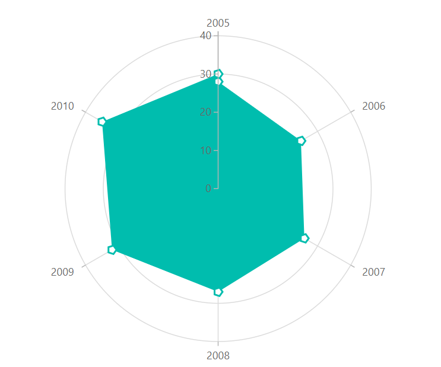

# Polar in Blazor Charts Component

## Polar

[Polar Chart](https://www.syncfusion.com/blazor-components/blazor-charts/chart-types/polar-chart) series visualizes data in terms of values and angles. It provides options for visual comparison between several quantitative or qualitative aspects of a situation. To render a polar chart, set the series [Type](https://help.syncfusion.com/cr/blazor/Syncfusion.Blazor.Charts.ChartSeries.html#Syncfusion_Blazor_Charts_ChartSeries_Type) to [Polar](https://help.syncfusion.com/cr/blazor/Syncfusion.Blazor.Charts.ChartSeriesType.html#Syncfusion_Blazor_Charts_ChartSeriesType_Polar).

N> Refer to our [Blazor Polar Chart](https://www.syncfusion.com/blazor-components/blazor-charts/chart-types/polar-chart) feature tour page to know about its other groundbreaking feature representations. Explore our [Blazor Polar Chart Example](https://blazor.syncfusion.com/demos/chart/polar-line) to know how to render and configure the Polar type chart.

## Draw types

 To change the series plotting type to  [Line](https://help.syncfusion.com/cr/blazor/Syncfusion.Blazor.Charts.ChartDrawType.html#Syncfusion_Blazor_Charts_ChartDrawType_Line),  [Column](https://help.syncfusion.com/cr/blazor/Syncfusion.Blazor.Charts.ChartDrawType.html#Syncfusion_Blazor_Charts_ChartDrawType_Column),  [Area](https://help.syncfusion.com/cr/blazor/Syncfusion.Blazor.Charts.ChartDrawType.html#Syncfusion_Blazor_Charts_ChartDrawType_Area),  [RangeColumn](https://help.syncfusion.com/cr/blazor/Syncfusion.Blazor.Charts.ChartDrawType.html#Syncfusion_Blazor_Charts_ChartDrawType_RangeColumn),  [Spline](https://help.syncfusion.com/cr/blazor/Syncfusion.Blazor.Charts.ChartDrawType.html#Syncfusion_Blazor_Charts_ChartDrawType_Spline), [Scatter](https://help.syncfusion.com/cr/blazor/Syncfusion.Blazor.Charts.ChartDrawType.html#Syncfusion_Blazor_Charts_ChartDrawType_Scatter), [StackingArea](https://help.syncfusion.com/cr/blazor/Syncfusion.Blazor.Charts.ChartDrawType.html#Syncfusion_Blazor_Charts_ChartDrawType_StackingArea), and [StackingColumn](https://help.syncfusion.com/cr/blazor/Syncfusion.Blazor.Charts.ChartDrawType.html#Syncfusion_Blazor_Charts_ChartDrawType_StackingColumn), use the Polar's [DrawType](https://help.syncfusion.com/cr/blazor/Syncfusion.Blazor.Charts.ChartSeries.html#Syncfusion_Blazor_Charts_ChartSeries_DrawType) property. [DrawType](https://help.syncfusion.com/cr/blazor/Syncfusion.Blazor.Charts.ChartSeries.html#Syncfusion_Blazor_Charts_ChartSeries_DrawType) is set to [Line](https://help.syncfusion.com/cr/blazor/Syncfusion.Blazor.Charts.ChartDrawType.html#Syncfusion_Blazor_Charts_ChartDrawType_Line) by default.

### Line

To render a [line](https://help.syncfusion.com/cr/blazor/Syncfusion.Blazor.Charts.ChartDrawType.html#Syncfusion_Blazor_Charts_ChartDrawType_Line) series in  [Polar Chart](https://help.syncfusion.com/cr/blazor/Syncfusion.Blazor.Charts.ChartSeriesType.html#Syncfusion_Blazor_Charts_ChartSeriesType_Polar), specify the [DrawType](https://help.syncfusion.com/cr/blazor/Syncfusion.Blazor.Charts.ChartSeries.html#Syncfusion_Blazor_Charts_ChartSeries_DrawType) property to [Line](https://help.syncfusion.com/cr/blazor/Syncfusion.Blazor.Charts.ChartDrawType.html#Syncfusion_Blazor_Charts_ChartDrawType_Line). [IsClosed](https://help.syncfusion.com/cr/blazor/Syncfusion.Blazor.Charts.ChartSeries.html#Syncfusion_Blazor_Charts_ChartSeries_IsClosed) property specifies whether to join start and end point of a line series used in [Polar Chart](https://www.syncfusion.com/blazor-components/blazor-charts/chart-types/polar-chart) to form a closed path. The default value of [IsClosed](https://help.syncfusion.com/cr/blazor/Syncfusion.Blazor.Charts.ChartSeries.html#Syncfusion_Blazor_Charts_ChartSeries_IsClosed) property is **true**.

```cshtml

@using Syncfusion.Blazor.Charts

<SfChart>
    <ChartSeriesCollection>
        <ChartSeries DataSource="@SalesReports" XName="X" Width="2" YName="Y"
                     Type="ChartSeriesType.Polar" DrawType="ChartDrawType.Line">
            <ChartMarker Height="10" Width="10" Visible="true" Shape="ChartShape.Pentagon"></ChartMarker>
        </ChartSeries>
    </ChartSeriesCollection>
</SfChart>

@code{
    public class ChartData
    {
        public double X { get; set; }
        public double Y { get; set; }
    }

    public List<ChartData> SalesReports = new List<ChartData>
	{
        new ChartData{ X= 2005, Y= 28 },
        new ChartData{ X= 2006, Y= 25 },
        new ChartData{ X= 2007, Y= 26 },
        new ChartData{ X= 2008, Y= 27 },
        new ChartData{ X= 2009, Y= 32 },
        new ChartData{ X= 2010, Y= 35 },
        new ChartData{ X= 2011, Y= 30 }
    };
}

``` 


<!--  -->

### Spline

To render a [spline](https://help.syncfusion.com/cr/blazor/Syncfusion.Blazor.Charts.ChartDrawType.html#Syncfusion_Blazor_Charts_ChartDrawType_Spline) series in  [Polar Chart](https://help.syncfusion.com/cr/blazor/Syncfusion.Blazor.Charts.ChartSeriesType.html#Syncfusion_Blazor_Charts_ChartSeriesType_Polar), specify the [DrawType](https://help.syncfusion.com/cr/blazor/Syncfusion.Blazor.Charts.ChartSeries.html#Syncfusion_Blazor_Charts_ChartSeries_DrawType) property to [Spline](https://help.syncfusion.com/cr/blazor/Syncfusion.Blazor.Charts.ChartDrawType.html#Syncfusion_Blazor_Charts_ChartDrawType_Spline).

```cshtml

@using Syncfusion.Blazor.Charts

<SfChart>
    <ChartSeriesCollection>
        <ChartSeries DataSource="@SalesReports" XName="X" Width="2" Opacity="1" YName="Y"
                     Type="ChartSeriesType.Polar" DrawType="ChartDrawType.Spline">
            <ChartMarker Height="10" Width="10" Visible="true" Shape="ChartShape.Pentagon"></ChartMarker>
        </ChartSeries>
    </ChartSeriesCollection>
</SfChart>

@code{
    public class ChartData
    {
        public double X { get; set;}
        public double Y { get; set; }
    }

    public List<ChartData> SalesReports = new List<ChartData>
	{
        new ChartData{ X= 2005, Y= 28 },
        new ChartData{ X= 2006, Y= 25 },
        new ChartData{ X= 2007, Y= 26 },
        new ChartData{ X= 2008, Y= 27 },
        new ChartData{ X= 2009, Y= 32 },
        new ChartData{ X= 2010, Y= 35 },
        new ChartData{ X= 2011, Y= 30 }
    };
}

``` 


<!--  -->

### Area

To render a [area](https://help.syncfusion.com/cr/blazor/Syncfusion.Blazor.Charts.ChartDrawType.html#Syncfusion_Blazor_Charts_ChartDrawType_Area) series in  [Polar Chart](https://help.syncfusion.com/cr/blazor/Syncfusion.Blazor.Charts.ChartSeriesType.html#Syncfusion_Blazor_Charts_ChartSeriesType_Polar), specify the [DrawType](https://help.syncfusion.com/cr/blazor/Syncfusion.Blazor.Charts.ChartSeries.html#Syncfusion_Blazor_Charts_ChartSeries_DrawType) property to [Area](https://help.syncfusion.com/cr/blazor/Syncfusion.Blazor.Charts.ChartDrawType.html#Syncfusion_Blazor_Charts_ChartDrawType_Area).

```cshtml

@using Syncfusion.Blazor.Charts

<SfChart>
    <ChartSeriesCollection>
        <ChartSeries DataSource="@SalesReports" XName="X" Width="2" Opacity="1" YName="Y"
                     Type="ChartSeriesType.Polar" DrawType="ChartDrawType.Area">
            <ChartMarker Height="10" Width="10" Visible="true" Shape="ChartShape.Pentagon"></ChartMarker>
        </ChartSeries>
    </ChartSeriesCollection>
</SfChart>

@code{
    public class ChartData
    {
        public double X { get; set; }
        public double Y { get; set; }
    }

    public List<ChartData> SalesReports = new List<ChartData>
	{
        new ChartData{ X= 2005, Y= 28 },
        new ChartData{ X= 2006, Y= 25 },
        new ChartData{ X= 2007, Y= 26 },
        new ChartData{ X= 2008, Y= 27 },
        new ChartData{ X= 2009, Y= 32 },
        new ChartData{ X= 2010, Y= 35 },
        new ChartData{ X= 2011, Y= 30 }
    };
}

``` 
  

<!--  -->

### Stacked Area

To render a [stacking area](https://help.syncfusion.com/cr/blazor/Syncfusion.Blazor.Charts.ChartDrawType.html#Syncfusion_Blazor_Charts_ChartDrawType_StackingArea) series in [Polar Chart](https://help.syncfusion.com/cr/blazor/Syncfusion.Blazor.Charts.ChartSeriesType.html#Syncfusion_Blazor_Charts_ChartSeriesType_Polar), specify the [DrawType](https://help.syncfusion.com/cr/blazor/Syncfusion.Blazor.Charts.ChartSeries.html#Syncfusion_Blazor_Charts_ChartSeries_DrawType) property to [StackingArea](https://help.syncfusion.com/cr/blazor/Syncfusion.Blazor.Charts.ChartDrawType.html#Syncfusion_Blazor_Charts_ChartDrawType_StackingArea).

```cshtml

@using Syncfusion.Blazor.Charts

<SfChart>
    <ChartSeriesCollection>
        <ChartSeries DataSource="@SalesReports" XName="X" YName="Y"
                     Type="ChartSeriesType.Polar" DrawType="ChartDrawType.StackingArea">
            <ChartMarker Height="10" Width="10" Visible="true" Shape="ChartShape.Pentagon"></ChartMarker>
        </ChartSeries>

        <ChartSeries DataSource="@SalesReports" XName="X" YName="Y1"
                     Type="ChartSeriesType.Polar" DrawType="ChartDrawType.StackingArea">
            <ChartMarker Height="10" Width="10" Visible="true" Shape="ChartShape.Pentagon"></ChartMarker>
        </ChartSeries>

        <ChartSeries DataSource="@SalesReports" XName="X" YName="Y2"
                     Type="ChartSeriesType.Polar" DrawType="ChartDrawType.StackingArea">
            <ChartMarker Height="10" Width="10" Visible="true" Shape="ChartShape.Pentagon"></ChartMarker>
        </ChartSeries>
    </ChartSeriesCollection>
</SfChart>

@code{
    public class ChartData
    {
        public double X { get; set; }
        public double Y { get; set; }
        public double Y1 { get; set; }
        public double Y2 { get; set; }
    }

    public List<ChartData> SalesReports = new List<ChartData>
	{
        new ChartData{ X=2000, Y= 0.61, Y1= 0.03, Y2= 0.48},
        new ChartData{ X=2001, Y= 0.81, Y1= 0.05, Y2= 0.53 },
        new ChartData{ X=2002, Y= 0.91, Y1= 0.06, Y2= 0.57 },
        new ChartData{ X=2003, Y= 1, Y1= 0.09, Y2= 0.61 },
        new ChartData{ X=2004, Y= 1.19, Y1= 0.14, Y2= 0.63 },
        new ChartData{ X=2005, Y= 1.47, Y1= 0.20, Y2= 0.64 },
        new ChartData{ X=2006, Y= 1.74, Y1= 0.29, Y2= 0.66 },
        new ChartData{ X=2007, Y= 1.98, Y1= 0.46, Y2= 0.76 },
        new ChartData{ X=2008, Y= 1.99, Y1= 0.64, Y2= 0.77 },
        new ChartData{ X=2009, Y= 1.70, Y1= 0.75, Y2= 0.55 }
    };
}

``` 


<!--  -->

### Column

To render a [column](https://help.syncfusion.com/cr/blazor/Syncfusion.Blazor.Charts.ChartDrawType.html#Syncfusion_Blazor_Charts_ChartDrawType_Column) series in [Polar Chart](https://help.syncfusion.com/cr/blazor/Syncfusion.Blazor.Charts.ChartSeriesType.html#Syncfusion_Blazor_Charts_ChartSeriesType_Polar), specify the [DrawType](https://help.syncfusion.com/cr/blazor/Syncfusion.Blazor.Charts.ChartSeries.html#Syncfusion_Blazor_Charts_ChartSeries_DrawType) property to [Column](https://help.syncfusion.com/cr/blazor/Syncfusion.Blazor.Charts.ChartDrawType.html#Syncfusion_Blazor_Charts_ChartDrawType_Column).

```cshtml

@using Syncfusion.Blazor.Charts

<SfChart >
    <ChartSeriesCollection>
        <ChartSeries DataSource="@SalesReports" XName="X" YName="Y"
                     Type="ChartSeriesType.Polar" DrawType="ChartDrawType.Column">
            <ChartMarker Height="10" Width="10" Visible="true" Shape="ChartShape.Pentagon"></ChartMarker>
        </ChartSeries>
    </ChartSeriesCollection>
</SfChart>

@code{
    public class ChartData
    {
        public double X { get; set; }
        public double Y { get; set; }
    }

    public List<ChartData> SalesReports = new List<ChartData>
	{
        new ChartData{ X= 2005, Y= 28 },
        new ChartData{ X= 2006, Y= 25 },
        new ChartData{ X= 2007, Y= 26 },
        new ChartData{ X= 2008, Y= 27 },
        new ChartData{ X= 2009, Y= 32 },
        new ChartData{ X= 2010, Y= 35 },
        new ChartData{ X= 2011, Y= 30 }
    };
}

``` 


<!--  -->

### Stacked column

To render a [stacking column](https://help.syncfusion.com/cr/blazor/Syncfusion.Blazor.Charts.ChartDrawType.html#Syncfusion_Blazor_Charts_ChartDrawType_StackingColumn) series in [Polar Chart](https://help.syncfusion.com/cr/blazor/Syncfusion.Blazor.Charts.ChartSeriesType.html#Syncfusion_Blazor_Charts_ChartSeriesType_Polar), specify the [DrawType](https://help.syncfusion.com/cr/blazor/Syncfusion.Blazor.Charts.ChartSeries.html#Syncfusion_Blazor_Charts_ChartSeries_DrawType) property to [StackingColumn](https://help.syncfusion.com/cr/blazor/Syncfusion.Blazor.Charts.ChartDrawType.html#Syncfusion_Blazor_Charts_ChartDrawType_StackingColumn).

```cshtml

@using Syncfusion.Blazor.Charts

<SfChart>
    <ChartSeriesCollection>
        <ChartSeries DataSource="@SalesReports" XName="X" YName="Y"
                     Type="ChartSeriesType.Polar" DrawType="ChartDrawType.StackingColumn">
        </ChartSeries>

        <ChartSeries DataSource="@SalesReports" XName="X" YName="Y1"
                     Type="ChartSeriesType.Polar" DrawType="ChartDrawType.StackingColumn">
        </ChartSeries>

        <ChartSeries DataSource="@SalesReports" XName="X" YName="Y2"
                     Type="ChartSeriesType.Polar" DrawType="ChartDrawType.StackingColumn">
        </ChartSeries>
    </ChartSeriesCollection>
</SfChart>

@code{
    public class ChartData
    {
        public double X { get; set; }
        public double Y { get; set; }
        public double Y1 {get; set; }
        public double Y2 { get; set; }
    }

    public List<ChartData> SalesReports = new List<ChartData>
	{
        new ChartData{ X=2000, Y= 0.61, Y1= 0.03, Y2= 0.48},
        new ChartData{ X=2001, Y= 0.81, Y1= 0.05, Y2= 0.53 },
        new ChartData{ X=2002, Y= 0.91, Y1= 0.06, Y2= 0.57 },
        new ChartData{ X=2003, Y= 1, Y1= 0.09, Y2= 0.61 },
        new ChartData{ X=2004, Y= 1.19, Y1= 0.14, Y2= 0.63 },
        new ChartData{ X=2005, Y= 1.47, Y1= 0.20, Y2= 0.64 },
        new ChartData{ X=2006, Y= 1.74, Y1= 0.29, Y2= 0.66 },
        new ChartData{ X=2007, Y= 1.98, Y1= 0.46, Y2= 0.76 },
        new ChartData{ X=2008, Y= 1.99, Y1= 0.64, Y2= 0.77 },
        new ChartData{ X=2009, Y= 1.70, Y1= 0.75, Y2= 0.55 }
    };
}

``` 


<!--  -->

### Range column

To render a [range column](https://help.syncfusion.com/cr/blazor/Syncfusion.Blazor.Charts.ChartDrawType.html#Syncfusion_Blazor_Charts_ChartDrawType_RangeColumn) series in [Polar Chart](https://help.syncfusion.com/cr/blazor/Syncfusion.Blazor.Charts.ChartSeriesType.html#Syncfusion_Blazor_Charts_ChartSeriesType_Polar), specify the [DrawType](https://help.syncfusion.com/cr/blazor/Syncfusion.Blazor.Charts.ChartSeries.html#Syncfusion_Blazor_Charts_ChartSeries_DrawType) property to [RangeColumn](https://help.syncfusion.com/cr/blazor/Syncfusion.Blazor.Charts.ChartDrawType.html#Syncfusion_Blazor_Charts_ChartDrawType_RangeColumn).

```cshtml

@using Syncfusion.Blazor.Charts

<SfChart>
    <ChartPrimaryXAxis ValueType="Syncfusion.Blazor.Charts.ValueType.Category">
    </ChartPrimaryXAxis>

    <ChartSeriesCollection>
        <ChartSeries DataSource="@WeatherReports" XName="X" High="High" Low="Low"
                     Type="ChartSeriesType.Polar" DrawType="ChartDrawType.RangeColumn">
        </ChartSeries>
    </ChartSeriesCollection>
</SfChart>

@code{
    public class ChartData
    {
        public string X { get; set; }
        public double Low { get; set; }
        public double High { get; set; }
    }

    public List<ChartData> WeatherReports = new List<ChartData>
	{
        new ChartData{ X="Jan", Low= 0.7, High= 6.1 },
        new ChartData{ X="Feb", Low=1.3, High=6.3 },
        new ChartData{ X="Mar", Low= 1.9, High= 8.5 },
        new ChartData{ X= "Apr", Low= 3.1, High= 10.8 },
        new ChartData{ X="May", Low= 5.7, High= 14.40 },
        new ChartData { X= "Jun", Low= 8.4, High= 16.90 },
        new ChartData { X= "Jul", Low= 10.6,High= 19.20 },
        new ChartData { X= "Aug", Low= 10.5,High= 18.9 },
        new ChartData { X= "Sep", Low= 8.5, High= 16.1 },
        new ChartData { X= "Oct", Low= 6.0, High= 12.5 },
        new ChartData { X= "Nov", Low= 1.5, High= 6.9  },
        new ChartData { X= "Dec", Low= 5.1, High= 12.1 }
    };
}

``` 


<!--  -->

### Scatter
  
To render a [scatter](https://help.syncfusion.com/cr/blazor/Syncfusion.Blazor.Charts.ChartDrawType.html#Syncfusion_Blazor_Charts_ChartDrawType_Scatter) series in [Polar Chart](https://help.syncfusion.com/cr/blazor/Syncfusion.Blazor.Charts.ChartSeriesType.html#Syncfusion_Blazor_Charts_ChartSeriesType_Polar), specify the [DrawType](https://help.syncfusion.com/cr/blazor/Syncfusion.Blazor.Charts.ChartSeries.html#Syncfusion_Blazor_Charts_ChartSeries_DrawType) property to [Scatter](https://help.syncfusion.com/cr/blazor/Syncfusion.Blazor.Charts.ChartDrawType.html#Syncfusion_Blazor_Charts_ChartDrawType_Scatter).

```cshtml

@using Syncfusion.Blazor.Charts

<SfChart>
    <ChartPrimaryXAxis ValueType="Syncfusion.Blazor.Charts.ValueType.Category">
    </ChartPrimaryXAxis>
	
    <ChartSeriesCollection>
        <ChartSeries DataSource="@SalesReports" XName="X" YName="Y"
                     Type="ChartSeriesType.Polar" DrawType="ChartDrawType.Scatter">
        </ChartSeries>
    </ChartSeriesCollection>
</SfChart>

@code{
    public class ChartData
    {
        public double X { get; set; }
        public double Y { get; set; }
    }

    public List<ChartData> SalesReports = new List<ChartData>
	{
        new ChartData{ X= 2005, Y= 28 },
        new ChartData{ X= 2006, Y= 25 },
        new ChartData{ X= 2007, Y= 26 },
        new ChartData{ X= 2008, Y= 27 },
        new ChartData{ X= 2009, Y= 32 },
        new ChartData{ X= 2010, Y= 35 },
        new ChartData{ X= 2011, Y= 30 }
    };
}

``` 


<!--  -->

## Series customization

### Start angle

To customize the start angle of the [Polar Chart](https://help.syncfusion.com/cr/blazor/Syncfusion.Blazor.Charts.ChartSeriesType.html#Syncfusion_Blazor_Charts_ChartSeriesType_Polar), use [StartAngle](https://help.syncfusion.com/cr/blazor/Syncfusion.Blazor.Charts.ChartCommonAxis.html#Syncfusion_Blazor_Charts_ChartCommonAxis_StartAngle) property. By default, [StartAngle](https://help.syncfusion.com/cr/blazor/Syncfusion.Blazor.Charts.ChartCommonAxis.html#Syncfusion_Blazor_Charts_ChartCommonAxis_StartAngle) value is **0**.

```cshtml

@using Syncfusion.Blazor.Charts

<SfChart>
    <ChartPrimaryXAxis StartAngle="270" ValueType="Syncfusion.Blazor.Charts.ValueType.Category">
    </ChartPrimaryXAxis>
	
    <ChartSeriesCollection>
        <ChartSeries DataSource="@SalesReports" XName="X" YName="Y"
                     Type="ChartSeriesType.Polar" DrawType="ChartDrawType.Line">
        </ChartSeries>
    </ChartSeriesCollection>
</SfChart>

@code{
    public class ChartData
    {
        public double X { get; set; }
        public double Y { get; set; }
    }

    public List<ChartData> SalesReports = new List<ChartData>
	{
        new ChartData{ X= 2005, Y= 28 },
        new ChartData{ X= 2006, Y= 25 },
        new ChartData{ X= 2007, Y= 26 },
        new ChartData{ X= 2008, Y= 27 },
        new ChartData{ X= 2009, Y= 32 },
        new ChartData{ X= 2010, Y= 35 },
        new ChartData{ X= 2011, Y= 30 }
    };
}

``` 


<!--  -->

### Radius

To customize the radius of the [Polar Chart](https://help.syncfusion.com/cr/blazor/Syncfusion.Blazor.Charts.ChartSeriesType.html#Syncfusion_Blazor_Charts_ChartSeriesType_Polar), use [Coefficient](https://help.syncfusion.com/cr/blazor/Syncfusion.Blazor.Charts.ChartCommonAxis.html#Syncfusion_Blazor_Charts_ChartCommonAxis_Coefficient) property. By default, [Coefficient](https://help.syncfusion.com/cr/blazor/Syncfusion.Blazor.Charts.ChartCommonAxis.html#Syncfusion_Blazor_Charts_ChartCommonAxis_Coefficient) value is **100**.

```cshtml

@using Syncfusion.Blazor.Charts

<SfChart>
    <ChartPrimaryXAxis Coefficient="40" ValueType="Syncfusion.Blazor.Charts.ValueType.Category">
    </ChartPrimaryXAxis>
	
    <ChartSeriesCollection>
        <ChartSeries DataSource="@SalesReports" XName="X" YName="Y"
                     Type="ChartSeriesType.Polar" DrawType="ChartDrawType.Line">
        </ChartSeries>
    </ChartSeriesCollection>
</SfChart>

@code{
    public class ChartData
    {
        public double X { get; set; }
        public double Y { get; set; }
    }

    public List<ChartData> SalesReports = new List<ChartData>
	{
        new ChartData{ X= 2005, Y= 28 },
        new ChartData{ X= 2006, Y= 25 },
        new ChartData{ X= 2007, Y= 26 },
        new ChartData{ X= 2008, Y= 27 },
        new ChartData{ X= 2009, Y= 32 },
        new ChartData{ X= 2010, Y= 35 },
        new ChartData{ X= 2011, Y= 30 }
    };
}

``` 


<!--  -->

N> Refer to our [Blazor Charts](https://www.syncfusion.com/blazor-components/blazor-charts) feature tour page for its groundbreaking feature representations and also explore our [Blazor Chart Example](https://blazor.syncfusion.com/demos/chart/line?theme=bootstrap5) to know various chart types and how to represent time-dependent data, showing trends at equal intervals.

## See also

* [Data Label](../data-labels)
* [Tooltip](../tool-tip)