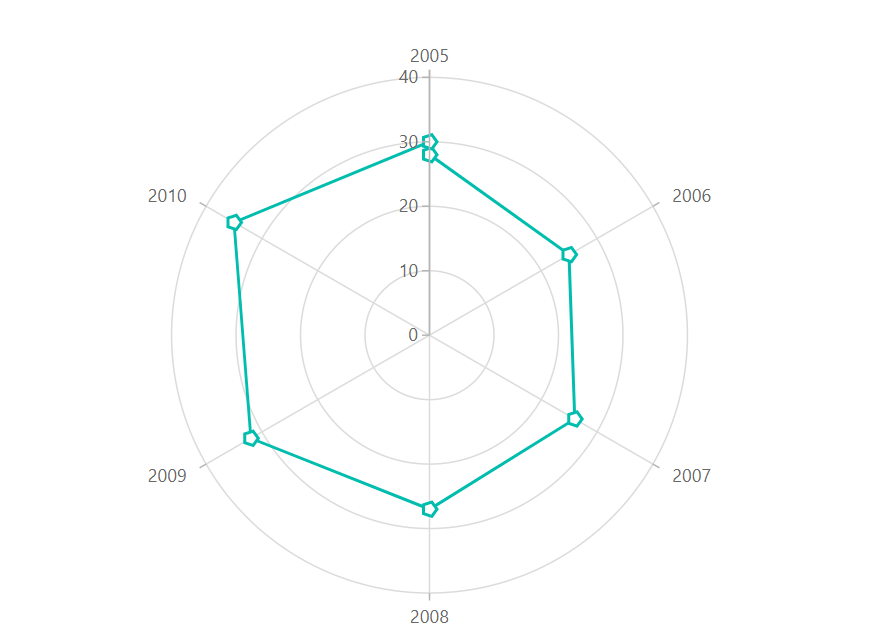
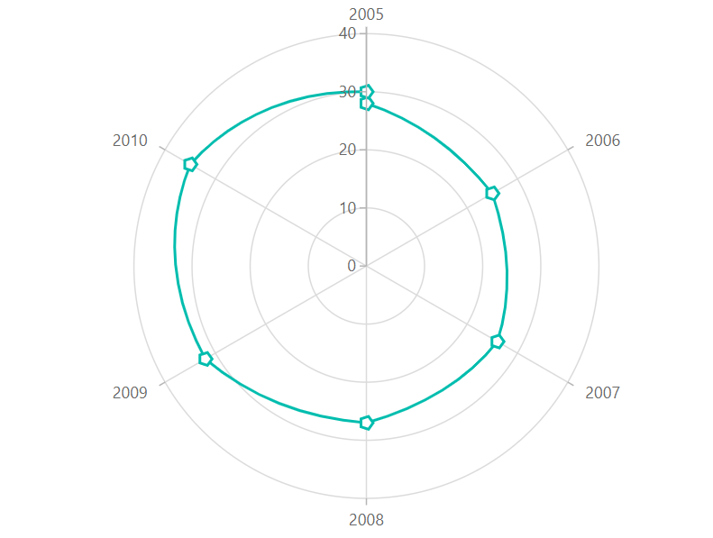
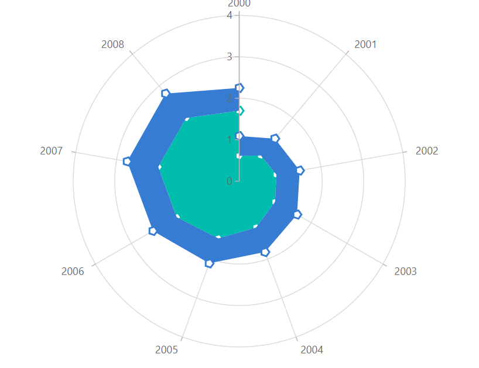
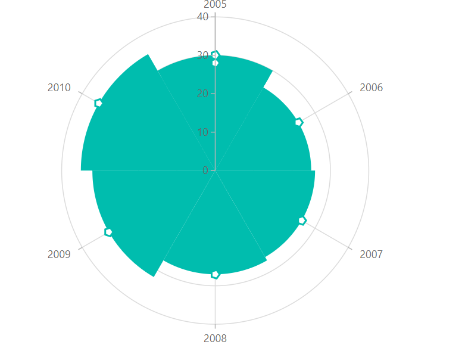
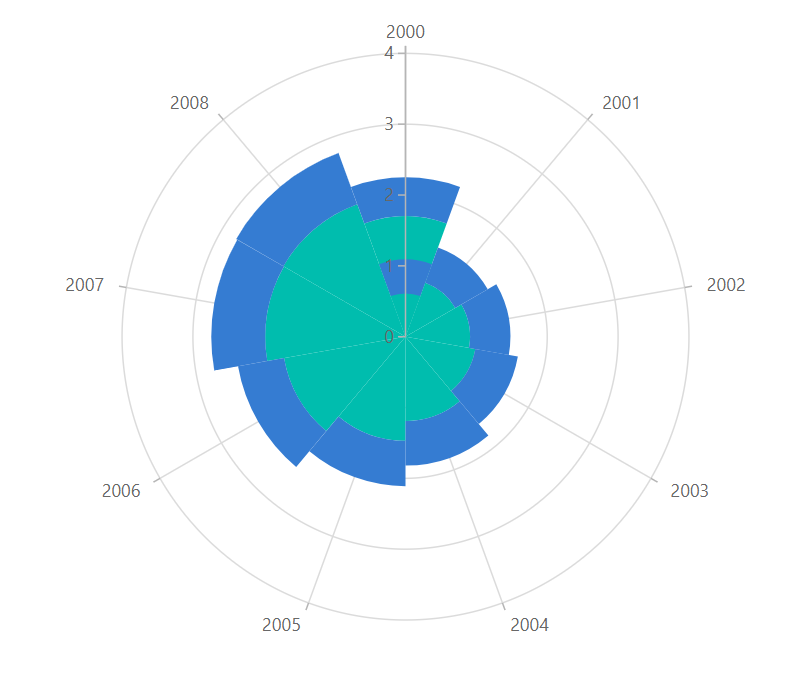
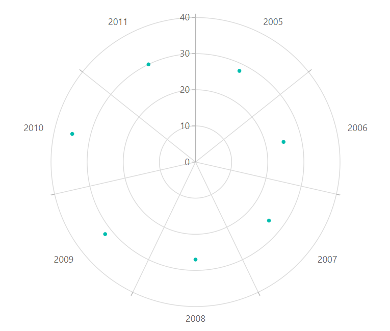
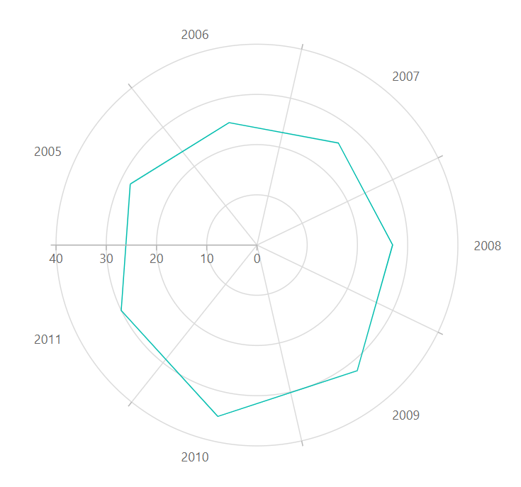
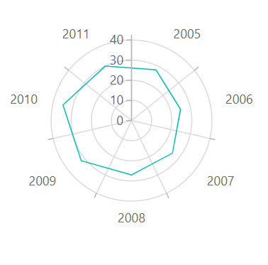

---
title: "Polar Chart in Blazor Charts component | Syncfusion"

component: "Charts"

description: "Learn here all about Polar Chart of Syncfusion Charts (SfCharts) component and more."
---

# Polar Chart in Blazor Charts (SfCharts)

## Polar

[`Polar`](https://www.syncfusion.com/blazor-components/blazor-charts/chart-types/polar-chart) series visualizes data in terms of values and angles. It provides options for visual comparison between several quantitative or qualitative aspects of a situation. To render a polar chart, use series [`Type`](https://help.syncfusion.com/cr/blazor/Syncfusion.Blazor~Syncfusion.Blazor.Charts.ChartSeries~Type.html) to [`Polar`](https://help.syncfusion.com/cr/blazor/Syncfusion.Blazor.Charts.ChartSeriesType.html#Syncfusion_Blazor_Charts_ChartSeriesType_Polar).

> Refer to our [`Blazor Polar Chart`](https://www.syncfusion.com/blazor-components/blazor-charts/chart-types/polar-chart) feature tour page to know about its other groundbreaking feature representations. Explore our [`Blazor Polar Chart Example`](https://blazor.syncfusion.com/demos/chart/polar-line) to know how to render and configure the Polar Line type chart.

## Draw Types

 To change the series plotting type to  [`Line`](https://help.syncfusion.com/cr/blazor/Syncfusion.Blazor.Charts.ChartDrawType.html#Syncfusion_Blazor_Charts_ChartDrawType_Line),  [`Column`](https://help.syncfusion.com/cr/blazor/Syncfusion.Blazor.Charts.ChartDrawType.html#Syncfusion_Blazor_Charts_ChartDrawType_Column),  [`Area`](https://help.syncfusion.com/cr/blazor/Syncfusion.Blazor.Charts.ChartDrawType.html#Syncfusion_Blazor_Charts_ChartDrawType_Area),  [`RangeColumn`](https://help.syncfusion.com/cr/blazor/Syncfusion.Blazor.Charts.ChartDrawType.html#Syncfusion_Blazor_Charts_ChartDrawType_RangeColumn),  [`Spline`](https://help.syncfusion.com/cr/blazor/Syncfusion.Blazor.Charts.ChartDrawType.html#Syncfusion_Blazor_Charts_ChartDrawType_Spline), [`Scatter`](https://help.syncfusion.com/cr/blazor/Syncfusion.Blazor.Charts.ChartDrawType.html#Syncfusion_Blazor_Charts_ChartDrawType_Scatter), [`StackingArea`](https://help.syncfusion.com/cr/blazor/Syncfusion.Blazor.Charts.ChartDrawType.html#Syncfusion_Blazor_Charts_ChartDrawType_StackingArea) and [`StackingColumn`](https://help.syncfusion.com/cr/blazor/Syncfusion.Blazor.Charts.ChartDrawType.html#Syncfusion_Blazor_Charts_ChartDrawType_StackingColumn) use the Polar's [`DrawType`](https://help.syncfusion.com/cr/blazor/Syncfusion.Blazor.Charts.ChartSeries.html#Syncfusion_Blazor_Charts_ChartSeries_DrawType) property. [`DrawType`](https://help.syncfusion.com/cr/blazor/Syncfusion.Blazor.Charts.ChartSeries.html#Syncfusion_Blazor_Charts_ChartSeries_DrawType) is set to [`Line`](https://help.syncfusion.com/cr/blazor/Syncfusion.Blazor.Charts.ChartDrawType.html#Syncfusion_Blazor_Charts_ChartDrawType_Line) by default.

### Line

To render a [`Line`](https://help.syncfusion.com/cr/blazor/Syncfusion.Blazor.Charts.ChartDrawType.html#Syncfusion_Blazor_Charts_ChartDrawType_Line) series in  [`Polar Chart`](https://help.syncfusion.com/cr/blazor/Syncfusion.Blazor.Charts.ChartSeriesType.html#Syncfusion_Blazor_Charts_ChartSeriesType_Polar), specify the [`DrawType`](https://help.syncfusion.com/cr/blazor/Syncfusion.Blazor.Charts.ChartSeries.html#Syncfusion_Blazor_Charts_ChartSeries_DrawType) property to [`Line`](https://help.syncfusion.com/cr/blazor/Syncfusion.Blazor.Charts.ChartDrawType.html#Syncfusion_Blazor_Charts_ChartDrawType_Line). [`IsClosed`](https://help.syncfusion.com/cr/blazor/Syncfusion.Blazor~Syncfusion.Blazor.Charts.ChartSeries~IsClosed.html) property specifies whether to join start and end point of a line series used in [`Polar Chart`](https://www.syncfusion.com/blazor-components/blazor-charts/chart-types/polar-chart) to form a closed path. Default value of [`IsClosed`](https://help.syncfusion.com/cr/blazor/Syncfusion.Blazor~Syncfusion.Blazor.Charts.ChartSeries~IsClosed.html) is **true**.





### Spline

To render a [`Spline`](https://help.syncfusion.com/cr/blazor/Syncfusion.Blazor.Charts.ChartDrawType.html#Syncfusion_Blazor_Charts_ChartDrawType_Spline) series in  [`Polar Chart`](https://help.syncfusion.com/cr/blazor/Syncfusion.Blazor.Charts.ChartSeriesType.html#Syncfusion_Blazor_Charts_ChartSeriesType_Polar), specify the [`DrawType`](https://help.syncfusion.com/cr/blazor/Syncfusion.Blazor.Charts.ChartSeries.html#Syncfusion_Blazor_Charts_ChartSeries_DrawType) property to [`Spline`](https://help.syncfusion.com/cr/blazor/Syncfusion.Blazor.Charts.ChartDrawType.html#Syncfusion_Blazor_Charts_ChartDrawType_Spline).





### Area

To render a [`Area`](https://help.syncfusion.com/cr/blazor/Syncfusion.Blazor.Charts.ChartDrawType.html#Syncfusion_Blazor_Charts_ChartDrawType_Area) series in  [`Polar Chart`](https://help.syncfusion.com/cr/blazor/Syncfusion.Blazor.Charts.ChartSeriesType.html#Syncfusion_Blazor_Charts_ChartSeriesType_Polar), specify the [`DrawType`](https://help.syncfusion.com/cr/blazor/Syncfusion.Blazor.Charts.ChartSeries.html#Syncfusion_Blazor_Charts_ChartSeries_DrawType) property to [`Area`](https://help.syncfusion.com/cr/blazor/Syncfusion.Blazor.Charts.ChartDrawType.html#Syncfusion_Blazor_Charts_ChartDrawType_Area).




  

### Stacked Area

To render a [`StackingArea`](https://help.syncfusion.com/cr/blazor/Syncfusion.Blazor.Charts.ChartDrawType.html#Syncfusion_Blazor_Charts_ChartDrawType_StackingArea) series in  [`Polar Chart`](https://help.syncfusion.com/cr/blazor/Syncfusion.Blazor.Charts.ChartSeriesType.html#Syncfusion_Blazor_Charts_ChartSeriesType_Polar), specify the [`DrawType`](https://help.syncfusion.com/cr/blazor/Syncfusion.Blazor.Charts.ChartSeries.html#Syncfusion_Blazor_Charts_ChartSeries_DrawType) property to [`StackingArea`](https://help.syncfusion.com/cr/blazor/Syncfusion.Blazor.Charts.ChartDrawType.html#Syncfusion_Blazor_Charts_ChartDrawType_StackingArea).





### Column

To render a [`Column`](https://help.syncfusion.com/cr/blazor/Syncfusion.Blazor.Charts.ChartDrawType.html#Syncfusion_Blazor_Charts_ChartDrawType_Column) series in  [`Polar Chart`](https://help.syncfusion.com/cr/blazor/Syncfusion.Blazor.Charts.ChartSeriesType.html#Syncfusion_Blazor_Charts_ChartSeriesType_Polar), specify the [`DrawType`](https://help.syncfusion.com/cr/blazor/Syncfusion.Blazor.Charts.ChartSeries.html#Syncfusion_Blazor_Charts_ChartSeries_DrawType) property to [`Column`](https://help.syncfusion.com/cr/blazor/Syncfusion.Blazor.Charts.ChartDrawType.html#Syncfusion_Blazor_Charts_ChartDrawType_Column).





### Stacked Column

To render a [`StackingColumn`](https://help.syncfusion.com/cr/blazor/Syncfusion.Blazor.Charts.ChartDrawType.html#Syncfusion_Blazor_Charts_ChartDrawType_StackingColumn) series in  [`Polar Chart`](https://help.syncfusion.com/cr/blazor/Syncfusion.Blazor.Charts.ChartSeriesType.html#Syncfusion_Blazor_Charts_ChartSeriesType_Polar), specify the [`DrawType`](https://help.syncfusion.com/cr/blazor/Syncfusion.Blazor.Charts.ChartSeries.html#Syncfusion_Blazor_Charts_ChartSeries_DrawType) property to [`StackingColumn`](https://help.syncfusion.com/cr/blazor/Syncfusion.Blazor.Charts.ChartDrawType.html#Syncfusion_Blazor_Charts_ChartDrawType_StackingColumn).





### Range Column

To render a [`RangeColumn`](https://help.syncfusion.com/cr/blazor/Syncfusion.Blazor.Charts.ChartDrawType.html#Syncfusion_Blazor_Charts_ChartDrawType_RangeColumn) series in  [`Polar Chart`](https://help.syncfusion.com/cr/blazor/Syncfusion.Blazor.Charts.ChartSeriesType.html#Syncfusion_Blazor_Charts_ChartSeriesType_Polar), specify the [`DrawType`](https://help.syncfusion.com/cr/blazor/Syncfusion.Blazor.Charts.ChartSeries.html#Syncfusion_Blazor_Charts_ChartSeries_DrawType) property to [`RangeColumn`](https://help.syncfusion.com/cr/blazor/Syncfusion.Blazor.Charts.ChartDrawType.html#Syncfusion_Blazor_Charts_ChartDrawType_RangeColumn).





### Scatter
  
To render a [`Scatter`](https://help.syncfusion.com/cr/blazor/Syncfusion.Blazor.Charts.ChartDrawType.html#Syncfusion_Blazor_Charts_ChartDrawType_Scatter) series in  [`Polar Chart`](https://help.syncfusion.com/cr/blazor/Syncfusion.Blazor.Charts.ChartSeriesType.html#Syncfusion_Blazor_Charts_ChartSeriesType_Polar), specify the [`DrawType`](https://help.syncfusion.com/cr/blazor/Syncfusion.Blazor.Charts.ChartSeries.html#Syncfusion_Blazor_Charts_ChartSeries_DrawType) property to [`Scatter`](https://help.syncfusion.com/cr/blazor/Syncfusion.Blazor.Charts.ChartDrawType.html#Syncfusion_Blazor_Charts_ChartDrawType_Scatter).





## Series Customization

### Start Angle

Customize the start angle of the [`Polar Chart`](https://help.syncfusion.com/cr/blazor/Syncfusion.Blazor.Charts.ChartSeriesType.html#Syncfusion_Blazor_Charts_ChartSeriesType_Polar) using [`StartAngle`](https://help.syncfusion.com/cr/blazor/Syncfusion.Blazor.Charts.ChartCommonAxis.html#Syncfusion_Blazor_Charts_ChartCommonAxis_StartAngle) property. By default, [`StartAngle`](https://help.syncfusion.com/cr/blazor/Syncfusion.Blazor.Charts.ChartCommonAxis.html#Syncfusion_Blazor_Charts_ChartCommonAxis_StartAngle) value is **0**.





### Coefficient in axis

Customize the radius of the [`Polar Chart`](https://help.syncfusion.com/cr/blazor/Syncfusion.Blazor.Charts.ChartSeriesType.html#Syncfusion_Blazor_Charts_ChartSeriesType_Polar) using [`Coefficient`](https://help.syncfusion.com/cr/blazor/Syncfusion.Blazor.Charts.ChartCommonAxis.html#Syncfusion_Blazor_Charts_ChartCommonAxis_Coefficient) property. By default [`Coefficient`](https://help.syncfusion.com/cr/blazor/Syncfusion.Blazor.Charts.ChartCommonAxis.html#Syncfusion_Blazor_Charts_ChartCommonAxis_Coefficient) value is **100**.





> Refer to our [`Blazor Charts`](https://www.syncfusion.com/blazor-components/blazor-charts) feature tour page for its groundbreaking feature representations and also explore our [`Blazor Chart example`](https://blazor.syncfusion.com/demos/chart/line?theme=bootstrap4) to know various chart types and how to represent time-dependent data, showing trends at equal intervals.

## See Also

* [Data Label](../data-labels)

* [Tooltip](../tool-tip)