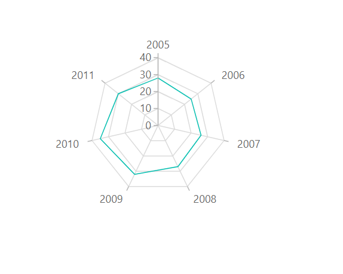

# Radar in Blazor Charts Component

## Radar
 
[Radar](https://www.syncfusion.com/blazor-components/blazor-charts/chart-types/radar-chart) series visualizes data in terms of values and angles. It provides option for visual comparison between several quantitative or qualitative aspects of a situation. To render a radar chart, set the series [Type](https://help.syncfusion.com/cr/blazor/Syncfusion.Blazor.Charts.ChartSeries.html#Syncfusion_Blazor_Charts_ChartSeries_Type) to [Radar](https://help.syncfusion.com/cr/blazor/Syncfusion.Blazor.Charts.ChartSeriesType.html#Syncfusion_Blazor_Charts_ChartSeriesType_Radar). To render a [Line](https://help.syncfusion.com/cr/blazor/Syncfusion.Blazor.Charts.ChartDrawType.html#Syncfusion_Blazor_Charts_ChartDrawType_Line) series in [Radar Chart](https://help.syncfusion.com/cr/blazor/Syncfusion.Blazor.Charts.ChartSeriesType.html#Syncfusion_Blazor_Charts_ChartSeriesType_Radar), specify the [DrawType](https://help.syncfusion.com/cr/blazor/Syncfusion.Blazor.Charts.ChartSeries.html#Syncfusion_Blazor_Charts_ChartSeries_DrawType) property to [Line](https://help.syncfusion.com/cr/blazor/Syncfusion.Blazor.Charts.ChartDrawType.html#Syncfusion_Blazor_Charts_ChartDrawType_Line). [IsClosed](https://help.syncfusion.com/cr/blazor/Syncfusion.Blazor.Charts.ChartSeries.html#Syncfusion_Blazor_Charts_ChartSeries_IsClosed) property specifies whether to join start and end point of a line series used in [Radar Chart](https://www.syncfusion.com/blazor-components/blazor-charts/chart-types/Radar-chart) to form a closed path. The default value of [IsClosed](https://help.syncfusion.com/cr/blazor/Syncfusion.Blazor.Charts.ChartSeries.html#Syncfusion_Blazor_Charts_ChartSeries_IsClosed) property is **true**.

```cshtml

@using Syncfusion.Blazor.Charts

<SfChart>
    <ChartPrimaryXAxis ValueType="Syncfusion.Blazor.Charts.ValueType.Category">
    </ChartPrimaryXAxis>

    <ChartSeriesCollection>
        <ChartSeries DataSource="@SalesReports" XName="X" YName="Y"
                     Type="ChartSeriesType.Radar" DrawType="ChartDrawType.Line">
        </ChartSeries>
    </ChartSeriesCollection>
</SfChart>

@code{
    public class ChartData
    {
        public double X { get; set; }
        public double Y { get; set; }
    }

    public List<ChartData> SalesReports = new List<ChartData>
	{
        new ChartData{ X= 2005, Y= 28 },
        new ChartData{ X= 2006, Y= 25 },
        new ChartData{ X= 2007, Y= 26 },
        new ChartData{ X= 2008, Y= 27 },
        new ChartData{ X= 2009, Y= 32 },
        new ChartData{ X= 2010, Y= 35 },
        new ChartData{ X= 2011, Y= 30 }
    };
}

``` 


N> Refer to our [Blazor Radar Chart](https://www.syncfusion.com/blazor-components/blazor-charts/chart-types/radar-chart) feature tour page to know about its other groundbreaking feature representations. Explore our [Blazor Radar Chart Example](https://blazor.syncfusion.com/demos/chart/polar-line) to know how to render and configure the Radar type chart.

## Series customization

### Start angle
 
To customize the start angle of the [Radar Chart](https://help.syncfusion.com/cr/blazor/Syncfusion.Blazor.Charts.ChartSeriesType.html#Syncfusion_Blazor_Charts_ChartSeriesType_Radar), use [StartAngle](https://help.syncfusion.com/cr/blazor#Syncfusion_Blazor_Charts_ChartCommonAxis_StartAngle/Syncfusion.Blazor.html/Syncfusion.Blazor.html) property. By default, [StartAngle](https://help.syncfusion.com/cr/blazor#Syncfusion_Blazor_Charts_ChartCommonAxis_StartAngle/Syncfusion.Blazor.html/Syncfusion.Blazor.html) value is **0**.

```cshtml

@using Syncfusion.Blazor.Charts

<SfChart>
    <ChartPrimaryXAxis StartAngle="270" ValueType="Syncfusion.Blazor.Charts.ValueType.Category">
    </ChartPrimaryXAxis>

    <ChartSeriesCollection>
        <ChartSeries DataSource="@SalesReports" XName="X" YName="Y"
                     Type="ChartSeriesType.Radar" DrawType="ChartDrawType.Line">
        </ChartSeries>
    </ChartSeriesCollection>
</SfChart>

@code{
    public class ChartData
    {
        public double X { get; set; }
        public double Y { get; set; }
    }

    public List<ChartData> SalesReports = new List<ChartData>
	{
        new ChartData{ X= 2005, Y= 28 },
        new ChartData{ X= 2006, Y= 25 },
        new ChartData{ X= 2007, Y= 26 },
        new ChartData{ X= 2008, Y= 27 },
        new ChartData{ X= 2009, Y= 32 },
        new ChartData{ X= 2010, Y= 35 },
        new ChartData{ X= 2011, Y= 30 }
    };
}

``` 


### Coefficient in axis
  
To customize the radius of the [Radar Chart](https://help.syncfusion.com/cr/blazor/Syncfusion.Blazor.Charts.ChartSeriesType.html#Syncfusion_Blazor_Charts_ChartSeriesType_Radar), use [Coefficient](https://help.syncfusion.com/cr/blazor#Syncfusion_Blazor_Charts_ChartCommonAxis_Coefficient) property. By default, [Coefficient](https://help.syncfusion.com/cr/blazor#Syncfusion_Blazor_Charts_ChartCommonAxis_Coefficient) value is **100**.

```cshtml

@using Syncfusion.Blazor.Charts

<SfChart>
    <ChartPrimaryXAxis Coefficient="40" ValueType="Syncfusion.Blazor.Charts.ValueType.Category">
    </ChartPrimaryXAxis>

    <ChartSeriesCollection>
        <ChartSeries DataSource="@SalesReports" XName="X" YName="Y"
                     Type="ChartSeriesType.Radar" DrawType="ChartDrawType.Line">
        </ChartSeries>
    </ChartSeriesCollection>
</SfChart>

@code{
    public class ChartData
    {
        public double X { get; set; }
        public double Y { get; set; }
    }

    public List<ChartData> SalesReports = new List<ChartData>
    {
        new ChartData{ X= 2005, Y= 28 },
        new ChartData{ X= 2006, Y= 25 },
        new ChartData{ X= 2007, Y= 26 },
        new ChartData{ X= 2008, Y= 27 },
        new ChartData{ X= 2009, Y= 32 },
        new ChartData{ X= 2010, Y= 35 },
        new ChartData{ X= 2011, Y= 30 }
    };
}

``` 



N> Refer to our [Blazor Charts](https://www.syncfusion.com/blazor-components/blazor-charts) feature tour page for its groundbreaking feature representations and also explore our [Blazor Chart Example](https://blazor.syncfusion.com/demos/chart/line?theme=bootstrap5) to know various chart types and how to represent time-dependent data, showing trends at equal intervals.

## See also

* [Data Label](../data-labels)
* [Tooltip](../tool-tip)