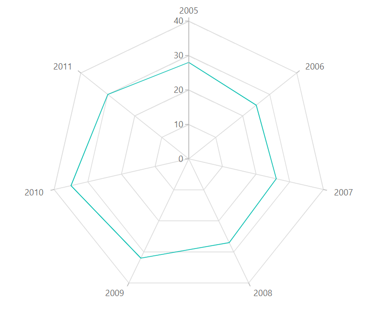
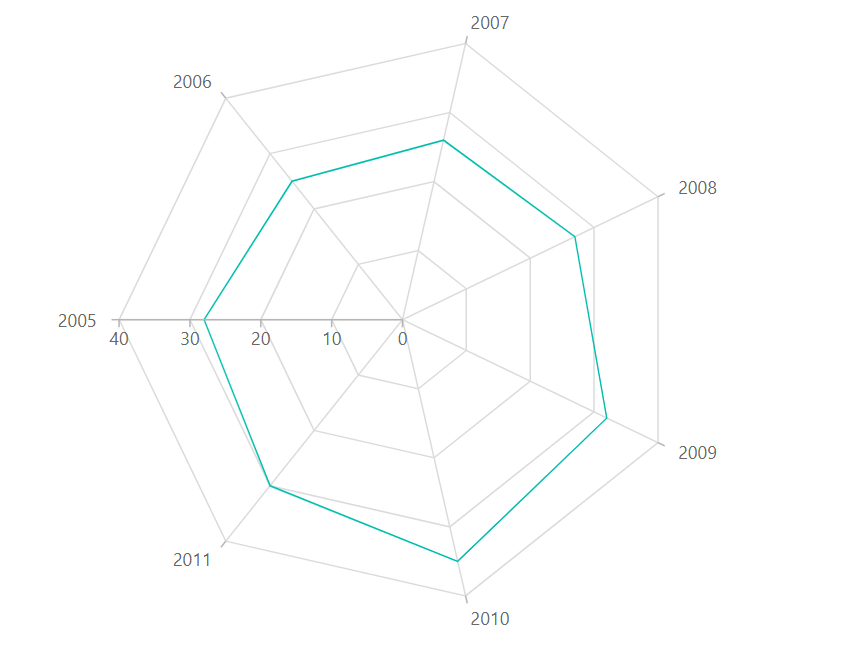

# Radar Chart in Blazor Charts (SfCharts)

## Radar

[`Radar`](https://www.syncfusion.com/blazor-components/blazor-charts/chart-types/radar-chart) series visualizes data in terms of values and angles. It provides options for visual comparison between several quantitative or qualitative aspects of a situation. To render a radar chart, use series [`Type`](https://help.syncfusion.com/cr/blazor/Syncfusion.Blazor~Syncfusion.Blazor.Charts.ChartSeries~Type.html) to [`Radar`](https://help.syncfusion.com/cr/blazor/Syncfusion.Blazor.Charts.ChartSeriesType.html#Syncfusion_Blazor_Charts_ChartSeriesType_Radar). To render a [`Line`](https://help.syncfusion.com/cr/blazor/Syncfusion.Blazor.Charts.ChartDrawType.html#Syncfusion_Blazor_Charts_ChartDrawType_Line) series in [`Radar Chart`](https://help.syncfusion.com/cr/blazor/Syncfusion.Blazor.Charts.ChartSeriesType.html#Syncfusion_Blazor_Charts_ChartSeriesType_Radar), specify the [`DrawType`](https://help.syncfusion.com/cr/blazor/Syncfusion.Blazor.Charts.ChartSeries.html#Syncfusion_Blazor_Charts_ChartSeries_DrawType) property to [`Line`](https://help.syncfusion.com/cr/blazor/Syncfusion.Blazor.Charts.ChartDrawType.html#Syncfusion_Blazor_Charts_ChartDrawType_Line). [`IsClosed`](https://help.syncfusion.com/cr/blazor/Syncfusion.Blazor~Syncfusion.Blazor.Charts.ChartSeries~IsClosed.html) property specifies whether to join start and end point of a line series used in [`Radar Chart`](https://www.syncfusion.com/blazor-components/blazor-charts/chart-types/Radar-chart) to form a closed path. Default value of [`IsClosed`](https://help.syncfusion.com/cr/blazor/Syncfusion.Blazor~Syncfusion.Blazor.Charts.ChartSeries~IsClosed.html) is **true**.





> Refer to our [`Blazor Radar Chart`](https://www.syncfusion.com/blazor-components/blazor-charts/chart-types/radar-chart) feature tour page to know about its other groundbreaking feature representations. Explore our [`Blazor Radar Chart Example`](https://blazor.syncfusion.com/demos/chart/polar-line) to know how to render and configure the Radar Line type chart.

## Series Customization

### Start Angle

Customize the start angle of the [`Radar Chart`](https://help.syncfusion.com/cr/blazor/Syncfusion.Blazor.Charts.ChartSeriesType.html#Syncfusion_Blazor_Charts_ChartSeriesType_Radar) using [`StartAngle`](https://help.syncfusion.com/cr/blazor/Syncfusion.Blazor.Charts.ChartCommonAxis.html#Syncfusion_Blazor_Charts_ChartCommonAxis_StartAngle) property. By default, [`StartAngle`](https://help.syncfusion.com/cr/blazor/Syncfusion.Blazor.Charts.ChartCommonAxis.html#Syncfusion_Blazor_Charts_ChartCommonAxis_StartAngle) value is **0**.





### Coefficient in axis
  
Customize the radius of the [`Radar Chart`](https://help.syncfusion.com/cr/blazor/Syncfusion.Blazor.Charts.ChartSeriesType.html#Syncfusion_Blazor_Charts_ChartSeriesType_Radar) using [`Coefficient`](https://help.syncfusion.com/cr/blazor/Syncfusion.Blazor.Charts.ChartCommonAxis.html#Syncfusion_Blazor_Charts_ChartCommonAxis_Coefficient) property. By default, [`Coefficient`](https://help.syncfusion.com/cr/blazor/Syncfusion.Blazor.Charts.ChartCommonAxis.html#Syncfusion_Blazor_Charts_ChartCommonAxis_Coefficient) value is **100**.





>> Refer to our [`Blazor Charts`](https://www.syncfusion.com/blazor-components/blazor-charts) feature tour page for its groundbreaking feature representations and also explore our [`Blazor Chart example`](https://blazor.syncfusion.com/demos/chart/line?theme=bootstrap4) to know various chart types and how to represent time-dependent data, showing trends at equal intervals.

## See Also

* [Data Label](../data-labels)

* [Tooltip](../tool-tip)