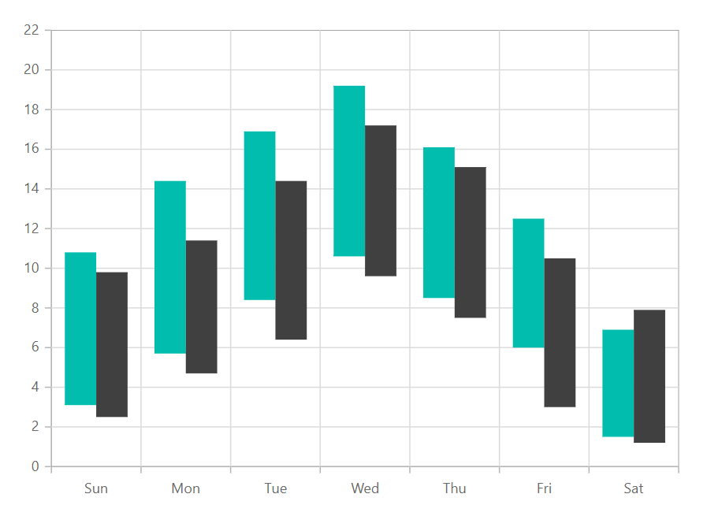
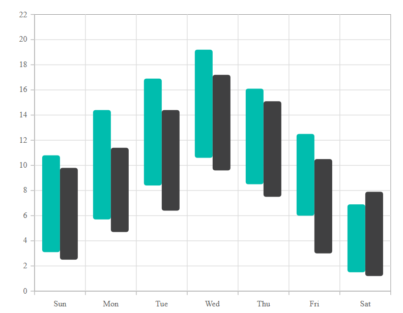

# Range Column in Blazor Charts Component

## Range Column

[Range column charts](https://www.syncfusion.com/blazor-components/blazor-charts/chart-types/range-column-chart) visualize a pair of y-values (high and low) for each x-value using vertical bars, making them suitable for ranges such as temperature highs/lows, stock price ranges, or any bounded measurements. To render a [range column](https://www.syncfusion.com/blazor-components/blazor-charts/chart-types/range-column-chart) series, configure the following:

1. **Set the series type**: Set the series [`Type`](https://help.syncfusion.com/cr/blazor/Syncfusion.Blazor.Charts.ChartSeries.html#Syncfusion_Blazor_Charts_ChartSeries_Type) to [`RangeColumn`](https://help.syncfusion.com/cr/blazor/Syncfusion.Blazor.Charts.ChartSeriesType.html#Syncfusion_Blazor_Charts_ChartSeriesType_RangeColumn).

2. **Provide high and low values**: Provide both high and low values for every data point using the [`High`](https://help.syncfusion.com/cr/blazor/Syncfusion.Blazor.Charts.ChartSeries.html#Syncfusion_Blazor_Charts_ChartSeries_High) and [`Low`](https://help.syncfusion.com/cr/blazor/Syncfusion.Blazor.Charts.ChartSeries.html#Syncfusion_Blazor_Charts_ChartSeries_Low) mappings.

```cshtml

@using Syncfusion.Blazor.Charts

<SfChart>
    <ChartPrimaryXAxis ValueType="Syncfusion.Blazor.Charts.ValueType.Category" />

    <ChartSeriesCollection>
        <ChartSeries DataSource="@WeatherReport1" XName="X" High="High" Low="Low" Width="2" Type="ChartSeriesType.RangeColumn">
        </ChartSeries>
        <ChartSeries DataSource="@WeatherReport2" XName="X" High="High" Low="Low" Width="2" Type="ChartSeriesType.RangeColumn">
        </ChartSeries>
    </ChartSeriesCollection>
</SfChart>

@code{
    public class ChartData
    {
        public string X { get; set; }
        public double Low { get; set; }
        public double High { get; set; }
    }

    public List<ChartData> WeatherReport1 = new List<ChartData>
	{
        new ChartData { X= "Sun", Low= 3.1, High= 10.8 },
        new ChartData { X= "Mon", Low= 5.7, High= 14.4 },
        new ChartData { X= "Tue", Low= 8.4, High= 16.9 },
        new ChartData { X= "Wed", Low= 10.6, High= 19.2 },
        new ChartData { X= "Thu", Low= 8.5, High= 16.1 },
        new ChartData { X= "Fri", Low= 6.0, High= 12.5 },
        new ChartData { X= "Sat", Low= 1.5, High= 6.9 }
    };

    public List<ChartData> WeatherReport2 = new List<ChartData>
	{
        new ChartData { X= "Sun", Low= 2.5, High= 9.8 },
        new ChartData { X= "Mon", Low= 4.7, High= 11.4 },
        new ChartData { X= "Tue", Low= 6.4, High= 14.4 },
        new ChartData { X= "Wed", Low= 9.6, High= 17.2 },
        new ChartData { X= "Thu", Low= 7.5, High= 15.1 },
        new ChartData { X= "Fri", Low= 3.0, High= 10.5 },
        new ChartData { X= "Sat", Low= 1.2, High= 7.9 }
    };
}

``` 




N> Refer to the [Blazor Range Column Chart](https://www.syncfusion.com/blazor-components/blazor-charts/chart-types/range-column-chart) feature tour to learn about key capabilities. See the [Range Column Chart demo](https://blazor.syncfusion.com/demos/chart/range-column?theme=bootstrap5) for interactive examples.

## Binding data with series

Bind data using the series [`DataSource`](https://help.syncfusion.com/cr/blazor/Syncfusion.Blazor.Charts.ChartSeries.html#Syncfusion_Blazor_Charts_ChartSeries_DataSource) property. Supply business objects or use [`SfDataManager`](https://help.syncfusion.com/cr/blazor/Syncfusion.Blazor.Data.SfDataManager.html). Map fields to [`XName`](https://help.syncfusion.com/cr/blazor/Syncfusion.Blazor.Charts.ChartSeries.html#Syncfusion_Blazor_Charts_ChartSeries_XName), [`High`](https://help.syncfusion.com/cr/blazor/Syncfusion.Blazor.Charts.ChartSeries.html#Syncfusion_Blazor_Charts_ChartSeries_High), and [`Low`](https://help.syncfusion.com/cr/blazor/Syncfusion.Blazor.Charts.ChartSeries.html#Syncfusion_Blazor_Charts_ChartSeries_Low). Both High and Low are required for each point. For more options, see [Working with data](../working-with-data).

```cshtml

@using Syncfusion.Blazor.Charts

<SfChart>
    <ChartPrimaryXAxis ValueType="Syncfusion.Blazor.Charts.ValueType.Category" />

    <ChartSeriesCollection>
        <ChartSeries DataSource="@WeatherReport1" XName="X" High="High" Low="Low" Width="2" Type="ChartSeriesType.RangeColumn">
        </ChartSeries>
        <ChartSeries DataSource="@WeatherReport2" XName="X" High="High" Low="Low" Width="2" Type="ChartSeriesType.RangeColumn">
        </ChartSeries>
    </ChartSeriesCollection>
</SfChart>

@code{
    public class ChartData
    {
        public string X { get; set; }
        public double Low { get; set; }
        public double High { get; set; }
    }

    public List<ChartData> WeatherReport1 = new List<ChartData>
	{
        new ChartData { X= "Sun", Low= 3.1, High= 10.8 },
        new ChartData { X= "Mon", Low= 5.7, High= 14.4 },
        new ChartData { X= "Tue", Low= 8.4, High= 16.9 },
        new ChartData { X= "Wed", Low= 10.6, High= 19.2 },
        new ChartData { X= "Thu", Low= 8.5, High= 16.1 },
        new ChartData { X= "Fri", Low= 6.0, High= 12.5 },
        new ChartData { X= "Sat", Low= 1.5, High= 6.9 }
    };

    public List<ChartData> WeatherReport2 = new List<ChartData>
	{
        new ChartData { X= "Sun", Low= 2.5, High= 9.8 },
        new ChartData { X= "Mon", Low= 4.7, High= 11.4 },
        new ChartData { X= "Tue", Low= 6.4, High= 14.4 },
        new ChartData { X= "Wed", Low= 9.6, High= 17.2 },
        new ChartData { X= "Thu", Low= 7.5, High= 15.1 },
        new ChartData { X= "Fri", Low= 3.0, High= 10.5 },
        new ChartData { X= "Sat", Low= 1.2, High= 7.9 }
    };
}

``` 


## Series customization

Use these properties to customize the [RangeColumn](https://help.syncfusion.com/cr/blazor/Syncfusion.Blazor.Charts.ChartSeriesType.html#Syncfusion_Blazor_Charts_ChartSeriesType_RangeColumn) series.

**Fill**

The [Fill](https://help.syncfusion.com/cr/blazor/Syncfusion.Blazor.Charts.ChartSeries.html#Syncfusion_Blazor_Charts_ChartSeries_Fill) property sets the series color.

```cshtml

@using Syncfusion.Blazor.Charts

<SfChart>
    <ChartPrimaryXAxis ValueType="Syncfusion.Blazor.Charts.ValueType.Category" />

    <ChartSeriesCollection>
        <ChartSeries DataSource="@WeatherReport1" XName="X" High="High" Low="Low" Width="2" Type="Syncfusion.Blazor.Charts.ChartSeriesType.RangeColumn" Fill="green"></ChartSeries>
        <ChartSeries DataSource="@WeatherReport2" XName="X" High="High" Low="Low" Width="2" Type="Syncfusion.Blazor.Charts.ChartSeriesType.RangeColumn" Fill="red"></ChartSeries>
    </ChartSeriesCollection>
</SfChart>

@code {
    public class ChartData
    {
        public string X { get; set; }
        public double Low { get; set; }
        public double High { get; set; }
    }

    public List<ChartData> WeatherReport1 = new List<ChartData>
    {
        new  ChartData { X=  "Sun", Low=  3.1, High=  10.8 },
        new  ChartData { X=  "Mon", Low=  5.7, High=  14.4 },
        new  ChartData { X=  "Tue", Low=  8.4, High=  16.9 },
        new  ChartData { X=  "Wed", Low=  10.6, High=  19.2 },
        new  ChartData { X=  "Thu", Low=  8.5, High=  16.1 },
        new  ChartData { X=  "Fri", Low=  6.0, High=  12.5 },
        new  ChartData { X=  "Sat", Low=  1.5, High=  6.9 }
    };

    public List<ChartData> WeatherReport2 = new List<ChartData>
    {
        new  ChartData { X=  "Sun", Low=  2.5, High=  9.8 },
        new  ChartData { X=  "Mon", Low=  4.7, High=  11.4 },
        new  ChartData { X=  "Tue", Low=  6.4, High=  14.4 },
        new  ChartData { X=  "Wed", Low=  9.6, High=  17.2 },
        new  ChartData { X=  "Thu", Low=  7.5, High=  15.1 },
        new  ChartData { X=  "Fri", Low=  3.0, High=  10.5 },
        new  ChartData { X=  "Sat", Low=  1.2, High=  7.9 }
    };
}

```


The [Fill](https://help.syncfusion.com/cr/blazor/Syncfusion.Blazor.Charts.ChartSeries.html#Syncfusion_Blazor_Charts_ChartSeries_Fill) property can also reference a gradient brush to create a color transition.

```cshtml

@using Syncfusion.Blazor.Charts

<SfChart>
    <ChartPrimaryXAxis ValueType="Syncfusion.Blazor.Charts.ValueType.Category" />

    <ChartSeriesCollection>
        <ChartSeries DataSource="@WeatherReport1" XName="X" High="High" Low="Low" Width="2" Type="ChartSeriesType.RangeColumn" Fill="url(#grad1)"></ChartSeries>
        <ChartSeries DataSource="@WeatherReport2" XName="X" High="High" Low="Low" Width="2" Type="ChartSeriesType.RangeColumn" Fill="url(#grad2)"></ChartSeries>
    </ChartSeriesCollection>
</SfChart>

<svg style="height: 0">
    <defs>
        <linearGradient id="grad1" x1="0%" y1="0%" x2="0%" y2="100%">
            <stop offset="20%" style="stop-color:orange;stop-opacity:1" />
            <stop offset="100%" style="stop-color:black;stop-opacity:1" />
        </linearGradient>
    </defs>
</svg>

<svg style="height: 0">
    <defs>
        <linearGradient id="grad2" x1="0%" y1="0%" x2="0%" y2="100%">
            <stop offset="20%" style="stop-color:green;stop-opacity:1" />
            <stop offset="100%" style="stop-color:lawngreen;stop-opacity:1" />
        </linearGradient>
    </defs>
</svg>

@code {
    public class ChartData
    {
        public string X { get; set; }
        public double Low { get; set; }
        public double High { get; set; }
    }

    public List<ChartData> WeatherReport1 = new List<ChartData>
    {
        new  ChartData { X=  "Sun", Low=  3.1, High=  10.8 },
        new  ChartData { X=  "Mon", Low=  5.7, High=  14.4 },
        new  ChartData { X=  "Tue", Low=  8.4, High=  16.9 },
        new  ChartData { X=  "Wed", Low=  10.6, High=  19.2 },
        new  ChartData { X=  "Thu", Low=  8.5, High=  16.1 },
        new  ChartData { X=  "Fri", Low=  6.0, High=  12.5 },
        new  ChartData { X=  "Sat", Low=  1.5, High=  6.9 }
    };

    public List<ChartData> WeatherReport2 = new List<ChartData>
    {
        new  ChartData { X=  "Sun", Low=  2.5, High=  9.8 },
        new  ChartData { X=  "Mon", Low=  4.7, High=  11.4 },
        new  ChartData { X=  "Tue", Low=  6.4, High=  14.4 },
        new  ChartData { X=  "Wed", Low=  9.6, High=  17.2 },
        new  ChartData { X=  "Thu", Low=  7.5, High=  15.1 },
        new  ChartData { X=  "Fri", Low=  3.0, High=  10.5 },
        new  ChartData { X=  "Sat", Low=  1.2, High=  7.9 }
    };
}

```



**Opacity**

The [Opacity](https://help.syncfusion.com/cr/blazor/Syncfusion.Blazor.Charts.ChartSeries.html#Syncfusion_Blazor_Charts_ChartSeries_Opacity) property controls the transparency of the series fill.

```cshtml

@using Syncfusion.Blazor.Charts

<SfChart>
    <ChartPrimaryXAxis ValueType="Syncfusion.Blazor.Charts.ValueType.Category" />

    <ChartSeriesCollection>
        <ChartSeries DataSource="@WeatherReport1" XName="X" High="High" Low="Low" Width="2" Type="Syncfusion.Blazor.Charts.ChartSeriesType.RangeColumn" Fill="green" Opacity="0.5"></ChartSeries>
        <ChartSeries DataSource="@WeatherReport2" XName="X" High="High" Low="Low" Width="2" Type="Syncfusion.Blazor.Charts.ChartSeriesType.RangeColumn" Fill="red" Opacity="0.5"></ChartSeries>
    </ChartSeriesCollection>
</SfChart>

@code {
    public class ChartData
    {
        public string X { get; set; }
        public double Low { get; set; }
        public double High { get; set; }
    }

    public List<ChartData> WeatherReport1 = new List<ChartData>
    {
        new  ChartData { X=  "Sun", Low=  3.1, High=  10.8 },
        new  ChartData { X=  "Mon", Low=  5.7, High=  14.4 },
        new  ChartData { X=  "Tue", Low=  8.4, High=  16.9 },
        new  ChartData { X=  "Wed", Low=  10.6, High=  19.2 },
        new  ChartData { X=  "Thu", Low=  8.5, High=  16.1 },
        new  ChartData { X=  "Fri", Low=  6.0, High=  12.5 },
        new  ChartData { X=  "Sat", Low=  1.5, High=  6.9 }
    };

    public List<ChartData> WeatherReport2 = new List<ChartData>
    {
        new  ChartData { X=  "Sun", Low=  2.5, High=  9.8 },
        new  ChartData { X=  "Mon", Low=  4.7, High=  11.4 },
        new  ChartData { X=  "Tue", Low=  6.4, High=  14.4 },
        new  ChartData { X=  "Wed", Low=  9.6, High=  17.2 },
        new  ChartData { X=  "Thu", Low=  7.5, High=  15.1 },
        new  ChartData { X=  "Fri", Low=  3.0, High=  10.5 },
        new  ChartData { X=  "Sat", Low=  1.2, High=  7.9 }
    };
}

```


**DashArray**

The [DashArray](https://help.syncfusion.com/cr/blazor/Syncfusion.Blazor.Charts.ChartSeries.html#Syncfusion_Blazor_Charts_ChartSeries_DashArray) property configures the dash pattern for the series border.

```cshtml

@using Syncfusion.Blazor.Charts

<SfChart>
    <ChartPrimaryXAxis ValueType="Syncfusion.Blazor.Charts.ValueType.Category" />

    <ChartSeriesCollection>
        <ChartSeries DataSource="@WeatherReport1" XName="X" High="High" Low="Low" Width="2" Type="Syncfusion.Blazor.Charts.ChartSeriesType.RangeColumn" Fill="green" DashArray="5,5" Opacity="0.7">
            <ChartSeriesBorder Width="2" Color="green"></ChartSeriesBorder>
        </ChartSeries>
        <ChartSeries DataSource="@WeatherReport2" XName="X" High="High" Low="Low" Width="2" Type="Syncfusion.Blazor.Charts.ChartSeriesType.RangeColumn" Fill="red" DashArray="5,5" Opacity="0.7">
            <ChartSeriesBorder Width="2" Color="red"></ChartSeriesBorder>
        </ChartSeries>
    </ChartSeriesCollection>
</SfChart>

@code {
    public class ChartData
    {
        public string X { get; set; }
        public double Low { get; set; }
        public double High { get; set; }
    }

    public List<ChartData> WeatherReport1 = new List<ChartData>
    {
        new  ChartData { X=  "Sun", Low=  3.1, High=  10.8 },
        new  ChartData { X=  "Mon", Low=  5.7, High=  14.4 },
        new  ChartData { X=  "Tue", Low=  8.4, High=  16.9 },
        new  ChartData { X=  "Wed", Low=  10.6, High=  19.2 },
        new  ChartData { X=  "Thu", Low=  8.5, High=  16.1 },
        new  ChartData { X=  "Fri", Low=  6.0, High=  12.5 },
        new  ChartData { X=  "Sat", Low=  1.5, High=  6.9 }
    };

    public List<ChartData> WeatherReport2 = new List<ChartData>
    {
        new  ChartData { X=  "Sun", Low=  2.5, High=  9.8 },
        new  ChartData { X=  "Mon", Low=  4.7, High=  11.4 },
        new  ChartData { X=  "Tue", Low=  6.4, High=  14.4 },
        new  ChartData { X=  "Wed", Low=  9.6, High=  17.2 },
        new  ChartData { X=  "Thu", Low=  7.5, High=  15.1 },
        new  ChartData { X=  "Fri", Low=  3.0, High=  10.5 },
        new  ChartData { X=  "Sat", Low=  1.2, High=  7.9 }
    };
}

```


**Series Border**

Use [ChartSeriesBorder](https://help.syncfusion.com/cr/blazor/Syncfusion.Blazor.Charts.ChartSeriesBorder.html) to set the border [Color](https://help.syncfusion.com/cr/blazor/Syncfusion.Blazor.Charts.ChartSeriesBorder.html#Syncfusion_Blazor_Charts_ChartSeriesBorder_Color) and [Width](https://help.syncfusion.com/cr/blazor/Syncfusion.Blazor.Charts.ChartSeriesBorder.html#Syncfusion_Blazor_Charts_ChartSeriesBorder_Width).

```cshtml

@using Syncfusion.Blazor.Charts

<SfChart>
    <ChartPrimaryXAxis ValueType="Syncfusion.Blazor.Charts.ValueType.Category" />

    <ChartSeriesCollection>
        <ChartSeries DataSource="@WeatherReport1" XName="X" High="High" Low="Low" Width="2" Type="Syncfusion.Blazor.Charts.ChartSeriesType.RangeColumn" Fill="green" Opacity="0.7">
            <ChartSeriesBorder Width="2" Color="black"></ChartSeriesBorder>
        </ChartSeries>
        <ChartSeries DataSource="@WeatherReport2" XName="X" High="High" Low="Low" Width="2" Type="Syncfusion.Blazor.Charts.ChartSeriesType.RangeColumn" Fill="red" Opacity="0.7">
            <ChartSeriesBorder Width="2" Color="black"></ChartSeriesBorder>
        </ChartSeries>
    </ChartSeriesCollection>
</SfChart>

@code {
    public class ChartData
    {
        public string X { get; set; }
        public double Low { get; set; }
        public double High { get; set; }
    }

    public List<ChartData> WeatherReport1 = new List<ChartData>
    {
        new  ChartData { X=  "Sun", Low=  3.1, High=  10.8 },
        new  ChartData { X=  "Mon", Low=  5.7, High=  14.4 },
        new  ChartData { X=  "Tue", Low=  8.4, High=  16.9 },
        new  ChartData { X=  "Wed", Low=  10.6, High=  19.2 },
        new  ChartData { X=  "Thu", Low=  8.5, High=  16.1 },
        new  ChartData { X=  "Fri", Low=  6.0, High=  12.5 },
        new  ChartData { X=  "Sat", Low=  1.5, High=  6.9 }
    };

    public List<ChartData> WeatherReport2 = new List<ChartData>
    {
        new  ChartData { X=  "Sun", Low=  2.5, High=  9.8 },
        new  ChartData { X=  "Mon", Low=  4.7, High=  11.4 },
        new  ChartData { X=  "Tue", Low=  6.4, High=  14.4 },
        new  ChartData { X=  "Wed", Low=  9.6, High=  17.2 },
        new  ChartData { X=  "Thu", Low=  7.5, High=  15.1 },
        new  ChartData { X=  "Fri", Low=  3.0, High=  10.5 },
        new  ChartData { X=  "Sat", Low=  1.2, High=  7.9 }
    };
}

```


**Column Spacing**

The [ColumnSpacing](https://help.syncfusion.com/cr/blazor/Syncfusion.Blazor.Charts.ChartSeries.html#Syncfusion_Blazor_Charts_ChartSeries_ColumnSpacing) property defines the spacing between adjacent columns.

```cshtml

@using  Syncfusion.Blazor.Charts

<SfChart>
    <ChartPrimaryXAxis ValueType="Syncfusion.Blazor.Charts.ValueType.Category" />
	
    <ChartSeriesCollection>
        <ChartSeries DataSource="@WeatherReport1" XName="X" High="High" Low="Low" Width="2" Type="ChartSeriesType.RangeColumn" Fill="green" ColumnSpacing="0.4" DashArray="5,5" Opacity="0.7">
            <ChartSeriesBorder Width="2" Color="green"></ChartSeriesBorder>
        </ChartSeries>
        <ChartSeries DataSource="@WeatherReport2" XName="X" High="High" Low="Low" Width="2" Type="ChartSeriesType.RangeColumn" Fill="red" ColumnSpacing="0.4" DashArray="5,5" Opacity="0.7">
            <ChartSeriesBorder Width="2" Color="red"></ChartSeriesBorder>
        </ChartSeries>
    </ChartSeriesCollection>
</SfChart>

@code { 
    public class ChartData
    {

        public string X { get; set; }
        public double Low { get; set; }
        public double High { get; set; }
    }
    
    public List<ChartData> WeatherReport1 = new List<ChartData>
    {
        new  ChartData { X=  "Sun", Low=  3.1, High=  10.8 },
        new  ChartData { X=  "Mon", Low=  5.7, High=  14.4 },
        new  ChartData { X=  "Tue", Low=  8.4, High=  16.9 },
        new  ChartData { X=  "Wed", Low=  10.6, High=  19.2 },
        new  ChartData { X=  "Thu", Low=  8.5, High=  16.1 },
        new  ChartData { X=  "Fri", Low=  6.0, High=  12.5 },
        new  ChartData { X=  "Sat", Low=  1.5, High=  6.9 }
    };

    public List<ChartData> WeatherReport2 = new List<ChartData>
    {
        new  ChartData { X=  "Sun", Low=  2.5, High=  9.8 },
        new  ChartData { X=  "Mon", Low=  4.7, High=  11.4 },
        new  ChartData { X=  "Tue", Low=  6.4, High=  14.4 },
        new  ChartData { X=  "Wed", Low=  9.6, High=  17.2 },
        new  ChartData { X=  "Thu", Low=  7.5, High=  15.1 },
        new  ChartData { X=  "Fri", Low=  3.0, High=  10.5 },
        new  ChartData { X=  "Sat", Low=  1.2, High=  7.9 } 
    }; 
}

``` 


### Corner radius

Use [ChartCornerRadius](https://help.syncfusion.com/cr/blazor/Syncfusion.Blazor.Charts.ChartCornerRadius.html) to round the corners of range column segments. Customize individual corners with [BottomLeft](https://help.syncfusion.com/cr/blazor/Syncfusion.Blazor.Charts.ChartCornerRadius.html#Syncfusion_Blazor_Charts_ChartCornerRadius_BottomLeft), [BottomRight](https://help.syncfusion.com/cr/blazor/Syncfusion.Blazor.Charts.ChartCornerRadius.html#Syncfusion_Blazor_Charts_ChartCornerRadius_BottomRight), [TopLeft](https://help.syncfusion.com/cr/blazor/Syncfusion.Blazor.Charts.ChartCornerRadius.html#Syncfusion_Blazor_Charts_ChartCornerRadius_TopLeft), and [TopRight](https://help.syncfusion.com/cr/blazor/Syncfusion.Blazor.Charts.ChartCornerRadius.html#Syncfusion_Blazor_Charts_ChartCornerRadius_TopRight).


```cshtml

@using Syncfusion.Blazor.Charts

<SfChart>
    <ChartPrimaryXAxis ValueType="Syncfusion.Blazor.Charts.ValueType.Category" />

    <ChartSeriesCollection>
        <ChartSeries DataSource="@Sales1" XName="X" High="High" Low="Low" Type="Syncfusion.Blazor.Charts.ChartSeriesType.RangeColumn">
            <ChartCornerRadius TopLeft="4" TopRight="4" BottomLeft="4" BottomRight="4"></ChartCornerRadius>
        </ChartSeries>
        <ChartSeries DataSource="@Sales2" XName="X" High="High" Low="Low" Type="Syncfusion.Blazor.Charts.ChartSeriesType.RangeColumn">
            <ChartCornerRadius TopLeft="4" TopRight="4" BottomLeft="4" BottomRight="4"></ChartCornerRadius>
        </ChartSeries>
    </ChartSeriesCollection>
</SfChart>

@code {
    public class SalesInfo
    {
        public string X { get; set; }
        public double Low { get; set; }
        public double High { get; set; }
    }

    public List<SalesInfo> Sales1 = new List<SalesInfo>
    {
        new SalesInfo { X= "Sun", Low= 3.1, High= 10.8 },
        new SalesInfo { X= "Mon", Low= 5.7, High= 14.4 },
        new SalesInfo { X= "Tue", Low= 8.4, High= 16.9 },
        new SalesInfo { X= "Wed", Low= 10.6, High= 19.2 },
        new SalesInfo { X= "Thu", Low= 8.5, High= 16.1 },
        new SalesInfo { X= "Fri", Low= 6.0, High= 12.5 },
        new SalesInfo { X= "Sat", Low= 1.5, High= 6.9 }
    };

    public List<SalesInfo> Sales2 = new List<SalesInfo>
    {
        new SalesInfo { X= "Sun", Low= 2.5, High= 9.8 },
        new SalesInfo { X= "Mon", Low= 4.7, High= 11.4 },
        new SalesInfo { X= "Tue", Low= 6.4, High= 14.4 },
        new SalesInfo { X= "Wed", Low= 9.6, High= 17.2 },
        new SalesInfo { X= "Thu", Low= 7.5, High= 15.1 },
        new SalesInfo { X= "Fri", Low= 3.0, High= 10.5 },
        new SalesInfo { X= "Sat", Low= 1.2, High= 7.9 }
    };
}

```




Customize the corner radius for individual data points using the [OnPointRender](https://blazor.syncfusion.com/documentation/chart/events#onpointrender) event and the [CornerRadius](https://help.syncfusion.com/cr/blazor/Syncfusion.Blazor.Charts.PointRenderEventArgs.html#Syncfusion_Blazor_Charts_PointRenderEventArgs_CornerRadius) property in the event arguments.

```cshtml

@using Syncfusion.Blazor.Charts

<SfChart>
    <ChartEvents OnPointRender="PointRenderEvent" />

    <ChartPrimaryXAxis ValueType="Syncfusion.Blazor.Charts.ValueType.Category" />

    <ChartSeriesCollection>
        <ChartSeries DataSource="@Sales1" XName="X" High="High" Low="Low" Type="Syncfusion.Blazor.Charts.ChartSeriesType.RangeColumn">
        </ChartSeries>
        <ChartSeries DataSource="@Sales2" XName="X" High="High" Low="Low" Type="Syncfusion.Blazor.Charts.ChartSeriesType.RangeColumn">
        </ChartSeries>
    </ChartSeriesCollection>    `
</SfChart>

@code {
    public class SalesInfo
    {
        public string X { get; set; }
        public double Low { get; set; }
        public double High { get; set; }
    }

    public List<SalesInfo> Sales1 = new List<SalesInfo>
    {
        new SalesInfo { X= "Sun", Low= 3.1, High= 10.8 },
        new SalesInfo { X= "Mon", Low= 5.7, High= 14.4 },
        new SalesInfo { X= "Tue", Low= 8.4, High= 16.9 },
        new SalesInfo { X= "Wed", Low= 10.6, High= 19.2 },
        new SalesInfo { X= "Thu", Low= 8.5, High= 16.1 },
        new SalesInfo { X= "Fri", Low= 6.0, High= 12.5 },
        new SalesInfo { X= "Sat", Low= 1.5, High= 6.9 }
    };

    public List<SalesInfo> Sales2 = new List<SalesInfo>
    {
        new SalesInfo { X= "Sun", Low= 2.5, High= 9.8 },
        new SalesInfo { X= "Mon", Low= 4.7, High= 11.4 },
        new SalesInfo { X= "Tue", Low= 6.4, High= 14.4 },
        new SalesInfo { X= "Wed", Low= 9.6, High= 17.2 },
        new SalesInfo { X= "Thu", Low= 7.5, High= 15.1 },
        new SalesInfo { X= "Fri", Low= 3.0, High= 10.5 },
        new SalesInfo { X= "Sat", Low= 1.2, High= -7.9 }
    };

    public void PointRenderEvent(PointRenderEventArgs args)
    {
        if ((args.Point.X as string) == "Sun" || (args.Point.X as string) == "Wed" || (args.Point.X as string) == "Sat")
        {
            args.CornerRadius.TopLeft = 5;
            args.CornerRadius.TopRight = 5;
            args.CornerRadius.BottomLeft = 5;
            args.CornerRadius.BottomRight = 5;
        }
    }
}

```



## Empty points

Data points with `null` or `undefined` values are considered empty. Empty data points are ignored and not plotted on the chart.

**Mode**

Use the [`Mode`](https://help.syncfusion.com/cr/blazor/Syncfusion.Blazor.Charts.ChartEmptyPointSettings.html#Syncfusion_Blazor_Charts_ChartEmptyPointSettings_Mode) property to control how empty or missing points are handled. The default is [`Gap`](https://help.syncfusion.com/cr/blazor/Syncfusion.Blazor.Charts.EmptyPointMode.html#Syncfusion_Blazor_Charts_EmptyPointMode_Gap).

```cshtml

@using Syncfusion.Blazor.Charts

<SfChart>
    <ChartPrimaryXAxis ValueType="Syncfusion.Blazor.Charts.ValueType.Category" />

    <ChartSeriesCollection>
        <ChartSeries DataSource="@WeatherReport1" XName="X" High="High" Low="Low" Width="2" Type="Syncfusion.Blazor.Charts.ChartSeriesType.RangeColumn">
            <ChartEmptyPointSettings Mode="EmptyPointMode.Gap"></ChartEmptyPointSettings>
            <ChartMarker Visible="true" Height="10" Width="10"></ChartMarker>
        </ChartSeries>
        <ChartSeries DataSource="@WeatherReport2" XName="X" High="High" Low="Low" Width="2" Type="Syncfusion.Blazor.Charts.ChartSeriesType.RangeColumn">
            <ChartEmptyPointSettings Mode="EmptyPointMode.Gap"></ChartEmptyPointSettings>
            <ChartMarker Visible="true" Height="10" Width="10"></ChartMarker>
        </ChartSeries>
    </ChartSeriesCollection>
</SfChart>

@code {
    public class ChartData
    {
        public string X { get; set; }
        public double Low { get; set; }
        public double High { get; set; }
    }

    public List<ChartData> WeatherReport1 = new List<ChartData>
    {
        new  ChartData { X=  "Sun", Low=  3.1, High=  10.8 },
        new  ChartData { X=  "Mon", Low=  5.7, High=  14.4 },
        new  ChartData { X=  "Tue", Low=  8.4, High=  16.9 },
        new  ChartData { X=  "Wed", Low=  double.NaN, High=  double.NaN },
        new  ChartData { X=  "Thu", Low=  8.5, High=  16.1 },
        new  ChartData { X=  "Fri", Low=  6.0, High=  12.5 },
        new  ChartData { X=  "Sat", Low=  1.5, High=  6.9 }
    };

    public List<ChartData> WeatherReport2 = new List<ChartData>
    {
        new  ChartData { X=  "Sun", Low=  2.5, High=  9.8 },
        new  ChartData { X=  "Mon", Low=  4.7, High=  11.4 },
        new  ChartData { X=  "Tue", Low=  6.4, High=  14.4 },
        new  ChartData { X=  "Wed", Low=  double.NaN, High=  double.NaN },
        new  ChartData { X=  "Thu", Low=  7.5, High=  15.1 },
        new  ChartData { X=  "Fri", Low=  3.0, High=  10.5 },
        new  ChartData { X=  "Sat", Low=  1.2, High=  7.9 }
    };
}

```


**Fill**

Use the [`Fill`](https://help.syncfusion.com/cr/blazor/Syncfusion.Blazor.Charts.ChartEmptyPointSettings.html#Syncfusion_Blazor_Charts_ChartEmptyPointSettings_Fill) property to set the fill color of empty points.

```cshtml

@using Syncfusion.Blazor.Charts

<SfChart>
    <ChartPrimaryXAxis ValueType="Syncfusion.Blazor.Charts.ValueType.Category" />

    <ChartSeriesCollection>
        <ChartSeries DataSource="@WeatherReport1" XName="X" High="High" Low="Low" Width="2" Type="Syncfusion.Blazor.Charts.ChartSeriesType.RangeColumn">
            <ChartEmptyPointSettings Mode="EmptyPointMode.Average" Fill="#FFDE59"></ChartEmptyPointSettings>
            <ChartMarker Visible="true" Height="10" Width="10"></ChartMarker>
        </ChartSeries>
        <ChartSeries DataSource="@WeatherReport2" XName="X" High="High" Low="Low" Width="2" Type="Syncfusion.Blazor.Charts.ChartSeriesType.RangeColumn">
            <ChartEmptyPointSettings Mode="EmptyPointMode.Average" Fill="#FFDE59"></ChartEmptyPointSettings>
            <ChartMarker Visible="true" Height="10" Width="10"></ChartMarker>
        </ChartSeries>
    </ChartSeriesCollection>
</SfChart>

@code {
    public class ChartData
    {
        public string X { get; set; }
        public double Low { get; set; }
        public double High { get; set; }
    }

    public List<ChartData> WeatherReport1 = new List<ChartData>
    {
        new  ChartData { X=  "Sun", Low=  3.1, High=  10.8 },
        new  ChartData { X=  "Mon", Low=  5.7, High=  14.4 },
        new  ChartData { X=  "Tue", Low=  8.4, High=  16.9 },
        new  ChartData { X=  "Wed", Low=  double.NaN, High=  double.NaN },
        new  ChartData { X=  "Thu", Low=  8.5, High=  16.1 },
        new  ChartData { X=  "Fri", Low=  6.0, High=  12.5 },
        new  ChartData { X=  "Sat", Low=  1.5, High=  6.9 }
    };

    public List<ChartData> WeatherReport2 = new List<ChartData>
    {
        new  ChartData { X=  "Sun", Low=  2.5, High=  9.8 },
        new  ChartData { X=  "Mon", Low=  4.7, High=  11.4 },
        new  ChartData { X=  "Tue", Low=  6.4, High=  14.4 },
        new  ChartData { X=  "Wed", Low=  double.NaN, High=  double.NaN },
        new  ChartData { X=  "Thu", Low=  7.5, High=  15.1 },
        new  ChartData { X=  "Fri", Low=  3.0, High=  10.5 },
        new  ChartData { X=  "Sat", Low=  1.2, High=  7.9 }
    };
}

```


**Border**

Use the [`Border`](https://help.syncfusion.com/cr/blazor/Syncfusion.Blazor.Charts.ChartEmptyPointSettings.html#Syncfusion_Blazor_Charts_ChartEmptyPointSettings_Border) property to set the border [Width](https://help.syncfusion.com/cr/blazor/Syncfusion.Blazor.Charts.ChartEmptyPointBorder.html#Syncfusion_Blazor_Charts_ChartEmptyPointBorder_Width) and [Color](https://help.syncfusion.com/cr/blazor/Syncfusion.Blazor.Charts.ChartEmptyPointBorder.html#Syncfusion_Blazor_Charts_ChartEmptyPointBorder_Color) for empty points.

```cshtml

@using Syncfusion.Blazor.Charts

<SfChart>
    <ChartPrimaryXAxis ValueType="Syncfusion.Blazor.Charts.ValueType.Category" />

    <ChartSeriesCollection>
        <ChartSeries DataSource="@WeatherReport1" XName="X" High="High" Low="Low" Width="2" Type="Syncfusion.Blazor.Charts.ChartSeriesType.RangeColumn">
            <ChartEmptyPointSettings Mode="EmptyPointMode.Average" Fill="#FFDE59">
                <ChartEmptyPointBorder Color="red" Width="2"></ChartEmptyPointBorder>
            </ChartEmptyPointSettings>
            <ChartMarker Visible="true" Height="10" Width="10"></ChartMarker>
        </ChartSeries>
        <ChartSeries DataSource="@WeatherReport2" XName="X" High="High" Low="Low" Width="2" Type="Syncfusion.Blazor.Charts.ChartSeriesType.RangeColumn">
            <ChartEmptyPointSettings Mode="EmptyPointMode.Average" Fill="#FFDE59">
                <ChartEmptyPointBorder Color="red" Width="2"></ChartEmptyPointBorder>
            </ChartEmptyPointSettings>
            <ChartMarker Visible="true" Height="10" Width="10"></ChartMarker>
        </ChartSeries>
    </ChartSeriesCollection>
</SfChart>

@code {
    public class ChartData
    {
        public string X { get; set; }
        public double Low { get; set; }
        public double High { get; set; }
    }

    public List<ChartData> WeatherReport1 = new List<ChartData>
    {
        new  ChartData { X=  "Sun", Low=  3.1, High=  10.8 },
        new  ChartData { X=  "Mon", Low=  5.7, High=  14.4 },
        new  ChartData { X=  "Tue", Low=  8.4, High=  16.9 },
        new  ChartData { X=  "Wed", Low=  double.NaN, High=  double.NaN },
        new  ChartData { X=  "Thu", Low=  8.5, High=  16.1 },
        new  ChartData { X=  "Fri", Low=  6.0, High=  12.5 },
        new  ChartData { X=  "Sat", Low=  1.5, High=  6.9 }
    };

    public List<ChartData> WeatherReport2 = new List<ChartData>
    {
        new  ChartData { X=  "Sun", Low=  2.5, High=  9.8 },
        new  ChartData { X=  "Mon", Low=  4.7, High=  11.4 },
        new  ChartData { X=  "Tue", Low=  6.4, High=  14.4 },
        new  ChartData { X=  "Wed", Low=  double.NaN, High=  double.NaN },
        new  ChartData { X=  "Thu", Low=  7.5, High=  15.1 },
        new  ChartData { X=  "Fri", Low=  3.0, High=  10.5 },
        new  ChartData { X=  "Sat", Low=  1.2, High=  7.9 }
    };
}

```


## Events

### Series render

The [`OnSeriesRender`](https://help.syncfusion.com/cr/blazor/Syncfusion.Blazor.Charts.ChartEvents.html#Syncfusion_Blazor_Charts_ChartEvents_OnSeriesRender) event enables customization of series before rendering, including [Data](https://help.syncfusion.com/cr/blazor/Syncfusion.Blazor.Charts.SeriesRenderEventArgs.html#Syncfusion_Blazor_Charts_SeriesRenderEventArgs_Data), [Fill](https://help.syncfusion.com/cr/blazor/Syncfusion.Blazor.Charts.SeriesRenderEventArgs.html#Syncfusion_Blazor_Charts_SeriesRenderEventArgs_Fill), and [Series](https://help.syncfusion.com/cr/blazor/Syncfusion.Blazor.Charts.SeriesRenderEventArgs.html#Syncfusion_Blazor_Charts_SeriesRenderEventArgs_Series).

```cshtml

@using Syncfusion.Blazor.Charts

<SfChart>
    <ChartPrimaryXAxis ValueType="Syncfusion.Blazor.Charts.ValueType.Category"></ChartPrimaryXAxis>
    <ChartEvents OnSeriesRender="SeriesRender"></ChartEvents>
    <ChartSeriesCollection>
        <ChartSeries DataSource="@WeatherReport1" XName="X" Name="Series1" High="High" Low="Low" Width="2" Type="Syncfusion.Blazor.Charts.ChartSeriesType.RangeColumn" />
        <ChartSeries DataSource="@WeatherReport2" XName="X" Name="Series2" High="High" Low="Low" Width="2" Type="Syncfusion.Blazor.Charts.ChartSeriesType.RangeColumn" />
    </ChartSeriesCollection>
</SfChart>

@code {
    public class ChartData
    {

        public string X { get; set; }
        public double Low { get; set; }
        public double High { get; set; }
    }

    public void SeriesRender(SeriesRenderEventArgs args)
    {
        if (args.Series.Name == "Series1")
        {
            args.Fill = "blue";
        }
        else if (args.Series.Name == "Series2")
        {
            args.Fill = "green";
        }
    }

    public List<ChartData> WeatherReport1 = new List<ChartData>
    {
        new ChartData { X= "Sun", Low= 3.1, High= 10.8 },
        new ChartData { X= "Mon", Low= 5.7, High= 14.4 },
        new ChartData { X= "Tue", Low= 8.4, High= 16.9 },
        new ChartData { X= "Wed", Low= 10.6, High= 19.2 },
        new ChartData { X= "Thu", Low= 8.5, High= 16.1 },
        new ChartData { X= "Fri", Low= 6.0, High= 12.5 },
        new ChartData { X= "Sat", Low= 1.5, High= 6.9 }
    };

    public List<ChartData> WeatherReport2 = new List<ChartData>
    {
        new ChartData { X= "Sun", Low= 2.5, High= 9.8 },
        new ChartData { X= "Mon", Low= 4.7, High= 11.4 },
        new ChartData { X= "Tue", Low= 6.4, High= 14.4 },
        new ChartData { X= "Wed", Low= 9.6, High= 17.2 },
        new ChartData { X= "Thu", Low= 7.5, High= 15.1 },
        new ChartData { X= "Fri", Low= 3.0, High= 10.5 },
        new ChartData { X= "Sat", Low= 1.2, High= 7.9 }
    };
}

```


### Point render

The [`OnPointRender`](https://help.syncfusion.com/cr/blazor/Syncfusion.Blazor.Charts.ChartEvents.html#Syncfusion_Blazor_Charts_ChartEvents_OnPointRender) event customizes each data point before it is rendered.

```cshtml

@using Syncfusion.Blazor.Charts

<SfChart>
    <ChartPrimaryXAxis ValueType="Syncfusion.Blazor.Charts.ValueType.Category"></ChartPrimaryXAxis>
    <ChartEvents OnPointRender="PointRender"></ChartEvents>
    <ChartSeriesCollection>
        <ChartSeries DataSource="@WeatherReport1" XName="X" Name="Series1" High="High" Low="Low" Width="2" Type="Syncfusion.Blazor.Charts.ChartSeriesType.RangeColumn" />
        <ChartSeries DataSource="@WeatherReport2" XName="X" Name="Series2" High="High" Low="Low" Width="2" Type="Syncfusion.Blazor.Charts.ChartSeriesType.RangeColumn" />
    </ChartSeriesCollection>
    <ChartLegendSettings Visible="false"></ChartLegendSettings>
</SfChart>

@code {
    public class ChartData
    {

        public string X { get; set; }
        public double Low { get; set; }
        public double High { get; set; }
    }

    public void PointRender(PointRenderEventArgs args)
    {
        args.Fill = (args.Point.Index % 2 != 0) ? "#ff6347" : "#009cb8";
    }

    public List<ChartData> WeatherReport1 = new List<ChartData>
    {
        new ChartData { X= "Sun", Low= 3.1, High= 10.8 },
        new ChartData { X= "Mon", Low= 5.7, High= 14.4 },
        new ChartData { X= "Tue", Low= 8.4, High= 16.9 },
        new ChartData { X= "Wed", Low= 10.6, High= 19.2 },
        new ChartData { X= "Thu", Low= 8.5, High= 16.1 },
        new ChartData { X= "Fri", Low= 6.0, High= 12.5 },
        new ChartData { X= "Sat", Low= 1.5, High= 6.9 }
    };

    public List<ChartData> WeatherReport2 = new List<ChartData>
    {
        new ChartData { X= "Sun", Low= 2.5, High= 9.8 },
        new ChartData { X= "Mon", Low= 4.7, High= 11.4 },
        new ChartData { X= "Tue", Low= 6.4, High= 14.4 },
        new ChartData { X= "Wed", Low= 9.6, High= 17.2 },
        new ChartData { X= "Thu", Low= 7.5, High= 15.1 },
        new ChartData { X= "Fri", Low= 3.0, High= 10.5 },
        new ChartData { X= "Sat", Low= 1.2, High= 7.9 }
    };
}

```


N> Refer to our [Blazor Charts](https://www.syncfusion.com/blazor-components/blazor-charts) feature tour page for its groundbreaking feature representations and also explore our [Blazor Chart Example](https://blazor.syncfusion.com/demos/chart/line?theme=bootstrap5) to know various chart types and how to represent time-dependent data, showing trends at equal intervals.

## See also

* [Data label](../data-labels)
* [Tooltip](../tool-tip)
