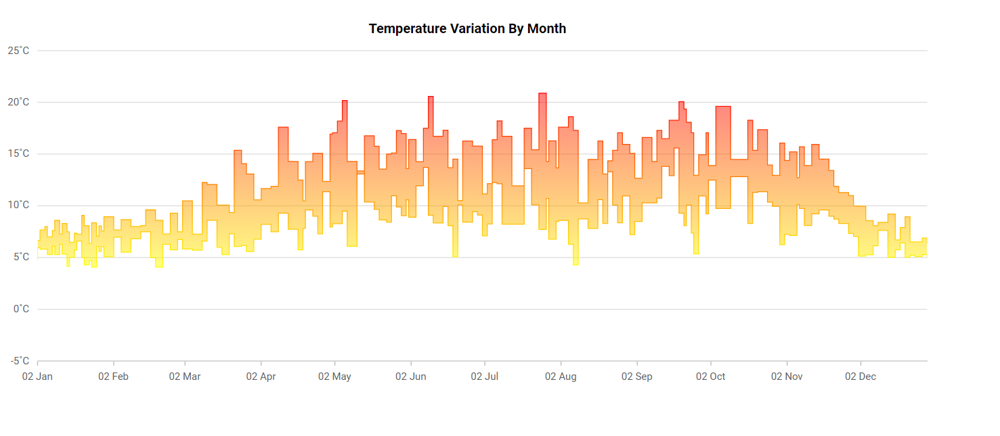

# Range Step Area in Blazor Charts Component

## Range Step Area

[Range Step Area Chart](https://www.syncfusion.com/blazor-components/blazor-charts/chart-types/range-step-area-chart) is used to display continuous data points as a series of steps that vary between high and low values over an interval of time for different categories. To render a range step area series in your chart, you need to follow a few steps to configure it correctly. Here's a concise guide on how to do this:
 
1. **Set the series type**: Define the series [`Type`](https://help.syncfusion.com/cr/blazor/Syncfusion.Blazor.Charts.ChartSeries.html#Syncfusion_Blazor_Charts_ChartSeries_Type) as [`RangeStepArea`](https://help.syncfusion.com/cr/blazor/Syncfusion.Blazor.Charts.ChartSeriesType.html#Syncfusion_Blazor_Charts_ChartSeriesType_RangeStepArea) in your chart configuration. This indicates that the data should be represented as a range step area chart, which is ideal for displaying data points as a range with high and low values. It connects these points with vertical and horizontal lines, creating a step like appearance.
 
2. **Provide high and low values**: The [`RangeStepArea`](https://help.syncfusion.com/cr/blazor/Syncfusion.Blazor.Charts.ChartSeriesType.html#Syncfusion_Blazor_Charts_ChartSeriesType_RangeStepArea) series requires two y-values for each data point, you need to specify both the high and low values. The high value represents the maximum range, while the low value represents the minimum range for each data point. These values define the upper and lower boundaries of the area for each point on the chart.

```cshtml
 
@using Syncfusion.Blazor.Charts

<SfChart>
    <ChartPrimaryXAxis ValueType="Syncfusion.Blazor.Charts.ValueType.Category" Format="dd MMM">
        <ChartAxisMajorGridLines Width="0" />
    </ChartPrimaryXAxis>
    <ChartPrimaryYAxis>
        <ChartAxisLineStyle Width="0"></ChartAxisLineStyle>
        <ChartAxisMajorTickLines Width="0" />
    </ChartPrimaryYAxis>
    <ChartSeriesCollection>
        <ChartSeries DataSource="@ChartPoints" XName="X" High="High" Low="Low" Type="ChartSeriesType.RangeStepArea">
            <ChartMarker Visible="false"></ChartMarker>
        </ChartSeries>
    </ChartSeriesCollection>
    <ChartLegendSettings Visible="false" />
</SfChart>

@code {
    public List<ChartData> ChartPoints = new List<ChartData>
    {
        new ChartData { X= "Sun", Low= 4.7, High= 9.8 },
         new ChartData { X= "Mon", Low= 4.7, High= 11.4 },
         new ChartData { X= "Tue", Low= 6.4, High= 14.4 },
         new ChartData { X= "Wed", Low= 9.6, High= 17.2 },
         new ChartData { X= "Thu", Low= 7.5, High= 15.1 },
         new ChartData { X= "Fri", Low= 3.0, High= 10.5 },
         new ChartData { X= "Sat", Low= 1.2, High= 7.9 }
    };

    public class ChartData
    {
        public string X { get; set; }
        public double High { get; set; }
        public double Low { get; set; }
    }
}

```




## Binding data with series

You can bind data to the chart using the [`DataSource`](https://help.syncfusion.com/cr/blazor/Syncfusion.Blazor.Charts.ChartSeries.html#Syncfusion_Blazor_Charts_ChartSeries_DataSource) property within the series configuration. The [`DataSource`](https://help.syncfusion.com/cr/blazor/Syncfusion.Blazor.Charts.ChartSeries.html#Syncfusion_Blazor_Charts_ChartSeries_DataSource) value can be set using either [`SfDataManager`](https://help.syncfusion.com/cr/blazor/Syncfusion.Blazor.Data.SfDataManager.html) property values or a list of business objects. More information on data binding can be found [here](../working-with-data). To display the data correctly, map the fields from the data to the chart series' [`XName`](https://help.syncfusion.com/cr/blazor/Syncfusion.Blazor.Charts.ChartSeries.html#Syncfusion_Blazor_Charts_ChartSeries_XName), [`High`](https://help.syncfusion.com/cr/blazor/Syncfusion.Blazor.Charts.ChartSeries.html#Syncfusion_Blazor_Charts_ChartSeries_High) and [`Low`](https://help.syncfusion.com/cr/blazor/Syncfusion.Blazor.Charts.ChartSeries.html#Syncfusion_Blazor_Charts_ChartSeries_Low) properties.

```cshtml
 
@using Syncfusion.Blazor.Charts

<SfChart>
    <ChartPrimaryXAxis ValueType="Syncfusion.Blazor.Charts.ValueType.Category" Format="dd MMM">
        <ChartAxisMajorGridLines Width="0" />
    </ChartPrimaryXAxis>
    <ChartPrimaryYAxis>
        <ChartAxisLineStyle Width="0"></ChartAxisLineStyle>
        <ChartAxisMajorTickLines Width="0" />
    </ChartPrimaryYAxis>
    <ChartSeriesCollection>
        <ChartSeries DataSource="@ChartPoints" XName="X" High="High" Low="Low" Type="ChartSeriesType.RangeStepArea">
            <ChartMarker Visible="false"></ChartMarker>
        </ChartSeries>
    </ChartSeriesCollection>
    <ChartLegendSettings Visible="false" />
</SfChart>

@code {
    public List<ChartData> ChartPoints = new List<ChartData>
    {
        new ChartData { X= "Sun", Low= 4.7, High= 9.8 },
         new ChartData { X= "Mon", Low= 4.7, High= 11.4 },
         new ChartData { X= "Tue", Low= 6.4, High= 14.4 },
         new ChartData { X= "Wed", Low= 9.6, High= 17.2 },
         new ChartData { X= "Thu", Low= 7.5, High= 15.1 },
         new ChartData { X= "Fri", Low= 3.0, High= 10.5 },
         new ChartData { X= "Sat", Low= 1.2, High= 7.9 }
    };

    public class ChartData
    {
        public string X { get; set; }
        public double High { get; set; }
        public double Low { get; set; }
    }
}

```


> Refer to our [Blazor Range Step Area Chart](https://www.syncfusion.com/blazor-components/blazor-charts/chart-types/range-step-area-chart) feature tour page to know about its other groundbreaking feature representations. Explore our [Blazor Range Step Area Chart Example](https://blazor.syncfusion.com/demos/chart/range-step-area?theme=bootstrap5) to know how to show variations in the data values for a given time.

## Series customization

The following properties can be used to customize the [Range Step Area](https://help.syncfusion.com/cr/blazor/Syncfusion.Blazor.Charts.ChartSeriesType.html#Syncfusion_Blazor_Charts_ChartSeriesType_RangeStepArea) series.

**Fill**

The [Fill](https://help.syncfusion.com/cr/blazor/Syncfusion.Blazor.Charts.ChartSeries.html#Syncfusion_Blazor_Charts_ChartSeries_Fill) property determines the color applied to the series.

```cshtml

@using Syncfusion.Blazor.Charts

<SfChart>
    <ChartPrimaryXAxis ValueType="Syncfusion.Blazor.Charts.ValueType.Category" Format="dd MMM">
        <ChartAxisMajorGridLines Width="0" />
    </ChartPrimaryXAxis>
    <ChartPrimaryYAxis>
        <ChartAxisLineStyle Width="0"></ChartAxisLineStyle>
        <ChartAxisMajorTickLines Width="0" />
    </ChartPrimaryYAxis>
    <ChartSeriesCollection>
        <ChartSeries DataSource="@ChartPoints" XName="X" High="High" Low="Low" Fill="blue" Type="ChartSeriesType.RangeStepArea">
            <ChartMarker Visible="false"></ChartMarker>
        </ChartSeries>
    </ChartSeriesCollection>
    <ChartLegendSettings Visible="false" />
</SfChart>

@code {
    public List<ChartData> ChartPoints = new List<ChartData>
    {
        new ChartData { X= "Sun", Low= 4.7, High= 9.8 },
         new ChartData { X= "Mon", Low= 4.7, High= 11.4 },
         new ChartData { X= "Tue", Low= 6.4, High= 14.4 },
         new ChartData { X= "Wed", Low= 9.6, High= 17.2 },
         new ChartData { X= "Thu", Low= 7.5, High= 15.1 },
         new ChartData { X= "Fri", Low= 3.0, High= 10.5 },
         new ChartData { X= "Sat", Low= 1.2, High= 7.9 }
    };

    public class ChartData
    {
        public string X { get; set; }
        public double High { get; set; }
        public double Low { get; set; }
    }
}

```


The [Fill](https://help.syncfusion.com/cr/blazor/Syncfusion.Blazor.Charts.ChartSeries.html#Syncfusion_Blazor_Charts_ChartSeries_Fill) property can be used to apply a gradient color to the range step area series. By configuring this property with gradient values, you can create a visually appealing effect in which the color transitions smoothly from one shade to another.

```cshtml

@using Syncfusion.Blazor.Charts

<SfChart>
    <ChartPrimaryXAxis ValueType="Syncfusion.Blazor.Charts.ValueType.Category" Format="dd MMM">
        <ChartAxisMajorGridLines Width="0" />
    </ChartPrimaryXAxis>
    <ChartPrimaryYAxis>
        <ChartAxisLineStyle Width="0"></ChartAxisLineStyle>
        <ChartAxisMajorTickLines Width="0" />
    </ChartPrimaryYAxis>
    <ChartSeriesCollection>
        <ChartSeries DataSource="@ChartPoints" XName="X" High="High" Low="Low" Fill="url(#grad1)" Type="ChartSeriesType.RangeStepArea">
            <ChartMarker Visible="false"></ChartMarker>
        </ChartSeries>
    </ChartSeriesCollection>
    <ChartLegendSettings Visible="false" />
</SfChart>

<svg style="height: 0">
    <defs>
        <linearGradient id="grad1" x1="0%" y1="0%" x2="0%" y2="100%">
            <stop offset="20%" style="stop-color:orange;stop-opacity:1" />
            <stop offset="100%" style="stop-color:black;stop-opacity:1" />
        </linearGradient>
    </defs>
</svg>

@code {
    public List<ChartData> ChartPoints = new List<ChartData>
    {
        new ChartData { X= "Sun", Low= 4.7, High= 9.8 },
         new ChartData { X= "Mon", Low= 4.7, High= 11.4 },
         new ChartData { X= "Tue", Low= 6.4, High= 14.4 },
         new ChartData { X= "Wed", Low= 9.6, High= 17.2 },
         new ChartData { X= "Thu", Low= 7.5, High= 15.1 },
         new ChartData { X= "Fri", Low= 3.0, High= 10.5 },
         new ChartData { X= "Sat", Low= 1.2, High= 7.9 }
    };

    public class ChartData
    {
        public string X { get; set; }
        public double High { get; set; }
        public double Low { get; set; }
    }
}

```


**Opacity**

The [Opacity](https://help.syncfusion.com/cr/blazor/Syncfusion.Blazor.Charts.ChartSeries.html#Syncfusion_Blazor_Charts_ChartSeries_Opacity) property specifies the transparency level of the [Fill](https://help.syncfusion.com/cr/blazor/Syncfusion.Blazor.Charts.ChartSeries.html#Syncfusion_Blazor_Charts_ChartSeries_Fill). Adjusting this property allows you to control how opaque or transparent the fill color of the series appears.

```cshtml

@using Syncfusion.Blazor.Charts

<SfChart>
    <ChartPrimaryXAxis ValueType="Syncfusion.Blazor.Charts.ValueType.Category" Format="dd MMM">
        <ChartAxisMajorGridLines Width="0" />
    </ChartPrimaryXAxis>
    <ChartPrimaryYAxis>
        <ChartAxisLineStyle Width="0"></ChartAxisLineStyle>
        <ChartAxisMajorTickLines Width="0" />
    </ChartPrimaryYAxis>
    <ChartSeriesCollection>
        <ChartSeries DataSource="@ChartPoints" XName="X" High="High" Low="Low" Fill="blue" Opacity="0.5" Type="ChartSeriesType.RangeStepArea">
            <ChartMarker Visible="false"></ChartMarker>
        </ChartSeries>
    </ChartSeriesCollection>
    <ChartLegendSettings Visible="false" />
</SfChart>

@code {
    public List<ChartData> ChartPoints = new List<ChartData>
    {
        new ChartData { X= "Sun", Low= 4.7, High= 9.8 },
         new ChartData { X= "Mon", Low= 4.7, High= 11.4 },
         new ChartData { X= "Tue", Low= 6.4, High= 14.4 },
         new ChartData { X= "Wed", Low= 9.6, High= 17.2 },
         new ChartData { X= "Thu", Low= 7.5, High= 15.1 },
         new ChartData { X= "Fri", Low= 3.0, High= 10.5 },
         new ChartData { X= "Sat", Low= 1.2, High= 7.9 }
    };

    public class ChartData
    {
        public string X { get; set; }
        public double High { get; set; }
        public double Low { get; set; }
    }
}

```


**DashArray**

The [DashArray](https://help.syncfusion.com/cr/blazor/Syncfusion.Blazor.Charts.ChartSeries.html#Syncfusion_Blazor_Charts_ChartSeries_DashArray) property determines the dashes of series border.

```cshtml

@using Syncfusion.Blazor.Charts

<SfChart>
    <ChartPrimaryXAxis ValueType="Syncfusion.Blazor.Charts.ValueType.Category" Format="dd MMM">
        <ChartAxisMajorGridLines Width="0" />
    </ChartPrimaryXAxis>
    <ChartPrimaryYAxis>
        <ChartAxisLineStyle Width="0"></ChartAxisLineStyle>
        <ChartAxisMajorTickLines Width="0" />
    </ChartPrimaryYAxis>
    <ChartSeriesCollection>
        <ChartSeries DataSource="@ChartPoints" XName="X" High="High" Low="Low" Fill="blue" Opacity="0.5" DashArray="5,5" Type="ChartSeriesType.RangeStepArea">
           <ChartSeriesBorder Width="2" Color="red"></ChartSeriesBorder>
        </ChartSeries>
    </ChartSeriesCollection>
    <ChartLegendSettings Visible="false" />
</SfChart>

@code {
    public List<ChartData> ChartPoints = new List<ChartData>
    {
        new ChartData { X= "Sun", Low= 4.7, High= 9.8 },
         new ChartData { X= "Mon", Low= 4.7, High= 11.4 },
         new ChartData { X= "Tue", Low= 6.4, High= 14.4 },
         new ChartData { X= "Wed", Low= 9.6, High= 17.2 },
         new ChartData { X= "Thu", Low= 7.5, High= 15.1 },
         new ChartData { X= "Fri", Low= 3.0, High= 10.5 },
         new ChartData { X= "Sat", Low= 1.2, High= 7.9 }
    };

    public class ChartData
    {
        public string X { get; set; }
        public double High { get; set; }
        public double Low { get; set; }
    }
}

```


**StepPosition**

Use the [`StepPosition`](https://help.syncfusion.com/cr/blazor/Syncfusion.Blazor.Charts.ChartSeries.html#Syncfusion_Blazor_Charts_ChartSeries_StepPosition) property to change the position of the steps in a range step area series.

```cshtml

@using Syncfusion.Blazor.Charts

<SfChart>
    <ChartPrimaryXAxis ValueType="Syncfusion.Blazor.Charts.ValueType.Category" Format="dd MMM">
        <ChartAxisMajorGridLines Width="0" />
    </ChartPrimaryXAxis>
    <ChartPrimaryYAxis>
        <ChartAxisLineStyle Width="0"></ChartAxisLineStyle>
        <ChartAxisMajorTickLines Width="0" />
    </ChartPrimaryYAxis>
    <ChartSeriesCollection>
        <ChartSeries DataSource="@ChartPoints" StepPosition="StepPosition.Center" XName="X" High="High" Low="Low" Type="ChartSeriesType.RangeStepArea">
            <ChartMarker Visible="true" Width="10" Height="10"></ChartMarker>
        </ChartSeries>
    </ChartSeriesCollection>
    <ChartLegendSettings Visible="false" />
</SfChart>

@code {
    public List<ChartData> ChartPoints = new List<ChartData>
    {
        new ChartData { X= "Sun", Low= 4.7, High= 9.8 },
         new ChartData { X= "Mon", Low= 4.7, High= 11.4 },
         new ChartData { X= "Tue", Low= 6.4, High= 14.4 },
         new ChartData { X= "Wed", Low= 9.6, High= 17.2 },
         new ChartData { X= "Thu", Low= 7.5, High= 15.1 },
         new ChartData { X= "Fri", Low= 3.0, High= 10.5 },
         new ChartData { X= "Sat", Low= 1.2, High= 7.9 }
    };

    public class ChartData
    {
        public string X { get; set; }
        public double High { get; set; }
        public double Low { get; set; }
    }
}

```


**Series Border**

The [ChartSeriesBorder](https://help.syncfusion.com/cr/blazor/Syncfusion.Blazor.Charts.ChartSeriesBorder.html) property determines the [Color](https://help.syncfusion.com/cr/blazor/Syncfusion.Blazor.Charts.ChartCommonBorder.html#Syncfusion_Blazor_Charts_ChartCommonBorder_Color) and [Width](https://help.syncfusion.com/cr/blazor/Syncfusion.Blazor.Charts.ChartCommonBorder.html#Syncfusion_Blazor_Charts_ChartCommonBorder_Width) of series border.

```cshtml

@using Syncfusion.Blazor.Charts

<SfChart>
    <ChartPrimaryXAxis ValueType="Syncfusion.Blazor.Charts.ValueType.Category" Format="dd MMM">
        <ChartAxisMajorGridLines Width="0" />
    </ChartPrimaryXAxis>
    <ChartPrimaryYAxis>
        <ChartAxisLineStyle Width="0"></ChartAxisLineStyle>
        <ChartAxisMajorTickLines Width="0" />
    </ChartPrimaryYAxis>
    <ChartSeriesCollection>
        <ChartSeries DataSource="@ChartPoints" XName="X" High="High" Low="Low" Fill="blue" Opacity="0.5" DashArray="5,5" Type="ChartSeriesType.RangeStepArea">
           <ChartSeriesBorder Width="2" Color="red"></ChartSeriesBorder>
        </ChartSeries>
    </ChartSeriesCollection>
    <ChartLegendSettings Visible="false" />
</SfChart>

@code {
    public List<ChartData> ChartPoints = new List<ChartData>
    {
        new ChartData { X= "Sun", Low= 4.7, High= 9.8 },
         new ChartData { X= "Mon", Low= 4.7, High= 11.4 },
         new ChartData { X= "Tue", Low= 6.4, High= 14.4 },
         new ChartData { X= "Wed", Low= 9.6, High= 17.2 },
         new ChartData { X= "Thu", Low= 7.5, High= 15.1 },
         new ChartData { X= "Fri", Low= 3.0, High= 10.5 },
         new ChartData { X= "Sat", Low= 1.2, High= 7.9 }
    };

    public class ChartData
    {
        public string X { get; set; }
        public double High { get; set; }
        public double Low { get; set; }
    }
}

```


> Refer to our [Blazor Charts](https://www.syncfusion.com/blazor-components/blazor-charts) feature tour page for its groundbreaking feature representations and also explore our [Blazor Chart Example](https://blazor.syncfusion.com/demos/chart/line?theme=bootstrap5) to know various chart types and how to represent time-dependent data, showing trends at equal intervals.

## Events

### Series render

The [`OnSeriesRender`](https://help.syncfusion.com/cr/blazor/Syncfusion.Blazor.Charts.ChartEvents.html#Syncfusion_Blazor_Charts_ChartEvents_OnSeriesRender) event allows you to customize series properties, such as [Data](https://help.syncfusion.com/cr/blazor/Syncfusion.Blazor.Charts.SeriesRenderEventArgs.html#Syncfusion_Blazor_Charts_SeriesRenderEventArgs_Data), [Fill](https://help.syncfusion.com/cr/blazor/Syncfusion.Blazor.Charts.SeriesRenderEventArgs.html#Syncfusion_Blazor_Charts_SeriesRenderEventArgs_Fill), and [Series](https://help.syncfusion.com/cr/blazor/Syncfusion.Blazor.Charts.SeriesRenderEventArgs.html#Syncfusion_Blazor_Charts_SeriesRenderEventArgs_Series), before they are rendered on the chart.

```cshtml

@using Syncfusion.Blazor.Charts

<SfChart>
    <ChartEvents OnSeriesRender="SeriesRender"></ChartEvents>
    <ChartPrimaryXAxis ValueType="Syncfusion.Blazor.Charts.ValueType.Category" Format="dd MMM">
        <ChartAxisMajorGridLines Width="0" />
    </ChartPrimaryXAxis>
    <ChartPrimaryYAxis>
        <ChartAxisLineStyle Width="0"></ChartAxisLineStyle>
        <ChartAxisMajorTickLines Width="0" />
    </ChartPrimaryYAxis>
    <ChartSeriesCollection>
        <ChartSeries DataSource="@ChartPoints" XName="X" High="High" Low="Low" Type="ChartSeriesType.RangeStepArea">
        </ChartSeries>
    </ChartSeriesCollection>
    <ChartLegendSettings Visible="false" />
</SfChart>

@code {
    public List<ChartData> ChartPoints = new List<ChartData>
    {
        new ChartData { X= "Sun", Low= 4.7, High= 9.8 },
         new ChartData { X= "Mon", Low= 4.7, High= 11.4 },
         new ChartData { X= "Tue", Low= 6.4, High= 14.4 },
         new ChartData { X= "Wed", Low= 9.6, High= 17.2 },
         new ChartData { X= "Thu", Low= 7.5, High= 15.1 },
         new ChartData { X= "Fri", Low= 3.0, High= 10.5 },
         new ChartData { X= "Sat", Low= 1.2, High= 7.9 }
    };

    public void SeriesRender(SeriesRenderEventArgs args)
    {
        args.Fill = "#FF4081";
    }

    public class ChartData
    {
        public string X { get; set; }
        public double High { get; set; }
        public double Low { get; set; }
    }
}

```


### Point render

The [`OnPointRender`](https://help.syncfusion.com/cr/blazor/Syncfusion.Blazor.Charts.ChartEvents.html#Syncfusion_Blazor_Charts_ChartEvents_OnPointRender) event allows you to customize each data point before it is rendered on the chart.

```cshtml

@using Syncfusion.Blazor.Charts

<SfChart>
    <ChartEvents OnPointRender="PointRender"></ChartEvents>
    <ChartPrimaryXAxis ValueType="Syncfusion.Blazor.Charts.ValueType.Category" Format="dd MMM">
        <ChartAxisMajorGridLines Width="0" />
    </ChartPrimaryXAxis>
    <ChartPrimaryYAxis>
        <ChartAxisLineStyle Width="0"></ChartAxisLineStyle>
        <ChartAxisMajorTickLines Width="0" />
    </ChartPrimaryYAxis>
    <ChartSeriesCollection>
        <ChartSeries DataSource="@ChartPoints" XName="X" High="High" Low="Low" Type="Syncfusion.Blazor.Charts.ChartSeriesType.RangeStepArea">
            <ChartMarker Visible="true" Height="10" Width="10"></ChartMarker>
        </ChartSeries>
    </ChartSeriesCollection>
    <ChartLegendSettings Visible="false" />
</SfChart>

@code {
    public List<ChartData> ChartPoints = new List<ChartData>
    {
        new ChartData { X= "Sun", Low= 4.7, High= 9.8 },
         new ChartData { X= "Mon", Low= 4.7, High= 11.4 },
         new ChartData { X= "Tue", Low= 6.4, High= 14.4 },
         new ChartData { X= "Wed", Low= 9.6, High= 17.2 },
         new ChartData { X= "Thu", Low= 7.5, High= 15.1 },
         new ChartData { X= "Fri", Low= 3.0, High= 10.5 },
         new ChartData { X= "Sat", Low= 1.2, High= 7.9 }
    };

    public void PointRender(PointRenderEventArgs args)
    {
        args.Fill = (args.Point.Index % 2 != 0) ? "#ff6347" : "#009cb8";
    }

    public class ChartData
    {
        public string X { get; set; }
        public double High { get; set; }
        public double Low { get; set; }
    }
}

```


## See also

* [Data Label](../data-labels)
* [Tooltip](../tool-tip)
