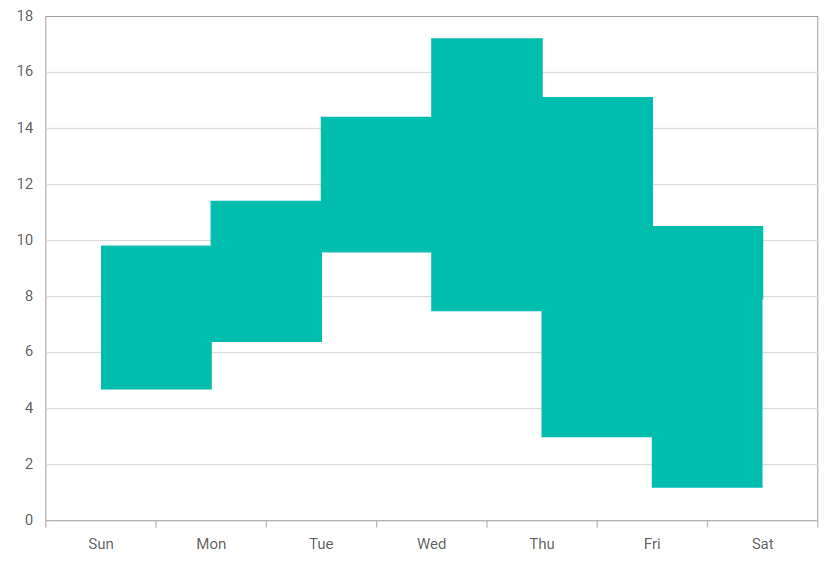

# Range Step Area in Blazor Charts Component

## Range Step Area

[Range Step Area Chart](https://www.syncfusion.com/blazor-components/blazor-charts/chart-types/range-step-area-chart) is same as range area chart except that the data points are connected as a step by horizontal and vertical lines.

[Range Step Area Chart](https://www.syncfusion.com/blazor-components/blazor-charts/chart-types/range-step-area-chart) is used to display continuous data points as set os steps that vary between high and low values over intervals of the time across different categories. To render a [Range Step Area Chart](https://www.syncfusion.com/blazor-components/blazor-charts/chart-types/range-step-area-chart), set the series [Type](https://help.syncfusion.com/cr/blazor/Syncfusion.Blazor.Charts.ChartSeries.html#Syncfusion_Blazor_Charts_ChartSeries_Type) as [RangeStepArea](https://help.syncfusion.com/cr/blazor/Syncfusion.Blazor.Charts.ChartSeriesType.html#Syncfusion_Blazor_Charts_ChartSeriesType_RangeStepArea).

```cshtml
 
@using Syncfusion.Blazor.Charts
@inject NavigationManager NavigationManager 
@inject HttpClient Http
@using System.IO
@using System.Net.Http.Json
 
<SfChart Title="Temperature Variation By Month">
    <ChartArea>
        <ChartAreaBorder Width="0"></ChartAreaBorder>
    </ChartArea>
    <ChartTooltipSettings Enable="true" Format="Temperature : <b>${point.low} - ${point.high}</b>" Shared="true"></ChartTooltipSettings>
    <ChartPrimaryXAxis ValueType="Syncfusion.Blazor.Charts.ValueType.DateTime" Format="dd MMM">
        <ChartAxisMajorGridLines Width="0"/>
    </ChartPrimaryXAxis>
    <ChartPrimaryYAxis LabelFormat="{value}˚C" Interval="5" Minimum="-5" Maximum="25">
        <ChartAxisLineStyle Width="0"></ChartAxisLineStyle>
        <ChartAxisMajorTickLines Width="0"/>
    </ChartPrimaryYAxis>
    <ChartSeriesCollection>
    <ChartSeries DataSource="@ChartPoints" XName="X" High="High" Low="Low"  Opacity="0.5" Type="ChartSeriesType.RangeStepArea">
            <ChartMarker Visible="false"></ChartMarker>                 
        </ChartSeries>
    </ChartSeriesCollection>
    <ChartLegendSettings Visible="false"/>
</SfChart>

@code{

    public string BorderColor { get; set; }    
    public ChartData[] ChartPoints { get; set; }

    protected async override Task OnInitializedAsync()
    {
        ChartPoints = new ChartData[] { };
        ChartPoints = await Http.GetFromJsonAsync<ChartData[]>(NavigationManager.BaseUri + "./range-data.json");

    }  

    public class ChartData
    {
        public string X { get; set; }
        public double High { get; set; }
        public double Low { get; set; }
    }
}

```



> Refer to our [Blazor Range Step Area Chart](https://www.syncfusion.com/blazor-components/blazor-charts/chart-types/range-area-chart) feature tour page to know about its other groundbreaking feature representations. Explore our [Blazor Range Step Area Chart Example](https://blazor.syncfusion.com/demos/chart/range-step-area?theme=bootstrap4) to know how to show variations in the data values for a given time.

## See Also

* [Data Label](../data-labels)
* [Tooltip](../tool-tip)
