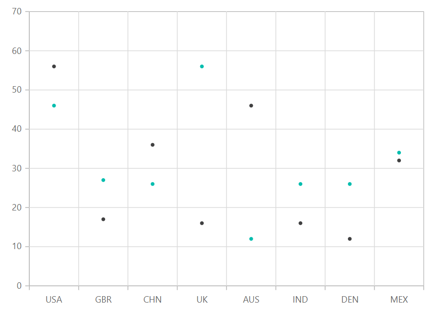

# Scatter Chart in Blazor Charts Component

## Scatter Chart

The Scatter Chart visualizes relationships between two Cartesian parameters by displaying data points as individual markers. To configure a scatter chart, set the series [`Type`](https://help.syncfusion.com/cr/blazor/Syncfusion.Blazor.Charts.ChartSeries.html#Syncfusion_Blazor_Charts_ChartSeries_Type) to [`Scatter`](https://help.syncfusion.com/cr/blazor/Syncfusion.Blazor.Charts.ChartSeriesType.html#Syncfusion_Blazor_Charts_ChartSeriesType_Scatter).

```cshtml

@using Syncfusion.Blazor.Charts

<SfChart DataSource="@ChartDataList">
    <ChartPrimaryXAxis ValueType="Syncfusion.Blazor.Charts.ValueType.Category" />

    <ChartSeriesCollection>
        <ChartSeries XName="X" YName="YValue" Type="ChartSeriesType.Scatter">
        </ChartSeries>
        <ChartSeries XName="X" YName="YValue1" Type="ChartSeriesType.Scatter">
        </ChartSeries>
    </ChartSeriesCollection>
</SfChart>

@code {
    public class ChartData
    {
        public string X { get; set; }
        public double YValue { get; set; }
        public double YValue1 { get; set; }
    }
	
    public List<ChartData> ChartDataList = new List<ChartData>
	{
        new ChartData { X = "USA", YValue = 46, YValue1 = 56 },
        new ChartData { X = "GBR", YValue = 27, YValue1 = 17 },
        new ChartData { X = "CHN", YValue = 26, YValue1 = 36 },
        new ChartData { X = "UK", YValue = 56,  YValue1 = 16 },
        new ChartData { X = "AUS", YValue = 12, YValue1 = 46 },
        new ChartData { X = "IND", YValue = 26, YValue1 = 16 },
        new ChartData { X = "DEN", YValue = 26, YValue1 = 12 },
        new ChartData { X = "MEX", YValue = 34, YValue1 = 32 }
    };
}

```




Refer to the [Blazor Scatter Chart](https://www.syncfusion.com/blazor-components/blazor-charts/chart-types/scatter-chart) feature tour page for additional feature details. Explore the [Blazor Scatter Chart Example](https://blazor.syncfusion.com/demos/chart/scatter?theme=bootstrap5) to learn how to plot data with two numeric parameters.

## Binding data with series

Bind data to the scatter chart using the [`DataSource`](https://help.syncfusion.com/cr/blazor/Syncfusion.Blazor.Charts.ChartSeries.html#Syncfusion_Blazor_Charts_ChartSeries_DataSource) property. The chart supports both local and remote data binding through [`SfDataManager`](https://help.syncfusion.com/cr/blazor/Syncfusion.Blazor.Data.SfDataManager.html). Map data fields to the series' [`XName`](https://help.syncfusion.com/cr/blazor/Syncfusion.Blazor.Charts.ChartSeries.html#Syncfusion_Blazor_Charts_ChartSeries_XName) and [`YName`](https://help.syncfusion.com/cr/blazor/Syncfusion.Blazor.Charts.ChartSeries.html#Syncfusion_Blazor_Charts_ChartSeries_YName) properties.

```cshtml

@using Syncfusion.Blazor.Charts

<SfChart DataSource="@ChartDataList">
    <ChartPrimaryXAxis ValueType="Syncfusion.Blazor.Charts.ValueType.Category" />

    <ChartSeriesCollection>
        <ChartSeries XName="X" YName="YValue" Type="ChartSeriesType.Scatter">
        </ChartSeries>
        <ChartSeries XName="X" YName="YValue1" Type="ChartSeriesType.Scatter">
        </ChartSeries>
    </ChartSeriesCollection>
</SfChart>

@code {
    public class ChartData
    {
        public string X { get; set; }
        public double YValue { get; set; }
        public double YValue1 { get; set; }
    }
	
    public List<ChartData> ChartDataList = new List<ChartData>
	{
        new ChartData { X = "USA", YValue = 46, YValue1 = 56 },
        new ChartData { X = "GBR", YValue = 27, YValue1 = 17 },
        new ChartData { X = "CHN", YValue = 26, YValue1 = 36 },
        new ChartData { X = "UK", YValue = 56,  YValue1 = 16 },
        new ChartData { X = "AUS", YValue = 12, YValue1 = 46 },
        new ChartData { X = "IND", YValue = 26, YValue1 = 16 },
        new ChartData { X = "DEN", YValue = 26, YValue1 = 12 },
        new ChartData { X = "MEX", YValue = 34, YValue1 = 32 }
    };
}

``` 


## Series customization

Customize the [Scatter](https://help.syncfusion.com/cr/blazor/Syncfusion.Blazor.Charts.ChartSeriesType.html#Syncfusion_Blazor_Charts_ChartSeriesType_Scatter) series using the following properties:

**Fill**

Set the color of scatter points using the [`Fill`](https://help.syncfusion.com/cr/blazor/Syncfusion.Blazor.Charts.ChartSeries.html#Syncfusion_Blazor_Charts_ChartSeries_Fill) property. Accepts named colors, hexadecimal codes, or RGB values.

```cshtml

@using Syncfusion.Blazor.Charts

<SfChart>
    <ChartPrimaryXAxis ValueType="Syncfusion.Blazor.Charts.ValueType.Category" />

    <ChartSeriesCollection>
        <ChartSeries DataSource="@ChartDataList" XName="X" YName="YValue" Fill="green" Type="Syncfusion.Blazor.Charts.ChartSeriesType.Scatter">
        </ChartSeries>
        <ChartSeries DataSource="@ChartDataList" XName="X" YName="YValue1" Fill="blue" Type="Syncfusion.Blazor.Charts.ChartSeriesType.Scatter">
        </ChartSeries>
    </ChartSeriesCollection>
</SfChart>

@code {
    public class ChartData
    {
        public string X { get; set; }
        public double YValue { get; set; }
        public double YValue1 { get; set; }
    }

    public List<ChartData> ChartDataList = new List<ChartData>
    {
        new ChartData { X = "USA", YValue = 46, YValue1 = 56 },
        new ChartData { X = "GBR", YValue = 27, YValue1 = 17 },
        new ChartData { X = "CHN", YValue = 26, YValue1 = 36 },
        new ChartData { X = "UK", YValue = 56,  YValue1 = 16 },
        new ChartData { X = "AUS", YValue = 12, YValue1 = 46 },
        new ChartData { X = "IND", YValue = 26, YValue1 = 16 },
        new ChartData { X = "DEN", YValue = 26, YValue1 = 12 },
        new ChartData { X = "MEX", YValue = 34, YValue1 = 32 }
    };
}

```


Apply gradient colors to scatter points by referencing a gradient definition in the [`Fill`](https://help.syncfusion.com/cr/blazor/Syncfusion.Blazor.Charts.ChartSeries.html#Syncfusion_Blazor_Charts_ChartSeries_Fill) property.

```cshtml

@using Syncfusion.Blazor.Charts

<SfChart>
    <ChartPrimaryXAxis ValueType="Syncfusion.Blazor.Charts.ValueType.Category" />

    <ChartSeriesCollection>
        <ChartSeries DataSource="@ChartDataList" XName="X" YName="YValue" Fill="url(#grad1)" Type="Syncfusion.Blazor.Charts.ChartSeriesType.Scatter">
            <ChartMarker Height="10" Width="10" />
        </ChartSeries>
        <ChartSeries DataSource="@ChartDataList" XName="X" YName="YValue1" Fill="url(#grad2)" Type="Syncfusion.Blazor.Charts.ChartSeriesType.Scatter">
            <ChartMarker Height="10" Width="10" />
        </ChartSeries>
    </ChartSeriesCollection>
</SfChart>

<svg style="height: 0">
    <defs>
        <linearGradient id="grad1" x1="0%" y1="0%" x2="0%" y2="100%">
            <stop offset="20%" style="stop-color:orange;stop-opacity:1" />
            <stop offset="100%" style="stop-color:black;stop-opacity:1" />
        </linearGradient>
    </defs>
</svg>

<svg style="height: 0">
    <defs>
        <linearGradient id="grad2" x1="0%" y1="0%" x2="0%" y2="100%">
            <stop offset="20%" style="stop-color:blue;stop-opacity:1" />
            <stop offset="100%" style="stop-color:black;stop-opacity:1" />
        </linearGradient>
    </defs>
</svg>

@code {
    public class ChartData
    {
        public string X { get; set; }
        public double YValue { get; set; }
        public double YValue1 { get; set; }
    }

    public List<ChartData> ChartDataList = new List<ChartData>
    {
        new ChartData { X = "USA", YValue = 46, YValue1 = 56 },
        new ChartData { X = "GBR", YValue = 27, YValue1 = 17 },
        new ChartData { X = "CHN", YValue = 26, YValue1 = 36 },
        new ChartData { X = "UK", YValue = 56,  YValue1 = 16 },
        new ChartData { X = "AUS", YValue = 12, YValue1 = 46 },
        new ChartData { X = "IND", YValue = 26, YValue1 = 16 },
        new ChartData { X = "DEN", YValue = 26, YValue1 = 12 },
        new ChartData { X = "MEX", YValue = 34, YValue1 = 32 }
    };
}

```


**Opacity**

The [Opacity](https://help.syncfusion.com/cr/blazor/Syncfusion.Blazor.Charts.ChartSeries.html#Syncfusion_Blazor_Charts_ChartSeries_Opacity) property controls the transparency of the [Fill](https://help.syncfusion.com/cr/blazor/Syncfusion.Blazor.Charts.ChartSeries.html#Syncfusion_Blazor_Charts_ChartSeries_Fill) color, allowing adjustment of the series' appearance.

```cshtml

@using Syncfusion.Blazor.Charts

<SfChart DataSource="@ChartDataList">
    <ChartPrimaryXAxis ValueType="Syncfusion.Blazor.Charts.ValueType.Category" />
	
    <ChartSeriesCollection>
        <ChartSeries XName="X" YName="YValue" Type="ChartSeriesType.Scatter" Fill="blue" Opacity="0.5">
            <ChartMarker Height="10" Width="10" Shape="ChartShape.Circle">
            </ChartMarker>
        </ChartSeries>
        <ChartSeries XName="X" YName="YValue1" Type="ChartSeriesType.Scatter" Fill="red" Opacity="0.5">
            <ChartMarker Height="10" Width="10" Shape="ChartShape.Diamond">
            </ChartMarker>
        </ChartSeries>
    </ChartSeriesCollection>
</SfChart>

@code {
    public class ChartData
    {
        public string X { get; set; }
        public double YValue { get; set; }
        public double YValue1 { get; set; }
    }
	
    public List<ChartData> ChartDataList = new List<ChartData>
	{
        new ChartData { X = "USA", YValue = 46, YValue1 = 56 },
        new ChartData { X = "GBR", YValue = 27, YValue1 = 17 },
        new ChartData { X = "CHN", YValue = 26, YValue1 = 36 },
        new ChartData { X = "UK", YValue = 56,  YValue1 = 16 },
        new ChartData { X = "AUS", YValue = 12, YValue1 = 46 },
        new ChartData { X = "IND", YValue = 26, YValue1 = 16 },
        new ChartData { X = "DEN", YValue = 26, YValue1 = 12 },
        new ChartData { X = "MEX", YValue = 34, YValue1 = 32 }
    };
}

``` 


**Shape**

Customize marker appearance using the [Shape](https://help.syncfusion.com/cr/blazor/Syncfusion.Blazor.Charts.ChartCommonMarker.html#Syncfusion_Blazor_Charts_ChartCommonMarker_Shape) property.

```cshtml

@using Syncfusion.Blazor.Charts

<SfChart>
    <ChartPrimaryXAxis ValueType="Syncfusion.Blazor.Charts.ValueType.Category" />

    <ChartSeriesCollection>
        <ChartSeries DataSource="@ChartDataList" XName="X" YName="YValue" Type="Syncfusion.Blazor.Charts.ChartSeriesType.Scatter">
            <ChartMarker Height="10" Width="10" Shape="ChartShape.Triangle" />
        </ChartSeries>
        <ChartSeries DataSource="@ChartDataList" XName="X" YName="YValue1" Type="Syncfusion.Blazor.Charts.ChartSeriesType.Scatter">
            <ChartMarker Height="10" Width="10" Shape="ChartShape.Rectangle" />
        </ChartSeries>
    </ChartSeriesCollection>
</SfChart>

@code {
    public class ChartData
    {
        public string X { get; set; }
        public double YValue { get; set; }
        public double YValue1 { get; set; }
    }

    public List<ChartData> ChartDataList = new List<ChartData>
    {
        new ChartData { X = "USA", YValue = 46, YValue1 = 56 },
        new ChartData { X = "GBR", YValue = 27, YValue1 = 17 },
        new ChartData { X = "CHN", YValue = 26, YValue1 = 36 },
        new ChartData { X = "UK", YValue = 56,  YValue1 = 16 },
        new ChartData { X = "AUS", YValue = 12, YValue1 = 46 },
        new ChartData { X = "IND", YValue = 26, YValue1 = 16 },
        new ChartData { X = "DEN", YValue = 26, YValue1 = 12 },
        new ChartData { X = "MEX", YValue = 34, YValue1 = 32 }
    };
}

```


## Empty points

Data points with `null`, `double.NaN`, or `undefined` values are treated as empty and are not plotted.

**Mode**

Use the [`Mode`](https://help.syncfusion.com/cr/blazor/Syncfusion.Blazor.Charts.ChartEmptyPointSettings.html#Syncfusion_Blazor_Charts_ChartEmptyPointSettings_Mode) property to specify how empty or missing data points are handled. The default mode is [`Gap`](https://help.syncfusion.com/cr/blazor/Syncfusion.Blazor.Charts.EmptyPointMode.html#Syncfusion_Blazor_Charts_EmptyPointMode_Gap).

```cshtml

@using Syncfusion.Blazor.Charts

<SfChart>
    <ChartPrimaryXAxis ValueType="Syncfusion.Blazor.Charts.ValueType.Category" />

    <ChartSeriesCollection>
        <ChartSeries DataSource="@ChartDataList" XName="X" YName="YValue" Type="Syncfusion.Blazor.Charts.ChartSeriesType.Scatter">
            <ChartEmptyPointSettings Mode="EmptyPointMode.Gap"></ChartEmptyPointSettings>
            <ChartMarker Visible="true" Height="10" Width="10"></ChartMarker>
        </ChartSeries>
        <ChartSeries DataSource="@ChartDataList" XName="X" YName="YValue1" Type="Syncfusion.Blazor.Charts.ChartSeriesType.Scatter">
            <ChartEmptyPointSettings Mode="EmptyPointMode.Gap"></ChartEmptyPointSettings>
            <ChartMarker Visible="true" Height="10" Width="10"></ChartMarker>
        </ChartSeries>
    </ChartSeriesCollection>
</SfChart>

@code {
    public class ChartData
    {
        public string X { get; set; }
        public double YValue { get; set; }
        public double YValue1 { get; set; }
    }

    public List<ChartData> ChartDataList = new List<ChartData>
    {
        new ChartData { X = "USA", YValue = 46, YValue1 = 56 },
        new ChartData { X = "GBR", YValue = 27, YValue1 = 17 },
        new ChartData { X = "CHN", YValue = 26, YValue1 = 36 },
        new ChartData { X = "UK", YValue = double.NaN,  YValue1 = double.NaN },
        new ChartData { X = "AUS", YValue = 12, YValue1 = 46 },
        new ChartData { X = "IND", YValue = 26, YValue1 = 16 },
        new ChartData { X = "DEN", YValue = 26, YValue1 = 12 },
        new ChartData { X = "MEX", YValue = 34, YValue1 = 32 }
    };
}

```


**Fill**

Customize the fill color of empty points using the [`Fill`](https://help.syncfusion.com/cr/blazor/Syncfusion.Blazor.Charts.ChartEmptyPointSettings.html#Syncfusion_Blazor_Charts_ChartEmptyPointSettings_Fill) property.

```cshtml

@using Syncfusion.Blazor.Charts

<SfChart>
    <ChartPrimaryXAxis ValueType="Syncfusion.Blazor.Charts.ValueType.Category" />

    <ChartSeriesCollection>
        <ChartSeries DataSource="@ChartDataList" XName="X" YName="YValue" Type="Syncfusion.Blazor.Charts.ChartSeriesType.Scatter">
            <ChartEmptyPointSettings Fill="blue" Mode="EmptyPointMode.Average"></ChartEmptyPointSettings>
            <ChartMarker Height="10" Width="10"></ChartMarker>
        </ChartSeries>
        <ChartSeries DataSource="@ChartDataList" XName="X" YName="YValue1" Type="Syncfusion.Blazor.Charts.ChartSeriesType.Scatter">
            <ChartEmptyPointSettings Fill="green" Mode="EmptyPointMode.Average"></ChartEmptyPointSettings>
            <ChartMarker Height="10" Width="10"></ChartMarker>
        </ChartSeries>
    </ChartSeriesCollection>
</SfChart>

@code {
    public class ChartData
    {
        public string X { get; set; }
        public double YValue { get; set; }
        public double YValue1 { get; set; }
    }

    public List<ChartData> ChartDataList = new List<ChartData>
    {
        new ChartData { X = "USA", YValue = 46, YValue1 = 56 },
        new ChartData { X = "GBR", YValue = 27, YValue1 = 17 },
        new ChartData { X = "CHN", YValue = 26, YValue1 = 36 },
        new ChartData { X = "UK", YValue = double.NaN,  YValue1 = double.NaN },
        new ChartData { X = "AUS", YValue = 12, YValue1 = 46 },
        new ChartData { X = "IND", YValue = 26, YValue1 = 16 },
        new ChartData { X = "DEN", YValue = 26, YValue1 = 12 },
        new ChartData { X = "MEX", YValue = 34, YValue1 = 32 }
    };
}

```


**Border**

Customize the border width and color of empty points using the [`Border`](https://help.syncfusion.com/cr/blazor/Syncfusion.Blazor.Charts.ChartEmptyPointSettings.html#Syncfusion_Blazor_Charts_ChartEmptyPointSettings_Border) property, including [Width](https://help.syncfusion.com/cr/blazor/Syncfusion.Blazor.Charts.ChartEmptyPointBorder.html#Syncfusion_Blazor_Charts_ChartEmptyPointBorder_Width) and [Color](https://help.syncfusion.com/cr/blazor/Syncfusion.Blazor.Charts.ChartEmptyPointBorder.html#Syncfusion_Blazor_Charts_ChartEmptyPointBorder_Color).

```cshtml

@using Syncfusion.Blazor.Charts

<SfChart>
    <ChartPrimaryXAxis ValueType="Syncfusion.Blazor.Charts.ValueType.Category" />

    <ChartSeriesCollection>
        <ChartSeries DataSource="@ChartDataList" XName="X" YName="YValue" Type="Syncfusion.Blazor.Charts.ChartSeriesType.Scatter">
            <ChartEmptyPointSettings Fill="blue" Mode="EmptyPointMode.Average">
                <ChartEmptyPointBorder Width="2" Color="#FF0000"></ChartEmptyPointBorder>
            </ChartEmptyPointSettings>
            <ChartMarker Height="10" Width="10"></ChartMarker>
        </ChartSeries>
        <ChartSeries DataSource="@ChartDataList" XName="X" YName="YValue1" Type="Syncfusion.Blazor.Charts.ChartSeriesType.Scatter">
            <ChartEmptyPointSettings Fill="green" Mode="EmptyPointMode.Average">
                <ChartEmptyPointBorder Width="2" Color="#FF0000"></ChartEmptyPointBorder>
            </ChartEmptyPointSettings>
            <ChartMarker Height="10" Width="10"></ChartMarker>
        </ChartSeries>
    </ChartSeriesCollection>
</SfChart>

@code {
    public class ChartData
    {
        public string X { get; set; }
        public double YValue { get; set; }
        public double YValue1 { get; set; }
    }

    public List<ChartData> ChartDataList = new List<ChartData>
    {
        new ChartData { X = "USA", YValue = 46, YValue1 = 56 },
        new ChartData { X = "GBR", YValue = 27, YValue1 = 17 },
        new ChartData { X = "CHN", YValue = 26, YValue1 = 36 },
        new ChartData { X = "UK", YValue = double.NaN,  YValue1 = double.NaN },
        new ChartData { X = "AUS", YValue = 12, YValue1 = 46 },
        new ChartData { X = "IND", YValue = 26, YValue1 = 16 },
        new ChartData { X = "DEN", YValue = 26, YValue1 = 12 },
        new ChartData { X = "MEX", YValue = 34, YValue1 = 32 }
    };
}

```


## Events

### Series render

The [`OnSeriesRender`](https://help.syncfusion.com/cr/blazor/Syncfusion.Blazor.Charts.ChartEvents.html#Syncfusion_Blazor_Charts_ChartEvents_OnSeriesRender) event enables customization of series properties, such as [Data](https://help.syncfusion.com/cr/blazor/Syncfusion.Blazor.Charts.SeriesRenderEventArgs.html#Syncfusion_Blazor_Charts_SeriesRenderEventArgs_Data), [Fill](https://help.syncfusion.com/cr/blazor/Syncfusion.Blazor.Charts.SeriesRenderEventArgs.html#Syncfusion_Blazor_Charts_SeriesRenderEventArgs_Fill), and [Series](https://help.syncfusion.com/cr/blazor/Syncfusion.Blazor.Charts.SeriesRenderEventArgs.html#Syncfusion_Blazor_Charts_SeriesRenderEventArgs_Series), before rendering.

```cshtml

@using Syncfusion.Blazor.Charts

<SfChart>
    <ChartEvents OnSeriesRender="SeriesRender" />
    <ChartPrimaryXAxis ValueType="Syncfusion.Blazor.Charts.ValueType.Category" />
    <ChartSeriesCollection>
        <ChartSeries DataSource="@ChartDataList" Name="Series1" XName="X" YName="YValue" Type="Syncfusion.Blazor.Charts.ChartSeriesType.Scatter" />
        <ChartSeries DataSource="@ChartDataList" Name="Series2" XName="X" YName="YValue1" Type="Syncfusion.Blazor.Charts.ChartSeriesType.Scatter" />
    </ChartSeriesCollection>
    <ChartLegendSettings Visible="false"></ChartLegendSettings>
</SfChart>

@code {
    public class ChartData
    {
        public string X { get; set; }
        public double YValue { get; set; }
        public double YValue1 { get; set; }
    }

    public void SeriesRender(SeriesRenderEventArgs args)
    {
        if (args.Series.Name == "Series1")
        {
            args.Fill = "red";
        }
        else if (args.Series.Name == "Series2")
        {
            args.Fill = "green";
        }
    }

    public List<ChartData> ChartDataList = new List<ChartData>
    {
        new ChartData { X = "USA", YValue = 46, YValue1 = 56 },
        new ChartData { X = "GBR", YValue = 27, YValue1 = 17 },
        new ChartData { X = "CHN", YValue = 26, YValue1 = 36 },
        new ChartData { X = "UK", YValue = 56,  YValue1 = 16 },
        new ChartData { X = "AUS", YValue = 12, YValue1 = 46 },
        new ChartData { X = "IND", YValue = 26, YValue1 = 16 },
        new ChartData { X = "DEN", YValue = 26, YValue1 = 12 },
        new ChartData { X = "MEX", YValue = 34, YValue1 = 32 }
    };
}

```


### Point render

The [`OnPointRender`](https://help.syncfusion.com/cr/blazor/Syncfusion.Blazor.Charts.ChartEvents.html#Syncfusion_Blazor_Charts_ChartEvents_OnPointRender) event allows customization of each data point before rendering.

```cshtml

@using Syncfusion.Blazor.Charts

<SfChart>
    <ChartPrimaryXAxis ValueType="Syncfusion.Blazor.Charts.ValueType.Category" />
    <ChartEvents OnPointRender="PointRender"></ChartEvents>
    <ChartSeriesCollection>
        <ChartSeries DataSource="@ChartDataList" Name="Series1" XName="X" YName="YValue" Type="Syncfusion.Blazor.Charts.ChartSeriesType.Scatter"> 
            <ChartMarker Height="10" Width="10" />
        </ChartSeries>
        <ChartSeries DataSource="@ChartDataList" Name="Series2" XName="X" YName="YValue1" Type="Syncfusion.Blazor.Charts.ChartSeriesType.Scatter">
            <ChartMarker Height="10" Width="10" />
        </ChartSeries>
    </ChartSeriesCollection>
    <ChartLegendSettings Visible="false"></ChartLegendSettings>
</SfChart>

@code {
    public class ChartData
    {
        public string X { get; set; }
        public double YValue { get; set; }
        public double YValue1 { get; set; }
    }

    public void PointRender(PointRenderEventArgs args)
    {
        args.Fill = args.Point.X.ToString() == "UK" ? args.Series.YName == "YValue" ? "#E91E63" : "#FFC107" : args.Fill;
    }

    public List<ChartData> ChartDataList = new List<ChartData>
    {
        new ChartData { X = "USA", YValue = 46, YValue1 = 56 },
        new ChartData { X = "GBR", YValue = 27, YValue1 = 17 },
        new ChartData { X = "CHN", YValue = 26, YValue1 = 36 },
        new ChartData { X = "UK", YValue = 56,  YValue1 = 16 },
        new ChartData { X = "AUS", YValue = 12, YValue1 = 46 },
        new ChartData { X = "IND", YValue = 26, YValue1 = 16 },
        new ChartData { X = "DEN", YValue = 26, YValue1 = 12 },
        new ChartData { X = "MEX", YValue = 34, YValue1 = 32 }
    };
}

```


N> Refer to our [Blazor Charts](https://www.syncfusion.com/blazor-components/blazor-charts) feature tour page for its groundbreaking feature representations and also explore our [Blazor Chart Example](https://blazor.syncfusion.com/demos/chart/line?theme=bootstrap5) to know various chart types and how to represent time-dependent data, showing trends at equal intervals.

## See also

* [Data label](../data-labels)
* [Tooltip](../tool-tip)
