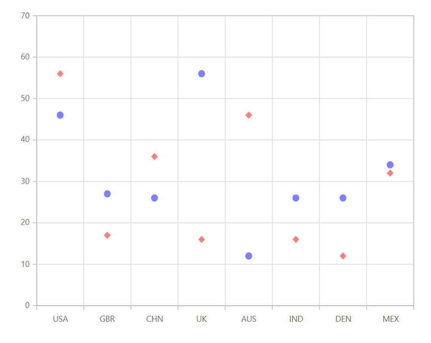

---
title: "Scatter Chart in Blazor Charts component | Syncfusion"

component: "Charts"

description: "Learn here all about Scatter Chart of Syncfusion Charts (SfCharts) component and more."
---
# Scatter Chart in Blazor Charts (SfCharts)

## Scatter

[`Scatter Chart`](https://www.syncfusion.com/blazor-components/blazor-charts/chart-types/scatter-chart) plots data with two numeric parameters. To render a [`Scatter Chart`](https://www.syncfusion.com/blazor-components/blazor-charts/chart-types/scatter-chart), use series [`Type`](https://help.syncfusion.com/cr/blazor/Syncfusion.Blazor~Syncfusion.Blazor.Charts.ChartSeries~Type.html) as [`Scatter`](https://help.syncfusion.com/cr/blazor/Syncfusion.Blazor.Charts.ChartSeriesType.html#Syncfusion_Blazor_Charts_ChartSeriesType_Scatter).





> Refer to our [`Blazor Scatter Chart`](https://www.syncfusion.com/blazor-components/blazor-charts/chart-types/scatter-chart) feature tour page to know about its other groundbreaking feature representations. Explore our [`Blazor Scatter Chart Example`](https://blazor.syncfusion.com/demos/chart/scatter?theme=bootstrap4) to know how to plot data with two numeric parameters.

## Series Customization

The following properties can be used to customize the [`Scatter`](https://help.syncfusion.com/cr/blazor/Syncfusion.Blazor.Charts.ChartSeriesType.html#Syncfusion_Blazor_Charts_ChartSeriesType_Scatter) series.

* [`Fill`](https://help.syncfusion.com/cr/blazor/Syncfusion.Blazor.Charts.ChartSeries.html#Syncfusion_Blazor_Charts_ChartSeries_Fill) – Specifies the color of the series.
* [`Opacity`](https://help.syncfusion.com/cr/blazor/Syncfusion.Blazor.Charts.ChartSeries.html#Syncfusion_Blazor_Charts_ChartSeries_Opacity) – Specifies the opacity of [`Fill`](https://help.syncfusion.com/cr/blazor/Syncfusion.Blazor.Charts.ChartSeries.html#Syncfusion_Blazor_Charts_ChartSeries_Fill).
* [`Shape`](https://help.syncfusion.com/cr/blazor/Syncfusion.Blazor.Charts.ChartShape.html) - Specifies the shape of the scatter series.





> Refer to our [`Blazor Charts`](https://www.syncfusion.com/blazor-components/blazor-charts) feature tour page for its groundbreaking feature representations and also explore our [`Blazor Chart example`](https://blazor.syncfusion.com/demos/chart/line?theme=bootstrap4) to know various chart types and how to represent time-dependent data, showing trends at equal intervals.

## See Also

* [Data Label](../data-labels)
* [Tooltip](../tool-tip)