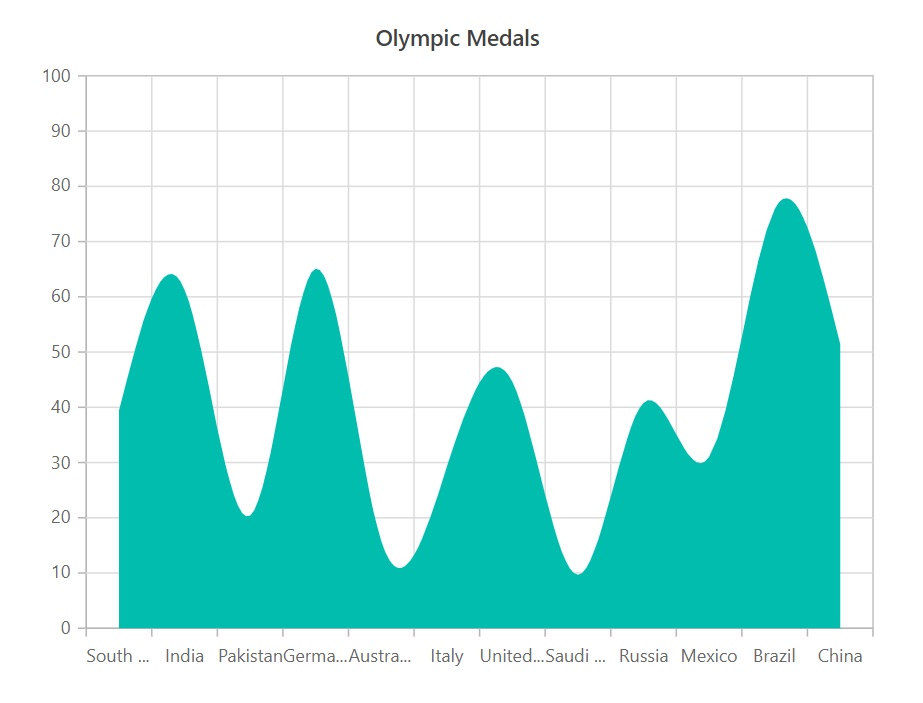

# Spline Area Chart in Blazor Charts (SfCharts)

## Spline Area

[`Spline Area Chart`](https://www.syncfusion.com/blazor-components/blazor-charts/chart-types/spline-area-chart) represents time dependent data and visualizes the trends at equal intervals, but with the data points connected with a smooth line. To render a [`Spline Area Chart`](https://www.syncfusion.com/blazor-components/blazor-charts/chart-types/spline-area-chart), use series [`Type`](https://help.syncfusion.com/cr/blazor/Syncfusion.Blazor~Syncfusion.Blazor.Charts.ChartSeries~Type.html) as [`Spline Area`](https://help.syncfusion.com/cr/blazor/Syncfusion.Blazor.Charts.ChartSeriesType.html#Syncfusion_Blazor_Charts_ChartSeriesType_SplineArea).





> Refer to our [`Blazor Spline Area Chart`](https://www.syncfusion.com/blazor-components/blazor-charts/chart-types/spline-area-chart) feature tour page to know about its other groundbreaking feature representations. Explore our [`Blazor Spline Area Chart Example`](https://blazor.syncfusion.com/demos/chart/spline-area?theme=bootstrap4) to know how to connects the data points with smooth curves.

## Series Customization

The following properties can be used to customize the [`Spline Area`](https://help.syncfusion.com/cr/blazor/Syncfusion.Blazor.Charts.ChartSeriesType.html#Syncfusion_Blazor_Charts_ChartSeriesType_SplineArea) series.

* [`Fill`](https://help.syncfusion.com/cr/blazor/Syncfusion.Blazor.Charts.ChartSeries.html#Syncfusion_Blazor_Charts_ChartSeries_Fill) – Specifies the color of the series.
* [`Opacity`](https://help.syncfusion.com/cr/blazor/Syncfusion.Blazor.Charts.ChartSeries.html#Syncfusion_Blazor_Charts_ChartSeries_Opacity) – Specifies the opacity of [`Fill`](https://help.syncfusion.com/cr/blazor/Syncfusion.Blazor.Charts.ChartSeries.html#Syncfusion_Blazor_Charts_ChartSeries_Fill).
* [`DashArray`](https://help.syncfusion.com/cr/blazor/Syncfusion.Blazor.Charts.ChartSeries.html#Syncfusion_Blazor_Charts_ChartSeries_DashArray) – Specifies the dashes of series border.
* [`ChartSeriesBorder`](https://help.syncfusion.com/cr/blazor/Syncfusion.Blazor.Charts.ChartSeriesBorder.html) – Specifies the [`Color`](https://help.syncfusion.com/cr/blazor/Syncfusion.Blazor.Charts.ChartCommonBorder.html#Syncfusion_Blazor_Charts_ChartCommonBorder_Color) and [`Width`](https://help.syncfusion.com/cr/blazor/Syncfusion.Blazor.Charts.ChartCommonBorder.html#Syncfusion_Blazor_Charts_ChartCommonBorder_Width) of series border.





> Refer to our Blazor [`Charts`](https://www.syncfusion.com/blazor-components/blazor-charts) feature tour page for its groundbreaking feature representations and also explore our Blazor [`Chart example`](https://blazor.syncfusion.com/demos/chart/line?theme=bootstrap4) to know various chart types and how to represent time-dependent data, showing trends at equal intervals.

## See Also

* [Data Label](../data-labels)
* [Tooltip](../tool-tip)